# Lapanza 3D Creative Lab — System Documentation

**Document type:** Consolidated Architecture, Requirements, Functional Specification, Implementation & Test Record
**Purpose:** Audit record and reimplementation reference — sufficient for a new team to understand, operate, or rebuild this system without access to the original author.
**System version documented:** `2.0.0` (package.json), repository state as of commit `409037c` (branch `main`)
**Live production URL:** https://lapanza3d.co.za (site) · https://lapanza3d.co.za/admin/ (admin portal)
**Repository:** `github.com/jbarkhuizen/Lapanza-3d-Creations-Martin` (branch `main`)
**Author of record:** Johan Barkhuizen, built with Claude Code (Anthropic)
**Document date:** 2026-08-21 (updated for Print Job Costing's status rename, Final Selling Price, and "List for sale")

---

## Table of Contents

1. [Executive Summary](#1-executive-summary)
2. [Evolution History](#2-evolution-history)
3. [Architecture](#3-architecture)
4. [Software Dependencies](#4-software-dependencies)
5. [Codebase & File Structure](#5-codebase--file-structure)
6. [Data Model (Database Schema)](#6-data-model-database-schema)
7. [API Reference](#7-api-reference)
8. [Process Flow Diagrams](#8-process-flow-diagrams)
9. [Functional Documentation](#9-functional-documentation)
10. [Requirements Document](#10-requirements-document)
11. [Functional Specification (Field-Level)](#11-functional-specification-field-level)
12. [Implementation & Release Process](#12-implementation--release-process)
13. [Test Strategy & Test Cases](#13-test-strategy--test-cases)
14. [Security Considerations](#14-security-considerations)
15. [Known Limitations & Technical Debt](#15-known-limitations--technical-debt)
16. [Environment & Configuration Reference](#16-environment--configuration-reference)
17. [Glossary](#17-glossary)
18. [Appendix: Operational Quick Reference](#18-appendix-operational-quick-reference)

---

## 1. Executive Summary

Lapanza 3D Creative Lab is a small-business e-commerce and operations platform for a South African 3D-printing/filament retailer. It consists of:

- A **public storefront** (static, multi-page) selling 3D-printer filament and printed goods (toys, homeware, phone accessories, car parts), with cart, checkout (Payfast card/EFT, manual EFT, cash-on-collection), customer accounts, custom design-request intake, and newsletter/WhatsApp opt-in.
- An **admin portal** (single-page app served by the same backend) for catalog management, order/invoice management, client relationship management, shipping configuration, 3D-print job costing, in-house filament stock tracking, supplier purchase tracking, marketing campaigns (email + WhatsApp), and site settings.
- A **single Node.js/Express backend** that serves the admin portal, all JSON APIs, and file uploads, backed by a single SQLite database file.

The system was built end-to-end (frontend, backend, admin tooling, deployment automation) across four development phases plus a production VPS migration, all captured in this repository's git history and summarized in §2.

**Current deployment:** a single AlmaLinux 10 VPS (domain.co.za), running nginx (TLS termination + static file serving + reverse proxy) in front of the Node backend (systemd-managed), with Let's Encrypt SSL auto-renewal.

---

## 2. Evolution History

The system has no formal change-management tooling (no Jira/ticketing system observed) — this history is reconstructed from git commits and the build session record.

| Phase | Scope | Test count at completion |
|---|---|---|
| **Pre-phase** | HTML→PHP-style refactor, filament catalog v1, homepage-tiles admin | 62/62 |
| **Phase 1** | Cart, checkout, shipping-weight matching, order management, Payfast payment integration, order cancellation, stock management, 3D Resources library | 69/69 |
| **Phase 2** | Client accounts (register/verify/login), rate limiting, newsletter double opt-in, custom design-request intake | 90/90 |
| **Phase 3** | Sequential invoicing, manual order creation, expanded shipping (PUDO lockers, fixed-price options), print-job costing tool, in-house filament stock tracking, supplier purchase history | 118/118 |
| **Frontend polish batch** | Nav/copy changes, hero visibility, WhatsApp CTA, car-parts custom-request CTA, add-to-cart toast | — |
| **Phase 4** | Public account page, newsletter campaigns (compose→approve→send), WhatsApp campaigns (Meta Business Cloud API), owner notification emails, checkout post-purchase opt-in, homepage cart reset, admin sidebar reorganisation (Client Side / Local Management / Settings) | 138/138 |
| **Production migration** | Moved from shared cPanel hosting to a dedicated VPS (AlmaLinux 10): Node 22, nginx, systemd, Let's Encrypt SSL, DNS cutover to `lapanza3d.co.za` | 141/141 |
| **Post-launch data load** | Bulk-imported 20 real customer records and 8 historical invoices (INV-0001–INV-0008) into production; added admin controls for registered users (manual verify, resend verification, delete/revoke) | 143/143 |
| **Backups** | Automated daily database backups (in-process scheduler, 30-backup retention) + an admin "Backups" view (Settings group) to run one on demand, and list/download/delete existing ones | 149/149 |
| **Uptime monitoring** | `/api/health` strengthened to verify real database connectivity (returns `503` on DB failure, not just a bare liveness `200`) so an external monitor actually catches a stuck/corrupted DB, not just a dead process; documented setup guide for a free-tier UptimeRobot monitor | 151/151 |
| **Visitor analytics** | First-party, privacy-minimal visitor tracking (`page_views` table + in-memory "active now"), new admin Analytics page with live active-visitor count, active-registered-clients list, and historical visit/unique-visitor/top-pages stats | 160/160 |
| **Storefront stock display** | Each filament colour card on the public site now shows its stock level below the price — `"{N} in stock"` or `"Out of stock"` — sourced from the same `stockQty` already flowing through `filaments.json`, no new data pipeline needed | 161/161 |
| **Checkout stock validation** | Blocks order creation if any cart item's quantity exceeds available stock (`stockQty`); returns detailed error listing out-of-stock items + quantities. Closes the gap from the pre-validation period where out-of-stock items could be purchased (§15). A check-only fix at this point — see the "Atomic stock reservation" row below for why that alone didn't close the concurrent-overselling case. | 167/167 |
| **Version history tracking** | Admin "Version History" page in Settings group; manual button to record deployment version with description; auto-incrementing version numbers (v1, v2, ...); table displays all versions in reverse chronological order showing version, description, deployed date. | 167/167 |
| **Customer password recovery (V1.01)** | Closes the previous "no forgot-password" gap — register/verify/login was the only path in and there was no way back in for a forgotten password. Adds `POST /api/client/forgot-password` (emails a single-use, 1h-expiry reset link; always returns the same generic response so the endpoint can't be used to discover which emails have accounts) and `POST /api/client/reset-password` (consumes the token, sets the new password, marks the account verified, revokes any other live sessions for that client, and logs the requester straight in). New `account.html` "Forgot password?" link and a `?reset_token=` landing view. | 172/172 |
| **Automated version-history recording (V1.01 versioning scheme)** | Replaces the manual "+ Record Version" admin button with `scripts/record-deploy-version.mjs`, run automatically by `deploy/deploy-app.sh` after every deploy (non-fatal on failure). Version labels switch from a plain incrementing integer to `"<major>.<minor>"` (e.g. `1.01`, `1.02`, ... rolling to `2.01` after `.99`), computed in `server/version-history.js`. `POST /api/version-history` is removed — the admin page is now read-only. | 177/177 |
| **Offsite backup sync** | Closes the single-point-of-failure gap flagged in §15 — on-server daily backups alone don't survive a disk/VPS failure. `server/backups.js`'s `syncOffsite()` mirrors `data/backups/` to a Google Drive folder via `rclone` right after every automated daily backup, self-correcting to match local 30-backup retention. Manual "Sync offsite now" button added to the admin Backups view; new `POST /api/backups/sync-offsite` route. Confirmed live in production (DEPLOY.md §9) — a Google **service account** was tried first and confirmed broken (`storageQuotaExceeded`: service accounts have zero Drive storage quota on a personal/non-Workspace account, sharing a folder doesn't change that); switched to OAuth as the real account, which works. | 180/180 |
| **Atomic stock reservation (closes the real overselling race)** | The earlier "Checkout stock validation" row above only checked current stock at order-creation time — it never reserved it, so two concurrent orders for the same last unit could both pass the check (neither had decremented anything yet) and both later get marked paid, since `decrementStockForOrder` ran at *payment* time and floors at 0 without re-validating. Fixed by moving the actual decrement to **order-creation time**, inside the same `db.transaction()` as the order/order_items INSERT (`reserveStockForOrder` in `server/orders.js`, online checkout only — throws and rolls back the whole order on insufficient stock, re-reading stock fresh rather than trusting the earlier pre-transaction read). Paying an order no longer touches stock at all (`markOrderPaid`/`updateOrderStatus`'s old paid-transition decrement removed). A new symmetric `restoreStockForOrder` releases reserved stock back when an order is cancelled — both via the automatic 5-day stale-order job (`cancelStalePendingOrders`) and an explicit admin cancel (`updateOrderStatus(..., 'cancelled')`), each idempotently guarded against double-restoring an already-cancelled order. `createManualOrder` also now reserves stock immediately at creation (previously only when `alreadyPaid`), though — consistent with its existing "admin free-text prices are trusted as-is" design — without the hard block online checkout gets. | 186/186 |
| **Todo / Backlog admin page** | New "Todo / Backlog" page (Settings group) tracking tasks, ideas, and gaps identified during development — No, Category (Bug/Feature/Enhancement/Tech Debt), Date Added, Name, Description, Planned Fix Date, Actual Fix Date, Status (Backlog/In Progress/Done/Won't Fix). `server/todos.js` (`listTodos`/`createTodo`/`updateTodo` — no delete function exists at all, append-only by design, same philosophy as `version_history`); `GET/POST/PUT /api/todos` under the existing `requireAuth` admin session — no separate API-key mechanism, so this assistant adds items the same way an admin would, through that same authenticated path, not a new one. `updateTodo` auto-stamps `actualFixDate` the moment status becomes `Done` unless one was already supplied. Seeded on first boot (once, guarded by `todo_items` being empty) with the 13 items then listed in §15 Known Limitations — §15 itself now points here rather than duplicating the detail. | 195/195 |
| **Print Job Costing: status rename, Final Selling Price, "List for sale"** | Status dropdown relabelled `Printed`/`Estimate` (was `printed`/`planned`, migrated in place). "Selling Price" relabelled **Minimum Selling Price** (unchanged, still purely computed) and a new admin-editable **Final Selling Price** added, defaulting to the minimum. The bigger addition: a print job can now be explicitly published as a real category product ("List for sale") — carries over name/price/weight/photo (if uploaded), admin sets stock qty, stays linked so re-opening it becomes "Update listing" (bump stock/price) instead of creating a duplicate. New `listing_category_id`/`listing_item_id` columns on `print_jobs`; new `listPrintJobForSale`/`updatePrintJobListing` in `server/print-jobs.js`; two new routes (§7.12). Deliberately the *only* crossing of the internal-costing/storefront boundary this module otherwise keeps strict — never automatic. | 203/203 |

### 2.1 Key architectural decisions and why

| Decision | Rationale |
|---|---|
| **Dual product storage** (SQLite for filament, `data/catalog.json` for category items) | Filament is the core, frequently-restocked catalog needing relational queries (stock, colours, SKUs); category items (toys/homeware/phones/car-parts) are simpler and were already modelled as flat JSON from the pre-phase build — never unified, by design, to avoid a risky migration mid-project. |
| **No ORM, no migration framework** | Single-developer, single-SQLite-file project. Schema changes are idempotent `CREATE TABLE IF NOT EXISTS` + guarded `ALTER TABLE ... ADD COLUMN` functions run on every boot (see §6). Deliberate simplicity over tooling overhead at this scale. |
| **`clients` row doubles as guest AND registered account** | A `clients` row with `password_hash IS NULL` is a guest-checkout record; setting `password_hash` "upgrades" it to a real account. Avoids a second identity for the same person who checks out as a guest and later registers with the same email. |
| **WhatsApp: full Meta Business Cloud API, not a manual composer** | Explicit user decision (Phase 4 planning) to build real API integration rather than a "copy this message and paste it yourself" tool, despite requiring Meta Business Account setup the assistant could not provision. |
| **Single VPS, not split hosting** | Simpler operationally for a small business; nginx serves the static `dist/` build directly and reverse-proxies `/api`, `/admin`, `/uploads` to the same-origin Node backend — no CORS complexity, cookies work same-site by default. |
| **Print-job costing is fully internal** | Print Job Costing and In-House Filament tracking never touch storefront pricing or the sellable Filament Library — deliberately separate data model to prevent internal costing figures leaking to customers. |
| **Invoice numbers seeded from existing paper/spreadsheet sequence** | `settings.invoiceNumberSeed` (default `10`) lets the system's own auto-numbering continue from wherever the business's pre-existing invoice sequence left off, rather than colliding with `INV-0001` again. |

---

## 3. Architecture

### 3.1 System Context

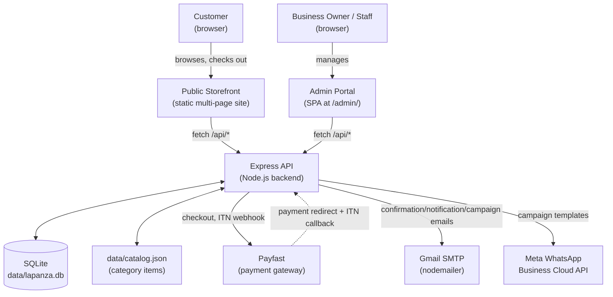

### 3.2 Component Architecture

| Component | Technology | Responsibility |
|---|---|---|
| **Public site** | Static HTML pages + Vite-bundled JS/CSS (Tailwind v4) | Product browsing, cart (localStorage), checkout, account, design requests, newsletter signup |
| **Admin portal** | Single HTML shell (`admin/index.html`) + one large vanilla-JS SPA (`admin/admin.js`, ~2,900 lines) | All back-office functionality — no separate framework (no React/Vue) |
| **Backend API** | Express 5 (`server/index.js`, ~1,400 lines) + ~20 domain modules | REST-ish JSON API, session auth (two independent session systems — admin and client), file uploads (multer), page-generation trigger |
| **Database** | better-sqlite3 (synchronous, single-connection, WAL mode) | System of record for everything except category-item products and static-page content |
| **Static page generator** | `scripts/generate-pages.mjs` | Reads DB + catalog.json, writes committed static HTML for every filament/category/car-parts page — **not** run at request time |
| **Reverse proxy / TLS** | nginx | Serves `dist/` statically, terminates HTTPS, proxies `/api`, `/admin`, `/uploads` to Node on `127.0.0.1:8787` |
| **Process supervisor** | systemd (`lapanza-admin.service`) | Keeps the Node process running, restarts on failure, starts on boot |

### 3.3 Deployment Architecture (Production)

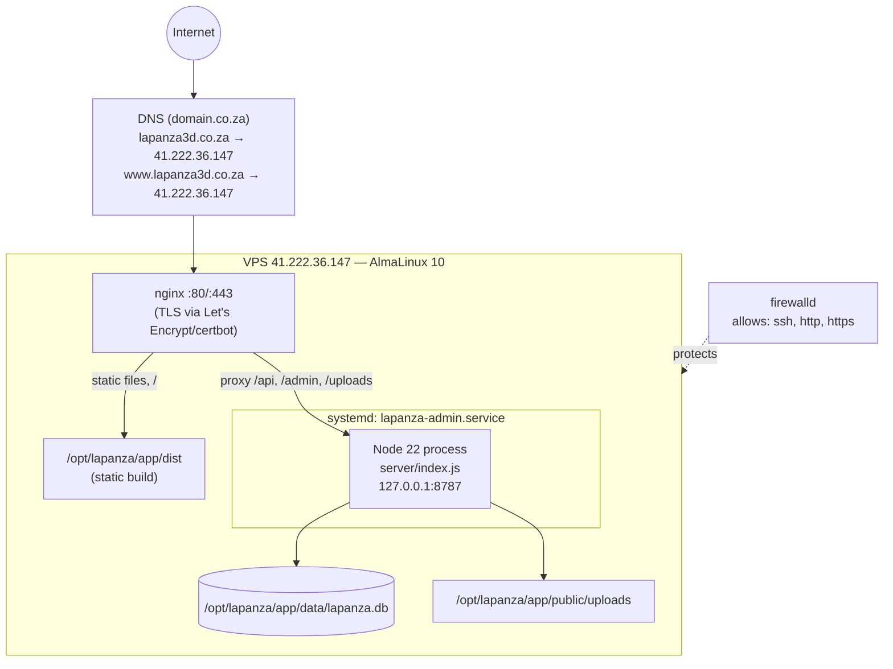

**Deployment specifics:**

| Item | Value |
|---|---|
| VPS provider | domain.co.za |
| OS | AlmaLinux 10.2 (Lavender Lion), kernel `6.12.0-211.7.3.el10_2` |
| Public IP | `41.222.36.147` |
| Domain | `lapanza3d.co.za` / `www.lapanza3d.co.za` (both A-recorded to the VPS IP) |
| Node.js | v22.23.2 (installed via NodeSource RPM repo — **`better-sqlite3` in this repo hard-requires Node ≥22**; Node 20 installs with only an engine warning then segfaults on every boot) |
| Web server | nginx 1.26.3, config at `/etc/nginx/conf.d/lapanza.conf` |
| TLS | Let's Encrypt via certbot, auto-renews via a systemd timer certbot installs |
| Process manager | systemd unit `lapanza-admin.service` (`deploy/lapanza-admin.service`), `Restart=on-failure` |
| App directory | `/opt/lapanza/app` (git clone of this repo) |
| Firewall | firewalld, default zone allows only `ssh`, `http`, `https` (+ `cockpit`, `dhcpv6-client` from the base image) |
| Deploy user | `deploy` (non-root, passwordless sudo via `/etc/sudoers.d/90-deploy`, SSH key-only login — password login is locked) |
| Deploy key | Dedicated ed25519 keypair (`~/.ssh/lapanza_vps_deploy`), public half provisioned by `deploy/bootstrap-vps.sh` |

### 3.4 Data Architecture

Two independent product data sources feed the storefront, deliberately never unified (see §2.1):

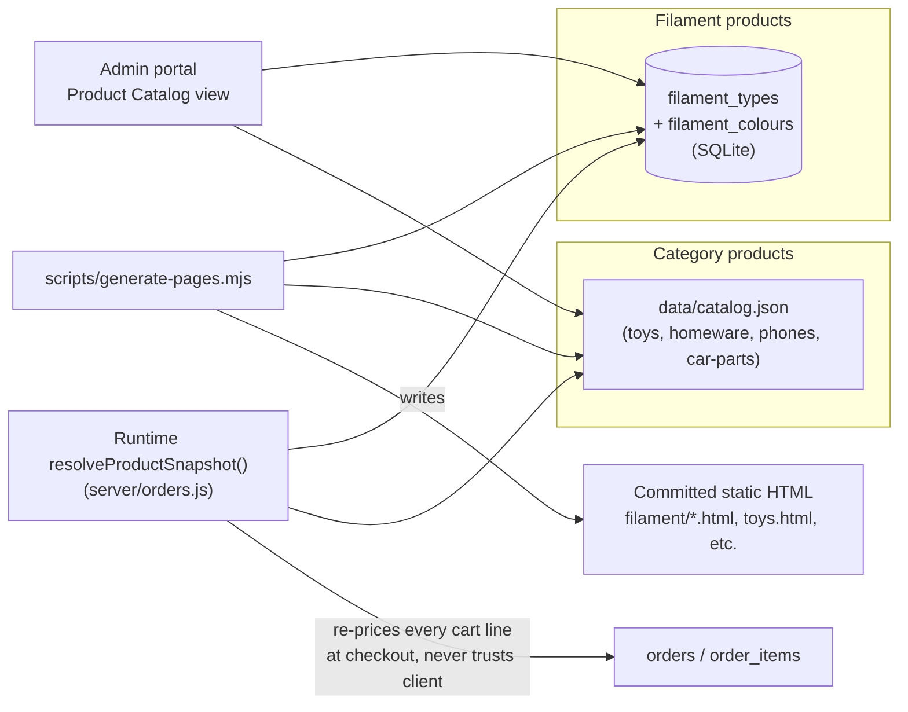

Every `productId` on the storefront encodes which system to resolve it against:
- `filament:{slug}:{sku}` — resolved against `filament_colours.sku` (globally unique)
- `category:{slug}:{sku-or-index}` — resolved against `data/catalog.json`

This lookup happens **server-side on every checkout**, never trusting a client-submitted price — see `resolveProductSnapshot()` in `server/orders.js`.

---

## 4. Software Dependencies

### 4.1 Runtime

| Requirement | Version | Notes |
|---|---|---|
| Node.js | **≥22** (production: 22.23.2) | `better-sqlite3@13` requires it; Node 20 appears to install successfully (warning only) then segfaults the process on first DB access |
| npm | 10.x+ | Ships with Node 22 |
| SQLite | bundled via better-sqlite3 (no separate install) | WAL journal mode |

### 4.2 Production Dependencies (`package.json`)

| Package | Version | Purpose |
|---|---|---|
| `express` | ^5.2.1 | HTTP server / routing |
| `better-sqlite3` | ^13.0.3 | Synchronous SQLite driver — the entire DB layer |
| `bcryptjs` | ^3.0.3 | Password hashing (admin accounts, client accounts) |
| `cookie-parser` | ^1.4.7 | Session cookie parsing (two independent session cookies — admin + client) |
| `cors` | ^2.8.6 | CORS headers (`origin: true, credentials: true`) |
| `express-rate-limit` | ^8.6.2 | Rate limiting on auth/public-form endpoints (`authLimiter`, `publicFormLimiter`) |
| `multer` | ^2.2.0 | Multipart file uploads (product images, resource files, design-request attachments, print-job files) |
| `nodemailer` | ^9.0.5 | All outbound email via Gmail SMTP + app password |
| `uuid` | ^14.0.1 | (available; most IDs actually use Node's built-in `crypto.randomUUID()`) |
| `three` | ^0.172.0 | 3D visual effects on the homepage (`src/js/home.js`) |
| `gsap` | ^3.12.7 | Animation library used throughout the public site and admin |
| `concurrently` | ^10.0.4 | Runs the Vite dev server + admin API together in local dev (`npm run dev:all`) |

### 4.3 Development Dependencies

| Package | Version | Purpose |
|---|---|---|
| `vite` | ^6.1.0 | Frontend build tool / dev server, multi-page bundling |
| `@tailwindcss/vite` | ^4.0.6 | Tailwind CSS v4 Vite plugin |
| `tailwindcss` | ^4.0.6 | Utility CSS framework |
| `nodemon` | ^3.1.14 | Backend auto-restart in dev (not used in production — systemd handles restarts there) |
| `supertest` | ^7.2.2 | HTTP assertion library (available for API tests) |

### 4.4 External Services

| Service | Used for | Configuration |
|---|---|---|
| **Payfast** | Card / Instant EFT payment processing | `PAYFAST_MODE` (sandbox/live), separate merchant ID/key/passphrase per mode, ITN webhook signature verification (`server/payfast.js`) |
| **Gmail SMTP** | All transactional + marketing email (order confirmations, verification emails, owner notifications, newsletter campaigns) | `GMAIL_USER` + `GMAIL_APP_PASSWORD` (a Google **app password**, never the real account password) |
| **Meta WhatsApp Business Cloud API** | WhatsApp marketing campaigns | `WHATSAPP_ACCESS_TOKEN` + `WHATSAPP_PHONE_NUMBER_ID`; requires a Meta Business Account, verified WhatsApp number, and at least one **Meta-approved message template** (free-text broadcast is not permitted by WhatsApp policy) |
| **domain.co.za** | Domain registration + DNS + VPS hosting | — |
| **Let's Encrypt (certbot)** | Free TLS certificates, auto-renewal | No manual credential — HTTP-01 challenge via nginx |

### 4.5 Build Toolchain

| Tool | Role |
|---|---|
| Vite (multi-page) | Bundles every top-level `*.html` + `car-parts/*.html` + `filament/*.html` as separate entries (see `vite.config.js`'s `htmlEntries()`) into `dist/` |
| `scripts/generate-pages.mjs` | **Not** part of the Vite build — a separate Node script, run via `npm run generate` or the admin "Publish to site" button, that reads the DB/catalog.json and regenerates the committed static HTML source files (which Vite then bundles) |
| `node --test` | Node's built-in test runner — no Jest/Mocha/Vitest. 161 tests across 22 `*.test.js` files |

---

## 5. Codebase & File Structure

### 5.1 Repository Layout

```
lapanza-3d-fullsite/
├── index.html                  Homepage (hand-authored — NOT regenerated by generate-pages.mjs)
├── story.html, toys.html, homeware.html, phones.html   Static pages (generated)
├── checkout.html, checkout-complete.html   Checkout flow pages
├── account.html                Customer "My Account" (register/login/order history)
├── design-request.html         Custom design/print request intake form
├── resources.html               3D Resources gallery (public)
├── car-parts/                  Generated: gwm.html, landrover.html
├── filament/                   Generated: 20 filament-type pages (pla.html, petg.html, ...)
├── admin/
│   ├── index.html               Admin SPA shell (static markup, all views as empty <div>s)
│   ├── admin.js                 ~2,900-line vanilla-JS admin application (all views, all API calls)
│   └── admin.css                Admin design system (CSS custom properties, light/dark theme)
├── src/
│   ├── data/                    site.js (nav/contact data), categories.json, filaments.json, settings.json
│   ├── js/                      Per-page Vite entry points (see 5.3) + shared modules (cart.js, cart-ui.js, nav.js, site.js)
│   └── styles/main.css          Shared Tailwind + custom CSS for the public site
├── server/
│   ├── index.js                 Express app: ALL route registration (~1,400 lines)
│   ├── db.js                    Schema definition + migrations (see §6)
│   ├── *.js (≈20 domain modules) One per business domain — see 5.2
│   └── *.test.js (≈20 files)     node:test unit tests, one per domain module
├── scripts/
│   ├── generate-pages.mjs        Static-page generator (source of truth for filament/*.html, car-parts/*.html, toys.html, homeware.html, phones.html, story.html)
│   └── generate-pages.test.js
├── deploy/                       VPS bootstrap + deploy automation (see §12)
├── public/                       Vite "public" dir — copied verbatim into dist/ (favicon, uploads/, site-settings.json)
├── data/                         Runtime data — gitignored except catalog.json is ALSO gitignored (real business data, not code)
│   ├── lapanza.db                SQLite database file (gitignored)
│   └── catalog.json              Category-item product data (gitignored — copied to server separately on deploy)
├── docs/                         This document + earlier planning docs
├── vite.config.js                Multi-page build config
├── package.json / package-lock.json
├── .env.example                  Documents every required environment variable
├── start.mjs / start.bat         One-command local dev bootstrap (installs deps, opens both dev servers)
└── README.md                     Quick-start guide (local dev only — predates Phases 2–4, see §15)
```

### 5.2 Backend Module Responsibility Matrix (`server/`)

| Module | Responsibility |
|---|---|
| `index.js` | Express app setup, session middleware (admin + client, two independent systems), **every** route registration, static file serving for `/admin` and `/uploads` |
| `db.js` | `ensureSchema()` — all `CREATE TABLE IF NOT EXISTS` + guarded `ALTER TABLE`; `getDb()` (cached singleton) / `openDb()` (explicit path, used by tests with `:memory:`) |
| `paths.js` | Resolves `dataDir()` / `uploadsDir()` / `backupsDir()` / `publicDir()` relative to `process.cwd()` (overridable via `DATA_DIR`/`UPLOADS_DIR`/`BACKUPS_DIR` env vars) |
| `migrate-json.js` | One-time bootstrap: on a brand-new DB, seeds nothing directly but is available to migrate from an older catalog.json shape if needed |
| `store.js` | Low-level product CRUD used by the admin catalog editor (filament + category items combined view) |
| `filaments.js` | Filament type + colour CRUD, stock, image upload wiring |
| `export.js` | Regenerates `public/site-settings.json` and syncs public-facing derived JSON after any catalog change |
| `admins.js` | Admin account CRUD, password hashing, first-run "setup" detection |
| `clients.js` | The single most complex domain module — guest/registered client CRUD, registration, email verification, login, WhatsApp opt-in, admin verify/resend/delete-or-revoke actions (Phase 4 addition) |
| `orders.js` | Checkout order creation (online), manual order creation (admin), invoice numbering, product-price re-resolution, stock decrement, order status lifecycle |
| `payfast.js` | Payfast redirect-payload signing, ITN (webhook) signature verification |
| `shipping.js` | Weight-bracket shipping matching (`auto_weight` options) + named flat-price options (`fixed` — PUDO lockers etc.) |
| `inventory.js` | Bulk stock-quantity updates (admin Stock Management view) |
| `resources.js` | 3D Resources (downloadable files/print settings) CRUD + public listing |
| `design-requests.js` | Custom design/print request intake, status lifecycle, admin notes |
| `newsletter.js` | Subscriber list: subscribe (double opt-in), confirm, unsubscribe |
| `newsletter-campaigns.js` | Compose → approve → send campaign lifecycle over the subscriber list |
| `whatsapp.js` | Meta Graph API client — `sendWhatsAppTemplate()`, `isWhatsAppConfigured()` |
| `whatsapp-campaigns.js` | Compose → approve → send campaign lifecycle over WhatsApp-opted-in clients |
| `mailer.js` | Every outbound email template (order confirmation, verification, low-stock alert, owner notifications, newsletter campaign send, design-request status change) |
| `print-jobs.js` | Print-job costing calculator (multi-filament, labour/power/markup) + in-house filament consumption logging |
| `in-house-filament.js` | Internal filament roll inventory (separate from the sellable Filament Library) |
| `purchases.js` | Supplier purchase / expense tracking |
| `settings.js` | Settings key-value store read/write wrapper |
| `settings-defaults.js` | Default values for every setting + the Google Fonts curated list |
| `uploads.js` | Multer storage configs + allowed-extension lists per upload type (filament images, resource images/files, design-request attachments, print-job images/files) |
| `jobs.js` | Background/periodic tasks: cancelling stale pending-payment orders, and the daily automated database backup (`startAutoBackupJob`) |
| `backups.js` | Database backup lifecycle — `createBackup()` (better-sqlite3's online backup API, safe against a live WAL-mode DB), `listBackups()`, `deleteBackup()`, `getBackupPath()`, `pruneOldBackups()` |
| `analytics.js` | Visitor tracking — `recordPageView()` (writes to `page_views`), `touchActiveVisitor()`/`getActiveVisitors()`/`pruneActiveVisitors()` (in-memory only, never persisted), `getVisitSummary()` (historical totals/daily breakdown/top pages) |

### 5.3 Frontend Structure (`src/js/`)

Each public-facing page has its own Vite entry point (registered in `vite.config.js`), all importing the shared `site.js` (which mounts navigation + cart UI on every page):

| Entry file | Page | Responsibility |
|---|---|---|
| `home-entry.js` | `index.html` | Homepage motion effects (`home.js`, GSAP + Three.js), **clears any stale cart on load** |
| `checkout-entry.js` | `checkout.html` | Full checkout form, shipping calculation, Payfast redirect submission, post-purchase opt-in panel |
| `checkout-complete-entry.js` | `checkout-complete.html` | Payfast return-URL landing page, clears cart |
| `account-entry.js` | `account.html` | Register/login/logout, order history |
| `design-request-entry.js` | `design-request.html` | Custom design request form submission (with file uploads) |
| `resources-entry.js` | `resources.html` | 3D Resources gallery listing + download links |
| `site.js` | *(imported by every page)* | Mounts `nav.js` (sidebar) + `cart-ui.js` (cart drawer, add-to-cart toast) + `analytics.js` (visitor beacon), theme toggle |
| `analytics.js` | *(shared)* | Sends a pageview beacon on load + a ~45s heartbeat while the tab stays visible, via `navigator.sendBeacon` — anonymous, client-generated visitor id only, no IP/fingerprinting |
| `cart.js` | *(shared)* | localStorage-backed cart state (`getCart`, `addItem`, `updateQuantity`, `removeItem`, `clearCart`), dispatches a `cart:updated` DOM event on every mutation |
| `cart-ui.js` | *(shared)* | Cart drawer UI, floating cart button + badge, add-to-cart toast notification |
| `nav.js` | *(shared)* | Sidebar navigation rendering (shared markup across every page) |
| `swatches.js` / `appearance.js` | *(shared)* | Colour-swatch rendering helpers; theme (light/dark) persistence |

### 5.4 Admin Frontend Structure

The admin portal is a **single hand-written vanilla-JS SPA** — no build-time framework, no client-side router library. `admin.js` implements:
- A `state` object + a `setRoute(route)` function that shows/hides `<div id="view-*">` elements
- One `render*()` function per view (e.g. `renderDashboard`, `renderCatalog`, `renderOrders`, `renderRegisteredUsers`, `renderNewsletterCampaigns`, `renderWhatsAppCampaigns`, `renderPrintJobs`, `renderInHouseFilament`, `renderPurchases`, `renderSettings`, ...) — each fetches its own data via a shared `api()` fetch wrapper and re-renders its `<div>`'s `innerHTML`
- All HTML is built via template literals with an `escapeHtml`/`escapeAttr` helper applied to every interpolated value (no innerHTML XSS)

---

## 6. Data Model (Database Schema)

19 tables in a single SQLite file (`data/lapanza.db`), `PRAGMA foreign_keys = ON`.

### 6.1 Entity Relationship Diagram

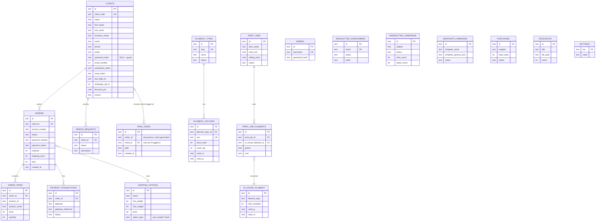

### 6.2 Table Reference

#### `admins`
Admin (staff) login accounts.
| Column | Type | Notes |
|---|---|---|
| id | TEXT PK | UUID |
| username | TEXT UNIQUE NOT NULL | |
| password_hash | TEXT NOT NULL | bcrypt |
| created_at | TEXT NOT NULL | ISO 8601 |

#### `filament_types`
The sellable filament catalog's parent record (one per material, e.g. "PLA", "PETG Speed").
| Column | Type | Notes |
|---|---|---|
| id | TEXT PK | |
| slug | TEXT UNIQUE NOT NULL | URL slug, drives `filament/{slug}.html` |
| name, description, colour_note | TEXT | Display copy |
| specs_json | TEXT | JSON array of spec rows |
| seo_title, seo_description | TEXT | |
| internal_notes | TEXT | Admin-only |
| status | TEXT DEFAULT 'published' | `published` / `draft` |
| featured | INTEGER (bool) | |
| sort_order | INTEGER | |
| created_at, updated_at | TEXT | |

#### `filament_colours`
One row per sellable SKU within a filament type.
| Column | Type | Notes |
|---|---|---|
| id | TEXT PK | |
| filament_type_id | TEXT FK → filament_types(id) ON DELETE CASCADE | |
| name, hex | TEXT | |
| sku | TEXT UNIQUE NOT NULL | Global uniqueness — used as the sole lookup key at checkout |
| weight_g | INTEGER | Product's own net weight (a spec) |
| shipping_weight_g | INTEGER | Parcel weight used for shipping-bracket matching — defaults to `weight_g`, admin-overridable |
| roll_length_m | REAL | |
| price_rand | INTEGER | Storefront price (whole Rand) |
| stock_qty | INTEGER | |
| used_m, used_g | REAL | Cumulative consumption logged by Print Job Costing (never decremented from `stock_qty` directly — remaining stock is `stock_qty`, this is separate internal usage tracking) |
| image_path | TEXT | `/uploads/filaments/...` |
| notes | TEXT | |
| sort_order | INTEGER | |
| created_at, updated_at | TEXT | |

#### `settings`
Simple key-value store (site config, invoicing config, print-job-costing rates). See `server/settings-defaults.js` for the full default key list (§9.13).
| Column | Type |
|---|---|
| key | TEXT PK |
| value | TEXT (often JSON-encoded) |

#### `clients`
**The most overloaded table in the system.** One row = one person/business the shop has dealt with, whether guest-checkout, registered account, or manually-entered (admin-imported) contact.
| Column | Type | Notes |
|---|---|---|
| id | TEXT PK | |
| client_code | TEXT UNIQUE NOT NULL | Sequential `CLI-000001` format |
| name | TEXT | Display name — always populated, mirrors first+last or business name |
| first_name, last_name, business_name | TEXT | Added Phase 3 |
| email | TEXT NOT NULL | Case-insensitively matched (`idx_clients_email`), not DB-unique — app enforces uniqueness for real accounts only |
| phone, street, suburb, city, province, postal_code, country | TEXT | Address fields |
| password_hash | TEXT NULL | **NULL = guest, set = registered account** |
| email_verified | INTEGER (bool) | |
| verification_token, verification_token_expires | TEXT | 24h TTL, single-use |
| reset_token, reset_token_expires | TEXT | V1.01 — password recovery, 1h TTL, single-use; separate from verification_token so both can be outstanding at once |
| last_login_at | TEXT NULL | Phase 4 |
| whatsapp_opt_in | INTEGER (bool) DEFAULT 0 | Phase 4, separate consent from newsletter |
| discount_pct | REAL DEFAULT 0 | Applied only on admin-created manual orders |
| discount_note | TEXT | |
| source | TEXT | Free-text lead source (`Website`, `Facebook`, `WA Group`, etc.) |
| created_at | TEXT NOT NULL | |

#### `orders`
| Column | Type | Notes |
|---|---|---|
| id | TEXT PK | |
| client_id | TEXT NOT NULL FK → clients(id) | |
| invoice_number | TEXT | `INV-0001` format, sequential (see §9.6) |
| status | TEXT DEFAULT 'pending_payment' | `pending_payment` \| `paid` \| `shipped` \| `completed` \| `cancelled` |
| subtotal, shipping_price, total | INTEGER | Whole Rand |
| discount_pct, discount_amount | | Manual-order-only |
| shipping_option_id | TEXT FK → shipping_options(id) NULL | |
| shipping_method | TEXT DEFAULT 'courier' | `courier` \| `own_courier` \| `collect` \| `fixed` |
| total_weight | INTEGER | Grams |
| payment_method | TEXT NOT NULL | `payfast_card` \| `payfast_eft` \| `manual_eft` \| `cash_on_collection` |
| payment_status | TEXT DEFAULT 'pending' | `pending` \| `paid` |
| tracking_number | TEXT | |
| confirmation_email_sent_at | TEXT NULL | |
| created_at, updated_at | TEXT | |

#### `order_items`
| Column | Type | Notes |
|---|---|---|
| id | TEXT PK | |
| order_id | TEXT NOT NULL FK → orders(id) ON DELETE CASCADE | |
| product_id | TEXT NOT NULL | `filament:{slug}:{sku}`, `category:{slug}:{sku}`, or `manual:{uuid}` for free-text lines |
| product_name, price, quantity, weight | | Snapshotted at order time — never re-derived |

#### `payment_transactions`
| Column | Type | Notes |
|---|---|---|
| id | TEXT PK | |
| order_id | TEXT NOT NULL FK → orders(id) ON DELETE CASCADE | |
| gateway | TEXT | `payfast` |
| gateway_reference | TEXT | Payfast's `pf_payment_id` |
| raw_payload | TEXT | Full ITN payload, JSON |
| status | TEXT | |
| created_at | TEXT | |
| *(unique index)* | `(gateway, gateway_reference, status)` | Idempotency — Payfast may resend the same ITN |

#### `shipping_options`
| Column | Type | Notes |
|---|---|---|
| id | TEXT PK | |
| name | TEXT | |
| min_weight, max_weight | INTEGER | Grams — bracket bounds for `auto_weight` type |
| price | INTEGER | |
| active | INTEGER (bool) | |
| option_type | TEXT DEFAULT 'auto_weight' | `auto_weight` (bracket-matched) \| `fixed` (named, customer/admin-picked directly — PUDO lockers, local delivery zones) |
| created_at, updated_at | TEXT | |

#### `resources`
3D Resources gallery (downloadable print settings/files).
| Column | Type |
|---|---|
| id, title, description | |
| image_path, file_path | `/uploads/resources/...` |
| print_settings, filament_type, dimensions | TEXT |
| active, sort_order | |
| created_at, updated_at | |

#### `newsletter_subscribers`
| Column | Type | Notes |
|---|---|---|
| id | TEXT PK | |
| email | TEXT UNIQUE NOT NULL | |
| status | TEXT DEFAULT 'pending' | `pending` \| `confirmed` \| `unsubscribed` |
| token | TEXT NOT NULL | Reused for BOTH the confirm link and every future unsubscribe link — one token, whole subscriber lifetime |
| subscribed_at, confirmed_at, unsubscribed_at | TEXT NULL | |

#### `design_requests`
| Column | Type | Notes |
|---|---|---|
| id | TEXT PK | |
| client_id | TEXT FK → clients(id) NULL | Linked if the submitter is a known client |
| name, email, phone, description, budget_note | TEXT | |
| reference_image_path, reference_file_path | TEXT NULL | |
| status | TEXT DEFAULT 'new' | `new` \| `in_review` \| `quoted` \| `accepted` \| `rejected` \| `completed` |
| admin_notes | TEXT | |
| created_at, updated_at | TEXT | |

#### `print_jobs`
Internal costing record. Not linked to storefront orders — but as of the "List for sale" feature below, CAN be explicitly, manually published as a real category product; that link is what `listing_category_id`/`listing_item_id` track.
| Column | Type | Notes |
|---|---|---|
| id, item_name | | |
| total_grams, total_meters | REAL | Sum across all filament slots |
| print_time_minutes, design_hours, setup_hours, post_processing_hours | | Time inputs |
| markup_pct | REAL | |
| filament_cost, power_cost, labour_cost, running_cost, total_cost, markup_amount, selling_price | REAL | Calculated outputs — `selling_price` is the computed floor, labelled **"Minimum Selling Price"** in the admin UI, never overridden |
| final_selling_price | REAL | Admin-editable — defaults to `selling_price` at creation if not supplied. What actually gets used as the price if/when this job is listed for sale |
| reference_file_path, reference_image_path | TEXT NULL | |
| status | TEXT DEFAULT 'Printed' | `Printed` / `Estimate` (renamed from `printed`/`planned` — see the migration note below) |
| date_printed | TEXT NULL | |
| created_at | TEXT | |
| listing_category_id, listing_item_id | TEXT NULL | Set once this job has been published as a category product — together locate the specific item inside that category's `items` array in `catalog.json` (there's no separate items table, see `store.js`). Both null until then; a second "List for sale" click on an already-listed job updates this same item instead of creating a duplicate. |

> **Migration note:** `status` values were renamed from lowercase `planned`/`printed` to `Estimate`/`Printed` when the "List for sale" feature shipped — `ensurePrintJobColumns()` in `db.js` runs a one-time, idempotent `UPDATE` on every boot to convert any pre-existing rows.

#### `in_house_filament`
Physical rolls kept for internal/local printing — separate from the sellable `filament_colours` catalog.
| Column | Type | Notes |
|---|---|---|
| id, filament_type, color_name | | |
| rolls_available | INTEGER | |
| weight_g, roll_length_m | | Per-roll spec |
| cost_per_roll_rand | INTEGER | |
| used_g, used_m | REAL | Cumulative consumption from logged print jobs |
| created_at, updated_at | TEXT | |

#### `print_job_filaments`
Join table — up to 4 filament slots per print job (multi-material prints).
| Column | Type |
|---|---|
| id | TEXT PK |
| print_job_id | FK → print_jobs(id) ON DELETE CASCADE |
| in_house_filament_id | FK → in_house_filament(id) |
| grams, meters, cost | REAL |
| slot_order | INTEGER |

> **Note:** this table replaced an earlier single-filament, role-based (`model_g`/`support_g`/...) shape via a one-time `DROP TABLE` + recreate in `db.js`, safe only because it shipped in the same phase with no production rows yet. This is explicitly called out in code as **not** the normal migration pattern for this project.

#### `purchases`
Supplier expense tracking.
| Column | Type |
|---|---|
| id, supplier, goods | |
| total_value | INTEGER |
| status | TEXT DEFAULT 'outstanding' — `outstanding` \| `paid` |
| payment_type | TEXT |
| purchase_date, created_at | TEXT |

#### `newsletter_campaigns`
| Column | Type | Notes |
|---|---|---|
| id, subject, body_text | | |
| status | TEXT DEFAULT 'draft' | `draft` \| `approved` \| `sent` |
| created_at, approved_at, sent_at | TEXT NULL | |
| sent_count, failed_count | INTEGER | Per-recipient send outcome tally |

#### `whatsapp_campaigns`
| Column | Type | Notes |
|---|---|---|
| id, template_name | | Must match a Meta-approved template name |
| template_params_json | TEXT | JSON array — the `{{1}}`, `{{2}}`... substitution values |
| status | TEXT DEFAULT 'draft' | `draft` \| `approved` \| `sent` |
| created_at, approved_at, sent_at | TEXT NULL | |
| sent_count, failed_count | INTEGER | |

#### `page_views`
One row per real page load (never per heartbeat — see §9.20). Post-launch addition.
| Column | Type | Notes |
|---|---|---|
| id | TEXT PK | |
| visitor_id | TEXT NOT NULL | Random, client-generated (localStorage), carries no personal information on its own |
| client_id | TEXT FK → clients(id) NULL | Only set when the visitor holds a valid logged-in client session at that moment — this is the one column on this table that ties a row to a real, identified person |
| path | TEXT NOT NULL | Truncated to 300 chars server-side |
| referrer | TEXT NOT NULL DEFAULT '' | Truncated to 300 chars server-side |
| created_at | TEXT NOT NULL | |
| *(indexes)* | `created_at`, `visitor_id` | |

#### `version_history`
Track deployments and system updates. Every row is created automatically by `scripts/record-deploy-version.mjs` after a deploy (V1.01) — nothing writes here manually.
| Column | Type | Notes |
|---|---|---|
| id | TEXT PK | |
| version_number | INTEGER NOT NULL UNIQUE | Legacy plain-incrementing integer, kept only to satisfy this constraint — not the displayed version |
| version_label | TEXT | V1.01 — the displayed version, `"<major>.<minor>"` two-digit-padded (e.g. `"1.01"`), computed by `nextLabel()` in `server/version-history.js` |
| description | TEXT NOT NULL | Latest git commit subject + short hash at deploy time, unless passed explicitly |
| deployed_date | TEXT NOT NULL | ISO timestamp when this version was recorded |
| deployed_by | TEXT NOT NULL DEFAULT 'admin' | Always `'deploy'` for automated rows |
| created_at | TEXT NOT NULL | Row creation timestamp |
| *(indexes)* | `version_number DESC` | Legacy — `listVersions()` actually orders by `created_at DESC, version_number DESC` |

#### `todo_items`
Backlog/todo tracker (admin "Todo / Backlog" page, §7.22). Append-only — no delete function exists.
| Column | Type | Notes |
|---|---|---|
| id | TEXT PK | |
| number | INTEGER NOT NULL UNIQUE | The displayed "No" column, auto-incrementing, separate from `date_added` |
| category | TEXT NOT NULL | `Bug` / `Feature` / `Enhancement` / `Tech Debt` |
| name | TEXT NOT NULL | |
| description | TEXT NOT NULL DEFAULT '' | |
| status | TEXT NOT NULL DEFAULT 'Backlog' | `Backlog` / `In Progress` / `Done` / `Won't Fix` |
| planned_fix_date | TEXT | Nullable, admin-set |
| actual_fix_date | TEXT | Nullable — auto-stamped by `updateTodo` the moment `status` becomes `Done`, unless already supplied |
| date_added | TEXT NOT NULL | Drives sort order (`ORDER BY date_added DESC`); backdatable at creation for seeded items |
| created_at, updated_at | TEXT NOT NULL | |
| *(indexes)* | `date_added DESC` | |
| *(seed)* | 13 rows | Inserted once, automatically, the first time this table is empty (`seedTodoItems` in `server/db.js`) — mirrors §15 Known Limitations at the time this table shipped |

---

## 7. API Reference

All routes are prefixed `/api` unless noted. Auth column: **Public** (no auth), **Admin** (`requireAuth` — admin session cookie), **Client** (`requireClientAuth` — customer session cookie), **Guarded** (public but email/id-matched, not a real auth session).

### 7.1 Admin Authentication & Setup

| Method | Path | Auth | Purpose |
|---|---|---|---|
| GET | `/api/health` | Public | Health check — verifies the database is actually reachable (not just that the process is alive), returns `503` if not. Designed to be polled by an external uptime monitor (see `docs/UPTIME_MONITORING.md`). |
| GET | `/api/setup/status` | Public | Reports whether first-run admin setup is needed (`{needsSetup}`) |
| POST | `/api/setup` | Public | First-run only — creates the first admin account |
| POST | `/api/auth/login` | Public (rate-limited) | Admin login |
| POST | `/api/auth/logout` | Public | Admin logout |
| GET | `/api/auth/me` | Public | Current admin session status |
| GET | `/api/admins` | Admin | List admin accounts |
| POST | `/api/admins` | Admin | Create admin account |
| DELETE | `/api/admins/:id` | Admin | Remove admin account |
| POST | `/api/admins/:id/reset-password` | Admin | Reset another admin's password |
| GET | `/api/dashboard` | Admin | Summary stats for the dashboard view |

### 7.2 Customer Accounts

| Method | Path | Auth | Purpose |
|---|---|---|---|
| POST | `/api/client/register` | Public (rate-limited) | Register (or upgrade an existing guest row) |
| GET | `/api/client/verify` | Public | Consumes a verification token (redirects to `/index.html?verified=0\|1`) |
| POST | `/api/client/login` | Public (rate-limited) | Customer login |
| POST | `/api/client/forgot-password` | Public (rate-limited) | V1.01 — emails a reset link if the address has a registered account; always returns the same generic message either way |
| POST | `/api/client/reset-password` | Public (rate-limited) | V1.01 — consumes the reset token, sets the new password, revokes other sessions for that client, and logs the requester in |
| POST | `/api/client/logout` | Public | Customer logout |
| GET | `/api/client/me` | Public | Current client session status |
| GET | `/api/client/orders` | Client | Own order history |
| PATCH | `/api/client/:id/marketing-preferences` | Guarded (email-matched, rate-limited) | Post-checkout WhatsApp opt-in toggle |

### 7.3 Newsletter (Public)

| Method | Path | Auth | Purpose |
|---|---|---|---|
| POST | `/api/newsletter/subscribe` | Public (rate-limited) | Double opt-in subscribe |
| GET | `/api/newsletter/confirm` | Public | Confirms subscription (redirect) |
| GET | `/api/newsletter/unsubscribe` | Public | Unsubscribes (redirect) |

### 7.4 Newsletter Campaigns (Admin)

| Method | Path | Auth | Purpose |
|---|---|---|---|
| GET | `/api/newsletter-campaigns` | Admin | List campaigns |
| POST | `/api/newsletter-campaigns` | Admin | Create draft |
| PATCH | `/api/newsletter-campaigns/:id/approve` | Admin | draft → approved |
| POST | `/api/newsletter-campaigns/:id/send` | Admin | approved → sent (emails every `confirmed` subscriber) |

### 7.5 WhatsApp Campaigns (Admin)

| Method | Path | Auth | Purpose |
|---|---|---|---|
| GET | `/api/whatsapp-campaigns` | Admin | List campaigns (+ `configured` flag) |
| POST | `/api/whatsapp-campaigns` | Admin | Create draft (template name + up to 4 params) |
| PATCH | `/api/whatsapp-campaigns/:id/approve` | Admin | draft → approved |
| POST | `/api/whatsapp-campaigns/:id/send` | Admin | approved → sent (messages every `whatsapp_opt_in=1` client with a phone number) |

### 7.6 Product Catalog (Admin)

| Method | Path | Auth | Purpose |
|---|---|---|---|
| GET/POST/PUT/DELETE | `/api/filaments`, `/api/filaments/:id` | Admin | Filament type CRUD |
| POST/PUT/DELETE | `/api/filaments/:id/colours`, `/api/filaments/:filamentId/colours/:colourId` | Admin | Colour/SKU CRUD |
| POST | `/api/filaments/:filamentId/colours/:colourId/image` | Admin | Colour image upload |
| GET/POST/PUT/DELETE | `/api/products`, `/api/products/:id` | Admin | Category-item CRUD (toys/homeware/phones/car-parts) |

### 7.7 Clients / Registered Users (Admin)

| Method | Path | Auth | Purpose |
|---|---|---|---|
| GET | `/api/clients` (`?q=&registeredOnly=`) | Admin | List/search clients |
| GET | `/api/clients/:id` | Admin | Client detail + order history |
| POST | `/api/clients` | Admin | Create client manually |
| PUT | `/api/clients/:id` | Admin | Update client |
| PATCH | `/api/clients/:id/verify` | Admin | Manually mark verified (skips token) |
| POST | `/api/clients/:id/resend-verification` | Admin | Regenerate token + resend verification email |
| DELETE | `/api/clients/:id` | Admin | Delete (no orders) or revoke account (has orders) — see §9.4 |

### 7.8 Shipping (Admin + Public)

| Method | Path | Auth | Purpose |
|---|---|---|---|
| GET/POST/PUT/DELETE | `/api/shipping-options`, `/api/shipping-options/:id` | Admin | Manage shipping options |
| GET | `/api/shipping-match?weight=` | Public | Weight-bracket match (used by checkout) |
| GET | `/api/shipping-options/public/fixed` | Public | List active `fixed`-type options (PUDO etc.) |

### 7.9 Stock / Inventory (Admin)

| Method | Path | Auth | Purpose |
|---|---|---|---|
| GET | `/api/inventory` | Admin | Stock overview |
| PUT | `/api/inventory` | Admin | Bulk stock update |

### 7.10 3D Resources

| Method | Path | Auth | Purpose |
|---|---|---|---|
| GET/POST/PUT/DELETE | `/api/resources`, `/api/resources/:id` | Admin | Manage resources |
| POST | `/api/resources/:id/image`, `/api/resources/:id/file` | Admin | Upload assets |
| GET | `/api/resources/public/list` | Public | Gallery listing |
| GET | `/api/resources/:id/download` | Public | Forced file download |

### 7.11 Design Requests

| Method | Path | Auth | Purpose |
|---|---|---|---|
| POST | `/api/design-requests` | Public (rate-limited) | Submit request (with optional file uploads) |
| GET | `/api/design-requests`, `/api/design-requests/:id` | Admin | List/detail |
| PATCH | `/api/design-requests/:id` | Admin | Update status/notes (triggers status-change email) |
| DELETE | `/api/design-requests/:id` | Admin | Remove |

### 7.12 Print Job Costing (Admin)

| Method | Path | Auth | Purpose |
|---|---|---|---|
| GET | `/api/print-jobs`, `/api/print-jobs/:id` | Admin | List/detail |
| POST | `/api/print-jobs/validate` | Admin | Pre-flight cost calculation (no save) |
| POST | `/api/print-jobs` | Admin | Create (calculates + logs filament consumption) |
| PATCH/DELETE | `/api/print-jobs/:id` | Admin | Update (status, finalSellingPrice) / delete |
| POST | `/api/print-jobs/:id/image`, `/api/print-jobs/:id/file` | Admin | Upload assets |
| POST | `/api/print-jobs/:id/list-for-sale` | Admin | Publishes this job as a **new** category product. Body: `{ categorySlug, stockQty }`. `400` if already listed, if `finalSellingPrice` isn't set, or the category doesn't exist |
| PUT | `/api/print-jobs/:id/listing` | Admin | Updates the **already-linked** listing's stock/price ("printed 3 more"). Body: `{ stockQty, price }`. `400` if this job hasn't been listed yet |

### 7.13 In-House Filament (Admin)

| Method | Path | Auth | Purpose |
|---|---|---|---|
| GET/POST/PUT/DELETE | `/api/in-house-filament`, `/api/in-house-filament/:id` | Admin | Manage internal filament rolls |

### 7.14 Purchases (Admin)

| Method | Path | Auth | Purpose |
|---|---|---|---|
| GET/POST/PUT/DELETE | `/api/purchases`, `/api/purchases/:id` | Admin | Supplier purchase tracking |

### 7.15 Orders / Invoicing (Admin + Public)

| Method | Path | Auth | Purpose |
|---|---|---|---|
| GET | `/api/orders` | Admin | List (filter by status/search) |
| POST | `/api/orders` | Admin | Create manual order |
| GET | `/api/orders/:id` | Admin | Detail |
| PUT | `/api/orders/:id/status` | Admin | Change status |
| PUT | `/api/orders/:id/tracking` | Admin | Set tracking number |
| POST | `/api/orders/:id/send-confirmation` | Admin | Resend confirmation email |
| GET | `/api/orders/:id/packing-slip` | Admin | Printable packing slip (HTML) |
| GET | `/api/orders/:id/invoice` | Admin | Printable invoice (HTML) |
| POST | `/api/checkout` | Public | **The** online checkout endpoint |
| POST | `/api/payfast/itn` | Public (Payfast only) | Payment webhook |

### 7.16 Settings & Publish (Admin)

| Method | Path | Auth | Purpose |
|---|---|---|---|
| GET | `/api/settings` | Admin | All settings + font options |
| PUT | `/api/settings` | Admin | Update settings (allow-listed keys only) |
| POST | `/api/publish` | Admin | Runs `generate-pages.mjs` logic to regenerate static HTML from current catalog data |

### 7.17 Database Backups (Admin)

| Method | Path | Auth | Purpose |
|---|---|---|---|
| GET | `/api/backups` | Admin | List all backups (filename, size, created date) |
| POST | `/api/backups` | Admin | Create a backup now |
| GET | `/api/backups/:filename/download` | Admin | Download a specific backup file |
| DELETE | `/api/backups/:filename` | Admin | Delete a specific backup file |
| POST | `/api/backups/sync-offsite` | Admin | Manually mirror `data/backups/` to the configured `rclone` remote now, rather than waiting for the next daily run; `400` with a clear message if `BACKUP_RCLONE_REMOTE` isn't set yet |

### 7.19 Visitor Analytics

| Method | Path | Auth | Purpose |
|---|---|---|---|
| POST | `/api/analytics/beacon` | Public (rate-limited, 30/min — much more permissive than other public routes since legitimate traffic hits this on every page load plus a periodic heartbeat) | Records a pageview or updates the in-memory active-visitor map (heartbeat) |
| GET | `/api/analytics/active` | Admin | Live "who's on the site right now" — total/anonymous/registered counts + a list of active registered clients |
| GET | `/api/analytics/summary` | Admin | Historical totals — all-time visits, unique visitors, today's visits, last-30-days daily breakdown, top 10 pages |

### 7.20 Static Serving

| Route | Behaviour |
|---|---|
| `/admin`, `/admin/*` | `express.static(admin/)` + SPA fallback to `admin/index.html` |
| `/uploads/*` | `express.static(public/uploads/)` |
| `/` | Redirects to `/admin/` (the Node server itself does **not** serve the public storefront — that's nginx's job in production, or a separate Vite dev server locally) |

### 7.21 Version History (Admin) — V1.01: now automated, no manual entry

| Method | Path | Auth | Purpose |
|---|---|---|---|
| GET | `/api/version-history` | Admin | List all recorded versions in reverse chronological order (newest first) — read-only |

**Responses:**

- **GET** `200` → `{ versions: [ { id, version_number, version_label, description, deployed_date, deployed_by, created_at }, ... ] }`

**Behaviour:**
- There is no POST route and no "Record Version" button in the admin UI as of V1.01 — a row is created only by `scripts/record-deploy-version.mjs`, which `deploy/deploy-app.sh` runs automatically after every deploy (non-fatal if it fails — a version-history hiccup never blocks a deploy). It reads the latest git commit subject/hash as the description unless one is passed explicitly as `argv[2]`.
- `version_label` is the customer/admin-facing string, `"<major>.<minor>"` two-digit-padded (e.g. `"1.01"`), computed by `server/version-history.js`'s `nextLabel()` — starts at `1.01`, increments the minor part each deploy, rolls the major over after `.99`.
- `version_number` is a legacy plain-incrementing integer, kept only to satisfy the original schema's `NOT NULL UNIQUE` constraint — not shown in the UI.
- `deployed_date` is always the record-time timestamp (ISO 8601). `deployed_by` is `'deploy'` for every automated row.

### 7.22 Todo / Backlog (Admin)

| Method | Path | Auth | Purpose |
|---|---|---|---|
| GET | `/api/todos` | Admin | List all items, newest `dateAdded` first |
| POST | `/api/todos` | Admin | Create a new item |
| PUT | `/api/todos/:id` | Admin | Edit an item's fields and/or change its status |

**Responses:**

- **GET** `200` → `{ todos: [ { id, number, category, name, description, status, plannedFixDate, actualFixDate, dateAdded, createdAt, updatedAt }, ... ] }`
- **POST** `201` → `{ todo }`. `400` → `{ error: "Name is required" }`
- **PUT** `200` → `{ todo }`. `404` if the id doesn't exist.

**Behaviour:**
- No DELETE route exists at all — append-only by design (`server/todos.js`), same philosophy as `version_history`: a mistaken or duplicate item is edited to status `"Won't Fix"` with a note, never removed.
- `category` is one of `Bug`/`Feature`/`Enhancement`/`Tech Debt`; `status` is one of `Backlog`/`In Progress`/`Done`/`"Won't Fix"` — an invalid value on create silently falls back to `Feature`/`Backlog` rather than rejecting the request (mirrors `createPurchase`'s status-clamping pattern elsewhere in this codebase).
- `number` is a separate display sequence (the "No" column) from `id`, auto-incrementing like `version_history.version_number`.
- `updateTodo` auto-stamps `actualFixDate` to the current timestamp the moment `status` becomes `Done`, unless the request already supplied one.
- Seeded once, automatically, the first time `todo_items` is empty (`seedTodoItems` in `server/db.js`) — the 13 items from §15 Known Limitations at the time this table shipped.
- No separate "Claude" identity or API key — this assistant adds/edits items through the same `requireAuth` admin-session path any logged-in admin uses.

---

## 8. Process Flow Diagrams

### 8.1 Customer Purchase Journey

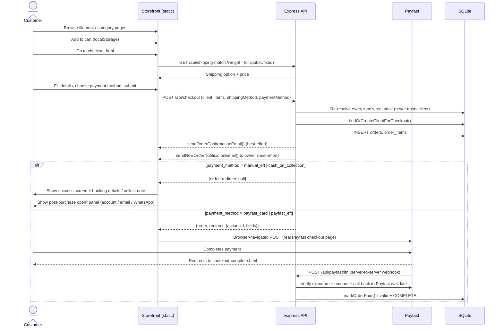

### 8.2 Customer Account Lifecycle

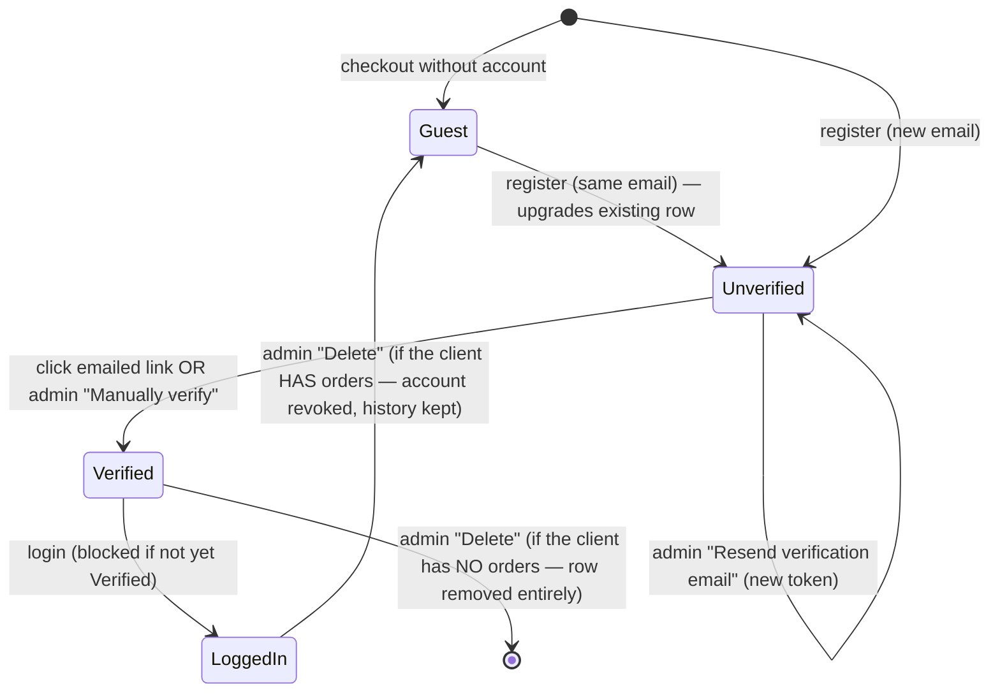

### 8.3 Admin Order & Invoice Management

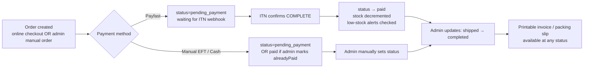

### 8.4 Newsletter Campaign Lifecycle

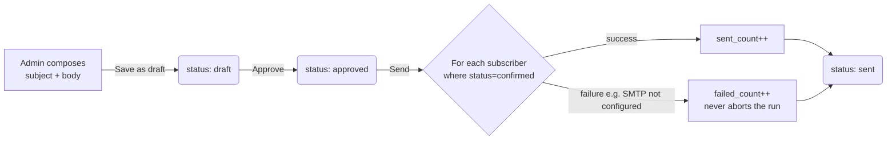

### 8.5 WhatsApp Campaign Lifecycle

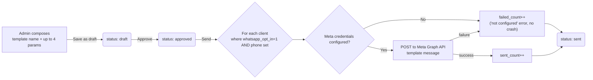

### 8.6 Design Request Lifecycle

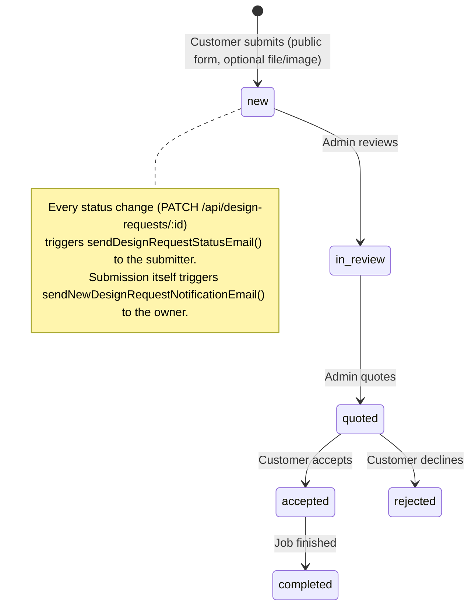

### 8.7 Print Job Costing Flow

```mermaid
flowchart TD
    A[Admin selects up to 4<br/>in-house filaments + grams/meters] --> B[Enter time inputs:<br/>print time, design/setup/post-processing hours]
    B --> C[Enter markup %]
    C --> D["POST /api/print-jobs/validate<br/>(preview, no save)"]
    D --> E{Admin confirms}
    E -->|Save| F["POST /api/print-jobs<br/>calculates: filament_cost, power_cost,<br/>labour_cost, running_cost, total_cost,<br/>markup_amount, selling_price"]
    F --> G[Logs consumption:<br/>in_house_filament.used_g/used_m incremented<br/>per filament slot used]
    G --> H[print_job_filaments rows created<br/>(one per slot)]
```

### 8.8 "Publish to Site" Flow

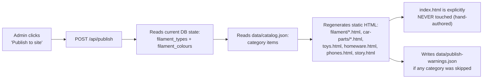

### 8.9 Deployment / Release Flow

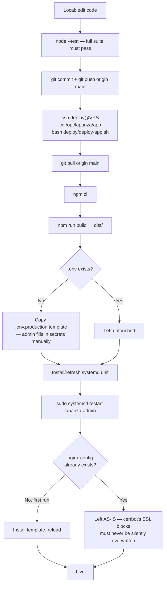

---

## 9. Functional Documentation

Each subsection: **Purpose · Actors · Key Fields · Business Rules · Flow · Endpoints · Tables Touched.**

### 9.1 Product Browsing (Storefront)

- **Purpose:** Let customers browse filament and category products.
- **Actors:** Anonymous/authenticated customer.
- **Key fields displayed:** name, price, colour swatches, stock (implicitly — out-of-stock items still show but checkout re-validates), specs, images.
- **Business rules:** All storefront browsing pages are **pre-generated static HTML** (see §8.8) — there is no live database query on page load. Content is only as fresh as the last "Publish to site" run.
- **Flow:** Static page → "Add to cart" button (`data-add-to-cart` attribute carries `productId`/`price`/`name`/`image`/`weight`) → delegated document-level click handler in `cart-ui.js` → `cart.js` writes to `localStorage` → toast notification shown.
- **Endpoints:** None (pure static + client-side cart).
- **Tables:** None at browse time (DB only read during the publish step and at checkout).

### 9.2 Shopping Cart

- **Purpose:** Client-side persistent cart.
- **Actors:** Anonymous/authenticated customer.
- **Key fields:** productId, name, price, image, weight, quantity.
- **Business rules:**
  - Cart lives entirely in `localStorage` (key `lapanza-cart`) — no server-side cart entity.
  - **Homepage load unconditionally clears the cart** (`home-entry.js`) — deliberate: prevents stale carts silently reappearing on repeat homepage visits.
  - `checkout-complete-entry.js` also clears the cart on the Payfast return page.
  - Every mutation dispatches a `cart:updated` DOM event; the cart badge/drawer re-renders reactively.
- **Flow:** Add/increment/decrement/remove in the drawer → all functions in `cart.js`.
- **Endpoints:** None.
- **Tables:** None.

### 9.3 Checkout

- **Purpose:** Convert a cart into a real order, across 4 payment methods.
- **Actors:** Anonymous or logged-in customer.
- **Key fields:** firstName, lastName, businessName, email, phone, street/suburb/city/province/postalCode/country, shippingMethod, paymentMethod, cart items.
- **Business rules:**
  - Server **never trusts client-submitted price** — every line is re-resolved server-side via `resolveProductSnapshot()` against SQLite (filament) or `catalog.json` (category).
  - Shipping: `courier` (auto weight-bracket match), `own_courier`/`collect` (free), `fixed` (named option, e.g. PUDO locker, picked directly — no weight logic).
  - `findOrCreateClientForCheckout()` matches by email case-insensitively; existing client (guest or registered) is reused rather than duplicated.
  - Confirmation email and owner-notification email are both **best-effort** — a failed send never fails the checkout itself.
  - Payfast: browser is redirected via a real `<form>` POST (not fetch/XHR) to Payfast's hosted page — Payfast requires owning the top-level navigation.
  - **Stock is reserved at order creation, not at payment** (`reserveStockForOrder` in `server/orders.js`, inside the same transaction as the order/order_items INSERT) — this is what actually stops two concurrent checkouts from both claiming the same last unit; the order is rejected outright (`Out of stock: ...`) if current stock can't cover it. Paying the order afterward doesn't touch stock again. If the order is later cancelled (5-day auto-cancel, or an admin cancel) the reservation is released back via `restoreStockForOrder`.
- **Flow:** See §8.1.
- **Endpoints:** `POST /api/checkout`, `GET /api/shipping-match`, `GET /api/shipping-options/public/fixed`, `POST /api/payfast/itn` (webhook).
- **Tables:** `clients`, `orders`, `order_items`, `payment_transactions`, `filament_colours` (stock reserved on order creation, restored on cancellation).

### 9.4 Customer Accounts

- **Purpose:** Registration, email verification, login, order history self-service.
- **Actors:** Customer; Admin (verify/resend/delete override).
- **Key fields:** firstName, lastName, email, password (≥8 chars).
- **Business rules:**
  - Registering with an email that already has a **guest** row upgrades that row (sets `password_hash`) rather than creating a duplicate client.
  - Registering with an email that already has a **password set** is rejected ("log in instead").
  - Login is blocked (`403`) until `email_verified = 1`.
  - Verification token: 24h TTL, single-use, cleared on use.
  - **Admin override (Phase 4):** "Manually verify" sets `email_verified=1` directly, no token involved — for a customer who never received/clicked the email. "Resend verification email" issues a **fresh** token (the old one is invalidated) and re-sends. Both actions only apply to rows that actually have an account (`password_hash` set) — throws otherwise.
  - **Delete (Phase 4):** if the client has **zero** orders, the row is hard-deleted. If the client **has** order history (FK'd from `orders.client_id`), only the account credentials are cleared (`password_hash`, `email_verified`, tokens → NULL/0) — the client reverts to a guest row and the order history is preserved. This distinction is automatic, not admin-chosen.
- **Flow:** See §8.2.
- **Endpoints:** `/api/client/register`, `/verify`, `/login`, `/logout`, `/me`, `/orders`; admin: `/api/clients/:id/verify`, `/resend-verification`, `DELETE /api/clients/:id`.
- **Tables:** `clients`, `orders` (read-only, for the delete-vs-revoke check).

### 9.5 Custom Design/Print Requests

- **Purpose:** Intake for one-off custom print jobs not in the catalog.
- **Actors:** Customer (public form); Admin (review/quote/status).
- **Key fields:** name, email, phone, description, budgetNote, referenceImage (upload), referenceFile (upload, e.g. STL).
- **Business rules:** Public submission is rate-limited (`publicFormLimiter`). Every status change emails the submitter. Submission itself emails the shop owner.
- **Endpoints:** `POST /api/design-requests` (public), admin CRUD.
- **Tables:** `design_requests`, `clients` (linked if matched).

### 9.6 Order & Invoice Management (Admin)

- **Purpose:** View, filter, update, and document (invoice/packing slip) every order.
- **Actors:** Admin.
- **Key fields:** status, trackingNumber, discountPct (manual orders only).
- **Business rules:**
  - Invoice numbers are sequential `INV-####`, computed as `MAX(existing invoice number) + 1`, seeded from `settings.invoiceNumberSeed` (default `10`) if no orders exist yet — lets the digital sequence continue a pre-existing paper/spreadsheet sequence without collision.
  - Manual orders (admin-created) can include **free-text line items** (`manual:{uuid}` productId) with an admin-trusted price — unlike online checkout, which always re-resolves against the catalog.
  - Status transitions: `pending_payment → paid → shipped → completed`, plus `cancelled` reachable at any point (automatic for stale pending Payfast orders, or explicit admin action). Either cancellation path releases the order's reserved stock back (`restoreStockForOrder`) — guarded so re-cancelling an already-cancelled order can't restore twice.
- **Endpoints:** §7.15.
- **Tables:** `orders`, `order_items`, `clients`, `shipping_options`.

### 9.7 Manual Order Creation (Admin)

- **Purpose:** Record a sale that didn't go through online checkout (phone order, in-person, WhatsApp order).
- **Actors:** Admin.
- **Key fields:** client (existing or new), line items (catalog product OR free-text description + price), shippingOptionId or manual shipping price, discountPct, paymentMethod, alreadyPaid (bool).
- **Business rules:** Same invoice-numbering as online orders. Stock is reserved at creation regardless of `alreadyPaid` (matches online checkout's *timing*), but — unlike online checkout — never hard-blocks: an admin's entry is trusted as-is, same as its free-text line items/prices, so it floors at 0 rather than throwing "Out of stock." `alreadyPaid=true` sets `status='paid'` immediately (skips `pending_payment`).
- **Endpoints:** `POST /api/orders`.
- **Tables:** `orders`, `order_items`, `clients`.

### 9.8 Shipping Configuration (Admin)

- **Purpose:** Define delivery pricing.
- **Key fields:** name, minWeight, maxWeight, price, active, optionType.
- **Business rules:** `auto_weight` options are matched by cart total weight falling within `[min_weight, max_weight]`. `fixed` options (PUDO lockers etc.) are named and picked directly by the customer at checkout, bypassing weight matching entirely.
- **Endpoints:** §7.8. **Tables:** `shipping_options`.

### 9.9 Product Catalog Management (Admin)

- **Purpose:** Manage both product systems (filament + category items) from one view.
- **Key fields (filament):** slug, name, description, colourNote, specs (array), seoTitle/Description, status, featured, sortOrder; per colour: name, hex, sku, weightG, shippingWeightG, rollLengthM, priceRand, stockQty, image, notes.
- **Key fields (category items):** varies by category — stored in `catalog.json`, not SQLite.
- **Business rules:** SKU is globally unique across all filament colours (enforced at DB level). Changes here are **not** live on the storefront until "Publish to site" is run (§8.8).
- **Storefront display:** each filament colour's static page card shows the price and, directly below it, the live stock count at last publish — `"{N} in stock"`, or `"Out of stock"` (styled to match the price colour, drawing the eye) when `stockQty` is `0` or unset. This is **display-only** — a 0-stock colour's "Add to Cart" button is still rendered and functional; nothing currently blocks checkout on stock level (see §15 — the same absence of enforcement already noted for in-house filament applies here too, on the sellable catalog).
- **Endpoints:** §7.6. **Tables:** `filament_types`, `filament_colours` (+ `catalog.json` for category items, file-based).

### 9.10 Registered Users (Admin) — see also §9.4

- **Purpose:** Admin-facing list of every client with `password_hash IS NOT NULL`, with account-management actions.
- **Key fields displayed:** name, email, status (verified/unverified badge), joined date, last logged-on date (or "Never"), expandable order history.
- **Actions:** Verify, Resend email (both hidden once verified), Delete.

### 9.11 Newsletter (Public Subscribe + Admin Campaigns)

- See §8.4. **Public:** double opt-in subscribe/confirm/unsubscribe (`newsletter_subscribers`). **Admin:** compose→approve→send campaigns (`newsletter_campaigns`), sent only to `status='confirmed'` subscribers.

### 9.12 WhatsApp Marketing (Opt-in + Admin Campaigns)

- See §8.5. **Opt-in:** post-checkout panel (`PATCH /api/client/:id/marketing-preferences`), email-matched (not a real login) since it only toggles a low-sensitivity consent flag. **Admin:** compose→approve→send campaigns against Meta's Graph API — **template-based only**, never free text (Meta policy for business-initiated messages outside a live customer session).

### 9.13 Site Settings (Admin)

- **Purpose:** Central config for branding, fonts, invoicing, print-job-costing rates, notification email.
- **Key fields (full default list):** siteName, tagline, phoneDisplay, phoneTel, email, address, hours, whatsapp (link), facebook, instagram, useUniversalFont, universalFont, fontSans, fontSerif, defaultTheme, homeTiles (array of 3), bankName, bankAccountName, bankAccountNumber, bankBranchCode, invoiceNumberSeed, markupPct, electricityRate, printerPowerDraw, runningCostsPct, designRate, setupRate, postProcessingRate, orderNotificationEmail.
- **Business rules:** `PUT /api/settings` only accepts an allow-listed set of keys (prevents arbitrary key injection).
- **Endpoints:** §7.16. **Tables:** `settings`.

### 9.14 Print Job Costing (Admin)

- See §8.7. **Purpose:** Calculate the true cost + Minimum Selling Price of a print, factoring filament, electricity, labour (design/setup/post-processing hours × rates), and markup %. Costing itself never touches storefront pricing on its own.
- **Status:** `Printed` or `Estimate` (dropdown in the Log Job form and inline per row in the table) — a rough quote vs. an actual completed print, purely informational, no other behaviour hangs off it.
- **Minimum Selling Price** (`sellingPrice`) is the computed floor (`totalCost + markup`) — read-only, never overridden.
- **Final Selling Price** (`finalSellingPrice`) is admin-editable, defaults to the Minimum Selling Price at creation if left blank, and can be changed any time afterward (inline in the table, blur-saves). This is the price actually used if the job is listed for sale.
- **"List for sale" — the one deliberate bridge to the storefront:** an admin can explicitly publish a Printed-or-Estimate job as a real category product (toys/homeware/phones/car-parts subcategories) — a new choice per job, not automatic. Carries over the job's name, Final Selling Price, and weight (grams, used for both `weight` and `shippingWeight`); carries over the reference photo only if one was uploaded to the job; the admin sets the stock quantity being listed. Requires `finalSellingPrice > 0` — nothing lists for R0.
  - The job stays **linked** to the resulting item (`listingCategoryId`/`listingItemId`) — a second click doesn't create a duplicate product; the button becomes **"Update listing"**, which bumps the existing item's stock (e.g. "printed 3 more") and/or price instead.
  - Implemented in `server/print-jobs.js`'s `listPrintJobForSale`/`updatePrintJobListing`, both operating on the same category/items structure `server/store.js`'s `upsertProduct` already uses for the regular catalog editor — no new product concept, no separate items table.
- **Flow:** See §8.7. **Endpoints:** §7.12. **Tables:** `print_jobs`, `print_job_filaments`, `in_house_filament`; listing writes into `catalog.json` via `store.js` (not SQLite — same split already accepted for category items elsewhere, see §2.1).

### 9.15 In-House Filament Stock (Admin, internal-only)

- **Purpose:** Track physically-open rolls used for internal/local printing — separate ledger from the sellable Filament Library.
- **Key fields:** filamentType, colorName, rollsAvailable, weightG, rollLengthM, costPerRollRand.
- **Business rules:** Remaining stock/% is always **computed at read time** (`rollsAvailable × spec − used`), never stored as a separate "remaining" column — single source of truth.

### 9.16 Purchase History (Admin)

- **Purpose:** Track supplier expenses (materials, equipment, consumables).
- **Key fields:** supplier, goods, totalValue, status (outstanding/paid), paymentType, purchaseDate.

### 9.17 3D Resources (Public + Admin)

- **Purpose:** A downloadable-file gallery (print settings, STL/3MF/OBJ/gcode files) for customers.
- **Business rules:** Downloads are forced via `Content-Disposition: attachment` (not served inline by extension guessing) — see `uploads.js`'s allowlist comment.

### 9.18 Database Backups (Admin)

- **Purpose:** Protect against data loss (single SQLite file = the entire business record).
- **Actors:** Admin (manual trigger + view/download/delete); system (automated daily run).
- **Key fields displayed:** filename, created date/time, file size.
- **Business rules:**
  - An automated backup runs once immediately on every process boot (so a fresh deploy is never more than the deploy interval away from a backup) and then once every 24 hours thereafter, via an in-process `setInterval` — same pattern as the stale-order auto-cancel job, no external cron.
  - The most recent 30 backups are kept; older ones are pruned automatically after every automated run. Manually-triggered backups count toward the same 30-backup limit — there's no separate "protected" manual backup that survives pruning indefinitely.
  - Uses `better-sqlite3`'s built-in online backup API (SQLite's own backup mechanism) — safe to run against the live database in WAL mode without stopping the app or locking out writers.
  - Every filename accepted from a request (download, delete) is validated against path traversal before touching the filesystem.
  - After every automated run, `data/backups/` is mirrored to a configured `rclone` remote (`syncOffsite()`) so backups survive a disk/VPS failure, not just bad data or a bad deploy — a self-correcting `rclone sync`, not `copy`, so remote pruning matches local pruning automatically. Runs in its own try/catch: an offsite failure is logged but never reported as "the backup failed," since the local backup already succeeded by that point. Requires one-time setup (DEPLOY.md §9); skips itself with a clear error if `BACKUP_RCLONE_REMOTE` isn't set.
- **Endpoints:** §7.17. **Tables:** none directly (operates on the SQLite file itself, not through it).

### 9.20 Visitor Analytics (Admin)

- **Purpose:** Traffic visibility — how many people visit, how much traffic historically, and who's on the site right now (specifically, which known/registered customers).
- **Actors:** Anonymous/logged-in customer (generates the data passively, via `src/js/analytics.js`); Admin (views it).
- **Key fields displayed:** active-now count, registered-clients-active count, visits today, total visits, unique visitors all-time, a live table of which registered clients are active and on what page, last-30-days daily visit/unique-visitor counts, top 10 pages all-time.
- **Business rules:**
  - Every public page sends a beacon on load (`type: 'pageview'`) and roughly every 45s while the tab stays open **and visible** (`type: 'heartbeat'`) — a backgrounded tab does not count as active. `navigator.sendBeacon` is used so the beacon survives page unload/navigation without blocking it.
  - Only pageview beacons are written to the durable `page_views` table. Heartbeats update the in-memory "active now" map only — never persisted, since heartbeat noise has no historical value once a visitor leaves.
  - "Active now" = any visitor whose most recent beacon (pageview or heartbeat) was within the last 5 minutes. Pruned lazily on every read of `/api/analytics/active`, not on a timer.
  - A visitor's `client_id` is attached to their beacon (and therefore their page views + active-now entry) **only** if they hold a valid, non-expired client session cookie at that exact moment — an anonymous browser gets no `client_id`, ever.
  - The visitor identifier (`visitorId`) is a random UUID generated client-side and stored in `localStorage` — it is not an IP address, not a fingerprint, and carries no personal information by itself. It exists purely to distinguish "one visitor across several page loads" from "several different visitors."
  - All date-grouping queries (today's visits, last-30-days breakdown) use SQLite's `'localtime'` modifier explicitly — the server runs in SAST (UTC+2) and SQLite's `date()`/`datetime()` default to UTC, which silently shifts day boundaries by a calendar day near midnight otherwise. (This exact class of bug already hit invoice-date import once in this project — see §12.5 — the fix was applied proactively here rather than waiting to hit it again.)
- **Privacy note:** while the anonymous visitor ID alone is not personal information, the `client_id` linkage means a **logged-in customer's browsing on this site is being logged against their real identity** while they're logged in. This is a genuine POPIA-relevant data-processing activity that the site's still-missing Privacy Policy (§15) should disclose — this feature increases the urgency of that pre-existing gap rather than being a new one on its own.
- **Endpoints:** §7.19. **Tables:** `page_views`, `clients` (read-only, to resolve active client names/emails).

### 9.21 Admin Sidebar Structure

Three groups (Phase 4 reorganisation, per explicit user request):
- **Client Side:** Dashboard, Analytics, Product catalog, Orders, +New order, Clients, Registered users, Design requests, Invoice History, 3D Resources, Shipping options, Newsletter, WhatsApp Updates
- **Local Management:** Stock management, In-House Filament, Print Job Costing, Purchase History
- **Settings:** Backups, Site settings

---

## 10. Requirements Document

### 10.1 Functional Requirements

| ID | Requirement | Phase |
|---|---|---|
| FR-01 | System shall display filament and category products with colours, specs, and pricing | Pre-phase |
| FR-02 | Customer shall be able to add/remove/adjust products in a persistent cart | Pre-phase |
| FR-03 | System shall calculate shipping cost by cart weight (bracket-matched) or by named fixed-price option | Phase 1 / 3 |
| FR-04 | System shall accept payment via Payfast (card, instant EFT), manual EFT, or cash-on-collection | Phase 1 |
| FR-05 | System shall verify Payfast payment authenticity via signed ITN webhook before marking an order paid | Phase 1 |
| FR-06 | System shall send an order confirmation email to the customer and a notification email to the owner | Phase 1 / 4 |
| FR-07 | Admin shall be able to view, filter, and update order status, tracking number, and print invoices/packing slips | Phase 1 / 3 |
| FR-08 | Admin shall be able to manage product catalog (filament types/colours, category items) with stock levels | Pre-phase / 1 |
| FR-09 | Admin shall be able to publish catalog changes to the live static site on demand | Pre-phase |
| FR-10 | Customer shall be able to register, verify email, log in, and view own order history | Phase 2 / 4 |
| FR-11 | Customer shall be able to subscribe to a newsletter with double opt-in and unsubscribe at any time | Phase 2 |
| FR-12 | Customer shall be able to submit a custom design/print request with optional file attachments | Phase 2 |
| FR-13 | Admin shall be able to create manual (offline) orders with free-text or catalog line items and record discounts | Phase 3 |
| FR-14 | System shall maintain a sequential invoice numbering scheme continuing from a pre-existing sequence | Phase 3 |
| FR-15 | Admin shall be able to calculate print-job cost and suggested selling price from filament/time/labour/markup inputs | Phase 3 |
| FR-16 | Admin shall be able to track in-house filament roll stock separately from sellable catalog stock | Phase 3 |
| FR-17 | Admin shall be able to track supplier purchases/expenses | Phase 3 |
| FR-18 | Admin shall be able to compose, approve, and send email newsletter campaigns to confirmed subscribers | Phase 4 |
| FR-19 | Admin shall be able to compose, approve, and send WhatsApp template campaigns to opted-in customers via Meta's Business API | Phase 4 |
| FR-20 | Customer shall be offered account creation / email opt-in / WhatsApp opt-in immediately after a successful order, without blocking checkout | Phase 4 |
| FR-21 | Admin shall be able to manually verify, resend verification email to, or delete/revoke a registered customer account | Post-launch |
| FR-22 | System shall reset the shopping cart when the customer returns to the homepage | Phase 4 |
| FR-23 | Admin sidebar shall be organised into Client Side / Local Management / Settings groups | Phase 4 |
| FR-24 | System shall automatically back up the database on a schedule with retention, and admin shall be able to trigger, view, download, and delete backups on demand | Post-launch |
| FR-25 | System shall track site visits (total and per-page, historically) and show admin a live count of currently-active visitors, distinguishing anonymous traffic from currently-active registered customers | Post-launch |
| FR-26 | Each filament colour's storefront page shall display its current stock level directly below its price | Post-launch |

### 10.2 Non-Functional Requirements

| ID | Requirement | Notes |
|---|---|---|
| NFR-01 | **Security** — passwords hashed (bcrypt), rate limiting on auth/public-form endpoints, session cookies `httpOnly`/`sameSite=lax`, admin/client sessions fully independent | Implemented |
| NFR-02 | **Data integrity** — checkout prices always server-resolved, never client-trusted | Implemented |
| NFR-03 | **Availability** — process auto-restarts on failure (systemd `Restart=on-failure`) | Implemented |
| NFR-04 | **Transport security** — HTTPS enforced site-wide, HTTP force-redirects | Implemented (certbot) |
| NFR-05 | **Auditability** — every schema change is additive/idempotent, safe to re-run on every boot | Implemented |
| NFR-06 | **Testability** — automated test coverage for all backend business logic | 161 tests, `node --test`, no test framework dependency |
| NFR-07 | **Deployability** — one-command deploy from git to running production service | `deploy/deploy-app.sh` |
| NFR-08 | **Email deliverability** — outbound mail failures never block the primary user action (checkout, registration) | Best-effort, try/catch around every send |
| NFR-09 | **Backup** — database is a single portable file, trivially backupable | Implemented — automated daily backup + on-demand admin backups, 30-backup retention (§9.18). Backups currently live on the same disk as the live DB, not yet off-server — see §15. |
| NFR-10 | **Compliance (WhatsApp)** — business-initiated broadcasts use only Meta-pre-approved templates | Implemented — free text is not permitted by Meta policy and the code enforces this shape |
| NFR-11 | **Observability** — an external monitor detects an outage before a customer reports one | `/api/health` verifies real DB connectivity (not just process liveness) and is designed to be polled by a third-party uptime service; see `docs/UPTIME_MONITORING.md`. **The actual monitor account/configuration is a manual, user-owned step** (third-party account signup) — the code-side support for it is implemented, but whether a monitor is actually configured and alerting depends on that manual step having been completed. |
| NFR-12 | **Privacy-by-design (visitor analytics)** — traffic data is collected without capturing IP addresses, fingerprints, or third-party tracking cookies | Implemented — anonymous tracking uses a random client-generated ID only. Real personal data (customer identity) is only ever linked when the visitor is already a logged-in, authenticated client — see the privacy note in §9.20. Not a substitute for an actual Privacy Policy page (§15). |

---

## 11. Functional Specification (Field-Level)

### 11.1 Checkout Form

| Field | Type | Required | Validation |
|---|---|---|---|
| firstName | text | Yes | Non-empty |
| lastName | text | Yes | Non-empty |
| businessName | text | No | — |
| email | email | Yes | Valid email format (HTML5) |
| phone | text | No | — |
| street/suburb/city/province/postalCode | text | Conditionally required | Required unless `shippingMethod` is `own_courier` or `collect` |
| country | text | No | Defaults `South Africa` |
| shippingMethod | radio | Yes | One of `courier`, `own_courier`, `collect`, `fixed` |
| paymentMethod | radio | Yes | One of `payfast_card`, `payfast_eft`, `manual_eft`, `cash_on_collection`; `cash_on_collection` only offered when `shippingMethod=collect` |

**Server-side validation (`server/orders.js` / `server/index.js`):** every cart line's `productId` must resolve to a real, currently-available product (else `400: Product no longer available`); `paymentMethod` must be in the allowed list; at least one item required.

### 11.2 Registration Form

| Field | Type | Required | Validation |
|---|---|---|---|
| firstName | text | No | — |
| lastName | text | No | — |
| email | email | Yes | Non-empty, becomes case-insensitive uniqueness key |
| password | password | Yes | Minimum 8 characters (server-enforced, `throw` otherwise) |

### 11.3 Login Form

| Field | Type | Required |
|---|---|---|
| email | email | Yes |
| password | password | Yes |

**Server responses:** `401 {error: 'Invalid email or password'}` for unknown email/wrong password/no account; `403 {error: 'Please verify your email...'}` for a correct password on an unverified account. Deliberately does not distinguish "unknown email" from "wrong password" to avoid leaking which emails have accounts — but *does* distinguish "unverified" since that's not a security-sensitive distinction.

### 11.4 Design Request Form

| Field | Type | Required |
|---|---|---|
| name | text | Yes |
| email | email | Yes |
| phone | text | No |
| description | textarea | Yes |
| budgetNote | text | No |
| referenceImage | file | No — image types only |
| referenceFile | file | No — STL/3MF/OBJ/gcode/zip/pdf |

### 11.5 Manual Order Form (Admin)

| Field | Required | Notes |
|---|---|---|
| client (existing pick OR new fields) | Yes | |
| line items | Yes, ≥1 | Each is EITHER `{productId, quantity}` (re-priced from catalog) OR `{description, unitPrice, quantity}` (free-text, admin-trusted price) |
| shippingOptionId OR manual shipping price | No | |
| discountPct | No | Clamped 0–100 |
| paymentMethod | Yes | One of the 4 allowed methods |
| alreadyPaid | No (bool) | Sets status directly to `paid` if true |

### 11.6 Print Job Costing Form (Admin)

| Field | Required | Notes |
|---|---|---|
| itemName | Yes | |
| filament slots (up to 4) | ≥1 | Each: in-house filament pick + grams + metres |
| printTimeMinutes | Yes | |
| designHours, setupHours, postProcessingHours | No, default 0 | |
| markupPct | No, default from settings | |

**Calculation:** `filamentCost` (per-slot cost from `in_house_filament.cost_per_roll_rand` proportional to grams/metres used) + `powerCost` (printTimeMinutes × printerPowerDraw × electricityRate) + `labourCost` ((design+setup+postProcessing hours) × their respective rates) → `runningCost` (× runningCostsPct) → `totalCost` → `markupAmount` (× markupPct) → `sellingPrice`.

### 11.7 Newsletter Campaign Compose Form (Admin)

| Field | Required |
|---|---|
| subject | Yes |
| bodyText | Yes |

### 11.8 WhatsApp Campaign Compose Form (Admin)

| Field | Required | Notes |
|---|---|---|
| templateName | Yes | Must exactly match a Meta-approved template |
| templateParams (up to 4) | No | Substituted into the template's `{{1}}`–`{{4}}` placeholders |

---

## 12. Implementation & Release Process

### 12.1 Development Workflow (as practised)

1. Change implemented locally against a local SQLite DB (`data/lapanza.db`, gitignored).
2. `node --test` run — **full suite must pass (161/161)** before any commit.
3. `git add` (never blanket `-A` for sensitive paths) → commit with a descriptive message → `git push origin main`.
4. No CI/CD pipeline (no GitHub Actions observed) — testing and deployment are both manual/assistant-driven.
5. No pull-request/branch-review workflow observed — all work committed directly to `main`.

### 12.2 Environment Strategy

| Environment | Where | Config source |
|---|---|---|
| Local dev | Developer machine, `npm run dev:all` (Vite :5173 + Node :8787) | `.env` (gitignored), or none — falls back to sandbox/unconfigured defaults |
| Production | VPS `41.222.36.147` | `/opt/lapanza/app/.env` (never in git), filled in manually over SSH |

There is **no separate staging environment** — the VPS is production from first deploy.

### 12.3 Deployment Automation (`deploy/`)

| File | Purpose |
|---|---|
| `bootstrap-vps.sh` | **Run once**, as root, on a fresh VPS. Installs Node 22, nginx, certbot, git, build tools; creates the `deploy` user with SSH-key-only login and passwordless sudo; configures firewalld (ssh/http/https only). |
| `deploy-app.sh` | **Run on every deploy**, as the `deploy` user. Clones (first run) or pulls `main`; `npm ci`; `npm run build`; installs `.env` from template if missing; installs/refreshes the systemd unit and restarts it; installs the nginx config **only if it doesn't already exist** (to avoid clobbering certbot's SSL blocks — see the incident in §12.5). |
| `lapanza-admin.service` | systemd unit — `WorkingDirectory=/opt/lapanza/app`, `ExecStart=/usr/bin/node server/index.js`, `Restart=on-failure`. |
| `nginx-lapanza.conf` | Initial nginx config template (plain HTTP; certbot rewrites it in place to add HTTPS + redirect on first SSL setup). |
| `.env.production.template` | Copied to `.env` on first deploy; admin fills in real secrets by hand over SSH — **never through chat/AI tooling**. |
| `DEPLOY.md` | Full step-by-step runbook (DNS, SSL, first-run admin setup, smoke test, backup guidance). |

### 12.4 First-Time Production Setup Sequence (as actually executed)

1. Generate a dedicated SSH deploy keypair locally.
2. Bootstrap the VPS (root, one-time password use only for key installation — password never reused afterward).
3. Point DNS A records (`@` and `www`) at the VPS IP.
4. Clone the repo, `npm ci`, `npm run build`.
5. Copy `data/catalog.json` to the server separately (gitignored — real business data, not code).
6. Export real business-config tables (filament catalog, shipping options, settings) from the local dev DB — **not** the whole dev DB, which also carries test accounts — and import them into the fresh production DB via a one-off Node script.
7. Fill in `.env` secrets (Gmail app password, Payfast credentials) directly on the server.
8. Install/start the systemd service and nginx config.
9. Verify DNS propagation, then run `certbot --nginx -d ... -d www....` for HTTPS.
10. First-run admin setup screen (`/admin/`) — create the real admin account (no default/test credentials shipped).
11. External uptime monitoring — see `docs/UPTIME_MONITORING.md`. Manual, third-party account setup; not something an automated deploy step can do.

### 12.5 Notable Implementation Incidents (retained for audit value)

| Incident | Root cause | Fix |
|---|---|---|
| Backend segfault-crash-looped on first VPS boot | `better-sqlite3@13` requires Node ≥22; VPS was bootstrapped with Node 20 (only an `EBADENGINE` warning at install time, not a hard failure) | Rebuilt bootstrap script to install Node 22; documented as a hard requirement |
| Fresh production DB had zero filament products despite a "successful" migration | The crash above happened *mid*-first-boot-migration, leaving a schema-only DB; once the crash was fixed and the process restarted, the DB already existed so first-boot migration correctly (by design) did not re-run | Deleted the corrupt DB file, restarted cleanly under the fixed Node version, then separately imported the real filament/shipping/settings data from the dev DB |
| `express-rate-limit` threw `ERR_ERL_UNEXPECTED_X_FORWARDED_FOR` on every rate-limited route once behind nginx, manifesting to end users as an inexplicable `Request failed (404)` on registration/login | Express's `trust proxy` setting defaults to `false`; nginx always sets `X-Forwarded-For`, which express-rate-limit refuses to trust blindly for its IP-based key without that setting | Added `app.set('trust proxy', 1)` — single-hop trust, correct for this exact nginx-in-front topology |
| A routine app redeploy silently deleted HTTPS (port 443 stopped listening) | `deploy-app.sh` unconditionally re-copied the plain-HTTP nginx template on every run, overwriting certbot's appended SSL/redirect blocks | Script now only installs the nginx template if the target config file doesn't already exist; documented in `DEPLOY.md` |
| Registered a 2nd test account, DNS-based test site showed 404 | User was testing against `www.lapanza3d.co.za` while DNS for that name still pointed at domain.co.za's default parking page (`169.239.218.57`), not the VPS — server itself was healthy the whole time (confirmed via direct `curl`) | Corrected the `A` records; confirmed via multiple public resolvers before re-testing |
| Historical invoice dates imported one calendar day early | `new Date("25 Jul 2026")` parses as local midnight, then `.toISOString()` shifts to UTC — VPS server timezone is `Africa/Johannesburg` (UTC+2), rolling the date back a day on conversion | Re-parsed with an explicit `+02:00` offset and noon time-of-day to avoid any rollover |

### 12.6 Release Cadence

No fixed release cadence — features shipped as completed, deployed same-session. Each deploy = `git pull` + rebuild + service restart on the single production host (no blue/green, no canary — acceptable given the single-VPS, low-traffic, small-business scale).

---

## 13. Test Strategy & Test Cases

### 13.1 Strategy

- **Framework:** Node's built-in `node:test` + `node:assert` — zero external test-framework dependency.
- **Isolation:** every test opens its own **in-memory SQLite database** (`openDb(':memory:')`), so tests never touch the real dev/production database and run fully in parallel-safe isolation.
- **Coverage shape:** unit tests at the domain-module level (`server/*.js` ↔ `server/*.test.js`, 1:1 file pairing) — no end-to-end browser test automation is checked into the repo (manual browser verification was performed interactively during development instead, per session record).
- **Current count:** 161 tests across 22 test files, 100% passing at last recorded run.
- **What is NOT covered by automated tests:** frontend JS (`src/js/*`, `admin/admin.js`), CSS/visual regressions, cross-browser behaviour, load/performance testing, real third-party API integration (Payfast/Gmail/Meta calls are exercised via credential-absent "fails gracefully" paths, not live sandbox calls in CI).

### 13.2 Representative Positive & Negative Test Cases

These mirror the actual automated suite's coverage philosophy and can be used as a manual regression checklist or as a template for expanding automated coverage.

#### Checkout & Orders

| # | Case | Type | Expected result |
|---|---|---|---|
| T-01 | Submit checkout with a valid cart, all required fields, `cash_on_collection` | Positive | `201`, order created with `status=pending_payment`, confirmation + owner-notification emails attempted |
| T-02 | Submit checkout with `shippingMethod=collect` and no street address | Positive | Succeeds — address not required for collection |
| T-03 | Submit checkout with an empty cart | Negative | `400` — "Order must have at least one item" (or equivalent) |
| T-04 | Submit checkout with a `productId` for a filament colour that was deleted since the page loaded | Negative | `400` — "Product no longer available" |
| T-05 | Submit checkout with a client-tampered price in the request body | Negative | Price is silently **ignored** — server re-resolves from catalog regardless of submitted value |
| T-06 | Submit checkout with an invalid `paymentMethod` value | Negative | `400` — rejected, not in `ALLOWED_PAYMENT_METHODS` |
| T-07 | Payfast ITN with a valid signature and `COMPLETE` status | Positive | Order → `paid`; stock is unaffected here — it was already reserved at order creation, not this transition |
| T-08 | Payfast ITN with an invalid/forged signature | Negative | Rejected, order status unchanged, logged as validation failure |
| T-09 | Payfast ITN for an unknown `m_payment_id` | Negative | Logged and ignored, `200` still returned to Payfast (per their retry-avoidance contract) |
| T-10 | Duplicate Payfast ITN (same gateway+reference+status) | Negative (idempotency) | Second insert is a no-op (unique index); moot for stock either way since paying no longer touches it |

#### Customer Accounts

| # | Case | Type | Expected result |
|---|---|---|---|
| T-11 | Register with a brand-new email + password ≥8 chars | Positive | `201`, unverified account created, verification email sent |
| T-12 | Register with an email that already has a guest (no password) row | Positive | Existing row upgraded — same client ID, no duplicate |
| T-13 | Register with an email that already has a password set | Negative | Rejected — "account already exists, log in instead" |
| T-14 | Register with a 7-character password | Negative | Rejected — "Password must be at least 8 characters" |
| T-15 | Login with correct credentials on a verified account | Positive | `200`, session cookie set, `last_login_at` updated |
| T-16 | Login with correct credentials on an **unverified** account | Negative | `403` — "please verify your email" |
| T-17 | Login with a wrong password | Negative | `401` — generic "Invalid email or password" (no distinction from unknown email) |
| T-18 | Login with an email that has never registered | Negative | `401` — same generic message as T-17 (deliberate — no email enumeration) |
| T-19 | Verify with a valid, unexpired token | Positive | Account verified, token cleared |
| T-20 | Verify with an already-used token | Negative | `null`/failure — token is single-use |
| T-21 | Verify with an expired token (>24h) | Negative | Fails — treated as invalid |
| T-22 | Admin "Manually verify" a client with an account | Positive | Verified immediately, no token involved |
| T-23 | Admin "Manually verify" a guest (no account) | Negative | Throws — "no account to verify" |
| T-24 | Admin "Resend verification" on an already-verified account | Negative | Throws — "already verified" |
| T-25 | Admin "Delete" a registered client with **zero** orders | Positive | Row hard-deleted |
| T-26 | Admin "Delete" a registered client **with** order history | Positive (business-rule-correct) | Account credentials cleared, client row + order history **retained** |
| T-27 | `setWhatsAppOptIn` with matching id+email | Positive | Flag toggles |
| T-28 | `setWhatsAppOptIn` with correct id but wrong email | Negative | No change — guard fails silently (returns false, not an error) |

#### Design Requests

| # | Case | Type | Expected result |
|---|---|---|---|
| T-29 | Submit with name/email/description only | Positive | `201`, owner notified |
| T-30 | Submit with a valid STL reference file | Positive | File stored, path recorded |
| T-31 | Submit with an executable file as "reference file" | Negative | Rejected by multer's extension allowlist |
| T-32 | Submit without a description | Negative | Rejected — required field |
| T-33 | Admin changes status `new → quoted` | Positive | Status-change email sent to submitter |

#### Newsletter Campaigns

| # | Case | Type | Expected result |
|---|---|---|---|
| T-34 | Create campaign with subject + body | Positive | `status=draft` |
| T-35 | Create campaign with empty subject | Negative | Rejected — "Subject is required" |
| T-36 | Approve a `draft` campaign | Positive | `status=approved` |
| T-37 | Approve an already-`approved` campaign | Negative | Rejected — only `draft` can be approved |
| T-38 | Send an `approved` campaign with 0 confirmed subscribers | Positive (edge) | `status=sent`, `sent_count=0`, `failed_count=0` — no crash |
| T-39 | Send an `approved` campaign with confirmed subscribers but no SMTP credentials configured | Negative (graceful) | `status=sent`, `failed_count` = recipient count, `sent_count=0` — never throws |
| T-40 | Send a `draft` (not yet approved) campaign | Negative | Rejected — "Only an approved campaign can be sent" |
| T-41 | Send only reaches `status='confirmed'` subscribers | Positive (business rule) | `pending`/`unsubscribed` subscribers are excluded from the send loop entirely |

#### WhatsApp Campaigns

| # | Case | Type | Expected result |
|---|---|---|---|
| T-42 | Create campaign with template name + params array of 5 | Positive (business rule) | Only first 4 params kept |
| T-43 | Create campaign with empty template name | Negative | Rejected |
| T-44 | Send with Meta credentials unset | Negative (graceful) | Every opted-in recipient tallies as `failed_count`, clear "not configured" error, no crash |
| T-45 | Send with valid credentials + mocked successful Graph API response | Positive | `sent_count` increments |
| T-46 | Send only reaches clients with `whatsapp_opt_in=1` AND a non-empty phone number | Positive (business rule) | Opted-out or phone-less clients excluded |

#### Manual Orders / Invoicing

| # | Case | Type | Expected result |
|---|---|---|---|
| T-47 | Create manual order with a catalog product line | Positive | Price re-resolved from catalog (same as online checkout) |
| T-48 | Create manual order with a free-text line item | Positive | Admin-entered price trusted as-is |
| T-49 | Create manual order with no line items | Negative | Rejected — "Order must have at least one item" |
| T-50 | Create manual order with `alreadyPaid=true` | Positive | `status=paid` immediately, skips `pending_payment` |
| T-51 | Invoice numbering after existing orders exist | Positive | `MAX+1`, ignoring the settings seed |
| T-52 | Invoice numbering on a completely empty orders table | Positive | Uses `settings.invoiceNumberSeed` |

#### Print Job Costing / In-House Filament

| # | Case | Type | Expected result |
|---|---|---|---|
| T-53 | Validate a job with 1 filament slot, valid grams | Positive | Calculated cost breakdown returned, nothing saved |
| T-54 | Save a job — consumption logged | Positive | `in_house_filament.used_g`/`used_m` incremented correctly |
| T-55 | Save a job that would consume more filament than is physically remaining | Negative (confirmed **not** enforced) | `print-jobs.js` contains no stock-sufficiency check — consumption is logged unconditionally, `used_g`/`used_m` can exceed the physical roll total. This is a genuine gap, not a designed behaviour — see §15. |

#### Admin Auth & Setup

| # | Case | Type | Expected result |
|---|---|---|---|
| T-56 | First-run `/api/setup` with no existing admins | Positive | Admin created, `needsSetup` becomes false |
| T-57 | `/api/setup` called again once an admin exists | Negative | Rejected — setup already complete |
| T-58 | Login with correct admin credentials | Positive | Session established |
| T-59 | Access any `requireAuth` route without a session | Negative | `401 Unauthorized` |
| T-60 | Rate-limited route (login) hit >10 times in the window | Negative | `429 Too Many Requests` |

#### Database Backups

| # | Case | Type | Expected result |
|---|---|---|---|
| T-61 | Create a backup against a live database | Positive | Real, non-empty `.db` file written; metadata (filename/size/createdAt) returned |
| T-62 | List backups with a mix of `.db` files and unrelated files present | Positive | Only `.db` files listed, newest first |
| T-63 | Delete an existing backup | Positive | File removed, no longer listed |
| T-64 | Delete a backup filename that doesn't exist | Negative (graceful) | No-op, returns `false`/`404`, does not throw |
| T-65 | Delete/download/get-path with a path-traversal filename (`../../etc/passwd`, `sub/dir.db`) | Negative (security) | Rejected — "Invalid backup filename" — before any filesystem access |
| T-66 | `pruneOldBackups(keep)` with more backups than the keep count | Positive | Oldest are removed until exactly `keep` remain |
| T-67 | `pruneOldBackups(keep)` with fewer backups than the keep count | Positive (edge) | No-op, nothing deleted |
| T-68 | Automated backup job fires once immediately on process boot | Positive | Confirmed live on the VPS — a backup file with a boot-time timestamp appears within seconds of `systemctl start` |

#### Health Check / Uptime Monitoring

| # | Case | Type | Expected result |
|---|---|---|---|
| T-69 | `GET /api/health` with a reachable database | Positive | `200 {"ok": true, ...}` |
| T-70 | `GET /api/health` with the database connection closed/unreachable | Negative (the actual point of this endpoint) | `503 {"ok": false, ...}` — proves this is a real health check, not a bare liveness ping that would falsely report `200` here |

#### Visitor Analytics

| # | Case | Type | Expected result |
|---|---|---|---|
| T-71 | `recordPageView` with a valid visitorId + path | Positive | Row written to `page_views`; visitor also marked active |
| T-72 | `recordPageView` with an empty visitorId, or an empty path | Negative | Rejected — "visitorId is required" / "path is required" |
| T-73 | `recordPageView` with a `clientId` provided | Positive | `client_id` column populated on the written row |
| T-74 | `touchActiveVisitor` (heartbeat) with no corresponding DB write | Positive | Visitor appears in "active now" without a `page_views` row existing |
| T-75 | `getActiveVisitors` with a mix of anonymous and registered-client visitors | Positive | Correctly splits `anonymousActive`/`registeredActive`, resolves real name/email for registered ones |
| T-76 | `pruneActiveVisitors` with an entry older than the active window | Positive | Stale entry removed, recent entry kept |
| T-77 | `getVisitSummary` against a database with seeded visits across two visitor IDs and two paths | Positive | Correct `totalVisits`, `uniqueVisitorsAllTime`, `todayVisits`, daily breakdown, and top-pages ranking |
| T-78 | `getVisitSummary` against an empty database | Positive (edge) | Zeroes and empty arrays, not an error |
| T-79 | `POST /api/analytics/beacon` with `type: 'pageview'` | Positive | `204`, row persisted |
| T-80 | `POST /api/analytics/beacon` with `type: 'heartbeat'` | Positive | `204`, no row persisted, visitor still counted active |
| T-81 | `POST /api/analytics/beacon` with a missing `visitorId` (malformed beacon) | Negative (graceful) | Still `204` — a fire-and-forget client-side call is never going to check the response, so this must never surface as an error |
| T-82 | `GET /api/analytics/active` / `/summary` without an admin session | Negative | `401 Unauthorized` |

#### Storefront Stock Display

| # | Case | Type | Expected result |
|---|---|---|---|
| T-83 | Generate a filament page with a colour whose `stockQty` is a positive number | Positive | `"{N} in stock"` rendered, muted styling |
| T-84 | Generate a filament page with a colour whose `stockQty` is `0` | Negative (the actual point of this label) | `"Out of stock"` rendered, styled to draw the eye (same colour treatment as the price) |
| T-85 | Generate a filament page with a colour that has no `stockQty` field at all | Positive (edge — defensive default) | `"Out of stock"` — `undefined` must never be treated as "in stock" |

### 13.3 Non-Functional / Infra Test Cases (manually verified during deployment)

| # | Case | Type | Result |
|---|---|---|---|
| T-61 | HTTP request to the domain redirects to HTTPS | Positive | Confirmed (`301`) |
| T-62 | Direct IP + plain HTTP access after SSL setup | Negative (expected) | `404` from nginx's certbot-generated catch-all — by design, not a bug |
| T-63 | `systemctl restart lapanza-admin` recovers from a crashed process | Positive | Confirmed via `Restart=on-failure` |
| T-64 | Redeploying the app does not remove HTTPS | Positive (regression test for the §12.5 incident) | Confirmed fixed — nginx conf left untouched on repeat deploys |
| T-65 | Firewall blocks all ports except ssh/http/https | Positive | Confirmed via `firewall-cmd --list-all` |

---

## 14. Security Considerations

| Area | Implementation | Residual risk / note |
|---|---|---|
| Password storage | bcrypt (`bcryptjs`), both admin and client accounts | — |
| Session management | Two fully independent httpOnly, sameSite=lax cookies (admin vs client) — sessions held in an in-memory `Map`, not a persistent store | **Sessions are lost on every process restart** (observed directly during deployment — admins had to re-login after each `systemctl restart`). Acceptable for current scale; would need Redis/DB-backed sessions for multi-instance or session-durability requirements. |
| Rate limiting | `express-rate-limit` on auth endpoints (`authLimiter`) and public form submissions (`publicFormLimiter`) | Correctly configured for the nginx reverse-proxy topology (`trust proxy` set — see §12.5 incident) |
| CSRF | Not explicitly implemented (no CSRF tokens) | Mitigated in practice by `sameSite=lax` cookies + JSON-only APIs (no state-changing GET requests), but not a formal CSRF defence |
| Input validation/XSS | All admin-rendered HTML goes through `escapeHtml`/`escapeAttr` before interpolation into `innerHTML` | Consistently applied; a project-level convention (and an automated pre-write hook) flags dense unescaped interpolation |
| Payment security | Payfast ITN signature + amount + IP verified server-side before trusting any payment-complete signal; checkout prices always server-resolved | — |
| Secrets management | `.env` gitignored everywhere; production secrets typed directly on the server, never through chat/AI tooling (explicit working rule established during this build) | — |
| File upload safety | Multer with per-upload-type extension allowlists; forced-download `Content-Disposition` for resource files (prevents inline execution/rendering of arbitrary uploaded content) | — |
| Transport security | HTTPS enforced site-wide via Let's Encrypt + nginx redirect | Auto-renewal via certbot's systemd timer |
| Admin account bootstrap | No default/shipped admin credentials — first-run setup screen forces creation of a real account on every fresh deploy | Superseded README's stale "Admin password: lapanza-admin" documentation is now inaccurate (see §15) |
| SELinux | **Disabled** on the production VPS | AlmaLinux 10 default is enforcing; disabling was accepted for deployment simplicity — a stricter posture would configure SELinux booleans/contexts instead |
| Firewall | firewalld, default-deny with explicit allows for ssh/http/https only | — |

---

## 15. Known Limitations & Technical Debt

These 13 items were seeded as the first entries in the admin **Todo / Backlog** page (Settings group, §7.22) when it shipped — that page is now the **live, authoritative source** for current status (a Backlog item here may since have moved to In Progress/Done/Won't Fix there without this static table being updated to match). This table stays as the point-in-time detail captured when each gap was first identified.

| Item | Detail |
|---|---|
| **No Privacy Policy / Terms & Conditions / Returns Policy pages** | The site collects real personal information (names, addresses, phone numbers at checkout; browsing behaviour linked to identity for logged-in customers via visitor analytics, §9.20) with no page disclosing what's collected or why — a genuine POPIA-relevant gap, and Payfast's own merchant approval process typically expects a refund-policy URL too. Not addressed by this or any prior phase. |
| **No CI/CD pipeline** | No GitHub Actions or equivalent — tests are run manually before each commit, deploys are manually triggered over SSH. |
| **No staging environment** | The VPS is production from first deploy; there is no intermediate environment to test against before changes reach real customers. |
| **In-memory session store** | Admin/client sessions do not survive a process restart (see §14). |
| **No E2E/browser test automation** | Frontend behaviour was verified manually (interactively, during development) rather than via a checked-in Playwright/Cypress suite. |
| **Payfast sandbox mode still active in production `.env`** at time of writing | `PAYFAST_MODE=sandbox` — real payments are not yet being processed; flip to `live` only once a real test transaction has been verified end-to-end. |
| **WhatsApp campaigns not yet functional** | `WHATSAPP_ACCESS_TOKEN`/`WHATSAPP_PHONE_NUMBER_ID` are unset — requires the business to complete Meta Business Account verification and get at least one message template approved before any campaign can actually send. |
| **`GMAIL_APP_PASSWORD` initially unset, now configured** | Was a launch blocker resolved during deployment (§12.5) — flagged here as a category of risk (external credential dependency) rather than a current issue. |
| **Single point of failure** | One VPS, one Node process, one SQLite file — no redundancy/failover. Acceptable at current business scale; would need a different architecture (managed Postgres, multi-instance, load balancer) to scale beyond it. |
| **Dual product storage remains unmerged** | By design (see §2.1), but it is genuine ongoing complexity — any future developer must remember category items live in a gitignored JSON file, not the database, and are content the deploy process must copy separately. |
| **`uuid` package present but mostly unused** | Most IDs use Node's built-in `crypto.randomUUID()` instead — `uuid` is a listed dependency with limited actual call sites; worth auditing for removal. |
| **No in-house filament stock-sufficiency check** | `server/print-jobs.js` logs filament consumption (`used_g`/`used_m`) unconditionally when a print job is saved — there is no check against `rolls_available × weight_g` before allowing the save, so logged usage can exceed physically available stock with no warning. Confirmed by direct code inspection (§13.2, T-55), not merely inferred. |
| **No cookie/tracking consent notice shown to visitors** | Visitor analytics (§9.20) collects anonymous behavioural data without any on-page disclosure or opt-out — no cookie banner, no "we track your visits" notice. The tracking itself is deliberately privacy-minimal (no IP/fingerprint), but the *absence of disclosure* is still a gap, and ties directly into the missing-Privacy-Policy item above. |
| **"Active now" resets on every backend restart** | The active-visitor map is deliberately in-memory (§9.20) — correct for its purpose (no historical value in heartbeat data), but means the live count reads 0 for up to 5 minutes after every deploy/restart until visitors' next beacon repopulates it, not an actual outage. |

---

## 16. Environment & Configuration Reference

All variables documented in `.env.example` / `deploy/.env.production.template`. **None of these values are safe to commit to git** — `.env` is gitignored everywhere.

| Variable | Purpose | Example / default |
|---|---|---|
| `PAYFAST_MODE` | `sandbox` or `live` — selects which credential set below is active | `sandbox` |
| `PAYFAST_MERCHANT_ID`, `PAYFAST_MERCHANT_KEY`, `PAYFAST_PASSPHRASE` | Live Payfast merchant credentials | — |
| `PAYFAST_SANDBOX_MERCHANT_ID`, `PAYFAST_SANDBOX_MERCHANT_KEY`, `PAYFAST_SANDBOX_PASSPHRASE` | Sandbox credentials — falls back to Payfast's shared public demo account (`10000100`) if blank | — |
| `GMAIL_USER` | Sending Gmail address | `lapanzaonline@gmail.com` |
| `GMAIL_APP_PASSWORD` | Google **App Password** (never the real account password) — generated at `myaccount.google.com/apppasswords`, requires 2-Step Verification enabled first | — |
| `SITE_URL` | Public origin of the storefront — used to build Payfast return/cancel URLs | `https://www.lapanza3d.co.za` (prod) / `http://localhost:5173` (dev) |
| `API_URL` | Public origin of this backend — used for Payfast's ITN `notify_url`; only needed if the backend sits behind a separate proxy hop from `SITE_URL` | Defaults to the request's own origin |
| `WHATSAPP_ACCESS_TOKEN` | Meta Graph API access token | — |
| `WHATSAPP_PHONE_NUMBER_ID` | Meta WhatsApp Business phone-number ID | — |
| `DATA_DIR` | Overrides where `data/` resolves (for hosts with a separate persistent-disk mount) | Defaults to `{cwd}/data` |
| `UPLOADS_DIR` | Overrides where uploaded files are stored | Defaults to `{cwd}/public/uploads` |
| `BACKUPS_DIR` | Overrides where database backups are written — deliberately independent of `DATA_DIR` so backups can target a separate disk/volume from the live DB | Defaults to `{cwd}/data/backups` |
| `BACKUP_RCLONE_REMOTE` | `rclone` remote name (with trailing colon, e.g. `gdrive:`) that `data/backups/` mirrors to nightly — see DEPLOY.md §9 for the one-time OAuth setup (not a service account — those can't upload to a personal Drive) | Blank — offsite sync skips itself with a clear error until set |
| `PORT` / `ADMIN_PORT` | Backend listen port | `8787` |
| `LOW_STOCK_ALERT_EMAIL` | Override recipient for low-stock alerts | Defaults to a hardcoded fallback address in `mailer.js` |

---

## 17. Glossary

| Term | Meaning |
|---|---|
| **Client** | A row in the `clients` table — may be a guest, a registered customer, or a manually-entered contact. Overloaded term throughout the codebase (see §6.2). |
| **Category item** | A product from `toys`/`homeware`/`phones`/`car-parts`, stored in `data/catalog.json`, not SQLite. |
| **Filament** | The sellable material catalog, fully SQLite-backed (`filament_types`/`filament_colours`). |
| **Publish** | The admin action that regenerates static storefront HTML from current catalog data (§8.8) — content is not live until this runs. |
| **ITN** | Instant Transaction Notification — Payfast's server-to-server payment-confirmation webhook. |
| **Fixed shipping option** | A named, flat-price delivery option (PUDO locker, local delivery zone) picked directly, bypassing weight-bracket matching. |
| **Guest checkout** | A `clients` row with `password_hash IS NULL` — has placed an order but never registered a password. |
| **Manual order** | An order created directly by an admin (phone/in-person/WhatsApp sale), as opposed to online checkout. |
| **In-house filament** | Physical rolls kept for internal printing — separate ledger from the sellable Filament Library. |
| **Campaign** | A composed marketing message (newsletter or WhatsApp) with a draft→approved→sent lifecycle, distinct from the subscriber/opt-in list it's sent to. |

---

## 18. Appendix: Operational Quick Reference

### Local development

```bash
node start.mjs              # installs deps (first run) + opens site (5173) + admin (8787)
npm run dev:site             # public site only
npm run dev:admin            # admin API/UI only
npm run generate             # regenerate static HTML from src/data/ + DB
npm run build                # production build → dist/
npm test                     # full test suite (node --test)
```

### Production (VPS)

```bash
# Connect
ssh -i ~/.ssh/lapanza_vps_deploy deploy@41.222.36.147

# Redeploy latest main
cd /opt/lapanza/app && bash deploy/deploy-app.sh

# Service management
sudo systemctl status lapanza-admin
sudo systemctl restart lapanza-admin
sudo journalctl -u lapanza-admin --no-pager | tail -50

# nginx
sudo nginx -t && sudo systemctl reload nginx
cat /etc/nginx/conf.d/lapanza.conf

# Health checks
curl -s https://lapanza3d.co.za/api/health
curl -s -o /dev/null -w "%{http_code}\n" https://lapanza3d.co.za/admin/

# Database backups -- automated daily (30-backup retention) + on demand
# from the admin "Backups" view (Settings group). To trigger/inspect from
# the shell instead of the UI:
ls -la /opt/lapanza/app/data/backups/
curl -s -X POST -H "Cookie: <admin session cookie>" https://lapanza3d.co.za/api/backups   # or use the admin UI button

# Offsite backup sync (Google Drive via rclone -- see DEPLOY.md §9 for setup)
rclone lsd gdrive:                                          # confirm the remote works at all
rclone sync /opt/lapanza/app/data/backups gdrive:            # manual sync from the shell
curl -s -X POST -H "Cookie: <admin session cookie>" https://lapanza3d.co.za/api/backups/sync-offsite   # or use the admin UI button

# SSL renewal (automatic via certbot's timer; manual re-run if ever needed)
sudo certbot --nginx -d lapanza3d.co.za -d www.lapanza3d.co.za
```

### Key file locations (production)

| What | Path |
|---|---|
| Application code | `/opt/lapanza/app` |
| Environment secrets | `/opt/lapanza/app/.env` |
| Database | `/opt/lapanza/app/data/lapanza.db` |
| Uploaded files | `/opt/lapanza/app/public/uploads/` |
| systemd unit | `/etc/systemd/system/lapanza-admin.service` |
| nginx config | `/etc/nginx/conf.d/lapanza.conf` |
| SSL certificates | `/etc/letsencrypt/live/lapanza3d.co.za/` |

---

*End of document. For questions this document doesn't answer, the authoritative source is always the code itself — every module referenced above is inline-commented with the "why" behind non-obvious decisions, following this project's own documentation convention of explaining rationale rather than restating what the code visibly does.*
