# Lapanza 3D Creative Lab — System Documentation

**Document type:** Consolidated Architecture, Requirements, Functional Specification, Implementation & Test Record
**Purpose:** Audit record and reimplementation reference — sufficient for a new team to understand, operate, or rebuild this system without access to the original author.
**System version documented:** `2.0.0` (package.json), repository state as of commit `6d4196b` (branch `main`)
**Live production URL:** https://lapanza3d.co.za (site) · https://lapanza3d.co.za/admin/ (admin portal)
**Repository:** `github.com/jbarkhuizen/Lapanza-3d-Creations-Martin` (branch `main`)
**Author of record:** Johan Barkhuizen, built with Claude Code (Anthropic)
**Document date:** 2026-08-21 (updated for the historical print-job import)

---

## Table of Contents

1. [Executive Summary](#1-executive-summary)
2. [Evolution History](#2-evolution-history)
3. [Architecture](#3-architecture)
4. [Software Dependencies](#4-software-dependencies)
5. [Codebase & File Structure](#5-codebase--file-structure)
6. [Data Model (Database Schema)](#6-data-model-database-schema)
7. [API Reference](#7-api-reference)
8. [Process Flow Diagrams](#8-process-flow-diagrams)
9. [Functional Documentation](#9-functional-documentation)
10. [Requirements Document](#10-requirements-document)
11. [Functional Specification (Field-Level)](#11-functional-specification-field-level)
12. [Implementation & Release Process](#12-implementation--release-process)
13. [Test Strategy & Test Cases](#13-test-strategy--test-cases)
14. [Security Considerations](#14-security-considerations)
15. [Known Limitations & Technical Debt](#15-known-limitations--technical-debt)
16. [Environment & Configuration Reference](#16-environment--configuration-reference)
17. [Glossary](#17-glossary)
18. [Appendix: Operational Quick Reference](#18-appendix-operational-quick-reference)

---

## 1. Executive Summary

Lapanza 3D Creative Lab is a small-business e-commerce and operations platform for a South African 3D-printing/filament retailer. It consists of:

- A **public storefront** (static, multi-page) selling 3D-printer filament and printed goods (toys, homeware, phone accessories, car parts), with cart, checkout (Payfast card/EFT, manual EFT, cash-on-collection), customer accounts, custom design-request intake, and newsletter/WhatsApp opt-in.
- An **admin portal** (single-page app served by the same backend) for catalog management, order/invoice management, client relationship management, shipping configuration, 3D-print job costing, in-house filament stock tracking, supplier purchase tracking, marketing campaigns (email + WhatsApp), and site settings.
- A **single Node.js/Express backend** that serves the admin portal, all JSON APIs, and file uploads, backed by a single SQLite database file.

The system was built end-to-end (frontend, backend, admin tooling, deployment automation) across four development phases plus a production VPS migration, all captured in this repository's git history and summarized in §2.

**Current deployment:** a single AlmaLinux 10 VPS (domain.co.za), running nginx (TLS termination + static file serving + reverse proxy) in front of the Node backend (systemd-managed), with Let's Encrypt SSL auto-renewal.

---

## 2. Evolution History

The system has no formal change-management tooling (no Jira/ticketing system observed) — this history is reconstructed from git commits and the build session record.

| Phase | Scope | Test count at completion |
|---|---|---|
| **Pre-phase** | HTML→PHP-style refactor, filament catalog v1, homepage-tiles admin | 62/62 |
| **Phase 1** | Cart, checkout, shipping-weight matching, order management, Payfast payment integration, order cancellation, stock management, 3D Resources library | 69/69 |
| **Phase 2** | Client accounts (register/verify/login), rate limiting, newsletter double opt-in, custom design-request intake | 90/90 |
| **Phase 3** | Sequential invoicing, manual order creation, expanded shipping (PUDO lockers, fixed-price options), print-job costing tool, in-house filament stock tracking, supplier purchase history | 118/118 |
| **Frontend polish batch** | Nav/copy changes, hero visibility, WhatsApp CTA, car-parts custom-request CTA, add-to-cart toast | — |
| **Phase 4** | Public account page, newsletter campaigns (compose→approve→send), WhatsApp campaigns (Meta Business Cloud API), owner notification emails, checkout post-purchase opt-in, homepage cart reset, admin sidebar reorganisation (Client Side / Local Management / Settings) | 138/138 |
| **Production migration** | Moved from shared cPanel hosting to a dedicated VPS (AlmaLinux 10): Node 22, nginx, systemd, Let's Encrypt SSL, DNS cutover to `lapanza3d.co.za` | 141/141 |
| **Post-launch data load** | Bulk-imported 20 real customer records and 8 historical invoices (INV-0001–INV-0008) into production; added admin controls for registered users (manual verify, resend verification, delete/revoke) | 143/143 |
| **Backups** | Automated daily database backups (in-process scheduler, 30-backup retention) + an admin "Backups" view (Settings group) to run one on demand, and list/download/delete existing ones | 149/149 |
| **Uptime monitoring** | `/api/health` strengthened to verify real database connectivity (returns `503` on DB failure, not just a bare liveness `200`) so an external monitor actually catches a stuck/corrupted DB, not just a dead process; documented setup guide for a free-tier UptimeRobot monitor | 151/151 |
| **Visitor analytics** | First-party, privacy-minimal visitor tracking (`page_views` table + in-memory "active now"), new admin Analytics page with live active-visitor count, active-registered-clients list, and historical visit/unique-visitor/top-pages stats | 160/160 |
| **Storefront stock display** | Each filament colour card on the public site now shows its stock level below the price — `"{N} in stock"` or `"Out of stock"` — sourced from the same `stockQty` already flowing through `filaments.json`, no new data pipeline needed | 161/161 |
| **Checkout stock validation** | Blocks order creation if any cart item's quantity exceeds available stock (`stockQty`); returns detailed error listing out-of-stock items + quantities. Closes the gap from the pre-validation period where out-of-stock items could be purchased (§15). A check-only fix at this point — see the "Atomic stock reservation" row below for why that alone didn't close the concurrent-overselling case. | 167/167 |
| **Version history tracking** | Admin "Version History" page in Settings group; manual button to record deployment version with description; auto-incrementing version numbers (v1, v2, ...); table displays all versions in reverse chronological order showing version, description, deployed date. | 167/167 |
| **Customer password recovery (V1.01)** | Closes the previous "no forgot-password" gap — register/verify/login was the only path in and there was no way back in for a forgotten password. Adds `POST /api/client/forgot-password` (emails a single-use, 1h-expiry reset link; always returns the same generic response so the endpoint can't be used to discover which emails have accounts) and `POST /api/client/reset-password` (consumes the token, sets the new password, marks the account verified, revokes any other live sessions for that client, and logs the requester straight in). New `account.html` "Forgot password?" link and a `?reset_token=` landing view. | 172/172 |
| **Automated version-history recording** | Replaces the manual "+ Record Version" admin button with `scripts/record-deploy-version.mjs`, run automatically by `deploy/deploy-app.sh` after every deploy. Pre-release labels start at `0.01`; `1.0` is reserved for the first official release. Each deploy atomically records Git-backed release detail: commit metadata, release notes, changed files, and added/deleted line counts. `POST /api/version-history` is removed — the admin page is read-only. | 177/177 |
| **Offsite backup sync** | Closes the single-point-of-failure gap flagged in §15 — on-server daily backups alone don't survive a disk/VPS failure. `server/backups.js`'s `syncOffsite()` mirrors `data/backups/` to a Google Drive folder via `rclone` right after every automated daily backup, self-correcting to match local 30-backup retention. Manual "Sync offsite now" button added to the admin Backups view; new `POST /api/backups/sync-offsite` route. Confirmed live in production (DEPLOY.md §9) — a Google **service account** was tried first and confirmed broken (`storageQuotaExceeded`: service accounts have zero Drive storage quota on a personal/non-Workspace account, sharing a folder doesn't change that); switched to OAuth as the real account, which works. | 180/180 |
| **Atomic stock reservation (closes the real overselling race)** | The earlier "Checkout stock validation" row above only checked current stock at order-creation time — it never reserved it, so two concurrent orders for the same last unit could both pass the check (neither had decremented anything yet) and both later get marked paid, since `decrementStockForOrder` ran at *payment* time and floors at 0 without re-validating. Fixed by moving the actual decrement to **order-creation time**, inside the same `db.transaction()` as the order/order_items INSERT (`reserveStockForOrder` in `server/orders.js`, online checkout only — throws and rolls back the whole order on insufficient stock, re-reading stock fresh rather than trusting the earlier pre-transaction read). Paying an order no longer touches stock at all (`markOrderPaid`/`updateOrderStatus`'s old paid-transition decrement removed). A new symmetric `restoreStockForOrder` releases reserved stock back when an order is cancelled — both via the automatic 5-day stale-order job (`cancelStalePendingOrders`) and an explicit admin cancel (`updateOrderStatus(..., 'cancelled')`), each idempotently guarded against double-restoring an already-cancelled order. `createManualOrder` also now reserves stock immediately at creation (previously only when `alreadyPaid`), though — consistent with its existing "admin free-text prices are trusted as-is" design — without the hard block online checkout gets. | 186/186 |
| **Todo / Backlog admin page** | New "Todo / Backlog" page (Settings group) tracking tasks, ideas, and gaps identified during development — No, Category (Bug/Feature/Enhancement/Tech Debt), Priority (Critical/High/Medium/Low), Date Added, Name, Description, Planned Fix Date, Actual Fix Date, Status (Backlog/In Progress/Done/Won't Fix/Claude Fix/Discarded/Deferred — see §API notes for the three hygiene statuses' distinct meanings). `server/todos.js` (`listTodos`/`createTodo`/`updateTodo` — no delete function exists at all, append-only by design, same philosophy as `version_history`); `GET/POST/PUT /api/todos` under the existing `requireAuth` admin session — no separate API-key mechanism, so this assistant adds items the same way an admin would, through that same authenticated path, not a new one. `updateTodo` auto-stamps `actualFixDate` the moment status becomes `Done` unless one was already supplied. Seeded on first boot (once, guarded by `todo_items` being empty) with the 13 items then listed in §15 Known Limitations — §15 itself now points here rather than duplicating the detail. | 195/195 |
| **Print Job Costing: status rename, Final Selling Price, "List for sale"** | Status dropdown relabelled `Printed`/`Estimate` (was `printed`/`planned`, migrated in place). "Selling Price" relabelled **Minimum Selling Price** (unchanged, still purely computed) and a new admin-editable **Final Selling Price** added, defaulting to the minimum. The bigger addition: a print job can now be explicitly published as a real category product ("List for sale") — carries over name/price/weight/photo (if uploaded), admin sets stock qty, stays linked so re-opening it becomes "Update listing" (bump stock/price) instead of creating a duplicate. New `listing_category_id`/`listing_item_id` columns on `print_jobs`; new `listPrintJobForSale`/`updatePrintJobListing` in `server/print-jobs.js`; two new routes (§7.12). Deliberately the *only* crossing of the internal-costing/storefront boundary this module otherwise keeps strict — never automatic. | 203/203 |
| **Historical print-job import** | `scripts/import-historical-print-jobs.mjs` backfilled 124 print jobs (132 filament-slot rows) from a pre-app spreadsheet into `print_jobs`/`print_job_filaments`, so they appear as history in Print Job Costing. Deliberately bypasses `createPrintJob()`: several historical jobs used more than `MAX_FILAMENT_SLOTS` (4) colours (a real fact, only the live entry form's fixed inputs care about that cap), and the import must never touch current in-house-filament stock (`incrementInHouseFilamentUsage` is never called — these grams were already used in the past, today's roll counts already reflect that). Filament names ("Generic PLA Grey", "SA Filament: Silk PLA - Pink", etc.) matched against the real in-house filament list by stripping the brand/reseller prefix and splitting into type+colour; 22 colour combos didn't exist yet and were auto-created at R0 cost/roll. Cost/Minimum Selling Price computed retroactively using today's Settings. Run against local dev; **not yet run against production** — see `docs/AI_HANDOFF.md`. Data-only, no test-suite change. | 203/203 |
| **Backlog sweep: "Claude Fix" status + concrete fixes** | Worked through the Todo/Backlog list end to end. New `"Claude Fix"` status (distinct from `Done`) marks an item this assistant investigated and resolved directly — `updateTodo` auto-stamps `actualFixDate` for it exactly like `Done`. Closed: **Privacy/T&C/Returns pages** (already shipped, backdated to Claude Fix), **cookie/tracking disclosure** (closed by the Privacy Policy's Cookies section — no consent banner needed since there's no third-party tracking, only first-party anonymous analytics), **no in-house-filament stock-sufficiency check** (`stockWarnings()` in `server/print-jobs.js` — a non-blocking warning surfaced on both `previewPrintJobCost` and `createPrintJob`, deliberately not a hard block since the historical import intentionally logs jobs exceeding recorded stock), **unused `uuid` dependency** (confirmed zero import sites anywhere, removed from `package.json`). Partially addressed: **no CI/CD** — added `.github/workflows/test.yml` running the test suite + build on every push/PR; deploy stays manual by deliberate choice (wiring the VPS SSH key into GitHub secrets is an infra/security decision left to the business owner, not taken unilaterally), so the item stays at `Backlog` rather than closing. Two new items logged from what surfaced while fixing the above: design-requests/3D-resources uploads have the same lost-original-filename gap print-jobs just fixed, and `audit_log`/`page_views` have no retention/pruning job. | 225/225 |
| **Legal pages: sole proprietorship → partnership correction (closes #29)** | `terms.html`/`privacy.html` originally described the business as a sole proprietorship owned by Johan Barkhuizen — legally impossible once a second owner is real (a sole proprietorship has exactly one owner by definition). Confirmed with the business owner that **Linandi Barkhuizen is a real co-owner**; both `src/data/legal/terms.html` and `privacy.html` corrected to describe Lapanza as **a partnership** owned and operated by Johan Barkhuizen and Linandi Barkhuizen. Johan remains the sole named POPIA Information Officer. Content-only change (no code/schema), regenerated via `npm run generate`. | 227/227 |
| **Widened audit log + security signals** | Backlog #27. Extended `AUDIT_EVENTS` with four broad action buckets (`order_updated`/`stock_updated`/`catalog_updated`/`settings_updated`) instrumented across ~24 `requireAuth` routes (order status/tracking/manual-creation, Stock Management + In-House Filament + Print Job Costing edits, filament/colour/category-product/shipping-option CRUD, Settings saves) — deliberately one type per *area* rather than per route, with the specific action always in `detail`, to keep the Audit Logs filter dropdown scannable at ~16 total event types (now grouped into Auth & sessions / Actions / Security `<optgroup>`s). Added three security signals: `client_login_failure` (customer-side login, mirroring the existing admin one), `rate_limit_exceeded` (custom `handler` on `authLimiter`/`publicFormLimiter`/`checkoutLimiter`, not `analyticsLimiter` — that one trips on legitimate heavy traffic, not abuse), and `unauthorized_access` (only when a protected admin route is hit with **no session cookie at all** — deliberately excludes the "cookie present but unknown" case, which is just every admin's first request after a routine restart wiping the in-memory sessions Map, Won't Fix #4 — so a routine restart doesn't look like an attack). Passive logging only, no email alerting, per explicit scope decision. Paired with `pruneOldAuditLogEntries()`/`startAuditLogPruneJob()` (12-month retention, daily) since this materially raises row volume — closes tech-debt #32 for `audit_log` (`page_views` remains open — see the "page_views retention" feature-history row below). | 232/232 |
| **page_views retention (closes #32)** | `pruneOldPageViews()`/`startPageViewsPruneJob()` — same 12-month/daily shape as `audit_log`'s. The catch: `getVisitSummary()`'s "all-time" totals/top-pages/unique-visitors were computed live from `page_views` with no date filter, so pruning old rows would have quietly turned "all-time" into "since the last prune". Fixed by introducing two small permanent tally tables (`analytics_page_totals`, `analytics_seen_visitors`) updated on every real pageview and never pruned — `getVisitSummary()` now reads all-time figures from those instead (today/last-30-days still read `page_views` directly, always well inside the retention window). Also needed a one-time backfill (`backfillAnalyticsTotals()` in `server/db.js`) for existing installs that already had `page_views` history before these tables existed — without it, the tally tables would start at zero and the dashboard would show a false reset the moment this shipped, before any pruning had even happened. | 235/235 |
| **Upload original-filename tracking for resources & design requests (closes #31)** | Same gap `print_jobs` already had a fix for: uploads are stored on disk under a randomized name (collision-proof), but `resources`/`design_requests` never separately captured the customer/admin-supplied original filename, so there was nothing human-readable to show or download-as. Added `image_original_name`/`file_original_name` to `resources` and `reference_image_original_name`/`reference_file_original_name` to `design_requests`, mirroring the `print_jobs` pattern exactly — upload routes now pass `req.file.originalname` through; admin UI shows/downloads-as the original name, falling back to the randomized stored filename for pre-existing rows. | 240/240 |
| **Category-item photo upload + "Visible on site" toggle (closes #33)** | Toys/Homeware/Phones/Car-Parts (GWM, Landrover, etc.) catalog items only had a plain Image URL text field, and no way to unlist an item from its category page without deleting it. Replaced the URL field with upload/replace/remove photo (`uploadCategoryItemImage`, mirrors the filament-colour photo pattern) and added a `listed` checkbox wired to a field `scripts/generate-pages.mjs` and `export.js` already read but the admin UI never exposed. Also fixed a real bug found along the way: `POST`/`PUT`/`DELETE /api/products` never called `syncPublicJson()`, so category-product edits never reached `src/data/categories.json` (what `npm run build` actually reads) until an unrelated filament edit happened to trigger a sync. | 241/241 |
| **"Publish to site" now actually publishes (closes #34)** | `POST /api/publish` only ran `scripts/generate-pages.mjs`, which rewrites the *source* HTML at repo root — `vite build` is what bundles that into `dist/`, which is what nginx actually serves (§12.3). Without it, clicking "Publish to site" silently updated the source pages but never the live output, so any catalog edit looked published in the admin but never appeared on the real site until the next full code deploy happened to run `npm run build` too. Found while investigating a reported "uploaded photo not showing on the frontend." `runBuild()` (spawns `npm run build`) now runs after `runGenerate()` on every publish. | 241/241 |
| **Consistent "R 350.00" currency formatting site-wide** | Prices displayed inconsistently everywhere — bare numbers with no currency symbol (category item prices), no decimals (filament colour prices baked as `"R299"` into `filaments.json`, cart/checkout totals, most of admin), and the one place that *did* show decimals (invoices) stripped a trailing `.00`. Root cause: five separate ad-hoc `formatRand`/`formatPrice` implementations with three different, mutually inconsistent behaviours — no shared source of truth. Consolidated into one canonical format, duplicated only where the serving/bundling boundary requires it: `server/money.js` (server + `generate-pages.mjs`), `admin/money.js` (admin is its own static directory), `src/js/money.js` (separate client bundle) — all three documented as twins of each other. Category item prices stay free text (an admin can type "POA"), so `formatItemPrice()` formats only numeric-looking values and passes anything else through unchanged. | 253/253 (after rebase onto parallel newsletter/in-house-filament work landed in the same window) |
| **Payfast `payment_method` sent the wrong EFT code** | Payfast's documented `payment_method` values are `cc` (credit card) and `ef` (EFT) — ours sent `eft`, which Payfast doesn't recognise. Found live during the go-live test below: a customer choosing "Payfast — Instant EFT" landed on an unrelated Mobicred page instead of the EFT flow, an invalid value silently falling through to Payfast's own fallback method rather than erroring. | 253/253 |
| **Payfast live payments enabled (closes #6)** | `payfast.js` was already fully live-mode-capable (mode-gated URLs, separate live/sandbox credential sets, full ITN signature + server-to-server `/validate` + amount verification, idempotent paid-transition) — confirmed by code review, no code changes needed beyond the `payment_method` fix above. The business owner entered the real Merchant ID/Key/Passphrase into `.env` directly (credentials are never entered by this assistant) and flipped `PAYFAST_MODE=live`; verified end-to-end with a real transaction. Closes the "sandbox mode still active" item in §15. | 253/253 (config-only) |
| **Checkout page cleanup: consent placement, self-service details, cancel order, persisted selections (closes #127)** | Moved the two marketing-consent checkboxes from the Your Details panel to the bottom of the page, above Place Order. "Update Details" is now a real button (was an underlined text link), hidden by default — only shown for a logged-in customer, and only once they've actually changed a detail field from what's on file (reverting hides it again); saves via a new self-service `PATCH /api/client/me` (explicitly allow-listed fields — `discountPct`/`discountNote`/`source` stay admin-only, unreachable from a customer's own session even if included in the request body). Added a Cancel Order button (confirms, clears the cart, returns home). Fixed shipping method / payment method / PUDO-fixed-option resetting to the HTML defaults on every page load — this is a static page, so navigating away and back was a full reload; both now persist to `localStorage` and restore. | 255/255 |
| **Order reference shortened to 8 chars, banking details shown on Manual EFT confirmation (closes #128)** | Order reference shown to customers was the full 36-char UUID — unusable as an actual EFT payment reference. Shortened to the first 8 characters everywhere it still showed the full ID (Manual EFT/Cash-on-Collection confirmation panel, the order confirmation email, `checkout-complete.html`), matching the convention already used in email subject lines and the "Order placed" heading. Also added the real banking details (bank/account name/account number/branch code, from public site settings) directly on the Manual EFT confirmation panel — previously it only said details had been emailed, with nothing to pay against on the page itself. | 255/255 |
| **Checkout: PUDO default, unreadable dropdown, consent re-placed, Payfast confirmation sent before payment (closes #129)** | PUDO locker/local delivery moved to the top of Shipping Options and made the default (was courier). The PUDO fixed-option `<select>` was effectively invisible — `bg-transparent` with no explicit text colour rendered unreadable against the panel in at least one theme; now explicit `bg-cream`/`text-charcoal` (paired theme tokens), high-contrast in both themes. Payfast — Card reconfirmed as the default payment selection. Consent checkboxes moved again — directly below Your Details, superseding the "bottom of the page" placement from the #127 row above. The important fix: **order confirmation emails for Payfast (card/EFT) no longer send at order-creation time** — the order is only `pending_payment` at that point, not actually paid, so a customer who abandoned/declined at Payfast was getting a "your order is confirmed" email regardless. The confirmation now sends from the `/api/payfast/itn` webhook handler only once `payment_status=COMPLETE`, guarded by `markOrderPaid`'s `changed` flag (not just its `lowStock` result) so a duplicate ITN redelivery for an already-paid order can't resend it. Manual EFT/Cash on Collection are unaffected — no online payment gate to wait for, so they still confirm immediately. | 256/256 |
| **Homepage header redesign: collapsible sidebar, quick search, account widget** | Removed the horizontal top-nav link row (`Our Story`/`Shop the range`/`Resources`/`Design Request`/`My Account`/`Contact`) — those pages remain reachable through the existing catalogue sidebar, which is homepage-only markup (`index.html` is hand-crafted, skipped by `scripts/generate-pages.mjs`, per the existing `hydrateHomeTiles()` comment in `src/js/site.js`). Added a left-arrow button (new `src/js/home-header.js`, imported only by `home-entry.js`) that hides/restores the desktop catalogue sidebar, state kept in `localStorage['lapanza-sidebar-hidden']`; the header's fixed `left` offset had to override via `!important` in `main.css` — Tailwind v4's own utility layer (`@import "tailwindcss"`) otherwise beats an unlayered `#site-header.is-collapsed{left:0}` rule regardless of source order. A search icon opens a client-side quick-search panel matching typed text against a small static index of site pages plus `FILAMENT_NAV` (no server-side search endpoint exists — `/api/products` is admin-only). A "man" icon opens an account panel: guest view links to `account.html`; logged-in view (via the existing `GET /api/client/me` session check) shows the client's name/email with a link through to their account. All three widgets are guarded by element presence, so the shared bundle stays a no-op on every other page. | 256/256 |
| **Checkout: visible "Continue shopping" button, prefs reset after an order, PUDO/Local Delivery split** | `&larr; Continue shopping` in the checkout header was a plain text link, inconsistent with every other CTA on the site — restyled to the same `bg-charcoal`/`rounded-full` button used elsewhere (e.g. the "Back to shop" link already used on the same page). Fixed a real bug: `lapanza-checkout-prefs` (the shipping/payment-method persistence added in the #127 row above) was never cleared after an order actually completed, so placing a second order in the same browser session silently reopened checkout with the *previous* order's shipping/payment picks instead of the page's real defaults (Payfast — Card, PUDO Locker) — extracted the prefs helpers into a new shared `src/js/checkout-prefs.js` and call `clearCheckoutPrefs()` alongside the existing `clearCart()` in both success paths (`checkout-entry.js` for Manual EFT/Cash on Collection, `checkout-complete-entry.js` for the Payfast return page). Also split the single "PUDO locker / local delivery" radio into two — **PUDO Locker** and **Local Delivery** (moved to the bottom of the Shipping Options list) — purely a checkout-page display split: `shipping_options` rows have no category field, so the two buckets are name-matched client-side (`/local/i` → Local Delivery, everything else → PUDO Locker) and both still submit the single backend `shippingMethod: 'fixed'` the server already validates, so no API/schema change was needed. | 256/256 |
| **Self-service order cancellation, 7-day auto-cancel (was 5), owner notification on every cancel** | Account page's order history table gets a **Cancel** button next to any order still `pending_payment` (`account.html`/`account-entry.js`) — the row rebuilds with real DOM nodes (`createElement`/`textContent`, not `innerHTML`) so nothing customer-supplied ever gets parsed as markup. New `POST /api/client/orders/:id/cancel` → `cancelOrderByClient` (`server/orders.js`) enforces both ownership (a mismatched or missing order id returns the same 404 either way — can't be used to probe which orders exist) and status (400 if the order has already moved past `pending_payment`). `jobs.js`'s existing auto-cancel job — previously 5 days per the original spec, silently never revisited since — bumped to **7 days**, and `cancelStalePendingOrders` now returns the cancelled orders themselves (was just a count) so the job can act on each one, not merely log how many. Both cancellation paths — self-service and the timed job — now email `settings.orderNotificationEmail` (new `sendOrderCancelledNotificationEmail` in `server/mailer.js`, same shape as the existing new-order notification, `reason` distinguishing "Cancelled by customer" from "Automatically cancelled — unpaid after 7 days") so the business owner sees every cancellation, not just new orders. | 259/259 |
| **Custom Design Request form: clearer file uploads, accepted-type copy, prominent Send, name/phone now required** | The two native `<input type="file">` controls gave no real feedback once a file was picked — just the browser's own cramped "Choose File `<name>`" render, no way to tell at a glance whether something was attached or remove it without reopening the file dialog. Replaced with a styled `<label for>` trigger button + a separate filename display span + a clear (`&times;`) button, wired from the input's own `change` event (`initFileField()` in `design-request-entry.js`); the native input itself is visually hidden (`sr-only`, not `display:none`) so it stays keyboard/screen-reader operable. Added accepted-type/size copy under each field label — JPG/PNG/WebP for the reference image, STL/3MF/OBJ/GCODE/ZIP/PDF for the reference file, both up to 50MB — sourced from `uploadDesignRequestAssets`'s real `fileFilter`/`limits` in `server/uploads.js` (both fields share one 50MB multer limit, not the 5MB used elsewhere on the site — the old copy would have been wrong). "Send request" restyled from a small subdued `bg-charcoal` link-style button to the same prominent `bg-terracotta`/`ring-4`/uppercase treatment as checkout's "Place Order" — this is the page's one primary action. Name and Phone are now required alongside the already-required Email/Description, both client-side (`required` + `form.reportValidity()` before submit, the form already had `novalidate` and previously silently skipped native validation entirely) and server-side (`createDesignRequest` in `server/design-requests.js`). | 259/259 |
| **Account page: Log in / Create account / Send reset link / Set new password restyled to match the site's prominent-CTA convention** | Follow-up sweep after the design-request button fix, prompted by noticing account.html's four form-submit buttons still used the exact old subdued `bg-charcoal`/`text-sm`/`px-6 py-3` style design-request's "Send request" had before that fix — same visual weight as a secondary action, on a page where each of these forms has exactly one real action. Restyled all four to the established `bg-terracotta`/`ring-4 ring-terracotta/20`/`uppercase`/`font-bold`/`w-full` treatment shared with checkout's "Place Order" and design-request's "Send request". Reviewed the rest of the public site for the same gap: only 5 pages have any `<form>` at all (checkout, design-request, account, index, admin) — index's newsletter "Sign up" and the separate admin-portal login were deliberately left as-is (secondary action already high-contrast in its own dark card; internal staff tool with its own design system, respectively), not blanket-restyled. Markup-only change, no JS/server touched. | 259/259 |
| **Admin New Order: real client creation, catalog product picker, checkout-matching shipping, email/WhatsApp send-out** | Client creation and the order showing in the client's order list were already correct (`createManualOrder` already called `findOrCreateClientForCheckout` and linked `client_id`) — verified, not changed. Everything else was a real gap. **Line items** can now be picked from the catalog (new search-on-Enter picker sourced from `/api/inventory`, price/weight then server-resolved via the existing `productId` path, not admin-typed) or stay free-text/custom exactly as before — `listInventory()` (`server/inventory.js`) gained `productId` (matching `resolveProductSnapshot`'s `filament:slug:sku` / `category:slug:skuOrIndex` scheme exactly) and `weight` fields so the picker and a courier weight-estimate could both use it without duplicating that id-building logic. **Shipping** replaced a single flat `<select>` mixing weight-bracket and fixed-price rows with the same five-way radio split checkout.html uses (PUDO Locker / courier / own courier / collect / Local Delivery — `fixed_pudo`/`fixed_local` are this form's own UI-only bucket split too, mapped to backend `'fixed'` at submit exactly like `checkout-entry.js`); courier weight-matching is computed client-side from already-fetched shipping options against the order's picked-product weight, admin can still override or fall back to a manual price. `createManualOrder` gained an explicit `shippingMethod` param — previously every manual order was hardcoded to store `shipping_method='fixed'` regardless of what was actually picked (or, since nothing was ever picked, regardless of reality); now stores the real method, `own_courier`/`collect` always zero the price regardless of any stray manual price, and omitting the param entirely still defaults exactly as before (backward compatible). **Send-out**: order detail already had "Send confirmation email" (unchanged); added "Send via WhatsApp" next to it — a `https://api.whatsapp.com/send` click-to-chat link pre-filled with the order summary (same pattern as every other WhatsApp link on the site, not the Meta Business Cloud API `whatsapp.js` uses for bulk campaigns, which needs a pre-approved template and doesn't fit a one-off order message). Also fixed the order-detail shipping line to show the actual picked option's name (`order.shippingOption?.name`, already returned by `getOrder` but never read) instead of just the generic method label — applies to every order, not only manual ones. | 264/264 |
| **Client merge/delete, design-request status simplification, Invoice History management, shipping categories, blank-SKU fix, admin file-input styling** | A large admin-side batch, one commit. **Clients:** new "Merge…" action (`mergeClients` in `clients.js`) reassigns a duplicate client's orders and design requests onto a target client, then deletes the source outright — inline search-and-pick UI, same pattern the New Order client picker already used. "Delete" added to the Clients page too (was Registered-Users-only) — same existing `DELETE /api/clients/:id` (revoke-only if the client has order history, hard delete otherwise), just newly reachable from here. **Design Requests:** simplified the 6-stage quote/accept funnel (new/in_review/quoted/accepted/rejected/completed) down to **New / In Progress / Finalized** — mirrors the Backlog/In Progress/Done shape `todo_items` already uses, including the same auto-stamped completion date (`finalized_at`, cleared if reopened). A one-time boot migration (`ensureDesignRequestStatusColumns`, `server/db.js`) remaps every existing row into the new 3-stage model without losing which requests were already closed out. Status is now editable inline from the list row itself, not just after opening "View". **Invoice History:** real management actions where there were previously none — an inline Pending/Payment received select and a Completed (printed & shipped) checkbox both drive the existing `updateOrderStatus`, which now keeps `payment_status` in lockstep with whichever workflow status it's given (previously only `markOrderPaid`, the Payfast-only path, ever touched `payment_status` — a manual "mark as Paid" from the status dropdown silently left it on `pending` forever); a Cancel button (existing cancel flow, newly reachable here); and a genuine Delete (`deleteOrder`, new — no route could hard-delete an order at all before this), which restores stock only when it was still reserved (`pending_payment`/`paid`) and leaves it alone for `shipped`/`completed` (already gone) or `cancelled` (already restored). **Client name bug, found while building the above:** `listOrders()` only ever built its client lookup map to power the `q` search filter, never attached it to the rows it returned — Invoice History's `order.client?.name` was reading a field that was always `undefined`. Now attached unconditionally. **Shipping Options:** `shipping_options` gained a real `category` column (backfilled once from the exact same name-regex heuristic checkout.html and the New Order form already used internally, so nothing changes for existing PUDO/Local Delivery/Courier options) — the admin list now groups by category with a subheading per group, and checkout/New Order's own PUDO-vs-Local split reads `category` first, falling back to the name check only for a row with none. **Blank-SKU fix:** `updateColour` was persisting an explicitly-cleared SKU field as `''` — since `sku` is `UNIQUE NOT NULL`, a *second* colour later cleared the same way collided with it, surfacing as a confusing "duplicate SKU" error for two rolls that were never meant to conflict; now falls back to the same colourId-derived SKU `addColour` already generates for a blank one on create. **File inputs:** every raw `<input type="file">` in admin.js (filament-colour photo, category-item photo, Print Job Costing's model file/photo, 3D Resources' cover image/download file) restyled to a `.btn`-styled trigger (a button for the per-row colour/item ones, matching Print Job Costing's own pre-existing hidden-input-plus-button pattern; a `<label for>` for the four static-id ones) with the native input itself hidden — the browser's own unstyled "Choose File / No file chosen" chrome no longer shows anywhere in the admin. **Also added:** a "Save roll" button under each filament colour's Remove button, saving just that one colour immediately (`saveOneColour`) instead of requiring the top-level "Save product" — transparently saves the parent filament first too if it's a brand-new, not-yet-persisted type. | 280/280 |
| **Admin login default-password disclosure removed (closes #35)** | `admin/index.html`'s login screen had a static `<p class="hint">Default password: <code>lapanza-admin</code></p>` always rendered under the sign-in form, live in production, regardless of whether a real admin account already existed. The actual first-run flow was already correct — `GET /api/setup/status`/`POST /api/setup` and `admin.js`'s `#view-setup` section already gate a genuine password-creation form behind `needsSetup` (no admin row yet) — this was purely leftover copy from before that flow existed. One-line removal, no logic touched. | 280/280 |
| **Payfast live signature verification found failing (reopens #6/#45) — correction to the row above** | Auditing the backlog turned up the only real Payfast ITN ever received in production: Aug 26, order `691b035e` (a R5 test transaction). It came back `serverConfirmed: true` and `amountValid: true` — Payfast's own `/validate` call confirms this is a genuine `COMPLETE` payment — but `signatureValid: false`, so `verifyItn`'s overall `valid` is `false` and the order never transitions past `pending_payment`/`payment_status: pending`. **This directly contradicts the "Payfast live payments enabled (closes #6)" row above**, which claimed the live path was "verified end-to-end with a real transaction" — this is that transaction, and on inspection it did not pass. `server/payfast.js`'s signing logic matches Payfast's documented algorithm on code review (PHP-style urlencoding, submission-order field concatenation, passphrase handling all look correct) with no obvious bug found. Most likely cause: `PAYFAST_PASSPHRASE` (or `PAYFAST_SANDBOX_PASSPHRASE`, whichever mode is active) in `.env` doesn't exactly match the passphrase configured in the Payfast merchant dashboard — trailing whitespace from a copy-paste is the classic cause — but this assistant cannot read `.env` or the Payfast dashboard to confirm, so it needs the business owner to compare the two directly. Order `691b035e` was later manually cancelled by the owner and deleted along with a batch of other test orders (see the "cancelled test-order cleanup" row below) — the finding stands regardless. **Until fixed, every real customer Payfast payment will clear on Payfast's side but silently fail to auto-mark the order paid** — reopens #45 ("verify live Payfast production configuration") and un-strikes #6 in §15 below. | 280/280 (no code changed — investigation only) |
| **Cancelled test-order cleanup, invoice numbering reset** | 18 cancelled orders (`INV-0009` through `INV-0026`, all created Aug 19–26 while testing checkout/shipping/Payfast scenarios) hard-deleted at the owner's request via `deleteOrder` semantics (order_items + payment_transactions + orders rows) — none were real customer orders. A pre-delete snapshot was taken (`data/backups/pre-cancelled-order-cleanup-*.db`) and an `order_updated` audit entry logged, since this was done directly against the DB rather than through the admin UI's delete route. `nextInvoiceNumber()` derives its next value from `MAX(...)` across all orders regardless of status (`server/orders.js`), so deleting these also had the intended side effect of resetting the counter — the next real order now gets `INV-0009` instead of continuing from the test-inflated `INV-0026`. | 280/280 (data-only, no code changed) |
| **Accurate low-stock messaging for filament colours (closes #61)** | Every filament colour swatch used to show its exact raw `stockQty` regardless of how high it was ("47 in stock" is not meaningfully different from "3 in stock" to a shopper, and reveals more inventory detail than necessary). Now: `0` still reads "Out of stock"; at or below a new admin-configurable `lowStockThreshold` setting (Settings → Storefront stock messaging, default `3`) it reads "Only N left" (real urgency, real number); above it, just "In stock" with no count. `scripts/generate-pages.mjs` has no DB access — only the JSON exports `export.js` already syncs on every publish — so it reads the threshold from `src/data/settings.json` (already synced there via `publicSettings()`), falling back to the same default of 3 if that key is missing (e.g. a fresh checkout before the first sync). Deliberately scoped to filament colours only — category items (toys/homeware/phones/car-parts) are custom-printed to order with no comparable stock concept and already show no count at all, so no "false urgency" risk there per the backlog item's own wording. Running `npm run generate` against the real synced catalog data surfaced that 8 of 10 PLA colours are currently at exactly 1 unit — a real, useful signal this feature was built to show, not a bug. | 280/280 |
| **Delivery expectations shown before checkout (closes #44)** | Filament pages, category pages (toys/homeware/phones/car-parts), and the cart drawer now show a `deliveryNote()` panel distinguishing ready-stock filament (dispatched within a `filamentDispatchDays` window, default "1-2" business days) from made-to-order printed products (a `printLeadTimeDays` production window, default "3-5" business days) — both real figures from the business owner, not invented, and both admin-editable (Settings → Storefront stock & delivery messaging). Also states delivery regions factually rather than inventing them: PUDO Locker ships nationwide (a fact about the PUDO network itself), Local Delivery covers the Centurion area (matches the real named `shipping_options` rows — "Pierre van Ryneveld", "10km radius", "25km radius"), full pricing/zone detail deferred to Shipping Options at checkout rather than duplicated here. `scripts/generate-pages.mjs` reads both settings the same way as `lowStockThreshold` (no DB access, only the synced JSON); the cart drawer (`src/js/cart-ui.js`) ships static copy matching the real defaults so it's never blank, then quietly overwrites it from `/site-settings.json` if the admin values have since changed — same fetch-and-fall-back-silently pattern as `hydrateHomeTiles()`. | 280/280 |
| **Admin login default-password disclosure removed (closes #35), backup restore validated (closes #119), commerce trust badges added (closes #54)** | Backlog sweep, three items. **#35:** `admin/index.html`'s login screen had a static "Default password: lapanza-admin" hint always shown regardless of setup state — one-line removal, the real `needsSetup`-gated first-run flow was already correct. **#119:** no restore procedure existed anywhere despite daily automated backups running — validated one for real (`PRAGMA integrity_check` + row-count checks against a live backup file, read-only in `/tmp`, no downtime) and documented both that check and the actual stop/swap/restart restore steps in `deploy/DEPLOY.md` §10; the full live cutover itself is still unrehearsed, flagged as a to-do for a real maintenance window. **#54:** added a small trust-badge row (secure Payfast checkout, POPIA-compliant, faulty/damaged items covered — wording checked against the actual Returns Policy rather than an unqualified "money-back guarantee" claim, since most items are custom and non-returnable for change of mind) directly above checkout's Place Order button, matching the existing feather-style inline-SVG icon pattern used elsewhere on the site. Deliberately not added to the homepage hero — that section is a single-CTA, minimal design and a badge row would fight it; checkout is also the higher-value placement for a conversion trust signal. | 280/280 |
| **#6 confirmed stale, closed (Won't Fix)** | The business owner flagged that "#6 — Payfast sandbox mode still active in production" didn't sound right anymore. Investigated: couldn't determine live-vs-sandbox from server-side evidence alone (`serverConfirmed: true` on the one real ITN proves the code's mode setting internally matches whichever gateway sent it, not which gateway that was; the failed-validation path never persists a raw payload with `merchant_id` to check either). Asked the owner directly, who confirmed `PAYFAST_MODE=live` in `.env`. #6's specific premise (mode not yet flipped) is resolved — closed Won't Fix per this project's own convention for stale items, not Done, since the *broader* question #45 asks (does a live payment actually complete end-to-end) is still open due to the signature bug above. | 280/280 (no code changed — investigation only) |
| **Broken filament colour photos: initial diagnosis, graceful fallback added (see correction row below)** | Owner reported images not displaying on both the public site and admin. Investigated: 106 of 107 filament colours with an `imageUrl` set pointed at a file missing from disk. Initial theory (wrong, corrected below): a bulk catalog import had seeded filenames as metadata without the binaries ever being uploaded. Regardless of cause, added a real code improvement that stands on its own: `generate-pages.mjs`'s `colourCards()`/`catalogueItems()` trusted `imageUrl` truthiness alone to decide between rendering `` or the "Photo coming soon" placeholder, so a stale reference rendered a broken image icon instead of ever falling back. Added `imageFileExists()` — checks the file is actually present under `public/` before trusting a local `/uploads/...` path; an external `http(s)://` URL (category items can still carry one from before the upload feature existed) is trusted without a filesystem check, no network call at build time. Mirrored client-side with a plain `onerror="this.style.display='none'"` on every customer/admin-facing `` that renders a possibly-stale path (cart line items, admin filament-colour and category-item thumbnails). Two new regression tests prove the missing-file fallback and the external-URL passthrough. | 289/289 |
| **Offsite backup now covers `public/uploads/`, not just the DB (closes #132)** | Direct follow-up to the photo-recovery incident below: that recovery worked by luck (a dangling git object), because `public/uploads/` — real, manually-created business content (filament colour photos, category item photos, design-request/print-job/3D-resource uploads) — had never been covered by the backup system at all, only the SQLite DB was. `syncOffsite()` (`server/backups.js`) now also runs `rclone copy <uploads dir> <remote>/uploads` right after the existing DB `rclone sync`, to a sibling folder under the same already-configured remote — no new setup, no new env var. Deliberately `copy`, not `sync`: `sync` would make the offsite copy match the local one exactly, including deletions, which is correct for the DB backups dir (it mirrors `pruneOldBackups()`'s own deliberate pruning) but for uploads would propagate an accidental local deletion offsite too — precisely the failure mode this exists to prevent. Also deliberately its own try/catch, separate from the DB sync: a failed uploads copy must never be reported as "the backup failed" when the DB sync (what every existing caller already depends on) already succeeded. Confirmed live: `BACKUP_RCLONE_REMOTE=gdrive:` was already configured in production's `.env` (an earlier "not set" observation was from an unrelated local dev run, not production). | 291/291 |
| **Offsite sync made non-blocking — first version deployed above froze the whole admin backend for 5+ minutes** | Found immediately by watching the very first production sync after shipping the row above: the admin API stopped responding to every request (not just backup-related ones) for the entire transfer, because `syncOffsite()` used `execFileSync` — synchronous, blocks Node's single-threaded event loop for the whole subprocess duration. That was a pre-existing characteristic (the original DB-only sync used it too), but adding the uploads copy multiplied the blocking window from a near-instant incremental DB diff to a multi-minute 110-file transfer, turning a minor inefficiency into a real site-availability regression. Switched `execFileSync` → `execFile` (via `util.promisify`), made `syncOffsite()` `async`, and updated its two callers (`jobs.js`'s daily job, `POST /api/backups/sync-offsite`) to `await` it — the rclone subprocess now runs without blocking the event loop, so unrelated requests keep being served while a sync is in flight. New regression test proves it concretely: a deliberately slow mocked `run` still lets another queued async tick execute before the sync resolves. | 292/292 |
| **Correction: the missing photos were destroyed by this assistant, not a content gap — fully recovered** | The owner pushed back: Linandi had uploaded these photos one by one, confirmed by real, individually-timestamped "Updated photo for..." audit log entries spread across Aug 24-25. The bulk-import theory above was wrong. Re-investigated and found the actual cause: earlier the same day, this assistant ran `git stash push -u` on the VPS (twice, across two separate deploys) to work around unrelated dirty-tree conflicts before pulling — the `-u` flag sweeps up **untracked** files, which is exactly what every uploaded photo is (`public/uploads/` is real, deliberately never committed to git — see `.gitignore`). Before running `git stash drop` on each, this assistant checked `git stash show --stat`, which does **not** include untracked files in its output by default — the check reported "looks safe" while completely blind to the untracked photos bundled inside. The second (earlier) of the two dropped stashes contained all 106 missing files. **Recovery:** a dropped stash is not immediately garbage-collected — its commit object stays dangling and reachable until `git gc` runs. `git fsck --no-reflog` found both dropped stashes still present; `git ls-tree` on the untracked-files parent of the older one showed exactly 106 files under `uploads/filaments/`, matching the missing count exactly. Restored via `git checkout <that-tree-sha> -- public/uploads/filaments`, verified 107/107 present against the DB, re-triggered `syncPublicJson()` to refresh the stale `src/data/filaments.json` export, regenerated, rebuilt, and took a fresh DB backup. **Zero photos permanently lost** — this was recoverable by luck (a dangling git object), not by any actual safety net, since `public/uploads/` has never been covered by the backup system (see the new backlog item logged for that gap). Backlog #131 corrected to reflect the real cause; a lasting rule is now in place: never `git stash drop` on this repo without first checking `git stash show --include-untracked`, or avoid `-u` entirely and handle untracked drift separately. | 289/289 (no code change for the recovery itself — a git/filesystem operation) |
| **Payfast ITN signature bug found and fixed (closes #45, correction to earlier rows)** | Passphrase was ruled out first — the owner confirmed `.env`'s `PAYFAST_PASSPHRASE` matches the Payfast merchant dashboard exactly (also checked for invisible whitespace beforehand, via a diagnostic that reported only length/whitespace flags, never the value itself — clean). With passphrase eliminated, re-examined `buildSignature()` in `server/payfast.js` against Payfast's own published reference PHP implementation (confirmed via their sample code, not assumption): it builds the ITN signature string from **every posted field except `signature`, unconditionally** — `$pfParamString .= $key.'='.urlencode($val).'&'` runs even when `$val` is empty, contributing a bare `key=` rather than omitting the field. Our `buildSignature()` was filtering out any field with an empty/undefined/null value before hashing — correct for the OUTBOUND checkout redirect (we choose what to send, and simply don't send blank optional fields), **wrong for INBOUND ITN verification**, where Payfast decides what it sends and does include blanks (`custom_str1`-`custom_str5` etc. are commonly sent empty when unused). Fixed by adding a `skipEmpty` option to `buildSignature()` — `true` (unchanged) for the outbound redirect, `false` for `verifyItn()`. Added a regression test (`payfast.test.js`) with blank `custom_str1`/`custom_str2` fields, confirmed it fails against the old filtering behavior and passes with the fix. This is a strong, evidence-based fix (passphrase ruled out, root cause matches Payfast's own documented algorithm exactly) but has not yet been proven against a real live transaction — the original failing ITN (`691b035e`) is gone (deleted in the test-order cleanup), so the only way to fully close this out is a fresh real payment. | 287/287 |
| **Configurable lists: in-house filament brands, Todo/Backlog Category + Priority** | Owner asked to find every dropdown and make it admin-configurable with an active/inactive toggle. Audited every `<select>` in `admin.js` first — most (order status, payment method, shipping option type, print-job/purchase status, design-request status, audit event types) branch actual code on the exact stored string, so opening those up would let an admin type a value nothing else recognizes; those were deliberately left alone. Only plain-label lists with nothing depending on the specific string were converted: in-house filament brands (existed already as a `Settings` textarea) and Todo/Backlog's Category and Priority (previously hardcoded `TODO_CATEGORIES`/`TODO_PRIORITIES` arrays in `admin.js`). Todo/Backlog Status was explicitly excluded — `todoStatusBadge()`'s styling and the sort-order rank both depend on the exact fixed set including "Claude Fix"/"Won't Fix". **Shape:** `{id, name, active}[]`, stored as three settings keys (`inHouseFilamentBrands` upgraded, `todoCategories`/`todoPriorities` new) — `name` is the literal string still stored on records elsewhere (`in_house_filament.brand`, `todo_items.category`/`priority`), so renaming a list entry doesn't retroactively touch existing records, same as renaming a shipping option never rewrites past orders. `getSettings()` (`server/settings.js`) transparently upgrades a legacy plain-string array to the object shape on read, so an install with the old textarea format self-heals without a migration step. **Active semantics:** unticking an item hides it from the picker used to create a NEW record, but never from a record that already has it — both the in-house filament and Todo/Backlog pickers include the current record's own value even if it's since been deactivated, so editing an existing item never silently reassigns it. Priority's sort rank (`buildPriorityRank()`) is now derived from the settings list's own array order instead of a hardcoded map, so admin.js needs no code change when a new priority is added — it just ranks last until manually reordered (no reorder UI yet). **Real bug found and fixed along the way:** `inHouseFilamentBrands` was never actually in the `PUT /api/settings` allow-list — the textarea looked saveable but every edit was silently discarded before reaching the database, for every install that ever tried to use it. **UI:** a shared `configurableListPanel()`/`wireConfigurableListPanels()` in `admin.js` renders all three lists in Settings, each saving immediately on toggle/add (not bundled into the page's big "Save settings" button). Car-part brands (GWM/Landrover) were scoped as a fourth candidate but deferred — those are hardcoded page slugs in `generate-pages.mjs`, not a simple list, and making them genuinely addable means dynamic page generation, a bigger unit of work planned separately. | 286/286 |
| **Todo / Backlog page: sortable columns, tighter rows, description expands in place** | Admin-facing only, no backlog number (a workflow improvement noticed while working the backlog, not a pre-existing tracked item). **Sorting:** Category/Date Added/Priority/Planned Fix Date/Actual Fix Date/Status column headers are now clickable (`state.todoSort` in `admin.js`, `sortTodos()`) — click toggles ascending/descending with a ▲/▼ indicator, second click reverses. Status and Priority sort by a defined rank (`TODO_STATUS_RANK`/`TODO_PRIORITY_RANK`), not alphabetically — plain alphabetical would give "Backlog, Claude Fix, Done, In Progress, Won't Fix" for status and "Critical, High, Low, Medium" for priority, both wrong. Default view (`{ key: 'status', dir: 'asc' }`) puts In Progress and Backlog at the top, resolved/rejected work at the bottom. **Tighter rows:** a new `.todo-table`-scoped CSS block (padding/font-size only on this table, not the shared `table.catalog` every other admin table also uses) cut typical row height from ~96px to 47-82px depending on content. **Description expands in place:** clamped to one line by default (`-webkit-line-clamp: 1`), click expands that row's cell to full text with no modal or page navigation; `state.todoExpandedIds` (a Set) tracks which rows are expanded so the state survives the next full re-render a sort click or status change triggers, rather than collapsing unexpectedly. One CSS gotcha hit and fixed while building this: the new `.todo-table` rules were initially placed *before* the existing `table.catalog` rules in `admin.css` — identical selector specificity either way, so source order decided the winner, and the newer, earlier-in-file rules were silently losing. Moved after. | 280/280 (no server-side change, UI-only) |
| **Car-parts Creator + Model fields, 194-item Land Rover catalog import** | Follows up the "deferred" note in row 109 above — car-part models turned out to be a genuine `{id,name,active}` configurable list after all (`carPartModels` in `settings-defaults.js`/`settings.js`), not the dynamic-page-generation problem that row assumed, because items already render as a flat list per category with no per-model subpages. Two new car-parts-only item fields (gated in `admin.js` on `parent === 'car-parts'`, so GWM/Landrover only — every other category's items are unaffected): `creator` (free-text design credit) and `models` (multi-select checkboxes, stores the matching name strings directly — same "name not id" convention as every other configurable list, see row 109). A third field, `sourceUrl` (admin-only reference back to the design's original source page), is deliberately excluded from `export.js`'s public `categories.json` — not customer-facing. Owner supplied a spreadsheet of 194 real Land Rover parts (`LR_3D_Parts_Catalog_v3.xlsx`) to populate the previously-placeholder Landrover category; the sheet's own "Fits (Vehicles)" and "Category" columns turned out truncated/corrupted for a meaningful fraction of rows (e.g. "Range Rover L" for what the source site's own page confirmed was "Range Rover L322"), so rather than importing bad data, each part's page on lr3dparts.com was scraped for its JSON-LD `Product` block instead — which carried the full multi-model fitment list (several parts fit 4+ Defender generations, information the sheet's single-value column had already lost), a clean description/materials, and a real product photo (downloaded into `public/uploads/category-items/`, the sheet itself had none). Price/weight/shippingWeight (R150 / 300g / 500g) are flat admin-chosen defaults across all 194 items, not scraped — the source site lists free STL downloads, not priced physical products. One-off import script: `scripts/import-landrover-parts.mjs` (replaces the category's `items[]` wholesale from a pre-scraped JSON file; not idempotent, not meant to be re-run). GWM got the same two schema fields and admin UI but no seeded models or items — still 3 placeholders, populated later once real GWM parts exist. | 294/294 |
| **Search + model filter on GWM/Landrover pages** | Client-side only — the site is statically generated (`scripts/generate-pages.mjs`), so there's no server round-trip. A search box (matches name/description/creator) and model-filter checkboxes sit above the item grid on car-parts pages only (`isCarParts` gate, already existed for the "Request a part" CTA). Checkboxes are built from the models **actually present in that page's own items**, not the full admin list — a model never shows as a filter option with zero matching parts, and it self-maintains as items change with no extra rebuild-time dependency. Each card gets `data-search`/`data-models` attributes (added universally, harmless no-op on non-car-parts categories); a new `src/js/car-parts-filter.js` module, wired into the existing `site.js` boot sequence the same way every other page-scoped enhancer is (`hydrateHomeTiles()`-style: no-ops instantly if its marker element isn't on the page), does the actual show/hide. Search and model filter combine with AND; multiple checked models combine with OR (an item matches if it fits *any* checked model). | 294/294 (no server-side change, pure static-site JS) |
| **GWM gets its own model list; real add-flow bug found and fixed** | Owner supplied GWM's real models (P300, P500, Tank 300, Tank 500, P-Series) — different enough from Land Rover's naming that a shared list risked tagging a part with the wrong brand's model, so `carPartModels` was split into `carPartModelsLandrover` (the original 20) and `carPartModelsGwm` (these 5), each its own Settings panel, picked in `admin.js`'s `carPartItemFields()` by the item's own category slug. Owner also asked to verify the admin "add" flows actually worked (both the Settings "+ Add" for a new list entry, and "+ Item" for a new catalog item) — tested for real in an isolated sandbox (a throwaway temp copy of the app, its own fresh DB and admin account, no shared data touched) rather than assumed. **Found a real bug this way**: `carPartModelsLandrover`/`carPartModelsGwm` had been added to `settings.js`'s read-side `LIST_SETTING_KEYS` and wired into the admin UI when first built, but never added to `PUT /api/settings`'s own allow-list — every save was silently discarded, the exact same failure mode `inHouseFilamentBrands` had before it was fixed (see row 109's own note about that). Fixed by adding both keys to the allow-list and its shape-guard loop; a regression test now proves the round-trip, mirroring the existing `inHouseFilamentBrands` regression test. Re-verified in the same sandbox after the fix: both add flows now persist correctly, and a GWM item correctly shows only GWM's 5 models (not Land Rover's 20) when editing it. | 295/295 |
| **GWM/toys product photos regressed to placeholders, then fixed** | Self-inflicted: regenerating `car-parts/gwm.html`/`toys.html` locally (as part of the row above's catalog merge) ran `generate-pages.mjs`'s `imageFileExists()` against a local `public/uploads/` that never had 6 specific photos — they'd only ever been uploaded directly to the production server, never present in this session's local checkout. The generator correctly fell back to "Photo coming soon" for what it genuinely couldn't see locally, and that got committed and deployed over pages that were rendering the real photos correctly on the live site. Caught immediately from a live-site screenshot. Fix: pulled the 6 files down from production (`scp`), regenerated for real, verified `Photo coming soon` count dropped to 0 for the affected pages and `` pointed at the right files, before redeploying. No catalog data changed, only the two static pages' baked-in image markup. Lesson applied going forward: regenerating pages locally now means pulling/checking real uploaded photos first, not just trusting the catalog data matches. | 295/295 (no server-side change) |
| **Stock Management grouped into collapsible sections by category** | The admin Stock Management view (`renderStock()` in `admin.js`) was one flat searchable table with a plain "Category" text column. Regrouped into `<details>`/`<summary>` sections in a fixed order — Filament, Toys, Phones, Homeware, then a Car Parts parent nesting GWM and Landrover as two child sections (Car Parts is a UI grouping only, no inventory row's own `category` is ever literally "Car Parts" — GWM/Landrover items carry their own product name as `category`, same as Toys/Phones/Homeware do). A category that doesn't match any known group (a future new catalog category added without an `admin.js` update) falls into a trailing "Other" catch-all rather than silently vanishing from the page. Sections default open, remember their collapsed/expanded state in `state.stockCollapsed` (a `Set`, survives re-render after Save), and searching auto-expands only the sections with a match while hiding the rest — same "search everything" behaviour as before, just section-aware. **Real bug caught and fixed while verifying in an isolated sandbox** (same technique as the add-flow check two rows up): some browsers fire a spurious `toggle` event the instant a freshly-inserted `<details open>` is parsed, with no user action involved — the naive toggle listener was misreading that as a real click and silently un-collapsing a section the admin had deliberately closed, the moment a search ran and cleared. Fixed with a `data-initial-open` marker per section so the listener can tell the browser's own synthetic first fire apart from a genuine click. No catalog data, images, or generated site pages touched by this change — pure admin-UI JS/CSS (`admin.js`/`admin.css`), confirmed via `git status` before committing. | 295/295 (no server-side change) |
| **Storefront model filter: checkboxes → single-select dropdown with per-model counts** | Owner observed that GWM's part names all mention a specific model ("P300 ...") and asked for the model filter (built two rows up) to become a dropdown instead of checkboxes, with an item count shown per model. `generate-pages.mjs`'s `partFilterBar()` now emits a `<select id="part-model-filter">` — `<option>All models</option>` plus one option per distinct model actually present on that page's items, each labelled `"Name (N)"` where N is how many listed items carry that model. `car-parts-filter.js` updated to match: reads `modelSelect.value` instead of a checked-checkbox list, single value instead of a Set (a part fits one specific model in practice here, so single-select reads cleaner — this was a deliberate scope choice, not a technical constraint of the underlying data, which still supports an item carrying multiple models). Investigated before building: as of this change, none of the 5 real GWM items actually have a `models` value saved yet (verified directly against production's `catalog.json`) — "P300" was only ever in the item *names*, never tagged through the Model field. The dropdown therefore renders as search-only on the live GWM page today (0 models = no `<select>` at all, same graceful degradation as before) and will populate once GWM items get tagged through the existing admin "Fits models" checkboxes (that admin-side control is unchanged — only the public-facing filter became a dropdown). Landrover's dropdown is fully populated today (20 options, real counts, e.g. `Defender Td5 (44)`) since its 194 items already carry real model data from the original import. | 295/295 (no server-side change, pure static-site JS) |
| **Homepage "Featured products" + Todo/Backlog "Logged by" column** | Two independent requests, built together. **Featured products:** admin picks 4-6 existing products (Settings → new panel, search-and-add, same `/api/inventory`-backed picker New Order already uses) by `productId` — the exact `filament:{slug}:{sku}`/`category:{slug}:{sku}` scheme the cart already uses, not a typed name/price/link. `server/export.js`'s `syncPublicJson()` (already runs on every catalog/settings save and "Publish to site") resolves each one fresh against current catalog data into `{name, price, href}` and writes it to `public/site-settings.json` — so a featured item's price can never drift out of sync, and a deleted product's reference is silently dropped rather than breaking the homepage. New shared `server/item-anchor.js` (imported by both `generate-pages.mjs` and `export.js`, same cross-import pattern `money.js` already uses) gives every catalogue card and filament swatch a stable `id="item-{sku-or-fallback}"`, and computes the same category/filament page-path mapping in one place, so a featured product's link lands exactly on that item's card on its category/filament page (`toys.html#item-uno-box`, `car-parts/gwm.html#item-sku-001`, `filament/pla.html#item-sa-f-pla-a01-100175pg`) rather than just the top of a long grid. `index.html` (hand-crafted, generator-skipped) gets a new hidden-until-populated section; `site.js`'s `hydrateFeaturedProducts()` (same `hydrateHomeTiles()`-style client fetch of `/site-settings.json`) reveals it once populated. **Todo/Backlog "Logged by":** new `created_by` column (migration, NULL/`"—"` on all pre-existing rows — no honest way to backfill who logged something before this column existed). `POST /api/todos` sets it from `req.body.createdBy` if explicitly supplied, else `req.adminUsername` — a human typing into the real form gets their own login name automatically; this assistant passes `createdBy: 'Claude'` explicitly when logging an item on the owner's behalf going forward, so the column visibly distinguishes AI-logged items from human-logged ones. Both features' new/changed allow-list entries and shape guards were written and tested in the same sitting this time (see `AI_HANDOFF.md`'s standing note about that exact bug class) — verified end-to-end in an isolated sandbox seeded with a real copy of the catalog: searched and added real GWM/Landrover/toys products as featured, confirmed each resolved to the correct name/price/anchor href in `public/site-settings.json`, regenerated pages in that same sandbox and confirmed the anchor ids actually matched, loaded the homepage and confirmed the Featured section rendered and a link navigated to the right element; created a Todo via the real admin form and confirmed it was attributed to the logged-in test account. | 299/299 |
| **`PUT /api/settings` now actually publishes, closing a real gap the Featured Products launch immediately exposed** | Owner picked 4 featured products; they didn't appear live. Root cause: `syncPublicJson()` only ever refreshes `public/site-settings.json` — nginx serves `dist/`, which is only ever produced by `vite build` (see `runBuild()`'s own pre-existing comment, which already documented this *exact* failure mode for catalog/`/api/publish` before it was fixed there). `PUT /api/settings` had never been wired to the generate+build pipeline at all, so **every** settings change — not just featured products, also `homeTiles`, `lowStockThreshold`, `printLeadTimeDays`/`filamentDispatchDays`, all of them — looked saved in the admin but silently never reached the live site until someone happened to click "Publish to site" separately or a code deploy ran the build anyway. Fixed by having the route run the same `runGenerate()`+`runBuild()` `/api/publish` already uses, right after `syncPublicJson()`. Non-fatal by design: the setting is already persisted to the DB before this runs, so a publish hiccup surfaces as a `publishWarning` in the response (shown via the existing toast) rather than losing the save — same reasoning as `/api/publish`'s own try/catch. **Verification note:** the local Windows sandbox used to test this session's other features hit `spawn EINVAL` for both the new code path and the untouched, already-existing `/api/publish` route equally — proven to be a quirk of that specific local sandbox setup (not the fix, not Windows generally, not production) by running the identical spawn calls directly over SSH on the real production Linux box, where both succeeded cleanly end to end (`generate-pages.mjs` wrote every page, `vite build` completed in ~2.5s). | 299/299 (no automated test for the spawn pipeline itself — same as the pre-existing, still-untested `/api/publish` — verified for real against production instead) |
| **Featured products moved into the hero (flanking the headline), pictures added** | Owner feedback on the first cut: the "Featured" section (built as its own section below "Shop the range") wasn't where they wanted it, and had no pictures — only name/price, per the original literal request. Redesigned: the hero (`index.html`'s `<section aria-label="Hero">`) now wraps its centered text in a `flex flex-col md:flex-row` row with two new columns, `#featured-products-left`/`#featured-products-right`, so featured items sit two-per-side flanking "Ideas in. Objects out." on desktop — visible immediately on page load, no scroll needed (hero changed `h-screen` → `min-h-screen` so it can grow instead of clipping if the two rows push content taller than one viewport on small screens). On mobile the same two containers stack into two rows below the CTA button (flex-col → flex-row via Tailwind responsive classes, same DOM, no separate mobile markup) — still inside the hero. `server/export.js`'s `resolveFeaturedProducts()` now also resolves an `image` field (the colour/item's existing `imageUrl`, empty string if none) for both the filament and category branches. `site.js`'s `hydrateFeaturedProducts()` splits the resolved list evenly across the two columns (`Math.ceil(length/2)` left, remainder right — not hardcoded to 4, so 5 or 6 picks still degrade sensibly) and builds each card via DOM methods with an image (falling back to a plain placeholder box, same `onerror`-hide pattern used for cart/admin thumbnails elsewhere, if the photo 404s). Verified in a real browser at both mobile and 1600px desktop widths: exactly 2 cards left / 2 right of the hero text at desktop (confirmed via `getBoundingClientRect()`, not just eyeballing), correctly stacked below the CTA on mobile, both within the initial viewport. | 299/299 |
| **Overnight batch deployed (V0.58, V0.59, V0.60) — get-in-touch.html found 404ing live, fixed; admin features click-tested with real admin access** | Owner reviewed and approved the overnight batch (rows above) in the morning; deployed via the standard `deploy/deploy-app.sh` run. Production's working tree had the usual accumulated drift from live admin activity (generated filament/car-parts pages, `public/site-settings.json`, `src/data/*.json`) — confirmed beforehand that none of the incoming commits touched any of those same files, so `git pull` fast-forwarded cleanly with no conflict and no stash needed (the exact danger a previous session's `git stash -u` incident came from). V0.58 deployed clean; live-checked immediately after (not just trusting the deploy script's exit code) and found `get-in-touch.html` 404ing — `vite.config.js`'s `htmlEntries()` hand-lists every root-level static page as a build entry (only `filament/`/`car-parts/` are auto-globbed), and the new page was never added to that list, so it worked in local dev (vite's dev server serves any file on disk directly) but silently never made it into `dist/` on a real build. Added the missing entry, verified locally, redeployed as V0.59; a trailing docs-only commit was deployed as V0.60 to keep local/GitHub/VPS at the same head. Live-verified: homepage (no header CTA/marquee, hero highlight gone, sidebar has "Get in Touch"), `get-in-touch.html` (200, renders correctly), `car-parts/gwm.html` and `checkout.html` (load clean, Title Case headings render). **Owner then supplied a real admin login for a genuine click-through**, revoked once site development wraps and production planning starts: per-item "Save item" on a real GWM item (`GWM Rear Floor Clip-on Cup Holder`, already had `P300` checked from before the publish-pipeline fix existed) — toast confirmed "Item saved and published live", and the public GWM page's model-filter dropdown, previously empty, now shows real options (`P300 (5)`, `Tank 300 (1)`) — **the root-cause fix proven end-to-end in production, not just by code review**. New Order's client-detail panel — selected a real client and confirmed full name, business name, email, phone, and complete shipping address all render (previously just name+email). Deliberately did **not** click "Create order" or place a real checkout — either would consume a real invoice number, decrement real stock, and send a real email; see the known-limitations row on invoice emails below for the one thing still unconfirmed by an actual send. | 299/299 |
| **`INV-0002`/`INV-0003` marked Pending Payment (production, data-only)** | The owner pointed at these by their production admin screenshot (order ids `38ea61ce…`/`ce09e1aa…`, both `cancelled`) — they don't exist in this checkout's local dev DB, only in production, which is why the row below couldn't act on them directly. Applied via SSH straight against the production DB (same "data-only, snapshot first" precedent as the cancelled-test-order cleanup row above): pre-change backup taken (`data/backups/pre-inv0002-0003-status-fix-*.db`), both rows' `status` set `cancelled` → `pending_payment` (`payment_status` was already `pending`, left as-is), an `order_updated` audit_log entry written for each (`admin_id` null, `username: "Claude (direct DB, owner-directed)"` — no authenticated admin session was used, so attributed honestly rather than borrowing one). Verified by a fresh read-only query after. No stock was re-reserved for either order — `updateOrderStatus()` only restores stock on a transition *into* `cancelled`, never re-reserves on a transition out of it, matching exactly what clicking the same status dropdown in the live admin UI would have done (not a gap introduced by doing this via SSH). No code changed. | 299/299 (data-only) |
| **Overnight batch: per-item catalog save, GWM filter root cause, client matching, real invoicing, checkout validation, homepage/nav cleanup, sitewide Title Case** | Large owner-requested batch, one commit, run unattended overnight — flagged for morning verification before deploy. **Per-item catalog save/remove:** every category product's items (Toys/Homeware/Phones/GWM/Landrover — one shared `renderCategorySections()`) only ever had a "Remove" button that spliced the local array and relied on the top-level "Save product" to persist, unlike filament colours' existing per-row "Save roll". Added matching per-item endpoints (`POST/PUT/DELETE /api/products/:productId/items[/:itemId]`, a new shared `normalizeItem()` extracted from `normalizeItems()`) and a "Save item" button + immediate-DELETE-on-Remove for an already-saved item, mirroring `saveOneColour`/`data-remove-colour` exactly. **GWM model-filter root cause:** the dropdown (row 116) only renders when the *generated* `car-parts/gwm.html` has items carrying `models[]` — found that `POST`/`PUT`/`DELETE /api/products` and every filament/colour CRUD route (including the new per-item ones above) only ever called `syncPublicJson()`, never `runGenerate()`+`runBuild()`, the exact gap row 118 already fixed for `PUT /api/settings` after the Featured Products launch. So ticking a GWM item's "Fits models" boxes and saving reached the DB and `categories.json`, but the static page never regenerated — same bug class, different route family, closed the same way (new shared `publishCatalog()` helper, all category/filament/colour/item routes now run it, `admin.js`'s toast surfaces the resulting `publishWarning` everywhere "Save product"/"Save roll" already did). Existing GWM items pick this up on their next save or "Publish to site" — nothing to regenerate locally tonight since local dev DB's GWM items still carry no model data (production's may differ; not verified against production from this environment). **Client matching:** `findOrCreateClientForCheckout` (`clients.js`) matched by email only; now also matches by an exact, unambiguous first+last name (skipped if more than one existing client shares that name, so two different customers are never merged) when no email match exists, and only actually writes an update when a reconciled field (phone/address/business name/email) genuinely differs — flagged via a transient `client._dataUpdated`, propagated onto the order the same way `_lowStock` already is, surfaced as `clientDataUpdated` in both checkout's and the manual "Create order"'s JSON responses and shown as a brief "Updating Client Data…" notice (`checkout-entry.js`'s new `#checkout-info`, `admin.js`'s toast). **Checkout validation:** `checkout.html`'s submit handler relied solely on the browser's native `reportValidity()` tooltip; now also builds and displays an explicit "Please complete the following: …" summary (`#checkout-error`) naming every empty/invalid required field by its own on-page label, still calling `reportValidity()` too for the native focus-and-highlight. **Real invoicing:** `renderInvoiceHtml()` (previously private to `server/index.js`, admin-only "Print invoice") extracted to new `server/invoice.js` and given a `{ paid }` option (unpaid: "TOTAL DUE" + bank details; paid: "PAID IN FULL" stamp, no bank details) so the printed and emailed invoice can never drift apart. New `sendInvoiceEmail()` (`mailer.js`) sends it as a real HTML email — fired unconditionally at order placement for every payment method including Payfast (`/api/checkout`, right after order creation; an invoice stating what's owed is never a lie to send immediately, unlike the plain-text "your order is confirmed" email, which correctly still waits for Payfast per row 89's reasoning), a second `{ paid: true }` copy once the Payfast ITN webhook confirms `COMPLETE` (alongside the existing plain confirmation), and once from the admin "Create order" button (`{ paid: order.status === 'paid' }`, matching whichever "Already Paid" state the admin chose) — closes the three separate "send an invoice" asks in one shared code path. Each send is its own try/catch, logged via the existing `logEmailFailure()` under an "invoice email" context string distinct from "confirmation email" so it can never falsely inflate the confirmation-email failure-count regression test. **New Order client detail:** an existing-client search result previously showed only name/email; now also phone and the same joined shipping-address string used elsewhere, falling back to "No phone/address on file" rather than a blank line. **Homepage/nav:** removed the header's standalone "Get in touch" WhatsApp button and the marquee ticker banner from `index.html` (sidebar nav already covers both); added a new static `get-in-touch.html` (same template as `returns.html`) and a matching "Get in Touch" sidebar link (`nav.js`, next to the pre-existing "Our Story" link, which already covered the "who's behind it" ask); removed the `.highlight` lime background block behind "Objects out." in the hero (`main.css`) in both themes, per feedback it read as a stray yellow block. **Sitewide Title Case:** wrote a small one-off Node script (title-cases each word of short, static, non-prose `<span>`/`<h1-4>` text — skips anything with a template interpolation, over ~55 chars, or ending in sentence punctuation) and ran it over `admin/admin.js` and the account/checkout/design-request/resources pages (~150 labels/headings, e.g. "Tracking number" → "Tracking Number"); hand-reverted the handful of false positives it caught along the way (an email address, a live `0g` weight placeholder, a `data-default-text` attribute it left mismatched against the text it changed) before committing. Deliberately **not** run over `terms.html`/`privacy.html`/`returns.html` (pending #28's legal review) or any generated page's data-driven content (product/item names — those come from the catalog, not site copy). **Still open, flagged for the morning:** `INV-0002`/`INV-0003` (asked to be marked Pending Payment) don't exist in this environment's `data/lapanza.db` or its earliest backup — likely production-only or pre-app spreadsheet invoices; needs running against the real production DB, not guessed at from here. Every admin-only feature above (per-item save/remove, New Order client detail, invoice emails, "Updating Client Data" toast) was verified by code review, full test suite (299/299), and a syntax check only — this sandbox's admin login credentials weren't available to this session (and reading `.env`/browser-storage for them was correctly refused), so **no live click-through happened**; needs a real manual pass in the admin UI before this batch is trusted enough to deploy. | 299/299 |
| **Customer registration: Company Name field, name/surname mandatory, Confirm Password (V0.62)** | Owner request. `account.html`'s Create Account form gained an optional Company Name field (`businessName` — already flowed through `insertClient()`/`rowToClient()` unchanged from the checkout form's own field, this form just never collected it before), and First Name/Surname are now `required` alongside Email. New Confirm Password field, validated client-side (`account-entry.js`) with the exact same match-check pattern the existing Set-New-Password form already used. **Deliberately validated at the route, not inside `registerClient()`**: `POST /api/client/register` (`server/index.js`) now 400s without firstName/lastName, but the shared `registerClient()` function itself stays lenient, since ~15 other places (mostly `client-auth.test.js` fixtures) call it directly as a minimal email+password test account unrelated to what they're actually testing — pushing the requirement in there would have broken all of them for no real gain. Updated the 3 existing HTTP-level `/api/client/register` calls in `index.test.js` to supply a name; added a new regression test proving both the 400s and that a supplied company name is actually stored. Verified end-to-end in local dev (mismatched passwords blocked, missing required field blocked by native validation, a valid submission succeeds) and spot-checked live after deploying. | 300/300 |
| **Registered Users: Disable/Enable + admin-triggered password reset; fixed "+ Filament"/"+ Category" leaking onto every admin page (V0.64)** | Owner request, two parts. **Disable/Enable:** new `clients.disabled` column (guarded boot migration) and `setClientDisabled()` (`clients.js`) — deliberately separate from the existing Delete/revoke action: reversible, touches neither `password_hash` nor order history, just a straight kill switch. `loginClient()` now checks it before the unverified check, surfaced as a 403 (`POST /api/client/login`) with a distinct "This account has been disabled" message. New `PATCH /api/clients/:id/disabled` route; Registered Users gets Disable/Enable buttons and a red "Disabled" badge. **Admin password reset:** new `POST /api/clients/:id/send-password-reset` reuses the exact `requestPasswordReset()`/`sendClientPasswordResetEmail()` pair the customer's own "Forgot password?" flow already uses — same reset link/token/email, just admin-initiated instead of self-service; fails loudly to the admin (not silently, unlike the public flow's email-enumeration-safe generic response) if the send fails, matching the existing `resend-verification` route's behaviour. **"+ Filament"/"+ Category" bug:** these two topbar buttons (`admin/index.html`) only make sense on Product Catalog, but `setRoute()`'s visibility check was an *exclusion* list (hidden on Settings/Editor/Backups/Analytics/etc, shown everywhere else by default) — every route added since that list was written (Registered Users, Orders, Clients, New Order, Invoice History, Shipping, Resources, Design Requests, Newsletter, WhatsApp Updates, Stock, Purchases, Print Job Costing, In-House Filament, Dashboard...) defaulted to showing them, exactly the "these buttons don't belong here, and they're on other pages too" the owner reported. Flipped to an *inclusion* list — visible only on `catalog`/`editor` — so any future new route is hidden by default and has to opt in, not the other way round. 4 new regression tests (`client-auth.test.js` unit-level: disable blocks login and is reversible; `index.test.js` HTTP-level: the route 404s for an unknown client, and the password-reset route resolves the client and attempts the send). Verified live post-deploy: topbar buttons confirmed gone from Registered Users/Dashboard, still present on Product Catalog; "Send Password Reset" clicked for real against the owner's own account — toast confirmed and the email genuinely sent (Gmail app password is configured in production, unlike the test env) — **the first invoice/notification-style email in this whole engagement proven delivered by an actual send, not just code review**; Disable/Enable's click-through couldn't be forced through this session's browser-automation tool (its `confirm()` safety dialog auto-dismisses as Cancel, so nothing happened — itself proof the guard works), but the identical route is what the 4 new automated tests exercise directly. | 304/304 |
| **Low-stock alerts unified onto `settings.orderNotificationEmail` — were hardcoded to a personal address (V0.65)** | Owner reported receiving stock alerts on a personal Gmail, and asked to check whether a co-owner's personal Gmail was also receiving operational mail — every stock/order/design-request/maintenance notification should go to the one business address only. Investigated: `sendNewOrderNotificationEmail`/`sendOrderCancelledNotificationEmail`/`sendNewDesignRequestNotificationEmail` already correctly read `settings.orderNotificationEmail`, and production's value was already the correct business address — those were never the problem. `sendLowStockAlert` was the one exception: a standalone `LOW_STOCK_ALERT_TO` constant (`process.env.LOW_STOCK_ALERT_EMAIL || 'jbarkhuizen@gmail.com'`), independent of Settings entirely — confirmed the env override was never set in production, so every low-stock alert really was landing in that hardcoded personal inbox, exactly the complaint. Fixed by having `sendLowStockAlert` read `settings.orderNotificationEmail` the same way the other three already do, removing the separate env var/hardcoded-fallback path outright — one single admin-editable place now decides where every piece of owner-facing operational email goes, not an env var plus a hardcoded fallback plus a DB setting all independently able to disagree. **The co-owner's Gmail was investigated and is not the problem**: it exists only as a `clients` row (marketing/WhatsApp opt-in, zero orders — so no order/invoice email is ever addressed to it) and a separate admin login (which has no email at all, admin accounts can't receive mail through this app) — no code path found that sends operational mail there. If it's still receiving something, that's outside this app (e.g. a Gmail-level forward/rule on the business inbox) and needs a concrete example (a forwarded email/screenshot) to investigate further. | 304/304 |
| **Branded HTML emails + admin Communications settings (V0.69)** | Owner flagged the password-reset email as unprofessional — plain text, raw link, no branding. Every transactional email except the invoice (`sendInvoiceEmail`, already HTML) was the same: hand-built `text:` strings with no shared template. Added `server/email-template.js` (shared branded HTML shell — charcoal/terracotta/cream matching the site's own palette, wordmark header, footer with address/contact) and routed all 9 remaining customer/owner emails (password reset, email verification, order confirmation, design-request status, newsletter confirmation, low-stock alert, new order/cancelled-order/new-design-request owner notifications) through it. Subject + message wording for each is now admin-editable from **Settings → Communications** (`settings.emailTemplates`, `{{token}}` placeholders per template — e.g. `{{name}}`, `{{orderRef}}`); structural HTML (CTA buttons, order-items tables, the reset-link 1-hour-expiry disclaimer) stays code-controlled so an edit can only change wording, never drop a link or a security notice. `emailTemplates` added to `PUT /api/settings`'s allow-list with a shape guard that rebuilds from the known template keys (falls back to that template's default subject/message if the incoming entry is blank/malformed) — same allow-list-miss bug class this codebase has hit twice before, guarded against here from the start. New `server/email-template.test.js` (shell/escaping/interpolation unit tests) and 3 new `index.test.js` regression tests covering the settings round-trip (edited template persists, siblings stay at default, malformed/non-object input rejected). Not yet click-tested against a real admin session or a real SMTP send (no admin credentials available in this environment) — verified via the full automated suite (316/316) plus a direct API round-trip (GET/PUT `/api/settings`) against a real running server instance with a fresh throwaway admin account. **Later the same day, click-tested live with real admin credentials the owner shared** — Communications panel confirmed rendering correctly, an edited template saved and persisted through the real `PUT` pipeline, and a genuine password-reset send triggered from Registered Users (`POST /api/clients/.../send-password-reset` → 200, no SMTP error in the server journal) — the first real send of the new branded template. | 316/316 |
| **Backlog #120: actionable alerts for backup/payment/checkout failures + email-delivery-down WhatsApp fallback + security-signal spikes (owner-approved batch)** | Investigated first (no code): backup failures were console-only (systemd journal), payment/Payfast-ITN failures were console-only (the exact blind spot behind a real earlier incident — an ITN signature failure left a genuinely paid order stuck at `pending_payment` for days, found only by manual backlog audit), checkout's generic error path logged NOTHING at all (not even console), and email failures/security signals (`rate_limit_exceeded`/`unauthorized_access`/`client_login_failure`) landed in `audit_log` only — "visible when you look, not something that pages you," by the codebase's own prior comment. Proposed 6 concrete alert types, owner approved all plus a Settings panel to manage them. New `server/alerts.js` — the one module deciding whether/how a failure gets escalated, with a per-key in-memory cooldown (30 min default) so a repeat of the exact same failure doesn't spam. **Backup failures**: `startAutoBackupJob` (`server/jobs.js`) now records a new `BACKUP_FAILURE` audit event and emails on both the local-backup and offsite-sync failure paths (previously separate, still separate — an offsite hiccup is never conflated with "the backup itself failed"). **Payment failures**: the Payfast ITN handler now records `PAYMENT_FAILURE` and alerts on both an unknown-order ITN and a failed signature/amount validation. **Checkout errors**: every `/api/checkout` exception is now recorded to a new `CHECKOUT_ERROR` audit event unconditionally (the visibility fix), but only *alerted* on if the error message doesn't match one of `createOrder()`'s own known validation rejections (`isExpectedCheckoutValidationError()` in `alerts.js`) — an empty cart or an out-of-stock item is a normal customer outcome, not a system problem worth an interruption. **Email-delivery-down fallback**: the one alert type email itself can't carry (if Gmail is what's broken, an email about Gmail being broken never arrives) — `checkEmailFallback()` counts `EMAIL_FAILURE` audit rows in the last hour and, past a configurable threshold, falls back to WhatsApp via the existing Meta Business Cloud API plumbing (`server/whatsapp.js`, already used for campaigns). **Requires a Meta-approved message template** (WhatsApp's own rules forbid free-text business-initiated messages) that this assistant cannot provision — degrades to a `console.error` until the owner both creates+approves one in Meta Business Manager and sets the template name + their own WhatsApp number in Settings, same graceful-degradation pattern every other WhatsApp feature in this codebase already has. **Security-signal spikes**: `checkSecuritySpike()` alerts once a configurable count of the three security event types lands within a configurable window (defaults: 10 events / 15 min) — a single failed login is normal noise, a burst is the actual signal. **New external heartbeat**: `GET /api/health/backups` (unauthenticated, mirrors `/api/health`'s own pattern) reports 503 if the newest local backup is more than 30h old or doesn't exist — deliberately a SEPARATE endpoint from the email-based backup alert above, so a second UptimeRobot monitor can catch backup staleness even if this site's own email alerting is itself broken. **New Settings → Operational Alerts panel** (`admin.js`): per-failure-type on/off toggles plus the WhatsApp fallback and security-spike thresholds — alert *wording* stays fixed/code-authored (not template-editable like Settings → Communications), deliberately, so an admin edit can tune sensitivity but can't accidentally soften or lose the actual diagnostic detail. New `server/alerts.test.js` (9 unit tests, `:memory:` DB, covering the validation-error classifier, per-type enable/disable gating, and the WhatsApp/security-spike threshold logic) plus 4 new `index.test.js` regression tests (checkout-error audit recording, unknown-order ITN audit recording, the new settings persisting, the backup-health endpoint's unhealthy-when-empty response). 329/329 tests. **Later, reviewing #120 against its own spec before marking it closed, found a real gap**: the spec explicitly named "repeated admin-login failures" but the security-spike check only covered customer login failures (`CLIENT_LOGIN_FAILURE`), not the distinct admin one (`LOGIN_FAILURE`) — fixed (added to the spike's event set, wired into both failure branches of `POST /api/auth/login`), plus added the "documented response procedure" the spec also asked for (`deploy/DEPLOY.md` §11 — what to actually do for each alert type). Marked **Claude Fix** (not Done — this project's convention for an AI-resolved backlog item) via the real admin API, with a resolution note appended to the item's description. 330/330 tests. | 330/330 |
| **Backlog #51: admin-managed customer testimonials** | New `testimonials` table (`customer_name` — the real name, kept purely as the admin's own record of who consent was obtained from; `display_name` — what's actually shown publicly, a deliberately separate field so the admin can choose full name / first name only / "A happy customer" / etc per the spec's "name/display preference" ask; `consent_given`/`consent_note`; `testimonial_date`; `quote`; optional `link_url`/`link_label` for a project/product reference; optional `image_path`; `status` draft/published, the same vocabulary `filament_types.status` already uses). **The actual privacy guard the spec asked for is enforced in `server/testimonials.js`, not just the admin UI** — `assertPublishAllowed()` throws if `status` is set to `published` without `consent_given` true, checked on both create and update (including the case where consent was already on file from an earlier save and isn't resent in the current payload), so no code path can publish personal data without recorded consent. New admin **Testimonials** page (Client Side nav group) — list with Display Name/real-Customer-name/quote/date/consent/status columns, add/edit form, photo upload (mirrors 3D Resources' image-upload pattern exactly), delete (cleans up the image file, mirrors Resources). Fully admin-managed — no public submission form. Public side: published testimonials ride along in the existing `site-settings.json` export (`server/export.js`'s `syncPublicJson()`, same mechanism as `featuredProducts`) via a new `publicTestimonial()` mapper that **deliberately excludes `customerName`/`consentNote`** — only what the customer/admin actually agreed to show ever reaches the browser. New homepage section ("What customers say", between "Who's behind it" and "Get in touch"), hydrated client-side by `hydrateTestimonials()`/`testimonialCard()` (`src/js/site.js`, DOM-building, same idiom as `hydrateFeaturedProducts()`) — hidden entirely until at least one testimonial is published. 13 new tests (9 unit in `server/testimonials.test.js` covering the consent guard specifically, 4 HTTP regression in `index.test.js`), plus the existing `db.test.js` schema-inventory test updated for the new table. 343/343 tests. Verified locally: sample data injected into a local `site-settings.json` copy (reverted before commit, never touched git) confirmed the homepage section renders correctly (3 cards, quote/name/date, one showing a project link instead of a date) before shipping. | 343/343 |
| **Backlog #78: contact hours, WhatsApp response expectation, escalation guidance** | Found a real bug investigating this: `settings.hours` had existed in `DEFAULT_SETTINGS`/the admin "Public Site Contact" panel since early in the project, but was never actually consumed anywhere on the public site — `index.html`'s contact section had "By appointment" hardcoded as static text, completely disconnected from the setting. Fixed by making it live: `[data-contact-hours]` markers on `index.html` and `get-in-touch.html`, hydrated client-side by a new `hydrateContactInfo()` (`src/js/site.js`, same hydrate-at-runtime pattern as `hydrateFeaturedProducts`/`hydrateTestimonials`) reading straight from `site-settings.json` — no `export.js` change needed since plain settings keys are already in that file's spread. Two new settings, both real figures from the owner (not invented, same rule as `printLeadTimeDays`/`filamentDispatchDays`): `whatsappResponseNote` ("Usually within a few hours during business hours") and `escalationContactsNote` ("For urgent matters outside normal hours, contact Johan on 082 782 4585 or Linandi on 082 663 9608."). `hours`' own default updated to the owner's real hours ("Mon–Fri 8am–5pm, Sat 8am–12pm") — was previously a placeholder "By appointment" nobody had ever corrected. Both new keys added to the "Public Site Contact" admin panel (`admin.js`) right next to the existing Hours field, and to `PUT /api/settings`'s allow-list. All three are plain free-text scalars, admin-editable, no code change needed to update the wording later — directly satisfies the spec's "easy to update." 1 new `index.test.js` regression test for the settings round-trip. 344/344 tests. Verified locally with a real hydration-override test (injected distinct `TEST-*` values into a local `site-settings.json` copy, confirmed both pages rendered them, reverted before commit) — proves the hydration path actually overrides the static fallback text, not just that the fallback text happens to already read correctly. | 344/344 |
| **"Discarded" Todo/Backlog status** | New status distinct from "Won't Fix": Won't Fix records a real decision against a still-valid idea; Discarded means the item itself is no longer applicable (superseded, covered elsewhere, or merged into another item). Added to `TODO_STATUSES` (`server/todos.js`), admin.js's own constant + `TODO_STATUS_RANK` + `todoStatusBadge()` (muted "draft" styling, same as Won't Fix). Deliberately does NOT auto-stamp `actualFixDate` — discarding is not fixing (regression test pins this). Built for the full-backlog audit below. | 345/345 |
| **"Deferred" Todo/Backlog status + full 90-item backlog audit applied** | **Deferred** (third hygiene status, owner-requested): a still-valid item deliberately parked with an explicit revisit trigger in its description — distinct from Backlog (queued) and Won't Fix/Discarded (not happening). Same three touch-points as Discarded plus rank/badge; no `actualFixDate` stamp; regression test added. **Audit application (2026-08-29, owner-approved):** every one of the 90 then-open items had been audited against the real V0.78 codebase (requirement / current state / remaining scope / effort — full detail in the audit artifact, linked from the owner's Claude session). Owner-approved resolutions applied directly against the production DB (pre-change backup `data/backups/pre-audit-apply-2026-08-29.db`, every change audit-logged as `todo_updated`/`todo_created` under username Claude): **#14/#38/#79 → Done** with their genuinely-remaining scope split out to new items **#134–#137** (print-job quantity field; inline roll add; hero quote CTA; parking/collection wording); **15 items → Deferred** (#41 #47 #48 #49 #57 #58 #63 #64 #67 #69 #74 #112 #118 #123 #133), each with its trigger recorded; **14 items → Discarded** (#53→merged into #52, #77, #80/#83/#85/#88→merged into #81's phased quote plan, #84, #91→merged into #90, #94, #95, #98, #114, #121, #124), each with a where-the-substance-lives note; **#81's description now carries the whole guided-quote phased plan** (P1 structured-fields rebuild + #82 multi-file; P2 estimates; P3 acceptance/deposits after #45 Payfast verification). Open backlog went 90 → 58. Statuses not covered by the owner's instruction were left untouched in that batch. **Second owner-approved batch (2026-08-30, data-only, backup `pre-audit-apply-2026-08-30.db`):** #2 #16 #37 #55 #56 #68 → Done (all done-in-substance closures per the audit findings; #55/#56/#68 the owner had already closed manually), #64 #105 #117 → Discarded (#64 owner-revised from Deferred; #105 merged into #104; #117 contradicts Won't Fix #4), #77/#121 already Discarded. Open backlog after both batches: 54. | 346/346 |
| **Payfast live verification PASSED — #45 closed (Claude Fix)** | The controlled live test the audit put at P0, executed with the owner 2026-08-30: owner placed a real R5.00 card order through live checkout (INV-0011, a temporary "Test Product"), this assistant watched the server as the ITN arrived. Result: ITN from Payfast IP 13.245.74.88, `signature=true` / `serverConfirmed=true` / `amountValid=true` — **the first live ITN in this project's history to pass signature verification**, proving the 2026-08-27 blank-fields fix against a genuine payload. Order auto-flipped to paid/paid via `markOrderPaid`, transaction recorded COMPLETE (Payfast ref 324392419), and the owner confirmed all three customer emails arrived (placement invoice, order confirmation, Paid-in-Full invoice) plus Payfast's own receipt. Return URL rendered the order-received page. No `logEmailFailure`/audit-failure entries — the success path is deliberately quiet, failures log loudly, none did. Live card payments are fully operational; §15's Payfast row updated from open-risk to closure evidence. Follow-up housekeeping: the temporary Test Product (SKU-Test, phones) to be removed from the catalog by the owner. | 346/346 (no code changed — live verification only) |
| **Phase-1 quick-wins batch (closes #24 #36 #62 #65 #72 #126 #134 #135 #136)** | Eight of the audit's P1 items in one deployed batch, committed per item. **#62** delivery estimate in the cart drawer — cheapest fixed option ("PUDO / Local Delivery from R…") + the weight-matched courier bracket from the same public endpoints checkout prices from, estimate-labelled, hidden on empty cart/fetch failure, stale-response-guarded (verified live: R49/R80 for a 1kg roll). **#36+#136** hero CTA hierarchy — "Shop Filament" primary (magnetic CTA → `filament/pla.html`, flagship page since no filament index exists), "Upload a File for a Quote" secondary → design-request, WhatsApp demoted to a text link. **#72** vehicle part-request prefill — car-parts pages link `design-request.html?context={brand}` with brand-specific button wording; the form seeds an empty description with vehicle + part-number prompts (plain-text `.value`, no injection surface; verified live). **#24** PUDO locker on clients — tickbox + 5 locker fields (6 columns, boot migration), `updateClient` round-trip with untouched-update preservation, locker shown on New Order's selected-client panel. **#134** print-job batch quantity — per-copy inputs (slot grams/meters, print time, post-processing) scale by quantity; design/setup one-off; slot rows + in-house usage record physical batch consumption; per-copy price shown for multi-copy previews. **#135** inline "+ New In-House Roll" on the print-job form (posts to the existing create route, dup-guard intact, auto-selects into the first empty slot). **#126** new +Item/+Colour rows scroll-into-view + focus (append order kept — array order IS the persisted storefront render order). **#65** guest-checkout reassurance line on Your Details. Deploy hit the known VPS generated-file drift; handled per the standing runbook (reset tracked generated files → pull → `syncPublicJson()` from the live DB → regenerate → build), NO stash used. Public-facing items click-verified live post-deploy; admin-side items (#24 #126 #134 #135) covered by tests, not yet click-tested with a real admin session. #137 (parking/collection wording) still awaits the owner's real-world facts. | 349/349 |
| **Phase-2 performance + SEO batch (closes #104 #106 #107 #109 #113; #105 was pre-merged into #104)** | Measured-first pass, full before/after in `docs/PERFORMANCE.md`. **#104/#105**: `initHeroScene` extracted to `src/js/hero-scene.js`, dynamically imported via `requestIdleCallback` and only when `prefers-reduced-motion` is unset — homepage chunk 518KB→2KB; reduced-motion visitors no longer download ~450KB of Three.js that never animated (their fallback: the hero background, no canvas). **nginx**: production had NO compression at all (518KB JS raw on the wire, verified) — new `deploy/nginx-gzip.conf` installed to conf.d, plus 1y immutable Cache-Control on `/assets/` (safe: Vite content-hashes filenames), live certbot-managed conf edited with backup + `nginx -t`, repo template mirrored. **#106**: `server/images.js` (sharp) writes 480/960 WebP variants beside every catalog upload — upload routes generate before publish; `scripts/generate-image-variants.mjs` backfilled 308 existing sources (354 variants, originals untouched, no upscaling); `generate-pages.mjs`'s new `responsiveImg()` emits `<picture>`+srcset only for variants that exist on disk; `export.js`'s `preferSmallVariant()` swaps featured-card images to the 480 variant — the live homepage had served a 3,018KB JPEG for a ~230px card, now 9KB. **#109**: generator emits canonical + og:url + JSON-LD (BreadcrumbList from the same crumb strings the visible breadcrumbs use; ItemList of Product/Offer with display-string prices parsed to numeric ZAR and InStock/MadeToOrder availability); homepage gains LocalBusiness with real NAP/hours; robots.txt (disallow /admin, /api, checkout/account) + sitemap.xml regenerate on every publish from pages actually written. **#113**: `analytics_events` table + fixed five-event vocabulary riding the existing anonymous first-party beacon (no IP/third-parties — the no-banner privacy stance holds; privacy policy wording updated in the legal SOURCE `src/data/legal/` and regenerated); events dispatch via decoupled `lapanza:track` CustomEvents; WhatsApp clicks delegated; `payment_complete` recorded only server-side inside the ITN handler's changed-flag dedupe; admin Analytics gains a Shopping Funnel table; events prune on page_views' 12-month cycle. **Deploy-order lesson**: `syncPublicJson()` must run AFTER variant generation on a fresh rollout or featured images resolve to originals — hit once, re-synced+rebuilt. | 355/355 |
| **Phase-3 discovery + commerce batch (closes #39 #40 #43 #50 #60 #66 #96 #97)** | **#97**: account order history gains Tracking + per-order Invoice (new ownership-gated `GET /api/client/orders/:id/invoice`, same renderer as admin/email); `PUT /api/orders/:id/tracking` emails the customer via the new admin-editable `orderShipped` template on the empty→set transition only. **#96**: `GET /api/client/orders/:id/buy-again` re-resolves lines against the current catalog (same `resolveProductSnapshot` checkout uses) — today's prices, stock-capped quantities, unavailable items named; account page button adds to cart. **#66**: fixed-vocabulary fulfilment labels on category cards from real `stockQty`/`available`. **#50**: `valueProps()` strip on catalogue pages, claims fed by the same admin-editable settings as the delivery notes. **#39**: `public/search-index.json` regenerated per publish (every listed colour/item with SKU + keyword/model data, anchors via `itemAnchorId`); shared client engine (`src/js/search.js`, sku-exact > prefix > name > keyword ranking) wired into a new sidebar search box on every page and the homepage header (replacing its hardcoded 12-entry list); no-results routes to the quote flow. **#40**: filament pages with >3 colours get name/in-stock/price-sort filtering over the pre-rendered cards, URL-persisted (`?c=&stock=&sort=`). **#60**: `settings.volumeDiscounts` tiers (admin editor in Settings → Storefront; shape-guarded in `PUT /api/settings`) — `createOrder` applies the best tier's pct to the filament portion server-side into the existing `discount_pct/discount_amount` columns (invoices/emails render it unchanged); filament pages/cart/checkout display via a shared client mirror (`src/js/volume-discount.js`; a failed settings fetch errs toward charging less than displayed, never more). **Default empty = inert until the owner configures real tiers.** **#43**: `restock_subscriptions` (UNIQUE product+email, unsubscribe token, `notified_at`); `server/restock.js` subscribe/unsubscribe/process with injectable sender; public rate-limited subscribe route + redirect unsubscribe + admin pending list; triggers: after `publishCatalog()`, after admin cancel (stock restore), daily sweep + boot; notify-once, failed sends stay pending; subscribe control rendered on out-of-stock swatches (`src/js/restock-notify.js`); new `restockAlert` template; consent is single-purpose with one-click removal, deliberately separate from marketing consent. **Deploy incident**: `git add -A -- public/` in the #60 commit swept 662 untracked `public/uploads` files into git, blocking the VPS pull (refusing to overwrite its own untracked copies) — fixed by `git rm -r --cached public/uploads` (`294005c`), files untouched on disk everywhere; the untracked-by-design convention stands, and `-A` over a parent of `public/uploads` is now a known foot-gun. 13 new tests across the batch. | 362/362 |
| **Phase-4 guidance-layer batch (closes #73 #76 #89 #90 #108 #110; #91 was pre-merged into #90; #71 deliberately deferred until the owner authors guides)** | **#73**: `materials-guide.html` — 7 family sections (authored guidance prose) + spec-comparison table generated from the same per-filament `specs` the product pages render (drift-proof); families render only when a member type exists; sidebar nav link, search index, sitemap. Absorbs #42's comparison-table value. **#76**: `purchaseFaq(kind)` accordions (filament vs made-to-order flavours) on all catalogue pages with matching FAQPage JSON-LD — answers are fixed product facts, live settings values, or the published returns policy restated. **#89**: expandable DFM checklist on design-request.html beside the upload fields (walls ≥1.2mm, ±0.2–0.3mm clearances, ±50° overhangs, mm units, watertight meshes, no-model route), linking the guide. **#90 (+#91)**: `designFileRetentionMonths` setting (default 12, admin-editable, allow-listed); `pruneExpiredDesignFiles()` (server/design-requests.js) deletes uploads for requests FINALIZED longer ago than the window — files only, rows/text kept, new/in_progress never touched regardless of age; daily `startDesignFilePruneJob()` (jobs.js pattern), each batch audit-logged; admin Design Requests page notes the behaviour; privacy + terms updated in `src/data/legal/` (confidentiality, owner-only access, the window, early-deletion right) and regenerated — wording queued for #28's legal review. **#110**: three generated local-SEO pages (custom-3d-printing-centurion, filament-south-africa, vehicle-3d-printed-parts) with live catalogue counts and settings-fed lead times, conversion CTAs, breadcrumb JSON-LD, auto sitemap/search inclusion. **#108**: `docs/ACCESSIBILITY.md` baseline — verified strengths inventory + computed WCAG ratios (charcoal/espresso body AAA; terracotta small text 4.38, `espresso/55` 3.14, `/45` 2.40 below AA — remediation options documented, palette decisions deferred to owner; NVDA checkout pass is the remaining manual check). **Incident (same class as get-in-touch, 3rd occurrence)**: the four new root pages 404'd in production until added to vite.config.js `htmlEntries` (`3c826ff`) — caught by immediate live checks. 1 new test. | 363/363 |
| **Phase-5 guided-quote cluster (closes #81 #82 #86 #87; #80/#83/#85/#88/#92 were merged into #81's phased plan)** | The design-request pipeline goes from intake-only to quote-to-payment. **Schema** (`ensureDesignRequestV2Columns`): structured columns (service_type, intended_use, dimensions, quantity, material/colour/finish prefs, urgency, delivery_pref), `status_token` (backfilled for existing rows), quote fields (quote_amount whole-rand, quote_terms, quoted_at, quote_status ''/quoted/accepted, quote_order_id), and a `design_request_files` child table (kind image/file, CASCADE) — the legacy two-column upload shape stays readable, and `pruneExpiredDesignFiles` now covers both stores. **#81 form**: sectioned guided page (service-type radio cards, contact, project, files) ending in a review-before-submit summary; #72's context prefill preserved; XHR upload progress + draft-preserving errors (#83's scope). **#82**: both inputs `multiple` (5+5 max), all uploads into the child table. **Routes**: create attaches the logged-in client opportunistically (same session lookup as the beacon) and sends `designRequestReceived` with the tokenized status URL; `GET /api/design-request-status` (public, customer-safe subset — never admin_notes); `GET /api/client/design-requests`; `PUT /api/design-requests/:id/quote` (admin — validates positive rand, stamps quoted, emails `designRequestQuoted`); `POST /api/design-request-status/accept` (public+token — only from 'quoted', creates a `createManualOrder` for `quoteDepositPct`% of the quote as a payfast_card order, marks accepted+in_progress with quote_order_id, returns the standard Payfast redirect; ITN then marks it paid like any order). **UI**: status page `design-request-status.html` (+vite entry, added BEFORE deploy this time) with quote display + Accept & Pay; account page gains Your Design Requests; admin detail shows structured fields + files and a Quote panel (amount/terms + Save & Email; accepted state links the payment order); new Quote Deposit % field in Settings → Storefront. Live-verified: structured multipart submission → token status lookup on production; a labeled TEST request left for the owner's admin click-through. 3 new tests (quote lifecycle incl. only-once accept; structured+files+token storage; token subset). | 365/365 |
| **Phase-6 hardening (closes #115 #122 #130; #116 staging stays owner-gated)** | **#122**: `getReorderReport()` (inventory.js) + `GET /api/reorder-report` — sellable items at/below the existing `lowStockThreshold` with 30-day units sold from order_items (cancelled orders excluded since their stock restored); rendered as a collapsible panel above Stock Management's sections, auto-open when non-empty. **#130**: `settings.carPartBrands` ({id,name,active}, seeded GWM/Landrover, configurableListPanel UI + LIST_SETTING_KEYS + allow-list); `generate-pages.mjs` builds the car-parts categoryPages entries from the active list (name slugified to `car-parts/{slug}.html`), `src/data/site.js` exports `CAR_BRANDS_NAV` from the bundled settings export (same build-time freshness as FILAMENT_NAV) for `nav.js`, search-index page entries loop the list; `carPartItemFields()` hands a new brand NO model picker instead of the wrong brand's list. **#115**: Playwright (`playwright.config.js`, `tests/e2e/smoke.spec.js`) — two webServers (real backend on a scratch `DATA_DIR` DB + `vite preview` over dist with /api+/uploads proxies, new `preview` block in vite.config), 4 journeys: storefront add-to-cart → manual-EFT checkout success; guided design request through the review step; account register → admin-API verify → UI login; admin password+runtime-injected-username login → dashboard. Seeding is DIRECT to the scratch DB (`scripts/e2e-seed.mjs`, idempotent for Playwright worker restarts) — the colour-create API fires `publishCatalog()`, which would regenerate pages/dist from the near-empty scratch DB mid-run (the known clobber class). CI runs the pack after build with chromium; traces upload on failure. 1 new unit test (#122). Process lesson recorded: two incidents this phase from python `str.replace` acting globally — anchored Edits only for surgical changes. | 366/366 unit + 4/4 e2e |
| **Security-hardening follow-up (`6d7db7b`, 2026-08-31)** | Baseline security response headers on everything Express serves (X-Content-Type-Options nosniff, X-Frame-Options DENY, HSTS 1-year over HTTPS only — nginx-served dist/ pages get theirs from nginx config). Admin + client session cookies now carry the `Secure` attribute via `req.secure` (trust proxy makes this true exactly when the request arrived over HTTPS; NODE_ENV isn't set on the VPS, so an env gate would silently never fire) — `startSession`/`startClientSession` take `req`. `/api/auth/me` applies the same TTL check as `requireAuth` instead of bare `sessions.has()` — an expired admin session previously booted the SPA into the shell where every call 401'd instead of showing the login screen. Newsletter campaign send queue wrapped in error handling (one failed send can't wedge the queue); admin SPA logout/navigation renders wrapped so one panel error can't leave the UI half-rendered. Verified live: headers confirmed on https://lapanza3d.co.za/api/health through nginx. 3 new tests. | 369/369 unit + 4/4 e2e |
| **Owner resolutions applied (2026-09-01, `92d1f92`)** | **#137** closed Claude Fix: parking/collection line on get-in-touch.html Workshop block ("on arrival, call 082 782 4585 or press the gate button for attention" — owner's wording), verified live. **#46** closed Done: owner confirmed external uptime alerting is set up (see docs/UPTIME_MONITORING.md). **#116** staging confirmed Discarded — owner will not run a second VPS. Status changes applied to the production DB with backup `pre-owner-resolutions-2026-09-01.db` + audit-log entries. Volume discounts (#60) remain INERT — `settings.volumeDiscounts` is still unset on production; activating requires adding tiers in Settings → Storefront and saving (the settings save runs the publish pipeline itself). | 371/371 unit + 4/4 e2e |
| **Sidebar tagline removal (V0.79, `47911d0`) + catalog.json backup coverage (V0.80, `b45a88d`)** | Owner-requested removal of the "Creative Lab · Centurion" line under the brand mark in the sitewide sidebar (`src/js/nav.js` — the V0.71 change had only covered the homepage hero copy). V0.80 closed launch-audit blocker #6: `createBackup()` snapshots `data/catalog.json` to a paired `<same-timestamp>.catalog.json` beside every `.db` backup, `deleteBackup()` removes the pair so pruning strands no orphans, and the offsite `rclone sync` carries snapshots automatically (whole-dir sync — verified present on the Google Drive remote after a real production run). `saveCatalog()` (store.js) writes temp-then-rename so a crash mid-write can never truncate the only copy of the category catalog. Also that day (data-only, no commit): all 194 Landrover items set stockQty 0→10 on production via the app's own `saveCatalog` (backup `catalog.json.bak-20260829-095128`… reused pattern 2026-08-31 for the owner's repricing), making the category actually orderable. | 346/346 → 355/355 |
| **Launch-audit High batch (V0.91, `c10aedf`)** | Owner-approved audit items H6–H9+H11 (H1/H3/H4/H5 shipped in `6d7db7b` above). Site Overview directory browsing clamped to the app root — was `path.parse(cwd).root`, letting any admin session enumerate `/etc`, `/root`, `/home` names/sizes. Checkout: Cash on Collection hidden/disabled unless 'collect' shipping is chosen (the server hard-rejects the combination; previously the customer only learned at submit), and Place Order with shipping-not-ready shows an error instead of a silent no-op. Design-request uploads: client-side type/size validation at pick time mirroring `server/uploads.js` allowlists (multer's `fileFilter` drops disallowed files SILENTLY — the request still succeeds with no file, so pick time is the only moment the customer can be told); nginx `client_max_body_size` 25m→50m to match the app's 50MB limit (template + live conf, backup `lapanza.conf.bak-20260901`). Socials: Facebook aligned everywhere (footer, generate-pages, site.js, settings defaults, AND the production DB settings row — audit-logged) to the real page `profile.php?id=61591435717039`; the get-in-touch TikTok icon removed entirely (it pointed at a third party's video — re-add only with the owner-confirmed profile URL). `noindex` on `admin/index.html` (`noindex, nofollow`) and `account.html`. | 370/370 |
| **Launch-audit final batch (V0.94, `77f50d0`, closes blockers #5 + #4-code-side, High #2, and the Medium list)** | **B5**: no cart drawer on the checkout page (site.js skips `mountCartUI()` there) — checkout reads the cart once at init, so drawer edits desynced the displayed lines/totals/weight AND the submitted items; edits go via Continue Shopping. **B4 code half**: Add to Cart only renders when `stockQty > 0` (category items and filament colours), and zero-stock category items read "Out of Stock" instead of "Printed to Order" — the server hard-rejects zero-stock lines for every kind, so the old label promised a purchase the API refused. **H2**: CORS origin allowlist (site domains + SITE_URL/API_URL env + localhost dev) replaces `origin:true`+credentials. **Medium list**: un-cancel re-reserves stock (floor-at-0 admin semantics; cancel→revive→delete no longer double-restores); Stock Management saves carry `expectedStockQty` and reject rows whose live stock changed since page load; admin 8+ password minimum on create/reset (was setup-only); duplicate registration answers the same generic 201 as a fresh signup + emails the real owner (`sendDuplicateRegistrationEmail`) — closes the enumeration gap; dead `#range` breadcrumb removed; checkout-complete gets the standard font stack; deactivated resources 404 on the download route; JSON error middleware (multer size-limit errors reach the admin readable); Clear-cart confirmation; self-contained branded `404.html` + nginx `error_page` (template AND live conf, backup `lapanza.conf.bak-20260901b`); filament meta descriptions end at a sentence/word boundary. All verified live (404 page, CORS reflection off for foreign origins, no drawer on checkout, breadcrumbs, metas). | 375/375 |
| **Public settings allowlist (V0.92, `2d22722`, closes launch-audit blocker #3)** | `publicSettings()` had always been a name-only pass-through, so the public `/site-settings.json` published the bank account number, the full print-cost model (markup/electricity/design/setup/post-processing rates), operational-alert thresholds/windows, admin email templates, and the order-notification address. Now an explicit `PUBLIC_SETTINGS_KEYS` allowlist (server/settings.js) of the ~25 keys the storefront and `generate-pages` actually read — **a new public-facing settings key must be added there or it silently never reaches the site** (the same filtered object feeds `src/data/settings.json` at build time, which is why generate-time keys `lowStockThreshold`/`carPartBrands` are on the list). The authenticated admin `GET/PUT /api/settings` routes now return the FULL settings object — they edit the private keys and had only ever used `publicSettings()` because it used to be a pass-through (6 settings tests caught this during the change). Manual-EFT checkout success panel gets banking details from the checkout response itself (`bankingDetails`, attached server-side for `manual_eft` only, `null` for cash-on-collection, absent for Payfast); the invoice email carries them independently. Verified live: public JSON = exactly the allowlisted keys, homepage hydration intact. | 371/371 |
| **Repeat custom-print orders (closes #93) + a live #87 bug fix it uncovered** | **#93**: `POST /api/design-request-status/reorder` (token-gated, public) — on a request whose status is `finalized` and which carries a recorded `quoteAmount` (from #87), books a fresh `createManualOrder` at the FULL recorded price (never the deposit-pct math #87's accept uses) and returns the standard Payfast redirect; deliberately never calls `acceptDesignRequestQuote`, so the original request's `quote_status`/`quote_order_id` stay pointed at the original job, not the repeat — a customer can reorder the same finalized print any number of times. UI: new "Order This Again" panel on `design-request-status.html`, shown only when `status === 'finalized' && quoteAmount`; both it and the existing Accept & Pay button now share one `submitPayfastRedirect()` helper for the browser-navigated POST to Payfast's hosted page. **Bug found while writing #93's test**: the #87 accept endpoint's free-text order line used `{ name, price }`, but `createManualOrder`'s free-text branch reads `{ description, unitPrice }` — `name`/`price` are silently ignored, so **every quote acceptance since #87 shipped (2026-08-31) has 400'd instead of creating an order and redirecting to Payfast**. This was never caught because the labeled TEST design request left on production for the owner's admin click-through was never actually clicked through. Fixed in the same commit as #93 (both endpoints now pass the correct keys) — **the owner's standing "TEST quote click-through" backlog item should be re-run against production now that this is deployed, to confirm live.** 1 new route-level test covers the full submit → quote → accept → finalize → reorder chain plus the not-yet-finalized and unknown-token error paths. | 376/376 |
| **Admin Dashboard: sales data + product insights (V0.96, `80919eb`)** | The Dashboard tab was pure catalog metadata (product/filament/colour counts, recently-edited list) — no orders, no revenue, nothing sales-shaped. `server/sales.js`'s `getSalesSummary(range)` + `GET /api/dashboard/sales?range=today\|7d\|30d\|90d\|all` (admin-auth, deliberately a separate endpoint from `/api/dashboard` so switching range doesn't re-fetch catalog totals) computes: **revenue/orders/AOV scoped to `paid`+`shipped`+`completed` only** — a `pending_payment` order is booked, not paid, so it's excluded from revenue and surfaced as its own "Pending Payment" stat card instead; a **daily revenue series** for the trend chart; **top 10 products by revenue**, grouped by the stable `product_id` (not `product_name`, which a catalog rename could change mid-history) with `MAX(product_name)` as the display label; and a **full order-status breakdown** (count + R-total per status, all 5 statuses always present even at zero). Dashboard UI gets a range `<select>`, 4 new stat cards, a **dependency-free inline-SVG bar chart** for the revenue trend (this admin has zero chart libraries anywhere — a small hand-rolled SVG matches that rather than introducing one for a single panel), a Top Products table and a Status table, both reusing the existing `table.catalog`/`stat-card`/`section-head`/`statusBadge()` conventions. Existing catalog-metadata section unchanged below it. Live sanity-check against real production orders (2026-09-01): 8 paid orders since launch, R10,993 all-time revenue, R125 pending — top products currently show generic "INV-XXXX (imported historical invoice)" labels because the historical-import orders were never itemized by real product; this is accurate to the data, not a bug, and will read cleanly once enough itemized post-launch orders accumulate. 7 new tests (6 unit in `sales.test.js`, 1 route-level auth/range-wiring in `index.test.js`). **Not click-tested in a real browser** — this session's local dev-server preview tool failed to spawn regardless of command (`npm` or plain `node`), an environment issue unrelated to the change; verified instead via the full test suite, a static syntax check, and a direct query against live production data over SSH. Admin should click through the live Dashboard to confirm the layout renders as intended. | 383/383 |
| **Deposit tiers, Quote Stage tracking, real shipping on design-request orders (V0.98, `6038b68`)** | Three-part change to the #87/#93 quote/order flow. **Deposit tiers**: `settings.quoteDepositPct` (one sitewide number, read live at accept-time) → `settings.quoteDepositOptions` (extensible admin-editable list, seeded 25/50/75/100%; PUT /api/settings allow-list swapped to match — same "added to the read side, not the write side" bug class this codebase has now hit four times, caught by a route-level test before shipping). Admin picks a tier per quote (new `<select>` next to Amount on the Design Requests form); it locks onto `design_requests.quote_deposit_pct` at quote time, same reasoning as `quoteAmount` itself. **Quote Stage** (Quoted / Order Placed / Order Paid): `deriveQuoteStage(quoteStatus, linkedOrderStatus)` in `server/design-requests.js` — derived, never stored; reads the real order status through `quote_order_id`, so "Order Paid" needs no write-back and appears the instant the Payfast ITN clears. Deliberately separate from the existing New/In Progress/Finalized status (design/print WORK, not payment) — conflating them would have broken #93's finalized-gate and file-retention pruning, which also key off that field. Shown as a badge on the admin list + detail panel (`GET /api/design-requests[/:id]` now attach it via `withQuoteStage()`). **Shipping**: `/api/design-request-status/accept` and `/reorder` hardcoded `shippingMethod:'collect'` since #87/#93 shipped — no design-request order could ever capture a real delivery address. Both now take real `shippingMethod`/`shippingOptionId`/address from the customer (Collect / Own Courier / a Fixed delivery option — no weight-matched 'courier', a custom job has no catalog weight to rate against); `createManualOrder` already supported all of it, just was never asked. New shared shipping picker on `design-request-status.html` (one panel, reused by both actions). Real browser click-through via a standalone (not committed) Playwright script confirmed the full admin+customer flow, and caught a real bug along the way: the panel initially reused the `config-list-panel` CSS class for styling, which accidentally pulled it into `wireConfigurableListPanels()`'s generic wiring loop (selects by that class) — that loop expects a `[data-action="add-list-item"]` button my markup didn't have, throwing `null.addEventListener` and silently killing every wire-up after it in the same render pass. Fixed by dropping the shared class and giving the panel its own CSS rule. 12 new tests. | 388/388 unit + 4/4 e2e |
| **Multi-photo product galleries + real per-product detail pages (13-task SDD plan, 2026-09-01, `52cced3`, V0.99)** | Every filament colour and category/car-parts item can now carry up to 5 photos instead of one. Two new data-model shapes, both with a legacy single-photo fallback so nothing existing breaks: a child SQLite table `filament_colour_images` (CASCADE-deletes with its parent `filament_colours` row) for filament colours, and a new `images: string[]` field on `data/catalog.json` items for category/car-parts products — `colourGalleryPaths(colour, db)`/`itemGalleryPaths(item)` both fall back to the existing single `imageUrl`/`image_path` when no gallery rows exist yet, so every already-uploaded photo keeps working unmigrated. The 5-photo cap is enforced server-side on every add, not just in the admin UI. 6 new REST endpoints (POST add / DELETE remove / PUT reorder, mirrored for colours and items) reuse the existing multer + sharp `generateImageVariants()` pipeline — no new upload/processing code. Admin gets a shared gallery panel component (`admin/admin.js`) — native HTML5 drag-and-drop reordering, thumbnails, remove buttons — replacing the old single-file-input UI on both the colour and item edit forms. The generator (`scripts/generate-pages.mjs`) now writes one real static detail page per product (previously: none — cards only linked to anchors on their listing page), with Product+Offer JSON-LD. URL scheme deliberately deviates from the original spec: flat `filament/<type-slug>-<colour-sku>.html`, and a new flat `products/` directory for category/car-parts items, instead of nesting per-type/per-category — because `vite.config.js`'s `htmlEntries()` entry-discovery loop is non-recursive (only `filament/`/`car-parts/` are auto-globbed) and this project has already hit exactly this class of live-404 incident more than once (see the `htmlEntries` rows earlier in this §2 Evolution History table, e.g. "Overnight batch deployed (V0.58...)" and the Phase-4 guidance-layer row; also AI_HANDOFF.md's non-obvious-things list) — the spec's intent, a real static URL per product, is fully preserved, only the path shape changed. Storefront gets a CSS scroll-snap + IntersectionObserver carousel (`src/js/product-gallery.js`, new file) with dot indicators, reusing existing theme tokens (`--color-terracotta` etc.) — no new npm dependencies. Order flow untouched: detail pages reuse the existing delegated `data-add-to-cart` listener, no new cart logic. Real bugs found and fixed during implementation: duplicate-id validation gaps in both reorder functions, a direction-dependent drag-reorder bug plus a missing `dataTransfer.setData` call, wrong CSS theme-token names, and an unescaped title/description attribute that broke the generator against real production data containing a literal quote character (fixed with a new `escapeAttr()` helper — the same latent-bug class caught once in `generateItemDetailPage` and then again in `generateColourDetailPage`). One issue was environment-only, not a code bug: this worktree's empty `public/uploads/` correctly tripped the existing `imageFileExists()` guard (the production-incident safeguard from the 2026-08-27 photo-loss row above) into locally hiding real photos that exist in production — fixed by populating the worktree's own uploads dir, zero source changes needed. A real browser click-through (admin upload → generate + build → storefront card showing the photo carousel → click through to the new detail page → Add to Cart from the detail page) passed with no product bugs found. **Mandatory final whole-branch review** (Opus, 3 passes incl. verifying the entire real-scale generated corpus — 0 broken internal links, 0 filename collisions across 208 category items + 110 filament colours) found 2 Critical + 5 Important issues invisible to any single task's own review: (1) two fake test-fixture pages (`products/toys-shown-item-0.html`, `products/toys-external-photo-item-0.html`) were tracked in git and would have shipped as real products via vite's `products/` glob — fixed, and the leaking test's cleanup hardened so it can't recur; (2) the old single-photo admin UI was removed but 5 read sites (cart button image, homepage featured tiles, both listing-page JSON-LD blocks) still read only the now-unwritable legacy `imageUrl` field instead of the gallery — every product created after this shipped would have gotten an imageless cart line, homepage tile, and JSON-LD image even though its gallery photo displayed fine on cards/detail pages; fixed by routing all 5 through the same gallery-first fallback already used elsewhere. Plus 5 Important: the admin gallery panel now shows a read-only legacy-photo fallback (spec required one; deliberately non-deletable/non-reorderable, since a naive fix would have let the panel's × button delete a live photo from disk on a filter-miss); the admin draft no longer drops the gallery array on every keystroke/row-edit; `og:image` (spec-required, previously missing) added to every detail page; 3 more latent unescaped-attribute sites fixed (same bug class as the escapeAttr fixes above); the generator now prunes stale `products/`/`filament/` detail pages for renamed/unlisted/deleted products (previously accumulated forever). One fix round (all 7 findings in one commit) closed the review, re-review confirmed each fix independently including hand-tracing the pruning logic's `pla`/`pla-hyper` slug-collision edge case. Merged to `main`, pushed, deployed (V0.99), and live-verified: `curl` against real filament/products detail-page URLs returns 200 with correct JSON-LD and `og:image`, and the previously-committed fake fixture page now correctly 404s. Full regression before merge: `npm test` 399/399, `npm run build` clean, `npm run test:e2e` 4/4. | 399/399 unit + 4/4 e2e |
| **Design-request form updates + post-submit account-creation offer (2026-09-01, `378e04f`)** | Three owner-requested trims to the public custom-print-request form (`design-request.html`): Material Preference cut from 6 options to 4 (PLA/PETG/ABS/ASA, dropping TPU (flexible)/CPE); How Urgent replaced "No rush/Within 2 weeks/Within a week/ASAP" with concrete day-counts (Urgent (1 day)/3 days/1 week/2 weeks/1 month), blank default kept, no pre-selection; Delivery/Collection's 3 loosely-worded options replaced with checkout's real 5 shipping labels verbatim (PUDO Locker/Our shipping (courier)/I'll arrange my own courier/Collect from store/Local Delivery) — the old set was missing both courier options entirely and used different wording ("Collect (Centurion)") for the one option it shared. Fourth piece, more substantial: a design-request submission previously left `client_id` NULL for any guest submitter (no session cookie), unlike checkout which always resolves a real client record. `createDesignRequest()` (`server/design-requests.js`) now calls the same `findOrCreateClientForCheckout()` checkout's `createOrder()` already uses when there's no session, wrapped in the same transaction as the insert for the same race-safety reason that function's own doc comment gives. The submit response gains `client: {hasAccount}` (mirrors `order.client.hasAccount`), and `design-request-entry.js` shows the exact same "Create an account to track this" panel checkout already shows post-purchase (`optInPanelHtml()`/`wireOptInPanel()` in `checkout-entry.js`) when `hasAccount` is false — same `POST /api/client/register` call, no new backend routes, no new registration logic. The panel is skipped outright for an already-logged-in submitter; a duplicate email is handled entirely by `registerClient()`'s existing anti-enumeration behavior (generic success response either way — the route was deliberately built this way after SEC-003, so the account-panel wiring needed no special-casing for it). 6 new tests (2 unit in `design-requests.test.js` covering guest find-or-create + logged-in-session reuse + stale-clientId fallback, 2 route-level in `index.test.js` asserting `client.hasAccount` for both cases). The three dropdown changes were confirmed live in a real browser session (exact option lists read back from the rendered `<select>` elements); the account-creation panel itself was not click-tested this session — see the port-conflict fix two rows below, which was diagnosed and fixed only after this commit shipped. |
| **New categories no longer lose status/featured/sortOrder/SEO fields on create (2026-09-01, `92bc4af`)** | Real, reproducible code bug, not a one-off bad data row: `POST /api/products` (`server/index.js`) built every new category from a fixed field list — `{id, kind, slug, name, description, crumbs, parent, items}` — that never read `body.status` or its siblings (`featured`/`sortOrder`/`seoTitle`/`seoDescription`/`internalNotes`), even though the admin client's `blankProduct()` always sends `status: 'draft'` on create. The sibling `PUT /api/products/:id` route already carried these same fields forward correctly (with its own comment warning that `upsertProduct()` does a full-record replacement, so an omitted field is silently deleted, not just ignored) — `POST` simply never got the same treatment. Consequence: every category created through the normal admin "+ Category" flow since that route was written has no `status` key on disk at all; `JSON.stringify` omits a genuinely `undefined` value, so the field isn't merely blank, it's absent. Two places rendered this gap as visible text: the admin catalog list's status badge (`admin/admin.js`, no fallback — `undefined` prints literally, `.badge`'s `text-transform: uppercase` turns it into "UNDEFINED", matching the owner's real "Weed Shop" category report) and, if the same category's item also lacked a `name` (possible via a direct data-file edit bypassing `normalizeItem()`'s own `name: item.name || 'Item N'` default), the item's own public detail-page title and `<h1>` on `scripts/generate-pages.mjs`'s `generateItemDetailPage()`, which had no fallback anywhere it interpolated `item.name`. Fixed at both ends: `POST /api/products` now includes the same 6 fields `PUT` already does, with the same defaults `blankProduct()` sends (`status: body.status \|\| 'draft'`, `featured: Boolean(body.featured)`, etc.); the admin badge falls back to `'draft'` defensively even though the create-side gap is now closed; and `generateItemDetailPage()` derives one `itemName = item.name \|\| \`Item ${index + 1}\`` local and uses it everywhere the raw field was previously interpolated (title, breadcrumb, JSON-LD, `<h1>`, gallery alt text, Add to Cart button name) — the same convention `normalizeItem()` already uses for the same gap at write time, now also guarded at read/render time. 2 new tests: a route-level test asserting `POST /api/products` defaults `status`/`featured`/`sortOrder` correctly (both the implicit-draft and an explicit-values case, confirmed via a refetch too) and a generator test asserting an item with no `name` renders "Item N" on its detail page instead of literal "undefined". 407/407 total. The Weed Shop category's own real status and item name are a content decision, not a code fix — still needs the owner's input; this commit only stops it (and every category created from here on) from happening again. |
| **Admin catalog batch: stock price filter, client company column, catalog groupings (2026-09-01, `4ffad9d`)** | Three independent, bounded admin-UI additions, no backend or data-model changes. **Stock Management** (`renderStock()`): a Min/Max Rand pair of number inputs next to the existing search box, filtering on the already-present `item.price` field from `/api/inventory` alongside the existing SKU/name/category text match — same Enter-to-apply convention as the search box, persisted in `state.stockPriceMin`/`stockPriceMax` across re-renders. **Clients list** (`renderClients()`): a new Company column reading `c.businessName \|\| '—'`, inserted between Name and Email — `businessName` already existed end-to-end (DB column, `rowToClient()`, the edit form's "Business Name (Optional)" field, invoice HTML) but was never surfaced in the list table itself; all colspan values touched by the extra column (empty state, the nested orders/merge sub-rows) updated to match. **Product Catalog** (`renderCatalog()`): restructured from one flat table into the same collapsible `<details>` groups Stock Management already uses — `CATALOG_GROUP_DEFS`, deliberately mirroring `STOCK_GROUP_DEFS`'s shape and its Car-Parts-nests-GWM/Landrover reasoning, matching on `p.kind === 'filament'` for the one group with no shared category name, and `p.name` for every category-kind group. The existing Kind/Status/search toolbar filters still narrow `state.products` exactly as before `refreshProducts()` returns it — grouping only reorganizes an already-filtered list, so filter behavior is unchanged; a group hides only while a filter is active (same as Stock Management), so browsing unfiltered always shows every group including empty ones. Reused `.stock-section`/`.stock-section-parent` CSS verbatim (already fully generic, no stock-specific content) rather than duplicating styles. All three verified in a real local admin session with seeded fixture data: the price filter dropped a 210-item list to 0 at a R1000 minimum (all real seeded prices were well under it) and confirmed reversible; the Company column showed a real business name; the catalog groupings rendered correct per-group counts (Toys 2, Phones 1, Homeware 2, GWM 2, Landrover 1, Filament 0, Other 0 against the seeded state) including the nested Car Parts parent/children structure. One real local-environment bug found and fixed along the way, unrelated to the admin-UI code itself: `.claude/launch.json`'s single `lapanza-dev-all` config (running both dev servers via `concurrently` under one `npm run dev:all` invocation) let one injected `PORT` environment variable reach both child processes — vite's own hardcoded `server.port: 5173` config won the race for that port, so the admin API (`server/index.js`, `process.env.PORT \|\| process.env.ADMIN_PORT \|\| 8787`) silently also tried to bind 5173 and never actually listened anywhere reachable, breaking every `/api/*` proxy call. Fixed by splitting into two separate launch configs (`lapanza-dev-site`, `lapanza-dev-admin`) each declaring its own explicit port, so each dev server's `PORT` injection is scoped correctly. No dedicated tests (admin.js has no unit-test coverage in this project, matching its existing convention — verified via live browser session instead); 407/407 unaffected. |
| **Site Settings groupings + per-section save, Potential Market lead-list page (2026-09-01, `d433656`)** | Two independent admin additions. **Site Settings** (`renderSettings()`): the page's ~13 sections were each individually wrapped in a `<details class="stock-section">` via a new `settingsSectionWrap(key, label, innerHtml)` helper — same collapsible primitive Stock Management/Product Catalog already use, keyed off a new `SETTINGS_SECTIONS` array (18 entries — the panel-builder-function sections like the 6 configurable lists, deposit tiers, and featured products count as their own entries too) that also drives a new `settingsJumpMenuHtml()` strip of buttons at the top of the page; clicking one force-opens its target `<details>` (via `details.open = true`, clearing the key from `state.settingsCollapsed`) then `scrollIntoView({behavior:'smooth'})`s to it. 9 of those 18 sections previously relied on one shared `#save-settings` button covering the whole page (deleted along with its handler); each now gets its own scoped button wired through a new `wireScopedSettingsSave(sectionKey, buttonId, buildPatch)` helper — `buildPatch` receives only that section's own `#settings-section-<key>` container element, so the common case (`scopedSettingFieldsPatch()`, reading `[data-setting]` inputs) and the three structured-data exceptions (Homepage Tiles' `homeTiles[]`, Storefront Stock & Delivery's `volumeDiscounts[]` alongside its scalar fields, Communications' `emailTemplates`) all scope correctly to their own DOM subtree before PUTting. This is safe because `PUT /api/settings` (`server/settings.js`) already merges by key against a `settings(key,value)` row table — a partial payload only ever touches the keys present in it, so one section's save can never silently wipe another's fields; verified directly (not just by code inspection) by saving Appearance's `defaultTheme` and confirming Public Site Contact's `siteName` and Invoicing's `bankName` were byte-identical before and after. Two real bugs found and fixed before this shipped: (1) two of the new section labels were written as `'Storefront Stock &amp; Delivery'`/`'Invoicing &amp; Bank Details'` — pre-escaped HTML entities — which then went through `settingsSectionWrap`'s own `escapeHtml(label)` a second time, rendering the literal text `&amp;` on the page instead of `&`; fixed by passing plain `&` (single-escape, as everywhere else in this codebase). (2) five panel-builder functions (`communicationsPanel`, `operationalAlertsPanel`, `configurableListPanel`, `depositTierPanel`, `featuredProductsPanel`) still rendered their own internal `<div class="section-head"><h3>Label</h3></div>` from before the restructure, which now sat directly under the wrapping `<details>`'s own `<summary>Label</summary>` — every title showing twice; fixed by deleting the now-redundant internal header line from each function (one, `featuredProductsPanel`, had a more specific internal label — "Featured Products (Homepage)" — so its `settingsSectionWrap` call was given that fuller string instead of losing the "(Homepage)" qualifier). **Potential Market** (new `server/potential-market.js`, `admin/admin.js`'s `renderPotentialMarket()`/`potentialMarketViewHtml()`): a marketing-lead-contacts admin page, deliberately copied from the Testimonials feature's CRUD shape (list/get/create/update/delete, same `rowToX()` mapping convention) since Testimonials was the closest existing precedent with full delete support (Todos, the other candidate, is append-only by design). New table `potential_market_contacts` (id, name, surname, email, mobile_number, status, created_at, updated_at) — `status` is a fixed, code-enforced enum (`POTENTIAL_MARKET_STATUSES = ['Initial Load','Active','Inactive','Opt Out']`, `normalizeStatus()` falls back to a safe default rather than accepting an arbitrary string) representing an owner-managed pipeline stage, deliberately not the draft/published vocabulary testimonials/filament_types use since these aren't publishable content. 5 REST routes (`GET/POST /api/potential-market`, `GET/PUT/DELETE /api/potential-market/:id`), all `requireAuth`, audited under the existing `MARKETING_UPDATED` bucket (no new `AUDIT_EVENTS` value needed — it already existed, unused until now). Inline status editing straight from the list table (`.pm-status-inline` select, same pattern as Design Requests' `.dr-status-inline`) alongside a full edit form for the other fields. New nav entry under Client Side, next to Newsletter (closest sibling — contact data that isn't yet a real client). This is pure admin-internal data with no public-site surface at all — no `publishCatalog()` call anywhere in its routes, unlike Testimonials/catalog mutations. 9 new tests (7 unit incl. every managed status accepted on create + an out-of-list status falling back correctly, 2 route-level incl. an unauthenticated-request rejection). Both pieces verified in a real local admin browser session (fresh local DB, real login) rather than just unit tests: the Site Settings jump menu, all 18 section labels, and every scoped Save button confirmed rendering correctly after the escaping/duplicate-header fixes; a Potential Market contact was created, its status changed inline, and both persisted correctly via the live API. 422/422 total (400 baseline for this table's running count + 9 here + 6 more from the CSV-upload row below, since both commits landed in the same session before this row was written). |
| **Potential Market CSV upload + duplicate detection (2026-09-01, `8149737`)** | "+ Upload CSV" button added to the Potential Market toolbar (`admin/admin.js`). CSV parsing is hand-rolled (`parseCsv(text)`) rather than a new dependency — a small character-by-character state machine handling quoted fields, embedded commas, escaped `""`, and both `\n`/`\r\n` line endings, matching this project's consistent zero-new-npm-dependency convention for admin features. Header-row matching is deliberately loose (`CSV_FIELD_ALIASES`, e.g. `mobile`/`mobilenumber`/`phone` all map to `mobileNumber`, case- and space-insensitive) so a real spreadsheet export doesn't need exact column names. The parsed row array is sent as plain JSON (not multipart/file upload — no server-side file handling at all) to a new `POST /api/potential-market/import`, which delegates to a new domain function `importPotentialMarketContacts(rows, db)` in `server/potential-market.js`. Duplicate detection: `dedupeKey(row)` returns `email:<lowercased email>` when the row has one, else `name:<lowercased name>:<lowercased surname>` — a `Set` seeded from every existing contact's key catches DB duplicates, and is added to as each new row is accepted, so a repeat *within the same file* is caught against rows already accepted earlier in that same import, not just against what was already in the DB before the upload started. A row missing name or surname is skipped with reason `'Missing name or surname'` rather than throwing and aborting the whole batch — one bad row in a large spreadsheet doesn't lose every good row after it. Response shape `{created, skipped, skippedRows: [{row, reason}]}` — the admin UI shows `"${created} added, ${skipped} duplicate(s) skipped"` as a toast, so an import that skipped rows is never silently indistinguishable from one that fully succeeded. 6 new tests (5 unit on `importPotentialMarketContacts` — plain creates, DB-duplicate-by-email, in-file-duplicate, name+surname-match with no email, missing-name-or-surname without throwing — 1 route-level exercising the real HTTP → dedupe → DB round trip). Verified live: since this browser-automation tool has no native file-picker dialog support, the real upload path was exercised by constructing an actual `File` object in-page and dispatching a genuine `change` event through the production `#pm-csv-upload` input (not a mocked function call) — a 3-row CSV with one exact in-file repeat produced exactly 2 created contacts, with the row that omitted a Status column correctly defaulting to Initial Load. 422/422. |

### 2.1 Key architectural decisions and why

| Decision | Rationale |
|---|---|
| **Dual product storage** (SQLite for filament, `data/catalog.json` for category items) | Filament is the core, frequently-restocked catalog needing relational queries (stock, colours, SKUs); category items (toys/homeware/phones/car-parts) are simpler and were already modelled as flat JSON from the pre-phase build — never unified, by design, to avoid a risky migration mid-project. |
| **No ORM, no migration framework** | Single-developer, single-SQLite-file project. Schema changes are idempotent `CREATE TABLE IF NOT EXISTS` + guarded `ALTER TABLE ... ADD COLUMN` functions run on every boot (see §6). Deliberate simplicity over tooling overhead at this scale. |
| **`clients` row doubles as guest AND registered account** | A `clients` row with `password_hash IS NULL` is a guest-checkout record; setting `password_hash` "upgrades" it to a real account. Avoids a second identity for the same person who checks out as a guest and later registers with the same email. |
| **WhatsApp: full Meta Business Cloud API, not a manual composer** | Explicit user decision (Phase 4 planning) to build real API integration rather than a "copy this message and paste it yourself" tool, despite requiring Meta Business Account setup the assistant could not provision. |
| **Single VPS, not split hosting** | Simpler operationally for a small business; nginx serves the static `dist/` build directly and reverse-proxies `/api`, `/admin`, `/uploads` to the same-origin Node backend — no CORS complexity, cookies work same-site by default. |
| **Print-job costing is fully internal** | Print Job Costing and In-House Filament tracking never touch storefront pricing or the sellable Filament Library — deliberately separate data model to prevent internal costing figures leaking to customers. |
| **Invoice numbers seeded from existing paper/spreadsheet sequence** | `settings.invoiceNumberSeed` (default `10`) lets the system's own auto-numbering continue from wherever the business's pre-existing invoice sequence left off, rather than colliding with `INV-0001` again. |

---

## 3. Architecture

### 3.1 System Context

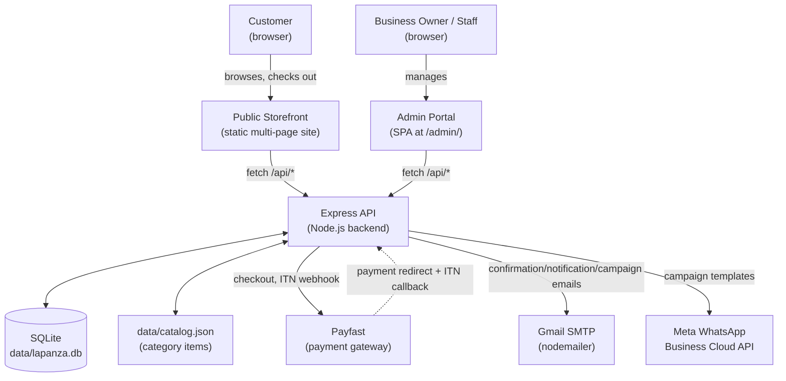

### 3.2 Component Architecture

| Component | Technology | Responsibility |
|---|---|---|
| **Public site** | Static HTML pages + Vite-bundled JS/CSS (Tailwind v4) | Product browsing, cart (localStorage), checkout, account, design requests, newsletter signup |
| **Admin portal** | Single HTML shell (`admin/index.html`) + one large vanilla-JS SPA (`admin/admin.js`, ~4,700 lines) | All back-office functionality — no separate framework (no React/Vue) |
| **Backend API** | Express 5 (`server/index.js`, ~1,400 lines) + ~20 domain modules | REST-ish JSON API, session auth (two independent session systems — admin and client), file uploads (multer), page-generation trigger |
| **Database** | better-sqlite3 (synchronous, single-connection, WAL mode) | System of record for everything except category-item products and static-page content |
| **Static page generator** | `scripts/generate-pages.mjs` | Reads DB + catalog.json, writes committed static HTML for every filament/category/car-parts page — **not** run at request time |
| **Reverse proxy / TLS** | nginx | Serves `dist/` statically, terminates HTTPS, proxies `/api`, `/admin`, `/uploads` to Node on `127.0.0.1:8787` |
| **Process supervisor** | systemd (`lapanza-admin.service`) | Keeps the Node process running, restarts on failure, starts on boot |

### 3.3 Deployment Architecture (Production)

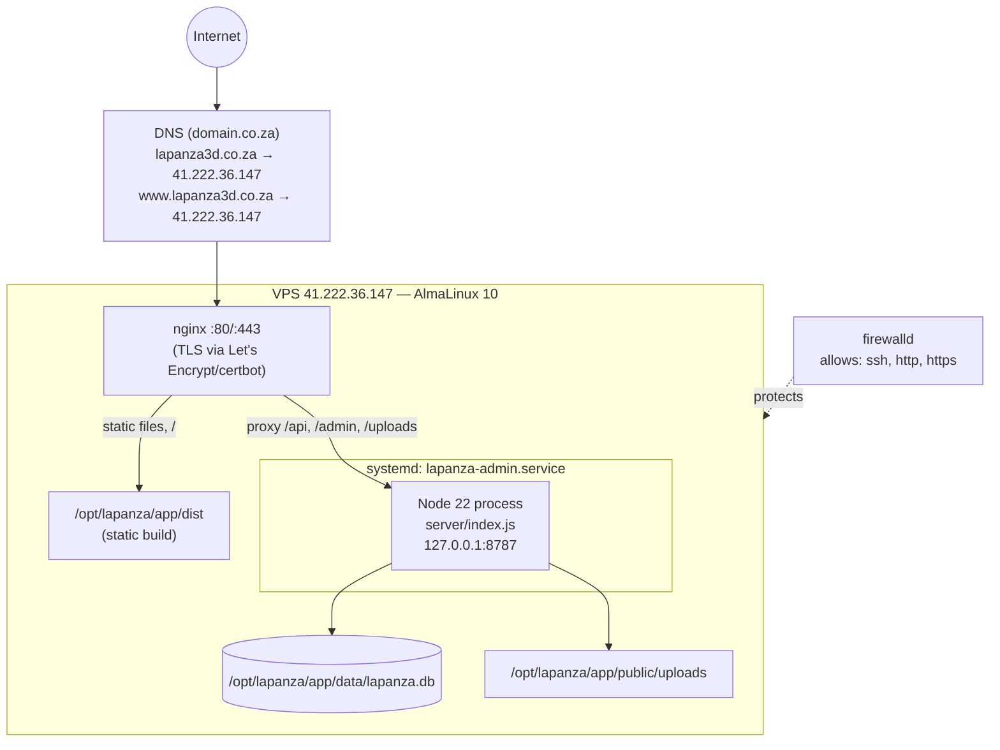

**Deployment specifics:**

| Item | Value |
|---|---|
| VPS provider | domain.co.za |
| OS | AlmaLinux 10.2 (Lavender Lion), kernel `6.12.0-211.7.3.el10_2` |
| Public IP | `41.222.36.147` |
| Domain | `lapanza3d.co.za` / `www.lapanza3d.co.za` (both A-recorded to the VPS IP) |
| Node.js | v22.23.2 (installed via NodeSource RPM repo — **`better-sqlite3` in this repo hard-requires Node ≥22**; Node 20 installs with only an engine warning then segfaults on every boot) |
| Web server | nginx 1.26.3, config at `/etc/nginx/conf.d/lapanza.conf` |
| TLS | Let's Encrypt via certbot, auto-renews via a systemd timer certbot installs |
| Process manager | systemd unit `lapanza-admin.service` (`deploy/lapanza-admin.service`), `Restart=on-failure` |
| App directory | `/opt/lapanza/app` (git clone of this repo) |
| Firewall | firewalld, default zone allows only `ssh`, `http`, `https` (+ `cockpit`, `dhcpv6-client` from the base image) |
| Deploy user | `deploy` (non-root, passwordless sudo via `/etc/sudoers.d/90-deploy`, SSH key-only login — password login is locked) |
| Deploy key | Dedicated ed25519 keypair (`~/.ssh/lapanza_vps_deploy`), public half provisioned by `deploy/bootstrap-vps.sh` |

### 3.4 Data Architecture

Two independent product data sources feed the storefront, deliberately never unified (see §2.1):

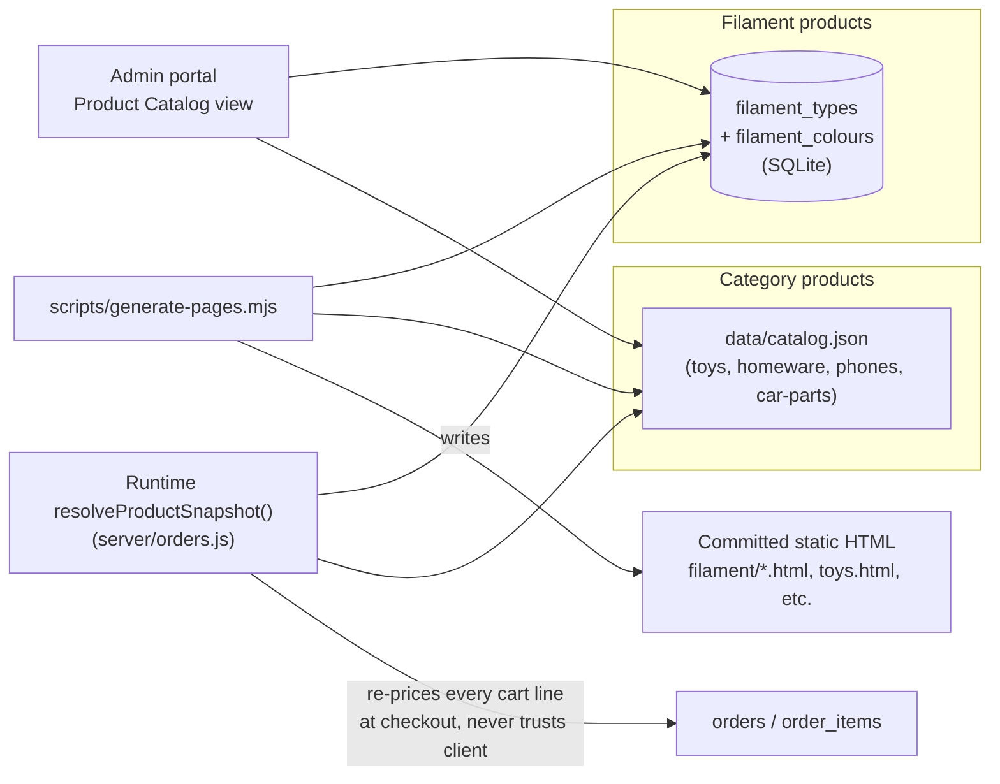

Every `productId` on the storefront encodes which system to resolve it against:
- `filament:{slug}:{sku}` — resolved against `filament_colours.sku` (globally unique)
- `category:{slug}:{sku-or-index}` — resolved against `data/catalog.json`

This lookup happens **server-side on every checkout**, never trusting a client-submitted price — see `resolveProductSnapshot()` in `server/orders.js`.

---

## 4. Software Dependencies

### 4.1 Runtime

| Requirement | Version | Notes |
|---|---|---|
| Node.js | **≥22** (production: 22.23.2) | `better-sqlite3@13` requires it; Node 20 appears to install successfully (warning only) then segfaults the process on first DB access |
| npm | 10.x+ | Ships with Node 22 |
| SQLite | bundled via better-sqlite3 (no separate install) | WAL journal mode |

### 4.2 Production Dependencies (`package.json`)

| Package | Version | Purpose |
|---|---|---|
| `express` | ^5.2.1 | HTTP server / routing |
| `better-sqlite3` | ^13.0.3 | Synchronous SQLite driver — the entire DB layer |
| `bcryptjs` | ^3.0.3 | Password hashing (admin accounts, client accounts) |
| `cookie-parser` | ^1.4.7 | Session cookie parsing (two independent session cookies — admin + client) |
| `cors` | ^2.8.6 | CORS headers (`origin: true, credentials: true`) |
| `express-rate-limit` | ^8.6.2 | Rate limiting on auth/public-form/checkout endpoints (`authLimiter`, `publicFormLimiter`, `checkoutLimiter`) |
| `multer` | ^2.2.0 | Multipart file uploads (product images, resource files, design-request attachments, print-job files) |
| `nodemailer` | ^9.0.5 | All outbound email via Gmail SMTP + app password |
| `uuid` | ^14.0.1 | (available; most IDs actually use Node's built-in `crypto.randomUUID()`) |
| `three` | ^0.172.0 | 3D visual effects on the homepage (`src/js/home.js`) |
| `gsap` | ^3.12.7 | Animation library used throughout the public site and admin |
| `concurrently` | ^10.0.4 | Runs the Vite dev server + admin API together in local dev (`npm run dev:all`) |

### 4.3 Development Dependencies

| Package | Version | Purpose |
|---|---|---|
| `vite` | ^6.1.0 | Frontend build tool / dev server, multi-page bundling |
| `@tailwindcss/vite` | ^4.0.6 | Tailwind CSS v4 Vite plugin |
| `tailwindcss` | ^4.0.6 | Utility CSS framework |
| `nodemon` | ^3.1.14 | Backend auto-restart in dev (not used in production — systemd handles restarts there) |
| `supertest` | ^7.2.2 | HTTP assertion library (available for API tests) |

### 4.4 External Services

| Service | Used for | Configuration |
|---|---|---|
| **Payfast** | Card / Instant EFT payment processing | `PAYFAST_MODE` (sandbox/live), separate merchant ID/key/passphrase per mode, ITN webhook signature verification (`server/payfast.js`) |
| **Gmail SMTP** | All transactional + marketing email (order confirmations, verification emails, owner notifications, newsletter campaigns) | `GMAIL_USER` + `GMAIL_APP_PASSWORD` (a Google **app password**, never the real account password) |
| **Meta WhatsApp Business Cloud API** | WhatsApp marketing campaigns | `WHATSAPP_ACCESS_TOKEN` + `WHATSAPP_PHONE_NUMBER_ID`; requires a Meta Business Account, verified WhatsApp number, and at least one **Meta-approved message template** (free-text broadcast is not permitted by WhatsApp policy) |
| **domain.co.za** | Domain registration + DNS + VPS hosting | — |
| **Let's Encrypt (certbot)** | Free TLS certificates, auto-renewal | No manual credential — HTTP-01 challenge via nginx |

### 4.5 Build Toolchain

| Tool | Role |
|---|---|
| Vite (multi-page) | Bundles every top-level `*.html` + `car-parts/*.html` + `filament/*.html` as separate entries (see `vite.config.js`'s `htmlEntries()`) into `dist/` |
| `scripts/generate-pages.mjs` | **Not** part of the Vite build — a separate Node script, run via `npm run generate` or the admin "Publish to site" button, that reads the DB/catalog.json and regenerates the committed static HTML source files (which Vite then bundles) |
| `node --test` | Node's built-in test runner — no Jest/Mocha/Vitest. 280 tests across 32 `*.test.js` files (current count — see §14 for the authoritative figure) |

---

## 5. Codebase & File Structure

### 5.1 Repository Layout

```
lapanza-3d-fullsite/
├── index.html                  Homepage (hand-authored — NOT regenerated by generate-pages.mjs)
├── story.html, toys.html, homeware.html, phones.html   Static pages (generated)
├── checkout.html, checkout-complete.html   Checkout flow pages
├── account.html                Customer "My Account" (register/login/order history)
├── design-request.html         Custom design/print request intake form
├── resources.html               3D Resources gallery (public)
├── car-parts/                  Generated: gwm.html, landrover.html
├── filament/                   Generated: 20 filament-type pages (pla.html, petg.html, ...)
├── admin/
│   ├── index.html               Admin SPA shell (static markup, all views as empty <div>s)
│   ├── admin.js                 ~4,700-line vanilla-JS admin application (all views, all API calls)
│   └── admin.css                Admin design system (CSS custom properties, light/dark theme)
├── src/
│   ├── data/                    site.js (nav/contact data), categories.json, filaments.json, settings.json
│   ├── js/                      Per-page Vite entry points (see 5.3) + shared modules (cart.js, cart-ui.js, nav.js, site.js)
│   └── styles/main.css          Shared Tailwind + custom CSS for the public site
├── server/
│   ├── index.js                 Express app: ALL route registration (~1,400 lines)
│   ├── db.js                    Schema definition + migrations (see §6)
│   ├── *.js (≈20 domain modules) One per business domain — see 5.2
│   └── *.test.js (≈20 files)     node:test unit tests, one per domain module
├── scripts/
│   ├── generate-pages.mjs        Static-page generator (source of truth for filament/*.html, car-parts/*.html, toys.html, homeware.html, phones.html, story.html)
│   └── generate-pages.test.js
├── deploy/                       VPS bootstrap + deploy automation (see §12)
├── public/                       Vite "public" dir — copied verbatim into dist/ (favicon, uploads/, site-settings.json)
├── data/                         Runtime data — gitignored except catalog.json is ALSO gitignored (real business data, not code)
│   ├── lapanza.db                SQLite database file (gitignored)
│   └── catalog.json              Category-item product data (gitignored — copied to server separately on deploy)
├── docs/                         This document + earlier planning docs
├── vite.config.js                Multi-page build config
├── package.json / package-lock.json
├── .env.example                  Documents every required environment variable
├── start.mjs / start.bat         One-command local dev bootstrap (installs deps, opens both dev servers)
└── README.md                     Quick-start guide (local dev only — predates Phases 2–4, see §15)
```

### 5.2 Backend Module Responsibility Matrix (`server/`)

| Module | Responsibility |
|---|---|
| `index.js` | Express app setup, session middleware (admin + client, two independent systems), **every** route registration, static file serving for `/admin` and `/uploads` |
| `db.js` | `ensureSchema()` — all `CREATE TABLE IF NOT EXISTS` + guarded `ALTER TABLE`; `getDb()` (cached singleton) / `openDb()` (explicit path, used by tests with `:memory:`) |
| `paths.js` | Resolves `dataDir()` / `uploadsDir()` / `backupsDir()` / `publicDir()` relative to `process.cwd()` (overridable via `DATA_DIR`/`UPLOADS_DIR`/`BACKUPS_DIR` env vars) |
| `migrate-json.js` | One-time bootstrap: on a brand-new DB, seeds nothing directly but is available to migrate from an older catalog.json shape if needed |
| `store.js` | Low-level product CRUD used by the admin catalog editor (filament + category items combined view) |
| `filaments.js` | Filament type + colour CRUD, stock, image upload wiring |
| `export.js` | Regenerates `public/site-settings.json` and syncs public-facing derived JSON after any catalog change |
| `admins.js` | Admin account CRUD, password hashing, first-run "setup" detection |
| `clients.js` | The single most complex domain module — guest/registered client CRUD, registration, email verification, login, WhatsApp opt-in, admin verify/resend/delete-or-revoke actions (Phase 4 addition) |
| `orders.js` | Checkout order creation (online), manual order creation (admin), invoice numbering, product-price re-resolution, stock decrement, order status lifecycle |
| `payfast.js` | Payfast redirect-payload signing, ITN (webhook) signature verification |
| `shipping.js` | Weight-bracket shipping matching (`auto_weight` options) + named flat-price options (`fixed` — PUDO lockers etc.) |
| `inventory.js` | Bulk stock/price updates + per-item "Listed on products page" toggle (admin Stock Management view) |
| `resources.js` | 3D Resources (downloadable files/print settings) CRUD + public listing |
| `design-requests.js` | Custom design/print request intake, status lifecycle, admin notes |
| `newsletter.js` | Subscriber list: subscribe (double opt-in), confirm, unsubscribe |
| `newsletter-campaigns.js` | Compose → approve → send campaign lifecycle over the subscriber list |
| `whatsapp.js` | Meta Graph API client — `sendWhatsAppTemplate()`, `isWhatsAppConfigured()` |
| `whatsapp-campaigns.js` | Compose → approve → send campaign lifecycle over WhatsApp-opted-in clients |
| `mailer.js` | Every outbound email template (order confirmation, verification, low-stock alert, owner notifications, newsletter campaign send, design-request status change) |
| `print-jobs.js` | Print-job costing calculator (multi-filament, labour/power/markup) + in-house filament consumption logging |
| `in-house-filament.js` | Internal filament roll inventory (separate from the sellable Filament Library) |
| `purchases.js` | Supplier purchase / expense tracking |
| `settings.js` | Settings key-value store read/write wrapper |
| `settings-defaults.js` | Default values for every setting + the Google Fonts curated list |
| `uploads.js` | Multer storage configs + allowed-extension lists per upload type (filament images, resource images/files, design-request attachments, print-job images/files) |
| `jobs.js` | Background/periodic tasks: cancelling stale pending-payment orders (hourly check, 7-day threshold), and the daily automated database backup (`startAutoBackupJob`) |
| `backups.js` | Database backup lifecycle — `createBackup()` (better-sqlite3's online backup API, safe against a live WAL-mode DB; also snapshots `data/catalog.json` to a paired `<same-timestamp>.catalog.json`, since the category-item catalog lives only in that gitignored file, not SQLite), `listBackups()`, `deleteBackup()` (removes the paired catalog snapshot too), `getBackupPath()`, `pruneOldBackups()`. The offsite `rclone sync` carries catalog snapshots automatically (whole-dir sync). `saveCatalog()` in `store.js` writes temp-then-rename so a crash mid-write can never truncate the live catalog. |
| `analytics.js` | Visitor tracking — `recordPageView()` (writes to `page_views`), `touchActiveVisitor()`/`getActiveVisitors()`/`pruneActiveVisitors()` (in-memory only, never persisted), `getVisitSummary()` (historical totals/daily breakdown/top pages) |
| `audit-log.js` | Security/session audit trail — `recordAuditEvent()` (called from `index.js` on login/logout/session-expiry/admin-account changes), `listAuditLog()` (filterable by `eventType`/`q`, admin "Audit Logs" page) |

### 5.3 Frontend Structure (`src/js/`)

Each public-facing page has its own Vite entry point (registered in `vite.config.js`), all importing the shared `site.js` (which mounts navigation + cart UI on every page):

| Entry file | Page | Responsibility |
|---|---|---|
| `home-entry.js` | `index.html` | Homepage motion effects (`home.js`, GSAP + Three.js), **clears any stale cart on load**, header widgets (`home-header.js`) |
| `checkout-entry.js` | `checkout.html` | Full checkout form, shipping calculation, Payfast redirect submission, post-purchase opt-in panel |
| `checkout-complete-entry.js` | `checkout-complete.html` | Payfast return-URL landing page, clears cart + checkout prefs |
| `account-entry.js` | `account.html` | Register/login/logout, order history, self-service order cancellation for still-`pending_payment` orders |
| `design-request-entry.js` | `design-request.html` | Custom design request form submission (with file uploads) |
| `resources-entry.js` | `resources.html` | 3D Resources gallery listing + download links |
| `home-header.js` | *(homepage only, imported by `home-entry.js`)* | Sidebar-collapse arrow, quick site search, account widget (guest/logged-in) — every function guards on element presence, so it's a no-op if ever imported elsewhere |
| `checkout-prefs.js` | *(shared by `checkout-entry.js` + `checkout-complete-entry.js`)* | `localStorage['lapanza-checkout-prefs']` read/write/clear — cleared on order completion so the next checkout starts from real defaults instead of the last order's picks |
| `site.js` | *(imported by every page)* | Mounts `nav.js` (sidebar) + `cart-ui.js` (cart drawer, add-to-cart toast) + `analytics.js` (visitor beacon), theme toggle |
| `analytics.js` | *(shared)* | Sends a pageview beacon on load + a ~45s heartbeat while the tab stays visible, via `navigator.sendBeacon` — anonymous, client-generated visitor id only, no IP/fingerprinting |
| `cart.js` | *(shared)* | localStorage-backed cart state (`getCart`, `addItem`, `updateQuantity`, `removeItem`, `clearCart`), dispatches a `cart:updated` DOM event on every mutation |
| `cart-ui.js` | *(shared)* | Cart drawer UI, floating cart button + badge, add-to-cart toast notification |
| `nav.js` | *(shared)* | Sidebar navigation rendering (shared markup across every page) |
| `swatches.js` / `appearance.js` | *(shared)* | Colour-swatch rendering helpers; theme (light/dark) persistence |

### 5.4 Admin Frontend Structure

The admin portal is a **single hand-written vanilla-JS SPA** — no build-time framework, no client-side router library. `admin.js` implements:
- A `state` object + a `setRoute(route)` function that shows/hides `<div id="view-*">` elements
- One `render*()` function per view (e.g. `renderDashboard`, `renderCatalog`, `renderOrders`, `renderRegisteredUsers`, `renderNewsletterCampaigns`, `renderWhatsAppCampaigns`, `renderPrintJobs`, `renderInHouseFilament`, `renderPurchases`, `renderSettings`, ...) — each fetches its own data via a shared `api()` fetch wrapper and re-renders its `<div>`'s `innerHTML`
- All HTML is built via template literals with an `escapeHtml`/`escapeAttr` helper applied to every interpolated value (no innerHTML XSS)

---

## 6. Data Model (Database Schema)

32 tables in a single SQLite file (`data/lapanza.db`), `PRAGMA foreign_keys = ON`.

### 6.1 Entity Relationship Diagram

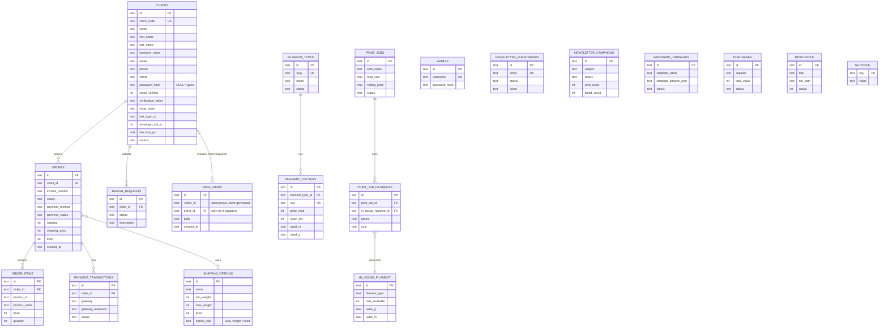

### 6.2 Table Reference

#### `admins`
Admin (staff) login accounts.
| Column | Type | Notes |
|---|---|---|
| id | TEXT PK | UUID |
| username | TEXT UNIQUE NOT NULL | |
| password_hash | TEXT NOT NULL | bcrypt |
| created_at | TEXT NOT NULL | ISO 8601 |

#### `filament_types`
The sellable filament catalog's parent record (one per material, e.g. "PLA", "PETG Speed").
| Column | Type | Notes |
|---|---|---|
| id | TEXT PK | |
| slug | TEXT UNIQUE NOT NULL | URL slug, drives `filament/{slug}.html` |
| name, description, colour_note | TEXT | Display copy |
| specs_json | TEXT | JSON array of spec rows |
| seo_title, seo_description | TEXT | |
| internal_notes | TEXT | Admin-only |
| status | TEXT DEFAULT 'published' | `published` / `draft` |
| featured | INTEGER (bool) | |
| sort_order | INTEGER | |
| created_at, updated_at | TEXT | |

#### `filament_colours`
One row per sellable SKU within a filament type.
| Column | Type | Notes |
|---|---|---|
| id | TEXT PK | |
| filament_type_id | TEXT FK → filament_types(id) ON DELETE CASCADE | |
| name, hex | TEXT | |
| sku | TEXT UNIQUE NOT NULL | Global uniqueness — used as the sole lookup key at checkout |
| weight_g | INTEGER | Product's own net weight (a spec) |
| shipping_weight_g | INTEGER | Parcel weight used for shipping-bracket matching — defaults to `weight_g`, admin-overridable |
| roll_length_m | REAL | |
| price_rand | INTEGER | Storefront price (whole Rand) |
| stock_qty | INTEGER | |
| used_m, used_g | REAL | Cumulative consumption logged by Print Job Costing (never decremented from `stock_qty` directly — remaining stock is `stock_qty`, this is separate internal usage tracking) |
| image_path | TEXT | `/uploads/filaments/...` |
| notes | TEXT | |
| sort_order | INTEGER | |
| listed | INTEGER NOT NULL DEFAULT 1 | Stock Management "Listed on products page" radio — `0` pulls just this colour off its filament's public colour grid without touching stock/price or the parent filament type's own draft/published `status` |
| created_at, updated_at | TEXT | |

#### `settings`
Simple key-value store (site config, invoicing config, print-job-costing rates). See `server/settings-defaults.js` for the full default key list (§9.13).
| Column | Type |
|---|---|
| key | TEXT PK |
| value | TEXT (often JSON-encoded) |

#### `clients`
**The most overloaded table in the system.** One row = one person/business the shop has dealt with, whether guest-checkout, registered account, or manually-entered (admin-imported) contact.
| Column | Type | Notes |
|---|---|---|
| id | TEXT PK | |
| client_code | TEXT UNIQUE NOT NULL | Sequential `CLI-000001` format |
| name | TEXT | Display name — always populated, mirrors first+last or business name |
| first_name, last_name, business_name | TEXT | Added Phase 3 |
| email | TEXT NOT NULL | Case-insensitively matched (`idx_clients_email`), not DB-unique — app enforces uniqueness for real accounts only |
| phone, street, suburb, city, province, postal_code, country | TEXT | Address fields |
| password_hash | TEXT NULL | **NULL = guest, set = registered account** |
| email_verified | INTEGER (bool) | |
| verification_token, verification_token_expires | TEXT | 24h TTL, single-use |
| reset_token, reset_token_expires | TEXT | V1.01 — password recovery, 1h TTL, single-use; separate from verification_token so both can be outstanding at once |
| last_login_at | TEXT NULL | Phase 4 |
| whatsapp_opt_in | INTEGER (bool) DEFAULT 0 | Phase 4, separate consent from newsletter |
| discount_pct | REAL DEFAULT 0 | Applied only on admin-created manual orders |
| discount_note | TEXT | |
| source | TEXT | Free-text lead source (`Website`, `Facebook`, `WA Group`, etc.) |
| created_at | TEXT NOT NULL | |

#### `orders`
| Column | Type | Notes |
|---|---|---|
| id | TEXT PK | |
| client_id | TEXT NOT NULL FK → clients(id) | |
| invoice_number | TEXT | `INV-0001` format, sequential (see §9.6) |
| status | TEXT DEFAULT 'pending_payment' | `pending_payment` \| `paid` \| `shipped` \| `completed` \| `cancelled` |
| subtotal, shipping_price, total | INTEGER | Whole Rand |
| discount_pct, discount_amount | | Manual-order-only |
| shipping_option_id | TEXT FK → shipping_options(id) NULL | |
| shipping_method | TEXT DEFAULT 'courier' | `courier` \| `own_courier` \| `collect` \| `fixed` |
| total_weight | INTEGER | Grams |
| payment_method | TEXT NOT NULL | `payfast_card` \| `payfast_eft` \| `manual_eft` \| `cash_on_collection` |
| payment_status | TEXT DEFAULT 'pending' | `pending` \| `paid` |
| tracking_number | TEXT | |
| confirmation_email_sent_at | TEXT NULL | |
| created_at, updated_at | TEXT | |

#### `order_items`
| Column | Type | Notes |
|---|---|---|
| id | TEXT PK | |
| order_id | TEXT NOT NULL FK → orders(id) ON DELETE CASCADE | |
| product_id | TEXT NOT NULL | `filament:{slug}:{sku}`, `category:{slug}:{sku}`, or `manual:{uuid}` for free-text lines |
| product_name, price, quantity, weight | | Snapshotted at order time — never re-derived |

#### `payment_transactions`
| Column | Type | Notes |
|---|---|---|
| id | TEXT PK | |
| order_id | TEXT NOT NULL FK → orders(id) ON DELETE CASCADE | |
| gateway | TEXT | `payfast` |
| gateway_reference | TEXT | Payfast's `pf_payment_id` |
| raw_payload | TEXT | Full ITN payload, JSON |
| status | TEXT | |
| created_at | TEXT | |
| *(unique index)* | `(gateway, gateway_reference, status)` | Idempotency — Payfast may resend the same ITN |

#### `shipping_options`
| Column | Type | Notes |
|---|---|---|
| id | TEXT PK | |
| name | TEXT | |
| min_weight, max_weight | INTEGER | Grams — bracket bounds for `auto_weight` type |
| price | INTEGER | |
| active | INTEGER (bool) | |
| option_type | TEXT DEFAULT 'auto_weight' | `auto_weight` (bracket-matched) \| `fixed` (named, customer/admin-picked directly — PUDO lockers, local delivery zones) |
| created_at, updated_at | TEXT | |

#### `resources`
3D Resources gallery (downloadable print settings/files).
| Column | Type |
|---|---|
| id, title, description | |
| image_path, file_path | `/uploads/resources/...` — storage path under a randomized filename, never the original |
| image_original_name, file_original_name | TEXT NULL — the human-recognizable filename, for admin UI display/download-as (same pattern as `print_jobs`, §6.2). `NULL` for rows uploaded before this column existed |
| print_settings, filament_type, dimensions | TEXT |
| active, sort_order | |
| created_at, updated_at | |

#### `testimonials`
Admin-managed customer testimonials (backlog #51). No public submission form.
| Column | Type | Notes |
|---|---|---|
| id | TEXT PK | |
| customer_name | TEXT NOT NULL | The REAL name — admin-internal record of who consent was obtained from, never exported publicly |
| display_name | TEXT NOT NULL | What's actually shown on the site — deliberately separate from `customer_name` so the admin can choose full name / first name only / "A happy customer" / etc |
| consent_given | INTEGER (bool) DEFAULT 0 | Gates `status`: `server/testimonials.js`'s `assertPublishAllowed()` throws if `status` is set to `published` without this being true — enforced at the data layer, not just the admin UI |
| consent_note | TEXT | Internal — how/when consent was obtained. Never exported publicly |
| testimonial_date | TEXT NULL | The date the testimonial itself refers to, not `created_at` |
| quote | TEXT NOT NULL | |
| link_url, link_label | TEXT NULL | Optional reference to a project/product — a plain URL + label, not a resolved `productId` (testimonials may reference a custom project outside the catalog) |
| image_path | TEXT NULL | `/uploads/testimonials/...`, same randomized-filename pattern as `resources` |
| status | TEXT DEFAULT 'draft' | `draft` \| `published` — same vocabulary `filament_types.status` uses |
| sort_order | INTEGER DEFAULT 0 | |
| created_at, updated_at | TEXT | |

Published rows are exported into `site-settings.json` (`server/export.js`'s `syncPublicJson()`, same mechanism as `settings.featuredProducts`) via `publicTestimonial()`, which deliberately drops `customer_name`/`consent_note` — only `id`/`displayName`/`quote`/`date`/`linkUrl`/`linkLabel`/`imageUrl` ever reach the browser.

#### `newsletter_subscribers`
| Column | Type | Notes |
|---|---|---|
| id | TEXT PK | |
| email | TEXT UNIQUE NOT NULL | |
| status | TEXT DEFAULT 'pending' | `pending` \| `confirmed` \| `unsubscribed` |
| token | TEXT NOT NULL | Reused for BOTH the confirm link and every future unsubscribe link — one token, whole subscriber lifetime |
| subscribed_at, confirmed_at, unsubscribed_at | TEXT NULL | |

#### `design_requests`
| Column | Type | Notes |
|---|---|---|
| id | TEXT PK | |
| client_id | TEXT FK → clients(id) NULL | Linked if the submitter is a known client |
| name, email, phone, description, budget_note | TEXT | |
| reference_image_path, reference_file_path | TEXT NULL | Storage path under a randomized filename, never the original |
| reference_image_original_name, reference_file_original_name | TEXT NULL | The human-recognizable filename, for admin UI display/download-as (same pattern as `print_jobs`, §6.2). `NULL` for rows uploaded before this column existed |
| status | TEXT DEFAULT 'new' | `new` \| `in_review` \| `quoted` \| `accepted` \| `rejected` \| `completed` |
| admin_notes | TEXT | |
| created_at, updated_at | TEXT | |

#### `print_jobs`
Internal costing record. Not linked to storefront orders — but as of the "List for sale" feature below, CAN be explicitly, manually published as a real category product; that link is what `listing_category_id`/`listing_item_id` track.
| Column | Type | Notes |
|---|---|---|
| id, item_name | | |
| total_grams, total_meters | REAL | Sum across all filament slots |
| print_time_minutes, design_hours, setup_hours, post_processing_hours | | Time inputs |
| markup_pct | REAL | |
| filament_cost, power_cost, labour_cost, running_cost, total_cost, markup_amount, selling_price | REAL | Calculated outputs — `selling_price` is the computed floor, labelled **"Minimum Selling Price"** in the admin UI, never overridden |
| final_selling_price | REAL | Admin-editable — defaults to `selling_price` at creation if not supplied. What actually gets used as the price if/when this job is listed for sale |
| reference_file_path, reference_image_path | TEXT NULL | Storage path under a randomized filename (see `uploads.js`) — never the original filename, so two uploads can't collide |
| reference_file_original_name, reference_image_original_name | TEXT NULL | The human-recognizable filename (e.g. `"Joint Box 8x5.3mf"`), stored purely for admin UI display/download-as. Rows uploaded before this column existed have `NULL` here; the admin UI falls back to the randomized stored filename for those |
| status | TEXT DEFAULT 'Printed' | `Printed` / `Estimate` (renamed from `printed`/`planned` — see the migration note below) |
| date_printed | TEXT NULL | |
| created_at | TEXT | |
| listing_category_id, listing_item_id | TEXT NULL | Set once this job has been published as a category product — together locate the specific item inside that category's `items` array in `catalog.json` (there's no separate items table, see `store.js`). Both null until then; a second "List for sale" click on an already-listed job updates this same item instead of creating a duplicate. |

> **Migration note:** `status` values were renamed from lowercase `planned`/`printed` to `Estimate`/`Printed` when the "List for sale" feature shipped — `ensurePrintJobColumns()` in `db.js` runs a one-time, idempotent `UPDATE` on every boot to convert any pre-existing rows.

#### `in_house_filament`
In-house printing stock is grouped by filament type and stores `brand`, `filament_type`, and `color_name`. The triple is case-insensitively unique for new records, preventing duplicate local stock entries. Available brands are maintained in Site Settings (`inHouseFilamentBrands`), initially SunLu, SA Filament, Build Volume, and Creality.

An administrator transfers a roll by explicitly selecting the exact sellable filament item from Stock Management. The transaction atomically subtracts one from `filament_colours.stock_qty` and adds one to `in_house_filament.rolls_available`; transfers fail if the chosen sellable item does not exist or has no stock. This keeps customer-facing sellable stock separate from material reserved for internal printing.
Physical rolls kept for internal/local printing — separate from the sellable `filament_colours` catalog.
| Column | Type | Notes |
|---|---|---|
| id, filament_type, color_name | | |
| rolls_available | INTEGER | |
| weight_g, roll_length_m | | Per-roll spec |
| cost_per_roll_rand | INTEGER | |
| used_g, used_m | REAL | Cumulative consumption from logged print jobs |
| created_at, updated_at | TEXT | |

#### `print_job_filaments`
Join table — up to 4 filament slots per print job (multi-material prints).
| Column | Type |
|---|---|
| id | TEXT PK |
| print_job_id | FK → print_jobs(id) ON DELETE CASCADE |
| in_house_filament_id | FK → in_house_filament(id) |
| grams, meters, cost | REAL |
| slot_order | INTEGER |

> **Note:** this table replaced an earlier single-filament, role-based (`model_g`/`support_g`/...) shape via a one-time `DROP TABLE` + recreate in `db.js`, safe only because it shipped in the same phase with no production rows yet. This is explicitly called out in code as **not** the normal migration pattern for this project.

#### `purchases`
Supplier expense tracking.
| Column | Type |
|---|---|
| id, supplier, goods | |
| total_value | INTEGER |
| status | TEXT DEFAULT 'outstanding' — `outstanding` \| `paid` |
| payment_type | TEXT |
| purchase_date, created_at | TEXT |

#### `newsletter_campaigns`
| Column | Type | Notes |
|---|---|---|
| id, subject, body_text | | |
| status | TEXT DEFAULT 'draft' | `draft` \| `approved` \| `sending` \| `sent` \| `partial` |
| created_at, approved_at, sent_at | TEXT NULL | |
| sent_count, failed_count | INTEGER | Per-recipient send outcome tally |

#### `newsletter_campaign_recipients` and `newsletter_suppressions`
Campaign recipient rows are an immutable audience snapshot: email, source, unsubscribe token, selected/sent/failed status, delivery time, and bounded failure reason. `newsletter_suppressions` is the global no-send list populated by an unsubscribe, preventing a contact from being selected by any future campaign.

#### `newsletter_templates` and `newsletter_assets`
Templates store a subject plus a structured block JSON document, rendered HTML, and mandatory plain-text fallback. Assets store allowlisted JPEG/PNG/WebP images uploaded for reuse in newsletters; images are limited to 5MB and served from `/uploads/newsletters/`.

#### `whatsapp_campaigns`
| Column | Type | Notes |
|---|---|---|
| id, template_name | | Must match a Meta-approved template name |
| template_params_json | TEXT | JSON array — the `{{1}}`, `{{2}}`... substitution values |
| status | TEXT DEFAULT 'draft' | `draft` \| `approved` \| `sent` |
| created_at, approved_at, sent_at | TEXT NULL | |
| sent_count, failed_count | INTEGER | |

#### `page_views`
One row per real page load (never per heartbeat — see §9.20). Post-launch addition.
| Column | Type | Notes |
|---|---|---|
| id | TEXT PK | |
| visitor_id | TEXT NOT NULL | Random, client-generated (localStorage), carries no personal information on its own |
| client_id | TEXT FK → clients(id) NULL | Only set when the visitor holds a valid logged-in client session at that moment — this is the one column on this table that ties a row to a real, identified person |
| path | TEXT NOT NULL | Truncated to 300 chars server-side |
| referrer | TEXT NOT NULL DEFAULT '' | Truncated to 300 chars server-side |
| created_at | TEXT NOT NULL | |
| *(indexes)* | `created_at`, `visitor_id` | |
| *(retention)* | 12 months | `pruneOldPageViews()`, run daily by `startPageViewsPruneJob()` (`server/jobs.js`) — closes the `page_views` half of backlog tech-debt #32 (`audit_log`'s half was closed first, see that table's entry). Detail rows only — see `analytics_page_totals`/`analytics_seen_visitors` below for what survives pruning |

#### `analytics_page_totals` / `analytics_seen_visitors`
Permanent running tallies, updated alongside every `page_views` insert (`recordPageView` in `server/analytics.js`) — exist specifically so pruning old `page_views` rows doesn't quietly turn the Analytics dashboard's "all-time" totals/top-pages/unique-visitors into "since the last prune" numbers. Both stay tiny regardless of traffic volume — one row per unique path/visitor ever seen, not one row per pageview — so neither is ever pruned.
| Table | Columns | Notes |
|---|---|---|
| `analytics_page_totals` | `path` TEXT PK, `visit_count` INTEGER NOT NULL DEFAULT 0 | `SUM(visit_count)` = all-time total visits; `ORDER BY visit_count DESC LIMIT 10` = all-time top pages |
| `analytics_seen_visitors` | `visitor_id` TEXT PK, `first_seen_at` TEXT NOT NULL | `COUNT(*)` = all-time unique visitors (insert-or-ignore per visitor, so a repeat visit doesn't inflate it) |

Backfilled once, automatically, by `backfillAnalyticsTotals()` (`server/db.js`, same "runs once while empty" guard as `seedTodoItems`) the first time the app boots after these tables were introduced on a database that already had `page_views` history — without this, the two tables would start genuinely empty and the Analytics dashboard's "all-time" numbers would have silently reset to (near) zero on that deploy, even though nothing had been pruned yet.

#### `version_history`
Track deployments and system updates. Every row is created automatically by `scripts/record-deploy-version.mjs` after a deploy — nothing writes here manually.
| Column | Type | Notes |
|---|---|---|
| id | TEXT PK | |
| version_number | INTEGER NOT NULL UNIQUE | Legacy plain-incrementing integer, kept only to satisfy this constraint — not the displayed version |
| version_label | TEXT | V0.01 during pre-release, then V1.0 for the first official release — the displayed version, computed by `nextLabel()` in `server/version-history.js` |
| description | TEXT NOT NULL | Latest git commit subject + short hash at deploy time, unless passed explicitly |
| deployed_date | TEXT NOT NULL | ISO timestamp when this version was recorded |
| deployed_by | TEXT NOT NULL DEFAULT 'admin' | Always `'deploy'` for automated rows |
| created_at | TEXT NOT NULL | Row creation timestamp |
| *(indexes)* | `version_number DESC` | Legacy — `listVersions()` actually orders by `created_at DESC, version_number DESC` |

#### `todo_items`
Backlog/todo tracker (admin "Todo / Backlog" page, §7.24). Append-only — no delete function exists.
| Column | Type | Notes |
|---|---|---|
| id | TEXT PK | |
| number | INTEGER NOT NULL UNIQUE | The displayed "No" column, auto-incrementing, separate from `date_added` |
| category | TEXT NOT NULL | `Bug` / `Feature` / `Enhancement` / `Tech Debt` |
| priority | TEXT NOT NULL DEFAULT 'Medium' | `Critical` / `High` / `Medium` / `Low` |
| name | TEXT NOT NULL | |
| description | TEXT NOT NULL DEFAULT '' | |
| status | TEXT NOT NULL DEFAULT 'Backlog' | `Backlog` / `In Progress` / `Done` / `Won't Fix` / `Claude Fix` / `Discarded` / `Deferred` |
| planned_fix_date | TEXT | Nullable, admin-set |
| actual_fix_date | TEXT | Nullable — auto-stamped by `updateTodo` the moment `status` becomes `Done`, unless already supplied |
| date_added | TEXT NOT NULL | Drives sort order (`ORDER BY date_added DESC`); backdatable at creation for seeded items |
| created_at, updated_at | TEXT NOT NULL | |
| *(indexes)* | `date_added DESC` | |
| *(seed)* | 13 rows | Inserted once, automatically, the first time this table is empty (`seedTodoItems` in `server/db.js`) — mirrors §15 Known Limitations at the time this table shipped |

#### `version_release_details`
One immutable release-detail record per `version_history` row. It supports the Version History drill-down view and is captured from Git during deployment.
| Column | Type | Notes |
|---|---|---|
| version_id | TEXT PK / FK | References `version_history.id`; one record per version |
| commit_hash | TEXT | Full Git commit SHA for the deployment; null only for the pre-history baseline |
| commit_range | TEXT | Git range since the preceding recorded release |
| release_notes | TEXT NOT NULL | Commit subjects and bodies for the release |
| commits_json | TEXT NOT NULL | Structured commit metadata: hash, subject, body, author, email, and authored time |
| files_json | TEXT NOT NULL | Structured changed-file entries with line additions/deletions |
| files_added, files_deleted | INTEGER NOT NULL | Aggregate non-binary line counts |
| captured_at | TEXT NOT NULL | When Git metadata was captured |

#### `audit_log`
Security/session/action audit trail (admin "Audit Logs" page, Settings group). Append-only — no update/delete function exists (only `pruneOldAuditLogEntries()`, age-based, see below). Originally scoped to just the admin portal's own auth/session lifecycle; widened to also cover orders/stock/catalog/settings actions and security signals (client login failures, rate-limit trips, unauthenticated admin-route access) — see the "Widened audit log" feature-history row.
| Column | Type | Notes |
|---|---|---|
| id | TEXT PK | |
| event_type | TEXT NOT NULL | See `AUDIT_EVENTS` in `server/audit-log.js`. Auth/session: `setup` / `login_success` / `login_failure` / `logout` / `session_expired` / `admin_created` / `admin_deleted` / `password_reset` / `email_failure`. Actions (deliberately one broad type per area, not one per route — see the widened-audit-log feature note): `order_updated` / `stock_updated` / `catalog_updated` / `settings_updated`. Security: `client_login_failure` / `rate_limit_exceeded` / `unauthorized_access` |
| admin_id | TEXT | Nullable — the *acting* admin for admin-management/action events, the authenticating admin for login/logout/expiry, null for a `login_failure`/`client_login_failure` against an unknown/wrong username and for `rate_limit_exceeded`/`unauthorized_access` (no session exists yet by definition) |
| username | TEXT | Stored as a plain string (not just a FK) so the row still reads correctly after the admin account it refers to is deleted — e.g. its own `admin_deleted` event, or a `login_failure` for a username that was never a real account |
| ip_address | TEXT | `req.ip`, which respects the `trust proxy` setting (see §12.5) |
| user_agent | TEXT | Raw `User-Agent` header |
| detail | TEXT NOT NULL DEFAULT '' | Free-text context — e.g. `Deleted admin "martin"` for `admin_deleted`, or `Order abc123: status pending_payment → cancelled` for `order_updated`. This is where the *specific* action lives, since event_type is deliberately a broad bucket |
| created_at | TEXT NOT NULL | |
| *(indexes)* | `created_at DESC` | `listAuditLog()` also tiebreaks with `rowid DESC` — two events in the same request can share a millisecond timestamp |
| *(retention)* | 12 months | `pruneOldAuditLogEntries()`, run daily by `startAuditLogPruneJob()` (`server/jobs.js`) — closes backlog tech-debt #32 for this table (`page_views` is a separate, still-open part of #32) |

---

## 7. API Reference

All routes are prefixed `/api` unless noted. Auth column: **Public** (no auth), **Admin** (`requireAuth` — admin session cookie), **Client** (`requireClientAuth` — customer session cookie), **Guarded** (public but email/id-matched, not a real auth session).

### 7.1 Admin Authentication & Setup

| Method | Path | Auth | Purpose |
|---|---|---|---|
| GET | `/api/health` | Public | Health check — verifies the database is actually reachable (not just that the process is alive), returns `503` if not. Designed to be polled by an external uptime monitor (see `docs/UPTIME_MONITORING.md`). |
| GET | `/api/health/backups` | Public | Backlog #120 — reports `503` if the newest local backup is missing or >30h old. A SEPARATE monitor target from `/api/health` on purpose, so backup staleness is caught even if this site's own email alerting (`server/alerts.js`) is itself broken. |
| GET | `/api/setup/status` | Public | Reports whether first-run admin setup is needed (`{needsSetup}`) |
| POST | `/api/setup` | Public | First-run only — creates the first admin account |
| POST | `/api/auth/login` | Public (rate-limited) | Admin login |
| POST | `/api/auth/logout` | Public | Admin logout |
| GET | `/api/auth/me` | Public | Current admin session status |
| GET | `/api/admins` | Admin | List admin accounts |
| POST | `/api/admins` | Admin | Create admin account |
| DELETE | `/api/admins/:id` | Admin | Remove admin account |
| POST | `/api/admins/:id/reset-password` | Admin | Reset another admin's password |
| GET | `/api/audit-log` | Admin | List audit trail entries, newest first, most recent 500. Query params: `eventType`, `q` (matches username/IP/detail), `limit` (clamped 1–1000). Covers auth/session events, order/stock/catalog/settings actions, and security signals (see `audit_log` table docs, §6) |
| GET | `/api/dashboard` | Admin | Summary stats for the dashboard view |

### 7.2 Customer Accounts

| Method | Path | Auth | Purpose |
|---|---|---|---|
| POST | `/api/client/register` | Public (rate-limited) | Register (or upgrade an existing guest row) |
| GET | `/api/client/verify` | Public | Consumes a verification token (redirects to `/index.html?verified=0\|1`) |
| POST | `/api/client/login` | Public (rate-limited) | Customer login |
| POST | `/api/client/forgot-password` | Public (rate-limited) | V1.01 — emails a reset link if the address has a registered account; always returns the same generic message either way |
| POST | `/api/client/reset-password` | Public (rate-limited) | V1.01 — consumes the reset token, sets the new password, revokes other sessions for that client, and logs the requester in |
| POST | `/api/client/logout` | Public | Customer logout |
| GET | `/api/client/me` | Public | Current client session status |
| GET | `/api/client/orders` | Client | Own order history |
| POST | `/api/client/orders/:id/cancel` | Client | Self-service cancel — only reachable for the caller's own order (`cancelOrderByClient` checks `clientId`, returns 404 either way for "not found" and "not yours") and only while it's still `pending_payment` (400 otherwise). Restores reserved stock like every other cancel path, then emails `settings.orderNotificationEmail` |
| PATCH | `/api/client/me` | Client | Self-service profile update (name/contact/address/marketing consent only) — explicit allow-list, `discountPct`/`discountNote`/`source` are admin-only and never reachable here even if included in the request body |
| PATCH | `/api/client/:id/marketing-preferences` | Guarded (email-matched, rate-limited) | Post-checkout WhatsApp opt-in toggle |

### 7.3 Newsletter (Public)

| Method | Path | Auth | Purpose |
|---|---|---|---|
| POST | `/api/newsletter/subscribe` | Public (rate-limited) | Double opt-in subscribe |
| GET | `/api/newsletter/confirm` | Public | Confirms subscription (redirect) |
| GET | `/api/newsletter/unsubscribe` | Public | Unsubscribes (redirect) |

### 7.4 Newsletter Campaigns (Admin)

| Method | Path | Auth | Purpose |
|---|---|---|---|
| GET | `/api/newsletter-campaigns` | Admin | List campaigns |
| GET | `/api/newsletter-campaigns/analytics` | Admin | Aggregate saved audience, accepted, failed, pending, and source metrics |
| GET | `/api/newsletter-recipients` | Admin | List eligible confirmed subscribers and explicitly opted-in clients |
| POST | `/api/newsletter-campaigns` | Admin | Create draft |
| PATCH | `/api/newsletter-campaigns/:id/approve` | Admin | draft → approved |
| GET | `/api/newsletter-campaigns/:id/recipients` | Admin | View a campaign's saved recipient snapshot and delivery statuses |
| POST | `/api/newsletter-campaigns/:id/test` | Admin | Send a test email to an administrator-supplied address |
| POST | `/api/newsletter-campaigns/:id/send` | Admin | Queue delivery to the saved snapshot |

Client email marketing consent is distinct from WhatsApp consent. Only clients with explicit consent, a consent source, and a generated unsubscribe token are eligible; unsubscribing adds the address to the global suppression list.

The Newsletter dashboard reports SMTP acceptance, failures, pending saved recipients, and recipient-source totals. SMTP acceptance only confirms Gmail accepted the message for onward delivery; it does not claim inbox placement, opens, or clicks.
Newsletter template, image, draft, approval, test-send, and queued-send changes are recorded in the append-only Audit Logs as **Newsletter updated** events.

### 7.5 WhatsApp Campaigns (Admin)

| Method | Path | Auth | Purpose |
|---|---|---|---|
| GET | `/api/whatsapp-campaigns` | Admin | List campaigns (+ `configured` flag) |
| POST | `/api/whatsapp-campaigns` | Admin | Create draft (template name + up to 4 params) |
| PATCH | `/api/whatsapp-campaigns/:id/approve` | Admin | draft → approved |
| POST | `/api/whatsapp-campaigns/:id/send` | Admin | approved → sent (messages every `whatsapp_opt_in=1` client with a phone number) |

### 7.6 Product Catalog (Admin)

| Method | Path | Auth | Purpose |
|---|---|---|---|
| GET/POST/PUT/DELETE | `/api/filaments`, `/api/filaments/:id` | Admin | Filament type CRUD |
| POST/PUT/DELETE | `/api/filaments/:id/colours`, `/api/filaments/:filamentId/colours/:colourId` | Admin | Colour/SKU CRUD |
| POST | `/api/filaments/:filamentId/colours/:colourId/image` | Admin | Colour image upload |
| GET/POST/PUT/DELETE | `/api/products`, `/api/products/:id` | Admin | Category-item CRUD (toys/homeware/phones/car-parts) |
| POST/PUT/DELETE | `/api/products/:productId/items`, `/api/products/:productId/items/:itemId` | Admin | Per-item save/remove ("Save item") — mirrors the colour CRUD pattern above |
| POST/DELETE | `/api/products/:productId/items/:itemId/image` | Admin | Category-item photo upload/remove — mirrors the colour-image pattern above |

### 7.7 Clients / Registered Users (Admin)

| Method | Path | Auth | Purpose |
|---|---|---|---|
| GET | `/api/clients` (`?q=&registeredOnly=`) | Admin | List/search clients |
| GET | `/api/clients/:id` | Admin | Client detail + order history |
| POST | `/api/clients` | Admin | Create client manually |
| PUT | `/api/clients/:id` | Admin | Update client |
| PATCH | `/api/clients/:id/verify` | Admin | Manually mark verified (skips token) |
| POST | `/api/clients/:id/resend-verification` | Admin | Regenerate token + resend verification email |
| PATCH | `/api/clients/:id/disabled` (`{disabled}`) | Admin | Block/restore login — reversible, distinct from Delete |
| POST | `/api/clients/:id/send-password-reset` | Admin | Admin-triggered version of the customer's own "Forgot password?" |
| DELETE | `/api/clients/:id` | Admin | Delete (no orders) or revoke account (has orders) — see §9.4 |
| POST | `/api/clients/:id/merge` (`{intoClientId}`) | Admin | Reassign the client's orders + design requests onto another client, then delete it — see `mergeClients` |

### 7.8 Shipping (Admin + Public)

| Method | Path | Auth | Purpose |
|---|---|---|---|
| GET/POST/PUT/DELETE | `/api/shipping-options`, `/api/shipping-options/:id` | Admin | Manage shipping options |
| GET | `/api/shipping-match?weight=` | Public | Weight-bracket match (used by checkout) |
| GET | `/api/shipping-options/public/fixed` | Public | List active `fixed`-type options (PUDO etc.) |

### 7.9 Stock / Inventory (Admin)

| Method | Path | Auth | Purpose |
|---|---|---|---|
| GET | `/api/inventory` | Admin | Stock overview |
| PUT | `/api/inventory` | Admin | Bulk stock update |

### 7.10 3D Resources

| Method | Path | Auth | Purpose |
|---|---|---|---|
| GET/POST/PUT/DELETE | `/api/resources`, `/api/resources/:id` | Admin | Manage resources |
| POST | `/api/resources/:id/image`, `/api/resources/:id/file` | Admin | Upload assets |
| GET | `/api/resources/public/list` | Public | Gallery listing |
| GET | `/api/resources/:id/download` | Public | Forced file download |

### 7.10a Testimonials (backlog #51)

| Method | Path | Auth | Purpose |
|---|---|---|---|
| GET/POST/PUT/DELETE | `/api/testimonials`, `/api/testimonials/:id` | Admin | Manage testimonials — `GET` accepts `?status=draft|published`. `POST`/`PUT` 400 if `status: 'published'` is sent without `consentGiven: true` |
| POST | `/api/testimonials/:id/image` | Admin | Upload photo |

No public route — published testimonials reach the storefront only via `site-settings.json` (§7.x Settings, `settings.testimonials`).

### 7.11 Design Requests

| Method | Path | Auth | Purpose |
|---|---|---|---|
| POST | `/api/design-requests` | Public (rate-limited) | Submit request (with optional file uploads) |
| GET | `/api/design-requests`, `/api/design-requests/:id` | Admin | List/detail |
| PATCH | `/api/design-requests/:id` | Admin | Update status/notes (triggers status-change email) |
| DELETE | `/api/design-requests/:id` | Admin | Remove |

### 7.12 Print Job Costing (Admin)

| Method | Path | Auth | Purpose |
|---|---|---|---|
| GET | `/api/print-jobs`, `/api/print-jobs/:id` | Admin | List/detail |
| POST | `/api/print-jobs/validate` | Admin | Pre-flight cost calculation (no save) |
| POST | `/api/print-jobs` | Admin | Create (calculates + logs filament consumption) |
| PATCH/DELETE | `/api/print-jobs/:id` | Admin | Update (status, finalSellingPrice) / delete |
| POST | `/api/print-jobs/:id/image`, `/api/print-jobs/:id/file` | Admin | Upload assets |
| POST | `/api/print-jobs/:id/list-for-sale` | Admin | Publishes this job as a **new** category product. Body: `{ categorySlug, stockQty }`. `400` if already listed, if `finalSellingPrice` isn't set, or the category doesn't exist |
| PUT | `/api/print-jobs/:id/listing` | Admin | Updates the **already-linked** listing's stock/price ("printed 3 more"). Body: `{ stockQty, price }`. `400` if this job hasn't been listed yet |

### 7.13 In-House Filament (Admin)
| POST | `/api/in-house-filament/:id/transfer-roll` | Admin | Transfer one selected sellable filament roll into in-house stock |

| Method | Path | Auth | Purpose |
|---|---|---|---|
| GET/POST/PUT/DELETE | `/api/in-house-filament`, `/api/in-house-filament/:id` | Admin | Manage internal filament rolls |

### 7.14 Purchases (Admin)

| Method | Path | Auth | Purpose |
|---|---|---|---|
| GET/POST/PUT/DELETE | `/api/purchases`, `/api/purchases/:id` | Admin | Supplier purchase tracking |

### 7.15 Orders / Invoicing (Admin + Public)

| Method | Path | Auth | Purpose |
|---|---|---|---|
| GET | `/api/orders` | Admin | List (filter by status/search) |
| POST | `/api/orders` | Admin | Create manual order |
| GET | `/api/orders/:id` | Admin | Detail |
| PUT | `/api/orders/:id/status` | Admin | Change status — also keeps `payment_status` in lockstep (paid/shipped/completed → paid, pending_payment → pending, cancelled untouched); Invoice History's Pending/Payment-received select and Completed checkbox both drive this same route |
| PUT | `/api/orders/:id/tracking` | Admin | Set tracking number |
| DELETE | `/api/orders/:id` | Admin | Hard delete — restores reserved stock only if still `pending_payment`/`paid`; see `deleteOrder` |
| POST | `/api/orders/:id/send-confirmation` | Admin | Resend confirmation email |
| GET | `/api/orders/:id/packing-slip` | Admin | Printable packing slip (HTML) |
| GET | `/api/orders/:id/invoice` | Admin | Printable invoice (HTML) |
| POST | `/api/checkout` | Public (rate-limited, 20/15min — `checkoutLimiter`) | **The** online checkout endpoint |
| POST | `/api/payfast/itn` | Public (Payfast only) | Payment webhook |

### 7.16 Settings & Publish (Admin)

| Method | Path | Auth | Purpose |
|---|---|---|---|
| GET | `/api/settings` | Admin | All settings + font options |
| PUT | `/api/settings` | Admin | Update settings (allow-listed keys only) |
| POST | `/api/publish` | Admin | Regenerates static HTML from current catalog data (`generate-pages.mjs`) **and** runs `npm run build` so the change actually reaches `dist/` (what nginx serves) — see the "Publish to site" fix in §2 Evolution History; before that fix this route only did the first half |

### 7.17 Database Backups (Admin)

| Method | Path | Auth | Purpose |
|---|---|---|---|
| GET | `/api/backups` | Admin | List all backups (filename, size, created date) |
| POST | `/api/backups` | Admin | Create a backup now |
| GET | `/api/backups/:filename/download` | Admin | Download a specific backup file |
| DELETE | `/api/backups/:filename` | Admin | Delete a specific backup file |
| POST | `/api/backups/sync-offsite` | Admin | Manually mirror `data/backups/` to the configured `rclone` remote now, rather than waiting for the next daily run; `400` with a clear message if `BACKUP_RCLONE_REMOTE` isn't set yet |

### 7.19 Visitor Analytics

| Method | Path | Auth | Purpose |
|---|---|---|---|
| POST | `/api/analytics/beacon` | Public (rate-limited, 30/min — much more permissive than other public routes since legitimate traffic hits this on every page load plus a periodic heartbeat) | Records a pageview or updates the in-memory active-visitor map (heartbeat) |
| GET | `/api/analytics/active` | Admin | Live "who's on the site right now" — total/anonymous/registered counts + a list of active registered clients |
| GET | `/api/analytics/summary` | Admin | Historical totals — all-time visits, unique visitors, today's visits, last-30-days daily breakdown, top 10 pages |

### 7.20 Static Serving

| Route | Behaviour |
|---|---|
| `/admin`, `/admin/*` | `express.static(admin/)` + SPA fallback to `admin/index.html` |
| `/uploads/*` | `express.static(public/uploads/)` |
| `/` | Redirects to `/admin/` (the Node server itself does **not** serve the public storefront — that's nginx's job in production, or a separate Vite dev server locally) |

### 7.21 Version History (Admin) — automated, no manual entry

| Method | Path | Auth | Purpose |
|---|---|---|---|
| GET | `/api/version-history` | Admin | List all recorded versions in reverse chronological order (newest first) — read-only |
| GET | `/api/version-history/:id` | Admin | Get one version plus its Git-backed release details (release notes, commits, changed files, line statistics) |

**Responses:**

- **GET** `200` → `{ versions: [ { id, version_number, version_label, description, deployed_date, deployed_by, created_at }, ... ] }`

**Behaviour:**
- There is no POST route and no "Record Version" button in the admin UI — a row is created only by `scripts/record-deploy-version.mjs`, which `deploy/deploy-app.sh` runs automatically after every deploy. It reads the latest git commit subject/hash as the description unless one is passed explicitly as `argv[2]`.
- `version_label` is the customer/admin-facing string, computed by `server/version-history.js`'s `nextLabel()`. Automated pre-release deployments start at `0.01` and increment through `0.99`; `1.0` is reserved for the first official release, after which maintenance deployments continue at `1.01`, `1.02`, and so on.
- Before inserting a version row, the recorder collects the Git commit range since the preceding release. It then writes the version and its `version_release_details` row in the same SQLite transaction. A failure to collect or persist release detail fails the deployment command rather than silently leaving an untraceable version.
- The Version History admin table links each version number to a drill-down view. The view shows release notes, commit messages/authors/timestamps, changed files, and aggregate added/deleted line counts. `scripts/backfill-version-release-details.mjs --force` backfills or rebuilds these records from Git for historical versions.
- `version_number` is a legacy plain-incrementing integer, kept only to satisfy the original schema's `NOT NULL UNIQUE` constraint — not shown in the UI.
- `deployed_date` is always the record-time timestamp (ISO 8601). `deployed_by` is `'deploy'` for every automated row.

### 7.22 Documentation and Test Cases (Admin)

| Method | Path | Auth | Purpose |
|---|---|---|---|
| GET | `/api/documentation` | Admin | List all checked-in Markdown documentation (`README.md` and `docs/**/*.md`) |
| GET | `/api/documentation/:id` | Admin | Open one catalogued Markdown document |
| GET | `/api/test-cases` | Admin | List discovered Node test cases and recent test-run summaries |
| POST | `/api/test-runs` | Admin | Start an `all`, `suite`, or `selected` catalogued test run |
| GET | `/api/test-runs/:id` | Admin | Read a run's current state, result counts, captured output, and individual selected-case results |

**Behaviour:**
- The Documentation page links every Markdown file committed under `docs/`, plus the root `README.md`. The server generates an opaque document ID from the allowlisted path; the download endpoint cannot read arbitrary server files.
- The Test Cases page discovers `server/*.test.js` test names, displays each test's latest individual result, and keeps recent full/suite/selected run summaries in `test_runs`.
- Administrators can run all test cases, one complete suite, or selected individual test cases. Commands are constructed server-side with `node --test`; the browser sends only catalog IDs and never command text, file paths, or shell arguments. On a Git checkout, each run executes from a temporary detached Git worktree with the checked-out dependency directory linked in, so generated test artifacts cannot modify the live application checkout or its local business data.
- Only one test run can be active at a time. Output is captured (up to 100 KB per run) for the report and selected-case output (up to 25 KB per case) is retained in `test_run_cases`.

#### `test_runs` and `test_run_cases`

`test_runs` stores the requested scope, status, requesting admin, start/end time, duration, passed/failed/skipped totals, and bounded runner output. `test_run_cases` stores the result of each individually selected test case, allowing the Test Cases page to show the most recent case-level status.

### 7.23 About this Site (Admin)

| Method | Path | Auth | Purpose |
|---|---|---|---|
| GET | `/api/site-overview` | Admin | VPS runtime, capacity, application-storage, backup, and root-directory overview |
| GET | `/api/site-overview/directory?path=…` | Admin | Read-only inventory of one filesystem directory |

**Behaviour:**
- The page is read-only: it never returns file contents, exposes no download action, and performs no modification or server-management command.
- It presents hostname, operating system/kernel, architecture, Node runtime, CPU count, uptime, memory availability, disk capacity, backup count, and key application paths (application, data, uploads, backups, and dependencies).
- The filesystem browser supports the complete VPS tree available to the service account. It displays direct-entry name, type, modification date, and file/directory size; each listing is capped at 1,000 entries and cached for 30 seconds to protect service responsiveness.
- `/proc`, `/sys`, `/dev`, and `/run` are shown as virtual system paths but deliberately cannot be traversed. They are kernel/runtime pseudo-filesystems rather than normal stored site files and scanning them can block, produce misleading sizes, or expose ephemeral process data. The endpoint also never escalates privileges, so unreadable operating-system paths are reported as inaccessible rather than bypassing permissions.

### 7.24 Todo / Backlog (Admin)

| Method | Path | Auth | Purpose |
|---|---|---|---|
| GET | `/api/todos` | Admin | List all items, newest `dateAdded` first |
| POST | `/api/todos` | Admin | Create a new item |
| PUT | `/api/todos/:id` | Admin | Edit an item's fields and/or change its status |

**Responses:**

- **GET** `200` → `{ todos: [ { id, number, category, priority, name, description, status, plannedFixDate, actualFixDate, dateAdded, createdAt, updatedAt }, ... ] }`
- **POST** `201` → `{ todo }`. `400` → `{ error: "Name is required" }`
- **PUT** `200` → `{ todo }`. `404` if the id doesn't exist.

**Behaviour:**
- No DELETE route exists at all — append-only by design (`server/todos.js`), same philosophy as `version_history`: a mistaken or duplicate item is edited to status `"Won't Fix"` with a note, never removed.
- `category` is one of `Bug`/`Feature`/`Enhancement`/`Tech Debt`; `priority` is one of `Critical`/`High`/`Medium`/`Low`; `status` is one of `Backlog`/`In Progress`/`Done`/`"Won't Fix"`/`"Claude Fix"`/`Discarded`/`Deferred` — an invalid value on create silently falls back to `Feature`/`Medium`/`Backlog` rather than rejecting the request (mirrors `createPurchase`'s status-clamping pattern elsewhere in this codebase).
- `Discarded` (added 2026-08-28) vs `"Won't Fix"`: Won't Fix records a real decision against a still-valid idea; Discarded means the item itself is no longer applicable (superseded, already covered elsewhere, or merged into another item). `Deferred` (added 2026-08-29) is a third distinct classification: a still-valid item deliberately parked, usually with an explicit revisit trigger in its description (sales volume, staff growth, a dependency shipping first). Neither auto-stamps `actualFixDate` — parking or discarding an item is not "fixing" it.
- `"Claude Fix"` is a distinct completion status from `Done` — it marks an item this assistant investigated and resolved directly (code fix, dependency removal, etc.), rather than one closed by a human admin's own work. `updateTodo` auto-stamps `actualFixDate` for `"Claude Fix"` exactly like `Done`.
- `number` is a separate display sequence (the "No" column) from `id`, auto-incrementing like `version_history.version_number`.
- `updateTodo` auto-stamps `actualFixDate` to the current timestamp the moment `status` becomes `Done`, unless the request already supplied one.
- Seeded once, automatically, the first time `todo_items` is empty (`seedTodoItems` in `server/db.js`) — the 13 items from §15 Known Limitations at the time this table shipped.
- No separate "Claude" identity or API key — this assistant adds/edits items through the same `requireAuth` admin-session path any logged-in admin uses.

---

## 8. Process Flow Diagrams

### 8.1 Customer Purchase Journey

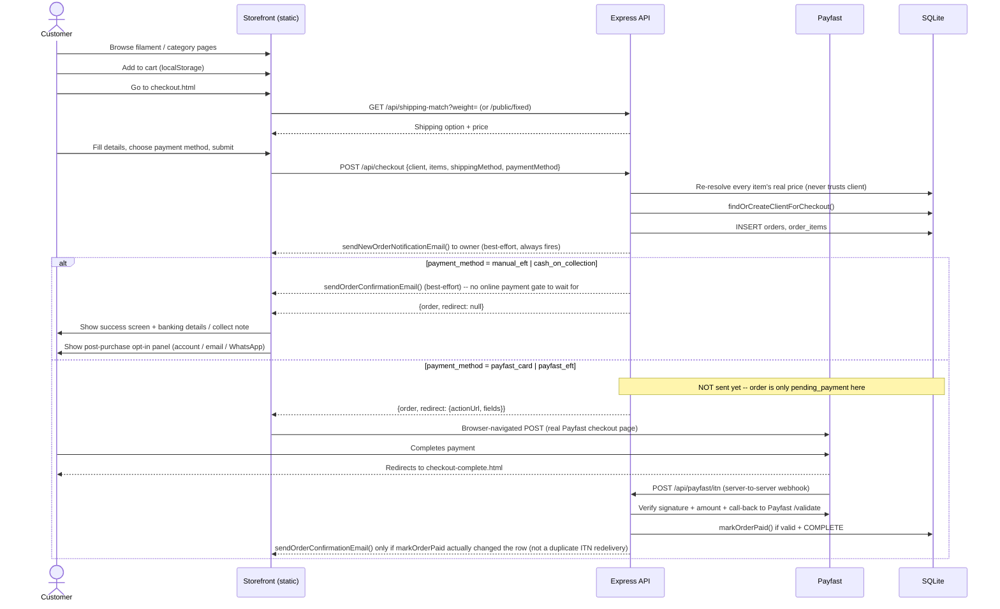

### 8.2 Customer Account Lifecycle

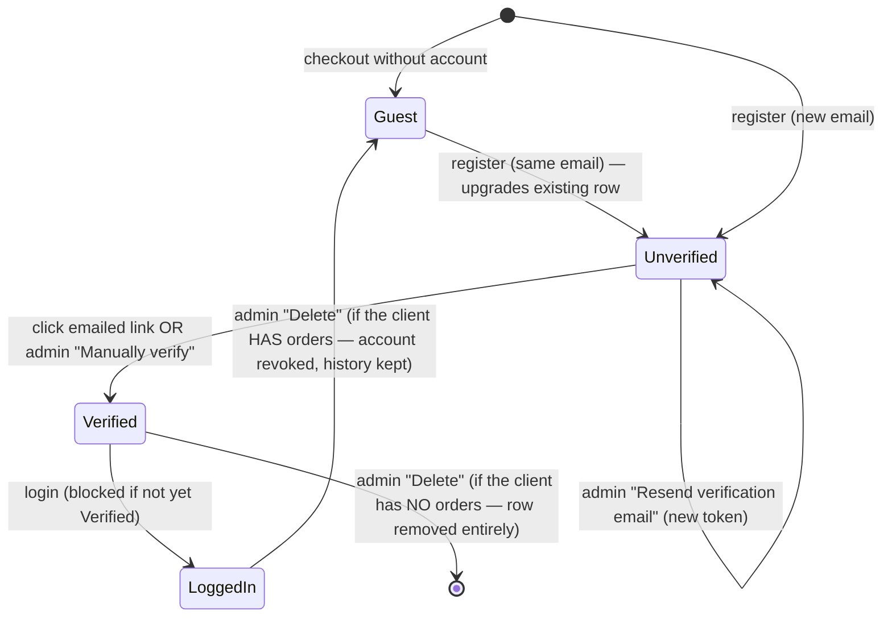

### 8.3 Admin Order & Invoice Management

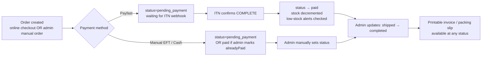

### 8.4 Newsletter Campaign Lifecycle

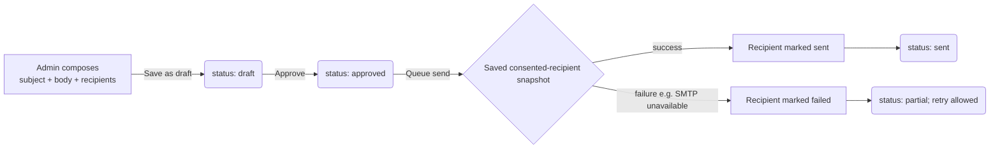

### 8.5 WhatsApp Campaign Lifecycle

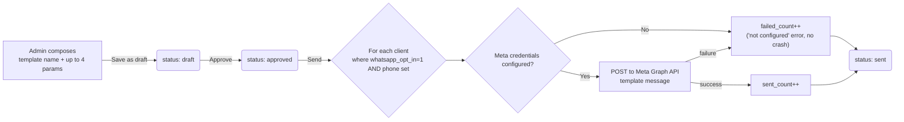

### 8.6 Design Request Lifecycle

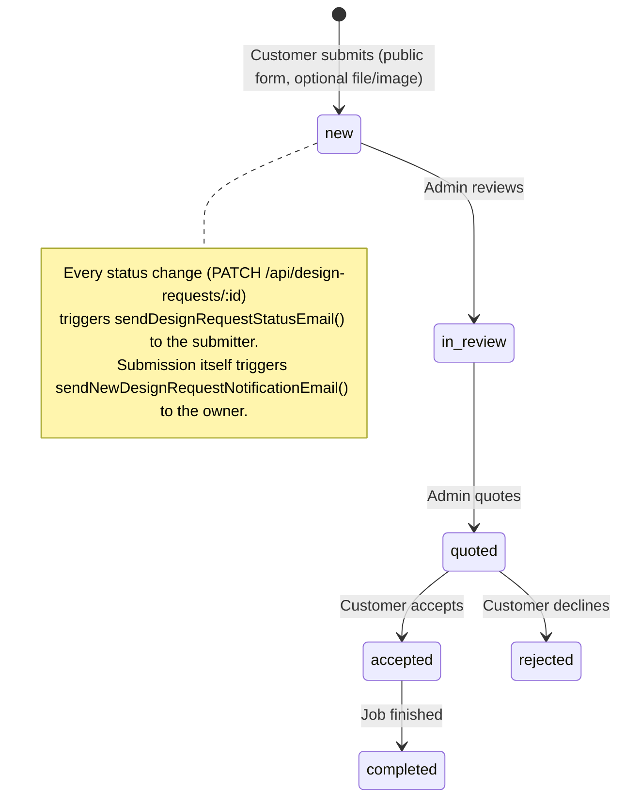

### 8.7 Print Job Costing Flow

```mermaid
flowchart TD
    A[Admin selects up to 4<br/>in-house filaments + grams/meters] --> B[Enter time inputs:<br/>print time, design/setup/post-processing hours]
    B --> C[Enter markup %]
    C --> D["POST /api/print-jobs/validate<br/>(preview, no save)"]
    D --> E{Admin confirms}
    E -->|Save| F["POST /api/print-jobs<br/>calculates: filament_cost, power_cost,<br/>labour_cost, running_cost, total_cost,<br/>markup_amount, selling_price"]
    F --> G[Logs consumption:<br/>in_house_filament.used_g/used_m incremented<br/>per filament slot used]
    G --> H[print_job_filaments rows created<br/>(one per slot)]
```

### 8.8 "Publish to Site" Flow

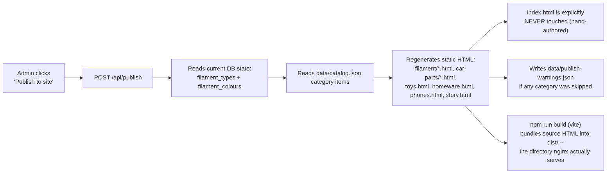

### 8.9 Deployment / Release Flow

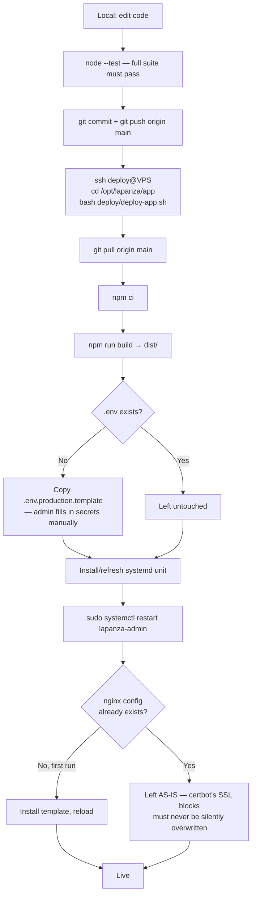

---

## 9. Functional Documentation

Each subsection: **Purpose · Actors · Key Fields · Business Rules · Flow · Endpoints · Tables Touched.**

### 9.1 Product Browsing (Storefront)

- **Purpose:** Let customers browse filament and category products.
- **Actors:** Anonymous/authenticated customer.
- **Key fields displayed:** name, price, colour swatches, stock (implicitly — out-of-stock items still show but checkout re-validates), specs, images.
- **Business rules:** All storefront browsing pages are **pre-generated static HTML** (see §8.8) — there is no live database query on page load. Content is only as fresh as the last "Publish to site" run.
- **Flow:** Static page → "Add to cart" button (`data-add-to-cart` attribute carries `productId`/`price`/`name`/`image`/`weight`) → delegated document-level click handler in `cart-ui.js` → `cart.js` writes to `localStorage` → toast notification shown.
- **Endpoints:** None (pure static + client-side cart).
- **Tables:** None at browse time (DB only read during the publish step and at checkout).

### 9.2 Shopping Cart

- **Purpose:** Client-side persistent cart.
- **Actors:** Anonymous/authenticated customer.
- **Key fields:** productId, name, price, image, weight, quantity.
- **Business rules:**
  - Cart lives entirely in `localStorage` (key `lapanza-cart`) — no server-side cart entity.
  - **Homepage load unconditionally clears the cart** (`home-entry.js`) — deliberate: prevents stale carts silently reappearing on repeat homepage visits.
  - `checkout-complete-entry.js` also clears the cart on the Payfast return page.
  - Every mutation dispatches a `cart:updated` DOM event; the cart badge/drawer re-renders reactively.
- **Flow:** Add/increment/decrement/remove in the drawer → all functions in `cart.js`.
- **Endpoints:** None.
- **Tables:** None.

### 9.3 Checkout

- **Purpose:** Convert a cart into a real order, across 4 payment methods.
- **Actors:** Anonymous or logged-in customer.
- **Key fields:** firstName, lastName, businessName, email, phone, street/suburb/city/province/postalCode/country, shippingMethod, paymentMethod, cart items.
- **Business rules:**
  - Server **never trusts client-submitted price** — every line is re-resolved server-side via `resolveProductSnapshot()` against SQLite (filament) or `catalog.json` (category).
  - Shipping: `courier` (auto weight-bracket match), `own_courier`/`collect` (free), `fixed` (named option, e.g. PUDO locker, picked directly — no weight logic).
  - `findOrCreateClientForCheckout()` matches by email case-insensitively; existing client (guest or registered) is reused rather than duplicated.
  - Confirmation email and owner-notification email are both **best-effort** — a failed send never fails the checkout itself.
  - Payfast: browser is redirected via a real `<form>` POST (not fetch/XHR) to Payfast's hosted page — Payfast requires owning the top-level navigation.
  - **Stock is reserved at order creation, not at payment** (`reserveStockForOrder` in `server/orders.js`, inside the same transaction as the order/order_items INSERT) — this is what actually stops two concurrent checkouts from both claiming the same last unit; the order is rejected outright (`Out of stock: ...`) if current stock can't cover it. Paying the order afterward doesn't touch stock again. If the order is later cancelled (5-day auto-cancel, or an admin cancel) the reservation is released back via `restoreStockForOrder`.
- **Flow:** See §8.1.
- **Endpoints:** `POST /api/checkout`, `GET /api/shipping-match`, `GET /api/shipping-options/public/fixed`, `POST /api/payfast/itn` (webhook).
- **Tables:** `clients`, `orders`, `order_items`, `payment_transactions`, `filament_colours` (stock reserved on order creation, restored on cancellation).

### 9.4 Customer Accounts

- **Purpose:** Registration, email verification, login, order history self-service.
- **Actors:** Customer; Admin (verify/resend/delete override).
- **Key fields:** firstName, lastName, email, password (≥8 chars).
- **Business rules:**
  - Registering with an email that already has a **guest** row upgrades that row (sets `password_hash`) rather than creating a duplicate client.
  - Registering with an email that already has a **password set** is rejected ("log in instead").
  - Login is blocked (`403`) until `email_verified = 1`.
  - Verification token: 24h TTL, single-use, cleared on use.
  - **Admin override (Phase 4):** "Manually verify" sets `email_verified=1` directly, no token involved — for a customer who never received/clicked the email. "Resend verification email" issues a **fresh** token (the old one is invalidated) and re-sends. Both actions only apply to rows that actually have an account (`password_hash` set) — throws otherwise.
  - **Delete (Phase 4):** if the client has **zero** orders, the row is hard-deleted. If the client **has** order history (FK'd from `orders.client_id`), only the account credentials are cleared (`password_hash`, `email_verified`, tokens → NULL/0) — the client reverts to a guest row and the order history is preserved. This distinction is automatic, not admin-chosen. Reachable from both the Clients page and Registered Users.
  - **Merge:** folds a duplicate client record into another (`mergeClients`) — reassigns every order and design request from the source to the target, then hard-deletes the source unconditionally (no revoke-only fallback, since the reassignment already cleared every FK reference before the delete runs). `page_views.client_id` is deliberately left pointing at the old id — anonymous visit analytics, not order/service history, and reassigning it would misattribute the source's real browsing history to the target.
- **Flow:** See §8.2.
- **Endpoints:** `/api/client/register`, `/verify`, `/login`, `/logout`, `/me`, `/orders`; admin: `/api/clients/:id/verify`, `/resend-verification`, `DELETE /api/clients/:id`, `POST /api/clients/:id/merge`.
- **Tables:** `clients`, `orders` (read-only, for the delete-vs-revoke check), `design_requests` (reassigned on merge).

### 9.5 Custom Design/Print Requests

- **Purpose:** Intake for one-off custom print jobs not in the catalog.
- **Actors:** Customer (public form); Admin (review/quote/status).
- **Key fields:** name, email, phone, description, budgetNote, referenceImage (upload), referenceFile (upload, e.g. STL), status, finalizedAt.
- **Business rules:** Public submission is rate-limited (`publicFormLimiter`). Every status change emails the submitter. Submission itself emails the shop owner. Status is `new` → `in_progress` → `finalized` (simplified from an earlier 6-stage new/in_review/quoted/accepted/rejected/completed funnel — a one-time boot migration remapped every existing row, see §2 Evolution History); `finalizedAt` auto-stamps the moment status first becomes `finalized` (same pattern as `todo_items.actual_fix_date`) and clears if the request is reopened. Editable inline from the admin list row, not only from the detail view.
- **Endpoints:** `POST /api/design-requests` (public), admin CRUD.
- **Tables:** `design_requests`, `clients` (linked if matched).

### 9.6 Order & Invoice Management (Admin)

- **Purpose:** View, filter, update, and document (invoice/packing slip) every order.
- **Actors:** Admin.
- **Key fields:** status, trackingNumber, discountPct (manual orders only).
- **Business rules:**
  - Invoice numbers are sequential `INV-####`, computed as `MAX(existing invoice number) + 1`, seeded from `settings.invoiceNumberSeed` (default `10`) if no orders exist yet — lets the digital sequence continue a pre-existing paper/spreadsheet sequence without collision.
  - Manual orders (admin-created) can include **free-text line items** (`manual:{uuid}` productId) with an admin-trusted price — unlike online checkout, which always re-resolves against the catalog.
  - Status transitions: `pending_payment → paid → shipped → completed`, plus `cancelled` reachable three ways: automatically, 7 days after creation, for any order still `pending_payment` (`jobs.js`'s `startAutoCancelJob`, hourly check via `cancelStalePendingOrders`); explicit admin action (any status); or the order's own client, self-service, from the account page's "Cancel" button (`cancelOrderByClient` — only while still `pending_payment`, ownership-checked). All three cancellation paths release the order's reserved stock back (`restoreStockForOrder`, guarded against double-restoring an already-cancelled order) and email `settings.orderNotificationEmail` (`sendOrderCancelledNotificationEmail`) so the business owner sees every cancellation regardless of which path triggered it.
  - `updateOrderStatus` keeps `payment_status` in lockstep with whichever status it's given (`paid`/`shipped`/`completed` → `payment_status='paid'`, `pending_payment` → `'pending'`, `cancelled` leaves it untouched) — Invoice History's inline Pending/Payment-received select and Completed (printed & shipped) checkbox both drive this one route, no separate payment-status endpoint exists.
  - **Delete** (`deleteOrder`, distinct from cancel) removes the order, its line items, and its payment transactions outright — restores reserved stock only if it was still `pending_payment`/`paid` (not `shipped`/`completed`, whose stock already physically left; not `cancelled`, already restored by whichever cancellation path got it there).
- **Endpoints:** §7.15.
- **Tables:** `orders`, `order_items`, `clients`, `shipping_options`.

### 9.7 Manual Order Creation (Admin)

- **Purpose:** Record a sale that didn't go through online checkout (phone order, in-person, WhatsApp order).
- **Actors:** Admin.
- **Key fields:** client (existing or new — same `findOrCreateClientForCheckout` online checkout uses, so a new client here is a real row and this order shows in their order history), line items (catalog product, picked via the New Order UI's search-on-Enter product picker sourced from `/api/inventory`, OR free-text description + price), shippingMethod (`courier`/`own_courier`/`collect`/`fixed` — same vocabulary as online checkout; the New Order UI's own PUDO-Locker/Local-Delivery radios are a UI-only split of `fixed`, mapped before the request is sent) + shippingOptionId or manual shipping price, discountPct, paymentMethod, alreadyPaid (bool).
- **Business rules:** Same invoice-numbering as online orders. Stock is reserved at creation regardless of `alreadyPaid` (matches online checkout's *timing*), but — unlike online checkout — never hard-blocks: an admin's entry is trusted as-is, same as its free-text line items/prices, so it floors at 0 rather than throwing "Out of stock." `alreadyPaid=true` sets `status='paid'` immediately (skips `pending_payment`). `shippingMethod` is optional for API backward compatibility — omitting it defaults to `'fixed'` when a `shippingOptionId` is given, else `'courier'` (the pre-shippingMethod behavior, which always stored `'fixed'` regardless of what was actually picked). `own_courier`/`collect` always price at R0, same as online checkout, regardless of any shippingOptionId/manual price also sent.
- **Endpoints:** `POST /api/orders`.
- **Tables:** `orders`, `order_items`, `clients`.

### 9.8 Shipping Configuration (Admin)

- **Purpose:** Define delivery pricing.
- **Key fields:** name, category, minWeight, maxWeight, price, active, optionType.
- **Business rules:** `auto_weight` options are matched by cart total weight falling within `[min_weight, max_weight]`. `fixed` options (PUDO lockers etc.) are named and picked directly by the customer at checkout, bypassing weight matching entirely. `category` is a free-text admin field (autocompleted from existing values via a `<datalist>`) the admin list groups by — backfilled once from the same name-based heuristic checkout.html and the New Order form already used to split PUDO Locker vs Local Delivery (`ensureShippingCategoryColumn`, `server/db.js`), so existing options needed no re-entry. Both of those pickers now read `category` first, falling back to the name check only for a row with none set.
- **Endpoints:** §7.8. **Tables:** `shipping_options`.

### 9.9 Product Catalog Management (Admin)

- **Purpose:** Manage both product systems (filament + category items) from one view.
- **Key fields (filament):** slug, name, description, colourNote, specs (array), seoTitle/Description, status, featured, sortOrder; per colour: name, hex, sku, weightG, shippingWeightG, rollLengthM, priceRand, stockQty, image, notes.
- **Key fields (category items):** varies by category — stored in `catalog.json`, not SQLite. Every category shares: name, details, material, size, finish, price, sku, imageUrl, weight/shippingWeight, stockQty, available, listed. **Car-parts only** (GWM/Landrover, gated in the admin UI on `parent === 'car-parts'`): `creator` (free-text design credit), `models` (multi-select, an array of name strings picked from Settings' `carPartModelsLandrover`/`carPartModelsGwm` configurable lists — one per brand, picked by the item's own category slug — same "store the name, not an id" convention as `inHouseFilamentBrands`/`todoCategories`, see §9.9's Settings note and `server/settings-defaults.js`), and `sourceUrl` (admin-only reference link, deliberately excluded from the public `categories.json` export — see `server/export.js`'s `syncPublicJson()`). The 194-item Landrover catalog (imported 2026-08-27) was scraped from lr3dparts.com's per-part JSON-LD `Product` block rather than typed in by hand — the source spreadsheet's own "Fits (Vehicles)"/"Category" columns were truncated/corrupted for a meaningful fraction of rows, while each part's own page carried the full multi-model fitment list and a product photo. One-off script: `scripts/import-landrover-parts.mjs` (replaces `items[]` wholesale, not idempotent).
- **Business rules:** SKU is globally unique across all filament colours (enforced at DB level). A blank SKU field on save (create or update) falls back to a colourId-derived SKU rather than persisting an empty string — otherwise a second colour with a blank SKU would hit the unique constraint against the first one and surface as a confusing "duplicate SKU" error for two rolls that were never meant to collide. Changes here are **not** live on the storefront until "Publish to site" is run (§8.8).
- **Storefront display:** each filament colour's static page card shows the price and, directly below it, the live stock count at last publish — `"{N} in stock"`, or `"Out of stock"` (styled to match the price colour, drawing the eye) when `stockQty` is `0` or unset. This is **display-only** — a 0-stock colour's "Add to Cart" button is still rendered and functional; nothing currently blocks checkout on stock level (see §15 — the same absence of enforcement already noted for in-house filament applies here too, on the sellable catalog).
- **Endpoints:** §7.6. **Tables:** `filament_types`, `filament_colours` (+ `catalog.json` for category items, file-based).

### 9.10 Registered Users (Admin) — see also §9.4

- **Purpose:** Admin-facing list of every client with `password_hash IS NOT NULL`, with account-management actions.
- **Key fields displayed:** name, email, status (verified/unverified badge), joined date, last logged-on date (or "Never"), expandable order history.
- **Actions:** Verify, Resend email (both hidden once verified), Delete.

### 9.11 Newsletter (Public Subscribe + Admin Campaigns)

- See §8.4. **Public:** double opt-in subscribe/confirm/unsubscribe (`newsletter_subscribers`). **Admin:** compose→approve→send campaigns (`newsletter_campaigns`), sent only to `status='confirmed'` subscribers.

### 9.12 WhatsApp Marketing (Opt-in + Admin Campaigns)

- See §8.5. **Opt-in:** post-checkout panel (`PATCH /api/client/:id/marketing-preferences`), email-matched (not a real login) since it only toggles a low-sensitivity consent flag. **Admin:** compose→approve→send campaigns against Meta's Graph API — **template-based only**, never free text (Meta policy for business-initiated messages outside a live customer session).

### 9.13 Site Settings (Admin)

- **Purpose:** Central config for branding, fonts, invoicing, print-job-costing rates, notification email.
- **Key fields (full default list):** siteName, tagline, phoneDisplay, phoneTel, email, address, hours, whatsapp (link), facebook, instagram, useUniversalFont, universalFont, fontSans, fontSerif, defaultTheme, homeTiles (array of 3), bankName, bankAccountName, bankAccountNumber, bankBranchCode, invoiceNumberSeed, markupPct, electricityRate, printerPowerDraw, runningCostsPct, designRate, setupRate, postProcessingRate, orderNotificationEmail.
- **Public exposure (V0.92):** only the keys in `PUBLIC_SETTINGS_KEYS` (`server/settings.js`) ever reach the public `/site-settings.json` and the build-time `src/data/settings.json` — banking, cost-model, alert, email-template and admin-only keys are deliberately excluded. Adding a new setting the storefront or `generate-pages` must read means adding it to that allowlist too, or it silently never leaves the server. The admin `GET/PUT /api/settings` routes return the full unfiltered object.
- **Business rules:** `PUT /api/settings` only accepts an allow-listed set of keys (prevents arbitrary key injection).
- **Endpoints:** §7.16. **Tables:** `settings`.

### 9.14 Print Job Costing (Admin)

- See §8.7. **Purpose:** Calculate the true cost + Minimum Selling Price of a print, factoring filament, electricity, labour (design/setup/post-processing hours × rates), and markup %. Costing itself never touches storefront pricing on its own.
- **Status:** `Printed` or `Estimate` (dropdown in the Log Job form and inline per row in the table) — a rough quote vs. an actual completed print, purely informational, no other behaviour hangs off it.
- **Minimum Selling Price** (`sellingPrice`) is the computed floor (`totalCost + markup`) — read-only, never overridden.
- **Final Selling Price** (`finalSellingPrice`) is admin-editable, defaults to the Minimum Selling Price at creation if left blank, and can be changed any time afterward (inline in the table, blur-saves). This is the price actually used if the job is listed for sale.
- **"List for sale" — the one deliberate bridge to the storefront:** an admin can explicitly publish a Printed-or-Estimate job as a real category product (toys/homeware/phones/car-parts subcategories) — a new choice per job, not automatic. Carries over the job's name, Final Selling Price, and weight (grams, used for both `weight` and `shippingWeight`); carries over the reference photo only if one was uploaded to the job; the admin sets the stock quantity being listed. Requires `finalSellingPrice > 0` — nothing lists for R0.
  - The job stays **linked** to the resulting item (`listingCategoryId`/`listingItemId`) — a second click doesn't create a duplicate product; the button becomes **"Update listing"**, which bumps the existing item's stock (e.g. "printed 3 more") and/or price instead.
  - Implemented in `server/print-jobs.js`'s `listPrintJobForSale`/`updatePrintJobListing`, both operating on the same category/items structure `server/store.js`'s `upsertProduct` already uses for the regular catalog editor — no new product concept, no separate items table.
- **Flow:** See §8.7. **Endpoints:** §7.12. **Tables:** `print_jobs`, `print_job_filaments`, `in_house_filament`; listing writes into `catalog.json` via `store.js` (not SQLite — same split already accepted for category items elsewhere, see §2.1).

### 9.15 In-House Filament Stock (Admin, internal-only)

- **Purpose:** Track physically-open rolls used for internal/local printing — separate ledger from the sellable Filament Library.
- **Key fields:** filamentType, colorName, rollsAvailable, weightG, rollLengthM, costPerRollRand.
- **Business rules:** Remaining stock/% is always **computed at read time** (`rollsAvailable × spec − used`), never stored as a separate "remaining" column — single source of truth.

### 9.16 Purchase History (Admin)

- **Purpose:** Track supplier expenses (materials, equipment, consumables).
- **Key fields:** supplier, goods, totalValue, status (outstanding/paid), paymentType, purchaseDate.

### 9.17 3D Resources (Public + Admin)

- **Purpose:** A downloadable-file gallery (print settings, STL/3MF/OBJ/gcode files) for customers.
- **Business rules:** Downloads are forced via `Content-Disposition: attachment` (not served inline by extension guessing) — see `uploads.js`'s allowlist comment.

### 9.18 Database Backups (Admin)

- **Purpose:** Protect against data loss (single SQLite file = the entire business record).
- **Actors:** Admin (manual trigger + view/download/delete); system (automated daily run).
- **Key fields displayed:** filename, created date/time, file size.
- **Business rules:**
  - An automated backup runs once immediately on every process boot (so a fresh deploy is never more than the deploy interval away from a backup) and then once every 24 hours thereafter, via an in-process `setInterval` — same pattern as the stale-order auto-cancel job, no external cron.
  - The most recent 30 backups are kept; older ones are pruned automatically after every automated run. Manually-triggered backups count toward the same 30-backup limit — there's no separate "protected" manual backup that survives pruning indefinitely.
  - Uses `better-sqlite3`'s built-in online backup API (SQLite's own backup mechanism) — safe to run against the live database in WAL mode without stopping the app or locking out writers.
  - Every filename accepted from a request (download, delete) is validated against path traversal before touching the filesystem.
  - After every automated run, `data/backups/` is mirrored to a configured `rclone` remote (`syncOffsite()`) so backups survive a disk/VPS failure, not just bad data or a bad deploy — a self-correcting `rclone sync`, not `copy`, so remote pruning matches local pruning automatically. Runs in its own try/catch: an offsite failure is logged but never reported as "the backup failed," since the local backup already succeeded by that point. Requires one-time setup (DEPLOY.md §9); skips itself with a clear error if `BACKUP_RCLONE_REMOTE` isn't set.
- **Endpoints:** §7.17. **Tables:** none directly (operates on the SQLite file itself, not through it).

### 9.20 Visitor Analytics (Admin)

- **Purpose:** Traffic visibility — how many people visit, how much traffic historically, and who's on the site right now (specifically, which known/registered customers).
- **Actors:** Anonymous/logged-in customer (generates the data passively, via `src/js/analytics.js`); Admin (views it).
- **Key fields displayed:** active-now count, registered-clients-active count, visits today, total visits, unique visitors all-time, a live table of which registered clients are active and on what page, last-30-days daily visit/unique-visitor counts, top 10 pages all-time.
- **Business rules:**
  - Every public page sends a beacon on load (`type: 'pageview'`) and roughly every 45s while the tab stays open **and visible** (`type: 'heartbeat'`) — a backgrounded tab does not count as active. `navigator.sendBeacon` is used so the beacon survives page unload/navigation without blocking it.
  - Only pageview beacons are written to the durable `page_views` table. Heartbeats update the in-memory "active now" map only — never persisted, since heartbeat noise has no historical value once a visitor leaves.
  - "Active now" = any visitor whose most recent beacon (pageview or heartbeat) was within the last 5 minutes. Pruned lazily on every read of `/api/analytics/active`, not on a timer.
  - A visitor's `client_id` is attached to their beacon (and therefore their page views + active-now entry) **only** if they hold a valid, non-expired client session cookie at that exact moment — an anonymous browser gets no `client_id`, ever.
  - The visitor identifier (`visitorId`) is a random UUID generated client-side and stored in `localStorage` — it is not an IP address, not a fingerprint, and carries no personal information by itself. It exists purely to distinguish "one visitor across several page loads" from "several different visitors."
  - All date-grouping queries (today's visits, last-30-days breakdown) use SQLite's `'localtime'` modifier explicitly — the server runs in SAST (UTC+2) and SQLite's `date()`/`datetime()` default to UTC, which silently shifts day boundaries by a calendar day near midnight otherwise. (This exact class of bug already hit invoice-date import once in this project — see §12.5 — the fix was applied proactively here rather than waiting to hit it again.)
- **Privacy note:** while the anonymous visitor ID alone is not personal information, the `client_id` linkage means a **logged-in customer's browsing on this site is being logged against their real identity** while they're logged in. This is a genuine POPIA-relevant data-processing activity that the site's still-missing Privacy Policy (§15) should disclose — this feature increases the urgency of that pre-existing gap rather than being a new one on its own.
- **Endpoints:** §7.19. **Tables:** `page_views`, `clients` (read-only, to resolve active client names/emails).

### 9.21 Admin Sidebar Structure

Three groups (Phase 4 reorganisation, per explicit user request):
- **Client Side:** Dashboard, Analytics, Product catalog, Orders, +New order, Clients, Registered users, Design requests, Invoice History, 3D Resources, Shipping options, Newsletter, WhatsApp Updates
- **Local Management:** Stock management, In-House Filament, Print Job Costing, Purchase History
- **Settings:** Backups, Site settings

---

## 10. Requirements Document

### 10.1 Functional Requirements

| ID | Requirement | Phase |
|---|---|---|
| FR-01 | System shall display filament and category products with colours, specs, and pricing | Pre-phase |
| FR-02 | Customer shall be able to add/remove/adjust products in a persistent cart | Pre-phase |
| FR-03 | System shall calculate shipping cost by cart weight (bracket-matched) or by named fixed-price option | Phase 1 / 3 |
| FR-04 | System shall accept payment via Payfast (card, instant EFT), manual EFT, or cash-on-collection | Phase 1 |
| FR-05 | System shall verify Payfast payment authenticity via signed ITN webhook before marking an order paid | Phase 1 |
| FR-06 | System shall send an order confirmation email to the customer and a notification email to the owner | Phase 1 / 4 |
| FR-07 | Admin shall be able to view, filter, and update order status, tracking number, and print invoices/packing slips | Phase 1 / 3 |
| FR-08 | Admin shall be able to manage product catalog (filament types/colours, category items) with stock levels | Pre-phase / 1 |
| FR-09 | Admin shall be able to publish catalog changes to the live static site on demand | Pre-phase |
| FR-10 | Customer shall be able to register, verify email, log in, and view own order history | Phase 2 / 4 |
| FR-11 | Customer shall be able to subscribe to a newsletter with double opt-in and unsubscribe at any time | Phase 2 |
| FR-12 | Customer shall be able to submit a custom design/print request with optional file attachments | Phase 2 |
| FR-13 | Admin shall be able to create manual (offline) orders with free-text or catalog line items and record discounts | Phase 3 |
| FR-14 | System shall maintain a sequential invoice numbering scheme continuing from a pre-existing sequence | Phase 3 |
| FR-15 | Admin shall be able to calculate print-job cost and suggested selling price from filament/time/labour/markup inputs | Phase 3 |
| FR-16 | Admin shall be able to track in-house filament roll stock separately from sellable catalog stock | Phase 3 |
| FR-17 | Admin shall be able to track supplier purchases/expenses | Phase 3 |
| FR-18 | Admin shall be able to compose, approve, and send email newsletter campaigns to confirmed subscribers | Phase 4 |
| FR-19 | Admin shall be able to compose, approve, and send WhatsApp template campaigns to opted-in customers via Meta's Business API | Phase 4 |
| FR-20 | Customer shall be offered account creation / email opt-in / WhatsApp opt-in immediately after a successful order, without blocking checkout | Phase 4 |
| FR-21 | Admin shall be able to manually verify, resend verification email to, or delete/revoke a registered customer account | Post-launch |
| FR-22 | System shall reset the shopping cart when the customer returns to the homepage | Phase 4 |
| FR-23 | Admin sidebar shall be organised into Client Side / Local Management / Settings groups | Phase 4 |
| FR-24 | System shall automatically back up the database on a schedule with retention, and admin shall be able to trigger, view, download, and delete backups on demand | Post-launch |
| FR-25 | System shall track site visits (total and per-page, historically) and show admin a live count of currently-active visitors, distinguishing anonymous traffic from currently-active registered customers | Post-launch |
| FR-26 | Each filament colour's storefront page shall display its current stock level directly below its price | Post-launch |

### 10.2 Non-Functional Requirements

| ID | Requirement | Notes |
|---|---|---|
| NFR-01 | **Security** — passwords hashed (bcrypt), rate limiting on auth/public-form/checkout endpoints, session cookies `httpOnly`/`sameSite=lax`, admin/client sessions fully independent, admin audit trail (`audit_log`, §7's `/api/audit-log`) | Implemented |
| NFR-02 | **Data integrity** — checkout prices always server-resolved, never client-trusted | Implemented |
| NFR-03 | **Availability** — process auto-restarts on failure (systemd `Restart=on-failure`) | Implemented |
| NFR-04 | **Transport security** — HTTPS enforced site-wide, HTTP force-redirects | Implemented (certbot) |
| NFR-05 | **Auditability** — every schema change is additive/idempotent, safe to re-run on every boot | Implemented |
| NFR-06 | **Testability** — automated test coverage for all backend business logic | 161 tests, `node --test`, no test framework dependency |
| NFR-07 | **Deployability** — one-command deploy from git to running production service | `deploy/deploy-app.sh` |
| NFR-08 | **Email deliverability** — outbound mail failures never block the primary user action (checkout, registration) | Best-effort, try/catch around every send |
| NFR-09 | **Backup** — database is a single portable file, trivially backupable | Implemented — automated daily backup + on-demand admin backups, 30-backup retention (§9.18). Backups currently live on the same disk as the live DB, not yet off-server — see §15. |
| NFR-10 | **Compliance (WhatsApp)** — business-initiated broadcasts use only Meta-pre-approved templates | Implemented — free text is not permitted by Meta policy and the code enforces this shape |
| NFR-11 | **Observability** — an external monitor detects an outage before a customer reports one | `/api/health` verifies real DB connectivity (not just process liveness) and is designed to be polled by a third-party uptime service; see `docs/UPTIME_MONITORING.md`. **The actual monitor account/configuration is a manual, user-owned step** (third-party account signup) — the code-side support for it is implemented, but whether a monitor is actually configured and alerting depends on that manual step having been completed. |
| NFR-12 | **Privacy-by-design (visitor analytics)** — traffic data is collected without capturing IP addresses, fingerprints, or third-party tracking cookies | Implemented — anonymous tracking uses a random client-generated ID only. Real personal data (customer identity) is only ever linked when the visitor is already a logged-in, authenticated client — see the privacy note in §9.20. Not a substitute for an actual Privacy Policy page (§15). |

---

## 11. Functional Specification (Field-Level)

### 11.1 Checkout Form

| Field | Type | Required | Validation |
|---|---|---|---|
| firstName | text | Yes | Non-empty |
| lastName | text | Yes | Non-empty |
| businessName | text | No | — |
| email | email | Yes | Valid email format (HTML5) |
| phone | text | No | — |
| street/suburb/city/province/postalCode | text | Conditionally required | Required unless `shippingMethod` is `own_courier` or `collect` |
| country | text | No | Defaults `South Africa` |
| shippingMethod | radio | Yes | One of `courier`, `own_courier`, `collect`, `fixed` |
| paymentMethod | radio | Yes | One of `payfast_card`, `payfast_eft`, `manual_eft`, `cash_on_collection`; `cash_on_collection` only offered when `shippingMethod=collect` |

**Server-side validation (`server/orders.js` / `server/index.js`):** every cart line's `productId` must resolve to a real, currently-available product (else `400: Product no longer available`); `paymentMethod` must be in the allowed list; at least one item required.

### 11.2 Registration Form

| Field | Type | Required | Validation |
|---|---|---|---|
| firstName | text | Yes | Non-empty (route-level, `POST /api/client/register` — `registerClient()` itself stays lenient, see §2 row on this) |
| lastName | text | Yes | Non-empty (route-level, same as above) |
| businessName | text | No | — |
| email | email | Yes | Non-empty, becomes case-insensitive uniqueness key |
| password | password | Yes | Minimum 8 characters (server-enforced, `throw` otherwise) |
| confirmPassword | password | Yes | Client-side only — must equal `password`; never sent to the server |

### 11.3 Login Form

| Field | Type | Required |
|---|---|---|
| email | email | Yes |
| password | password | Yes |

**Server responses:** `401 {error: 'Invalid email or password'}` for unknown email/wrong password/no account; `403 {error: 'Please verify your email...'}` for a correct password on an unverified account. Deliberately does not distinguish "unknown email" from "wrong password" to avoid leaking which emails have accounts — but *does* distinguish "unverified" since that's not a security-sensitive distinction.

### 11.4 Design Request Form

| Field | Type | Required |
|---|---|---|
| name | text | Yes |
| email | email | Yes |
| phone | text | Yes |
| description | textarea | Yes |
| budgetNote | text | No |
| referenceImage | file | No — JPG/PNG/WebP, up to 50MB |
| referenceFile | file | No — STL/3MF/OBJ/gcode/zip/pdf, up to 50MB |

### 11.5 Manual Order Form (Admin)

| Field | Required | Notes |
|---|---|---|
| client (existing pick OR new fields) | Yes | |
| line items | Yes, ≥1 | Each is EITHER `{productId, quantity}` (re-priced from catalog) OR `{description, unitPrice, quantity}` (free-text, admin-trusted price) |
| shippingOptionId OR manual shipping price | No | |
| discountPct | No | Clamped 0–100 |
| paymentMethod | Yes | One of the 4 allowed methods |
| alreadyPaid | No (bool) | Sets status directly to `paid` if true |

### 11.6 Print Job Costing Form (Admin)

| Field | Required | Notes |
|---|---|---|
| itemName | Yes | |
| filament slots (up to 4) | ≥1 | Each: in-house filament pick + grams + metres |
| printTimeMinutes | Yes | |
| designHours, setupHours, postProcessingHours | No, default 0 | |
| markupPct | No, default from settings | |

**Calculation:** `filamentCost` (per-slot cost from `in_house_filament.cost_per_roll_rand` proportional to grams/metres used) + `powerCost` (printTimeMinutes × printerPowerDraw × electricityRate) + `labourCost` ((design+setup+postProcessing hours) × their respective rates) → `runningCost` (× runningCostsPct) → `totalCost` → `markupAmount` (× markupPct) → `sellingPrice`.

### 11.7 Newsletter Campaign Compose Form (Admin)

| Field | Required |
|---|---|
| subject | Yes |
| bodyText | Yes |

### 11.8 WhatsApp Campaign Compose Form (Admin)

| Field | Required | Notes |
|---|---|---|
| templateName | Yes | Must exactly match a Meta-approved template |
| templateParams (up to 4) | No | Substituted into the template's `{{1}}`–`{{4}}` placeholders |

---

## 12. Implementation & Release Process

### 12.1 Development Workflow (as practised)

1. Change implemented locally against a local SQLite DB (`data/lapanza.db`, gitignored).
2. `node --test` run — **full suite must pass (161/161)** before any commit.
3. `git add` (never blanket `-A` for sensitive paths) → commit with a descriptive message → `git push origin main`.
4. No CI/CD pipeline (no GitHub Actions observed) — testing and deployment are both manual/assistant-driven.
5. No pull-request/branch-review workflow observed — all work committed directly to `main`.

### 12.2 Environment Strategy

| Environment | Where | Config source |
|---|---|---|
| Local dev | Developer machine, `npm run dev:all` (Vite :5173 + Node :8787) | `.env` (gitignored), or none — falls back to sandbox/unconfigured defaults |
| Production | VPS `41.222.36.147` | `/opt/lapanza/app/.env` (never in git), filled in manually over SSH |

There is **no separate staging environment** — the VPS is production from first deploy.

### 12.3 Deployment Automation (`deploy/`)

| File | Purpose |
|---|---|
| `bootstrap-vps.sh` | **Run once**, as root, on a fresh VPS. Installs Node 22, nginx, certbot, git, build tools; creates the `deploy` user with SSH-key-only login and passwordless sudo; configures firewalld (ssh/http/https only). |
| `deploy-app.sh` | **Run on every deploy**, as the `deploy` user. Clones (first run) or pulls `main`; `npm ci`; `npm run build`; installs `.env` from template if missing; installs/refreshes the systemd unit and restarts it; installs the nginx config **only if it doesn't already exist** (to avoid clobbering certbot's SSL blocks — see the incident in §12.5). |
| `lapanza-admin.service` | systemd unit — `WorkingDirectory=/opt/lapanza/app`, `ExecStart=/usr/bin/node server/index.js`, `Restart=on-failure`. |
| `nginx-lapanza.conf` | Initial nginx config template (plain HTTP; certbot rewrites it in place to add HTTPS + redirect on first SSL setup). |
| `.env.production.template` | Copied to `.env` on first deploy; admin fills in real secrets by hand over SSH — **never through chat/AI tooling**. |
| `DEPLOY.md` | Full step-by-step runbook (DNS, SSL, first-run admin setup, smoke test, backup guidance). |

### 12.4 First-Time Production Setup Sequence (as actually executed)

1. Generate a dedicated SSH deploy keypair locally.
2. Bootstrap the VPS (root, one-time password use only for key installation — password never reused afterward).
3. Point DNS A records (`@` and `www`) at the VPS IP.
4. Clone the repo, `npm ci`, `npm run build`.
5. Copy `data/catalog.json` to the server separately (gitignored — real business data, not code).
6. Export real business-config tables (filament catalog, shipping options, settings) from the local dev DB — **not** the whole dev DB, which also carries test accounts — and import them into the fresh production DB via a one-off Node script.
7. Fill in `.env` secrets (Gmail app password, Payfast credentials) directly on the server.
8. Install/start the systemd service and nginx config.
9. Verify DNS propagation, then run `certbot --nginx -d ... -d www....` for HTTPS.
10. First-run admin setup screen (`/admin/`) — create the real admin account (no default/test credentials shipped).
11. External uptime monitoring — see `docs/UPTIME_MONITORING.md`. Manual, third-party account setup; not something an automated deploy step can do.

### 12.5 Notable Implementation Incidents (retained for audit value)

| Incident | Root cause | Fix |
|---|---|---|
| Backend segfault-crash-looped on first VPS boot | `better-sqlite3@13` requires Node ≥22; VPS was bootstrapped with Node 20 (only an `EBADENGINE` warning at install time, not a hard failure) | Rebuilt bootstrap script to install Node 22; documented as a hard requirement |
| Fresh production DB had zero filament products despite a "successful" migration | The crash above happened *mid*-first-boot-migration, leaving a schema-only DB; once the crash was fixed and the process restarted, the DB already existed so first-boot migration correctly (by design) did not re-run | Deleted the corrupt DB file, restarted cleanly under the fixed Node version, then separately imported the real filament/shipping/settings data from the dev DB |
| `express-rate-limit` threw `ERR_ERL_UNEXPECTED_X_FORWARDED_FOR` on every rate-limited route once behind nginx, manifesting to end users as an inexplicable `Request failed (404)` on registration/login | Express's `trust proxy` setting defaults to `false`; nginx always sets `X-Forwarded-For`, which express-rate-limit refuses to trust blindly for its IP-based key without that setting | Added `app.set('trust proxy', 1)` — single-hop trust, correct for this exact nginx-in-front topology |
| A routine app redeploy silently deleted HTTPS (port 443 stopped listening) | `deploy-app.sh` unconditionally re-copied the plain-HTTP nginx template on every run, overwriting certbot's appended SSL/redirect blocks | Script now only installs the nginx template if the target config file doesn't already exist; documented in `DEPLOY.md` |
| Registered a 2nd test account, DNS-based test site showed 404 | User was testing against `www.lapanza3d.co.za` while DNS for that name still pointed at domain.co.za's default parking page (`169.239.218.57`), not the VPS — server itself was healthy the whole time (confirmed via direct `curl`) | Corrected the `A` records; confirmed via multiple public resolvers before re-testing |
| Historical invoice dates imported one calendar day early | `new Date("25 Jul 2026")` parses as local midnight, then `.toISOString()` shifts to UTC — VPS server timezone is `Africa/Johannesburg` (UTC+2), rolling the date back a day on conversion | Re-parsed with an explicit `+02:00` offset and noon time-of-day to avoid any rollover |

### 12.6 Release Cadence

No fixed release cadence — features shipped as completed, deployed same-session. Each deploy = `git pull` + rebuild + service restart on the single production host (no blue/green, no canary — acceptable given the single-VPS, low-traffic, small-business scale).

---

## 13. Test Strategy & Test Cases

### 13.1 Strategy

- **Framework:** Node's built-in `node:test` + `node:assert` — zero external test-framework dependency.
- **Isolation:** every test opens its own **in-memory SQLite database** (`openDb(':memory:')`), so tests never touch the real dev/production database and run fully in parallel-safe isolation.
- **Coverage shape:** unit tests at the domain-module level (`server/*.js` ↔ `server/*.test.js`, 1:1 file pairing) — no end-to-end browser test automation is checked into the repo (manual browser verification was performed interactively during development instead, per session record).
- **Current count:** 344 tests across 35 test files, 100% passing at last recorded run.
- **What is NOT covered by automated tests:** frontend JS (`src/js/*`, `admin/admin.js`), CSS/visual regressions, cross-browser behaviour, load/performance testing, real third-party API integration (Payfast/Gmail/Meta calls are exercised via credential-absent "fails gracefully" paths, not live sandbox calls in CI).

### 13.2 Representative Positive & Negative Test Cases

These mirror the actual automated suite's coverage philosophy and can be used as a manual regression checklist or as a template for expanding automated coverage.

#### Checkout & Orders

| # | Case | Type | Expected result |
|---|---|---|---|
| T-01 | Submit checkout with a valid cart, all required fields, `cash_on_collection` | Positive | `201`, order created with `status=pending_payment`, confirmation + owner-notification emails attempted |
| T-02 | Submit checkout with `shippingMethod=collect` and no street address | Positive | Succeeds — address not required for collection |
| T-03 | Submit checkout with an empty cart | Negative | `400` — "Order must have at least one item" (or equivalent) |
| T-04 | Submit checkout with a `productId` for a filament colour that was deleted since the page loaded | Negative | `400` — "Product no longer available" |
| T-05 | Submit checkout with a client-tampered price in the request body | Negative | Price is silently **ignored** — server re-resolves from catalog regardless of submitted value |
| T-06 | Submit checkout with an invalid `paymentMethod` value | Negative | `400` — rejected, not in `ALLOWED_PAYMENT_METHODS` |
| T-07 | Payfast ITN with a valid signature and `COMPLETE` status | Positive | Order → `paid`; stock is unaffected here — it was already reserved at order creation, not this transition |
| T-08 | Payfast ITN with an invalid/forged signature | Negative | Rejected, order status unchanged, logged as validation failure |
| T-09 | Payfast ITN for an unknown `m_payment_id` | Negative | Logged and ignored, `200` still returned to Payfast (per their retry-avoidance contract) |
| T-10 | Duplicate Payfast ITN (same gateway+reference+status) | Negative (idempotency) | Second insert is a no-op (unique index); moot for stock either way since paying no longer touches it |

#### Customer Accounts

| # | Case | Type | Expected result |
|---|---|---|---|
| T-11 | Register with a brand-new email + password ≥8 chars | Positive | `201`, unverified account created, verification email sent |
| T-12 | Register with an email that already has a guest (no password) row | Positive | Existing row upgraded — same client ID, no duplicate |
| T-13 | Register with an email that already has a password set | Negative | Rejected — "account already exists, log in instead" |
| T-14 | Register with a 7-character password | Negative | Rejected — "Password must be at least 8 characters" |
| T-15 | Login with correct credentials on a verified account | Positive | `200`, session cookie set, `last_login_at` updated |
| T-16 | Login with correct credentials on an **unverified** account | Negative | `403` — "please verify your email" |
| T-17 | Login with a wrong password | Negative | `401` — generic "Invalid email or password" (no distinction from unknown email) |
| T-18 | Login with an email that has never registered | Negative | `401` — same generic message as T-17 (deliberate — no email enumeration) |
| T-19 | Verify with a valid, unexpired token | Positive | Account verified, token cleared |
| T-20 | Verify with an already-used token | Negative | `null`/failure — token is single-use |
| T-21 | Verify with an expired token (>24h) | Negative | Fails — treated as invalid |
| T-22 | Admin "Manually verify" a client with an account | Positive | Verified immediately, no token involved |
| T-23 | Admin "Manually verify" a guest (no account) | Negative | Throws — "no account to verify" |
| T-24 | Admin "Resend verification" on an already-verified account | Negative | Throws — "already verified" |
| T-25 | Admin "Delete" a registered client with **zero** orders | Positive | Row hard-deleted |
| T-26 | Admin "Delete" a registered client **with** order history | Positive (business-rule-correct) | Account credentials cleared, client row + order history **retained** |
| T-27 | `setWhatsAppOptIn` with matching id+email | Positive | Flag toggles |
| T-28 | `setWhatsAppOptIn` with correct id but wrong email | Negative | No change — guard fails silently (returns false, not an error) |

#### Design Requests

| # | Case | Type | Expected result |
|---|---|---|---|
| T-29 | Submit with name/email/description only | Positive | `201`, owner notified |
| T-30 | Submit with a valid STL reference file | Positive | File stored, path recorded |
| T-31 | Submit with an executable file as "reference file" | Negative | Rejected by multer's extension allowlist |
| T-32 | Submit without a description | Negative | Rejected — required field |
| T-33 | Admin changes status `new → quoted` | Positive | Status-change email sent to submitter |

#### Newsletter Campaigns

| # | Case | Type | Expected result |
|---|---|---|---|
| T-34 | Create campaign with subject + body | Positive | `status=draft` |
| T-35 | Create campaign with empty subject | Negative | Rejected — "Subject is required" |
| T-36 | Approve a `draft` campaign | Positive | `status=approved` |
| T-37 | Approve an already-`approved` campaign | Negative | Rejected — only `draft` can be approved |
| T-38 | Send an `approved` campaign with 0 confirmed subscribers | Positive (edge) | `status=sent`, `sent_count=0`, `failed_count=0` — no crash |
| T-39 | Send an `approved` campaign with confirmed subscribers but no SMTP credentials configured | Negative (graceful) | `status=sent`, `failed_count` = recipient count, `sent_count=0` — never throws |
| T-40 | Send a `draft` (not yet approved) campaign | Negative | Rejected — "Only an approved campaign can be sent" |
| T-41 | Send only reaches `status='confirmed'` subscribers | Positive (business rule) | `pending`/`unsubscribed` subscribers are excluded from the send loop entirely |

#### WhatsApp Campaigns

| # | Case | Type | Expected result |
|---|---|---|---|
| T-42 | Create campaign with template name + params array of 5 | Positive (business rule) | Only first 4 params kept |
| T-43 | Create campaign with empty template name | Negative | Rejected |
| T-44 | Send with Meta credentials unset | Negative (graceful) | Every opted-in recipient tallies as `failed_count`, clear "not configured" error, no crash |
| T-45 | Send with valid credentials + mocked successful Graph API response | Positive | `sent_count` increments |
| T-46 | Send only reaches clients with `whatsapp_opt_in=1` AND a non-empty phone number | Positive (business rule) | Opted-out or phone-less clients excluded |

#### Manual Orders / Invoicing

| # | Case | Type | Expected result |
|---|---|---|---|
| T-47 | Create manual order with a catalog product line | Positive | Price re-resolved from catalog (same as online checkout) |
| T-48 | Create manual order with a free-text line item | Positive | Admin-entered price trusted as-is |
| T-49 | Create manual order with no line items | Negative | Rejected — "Order must have at least one item" |
| T-50 | Create manual order with `alreadyPaid=true` | Positive | `status=paid` immediately, skips `pending_payment` |
| T-51 | Invoice numbering after existing orders exist | Positive | `MAX+1`, ignoring the settings seed |
| T-52 | Invoice numbering on a completely empty orders table | Positive | Uses `settings.invoiceNumberSeed` |

#### Print Job Costing / In-House Filament

| # | Case | Type | Expected result |
|---|---|---|---|
| T-53 | Validate a job with 1 filament slot, valid grams | Positive | Calculated cost breakdown returned, nothing saved |
| T-54 | Save a job — consumption logged | Positive | `in_house_filament.used_g`/`used_m` incremented correctly |
| T-55 | Save a job that would consume more filament than is physically remaining | Negative (confirmed **not** enforced) | `print-jobs.js` contains no stock-sufficiency check — consumption is logged unconditionally, `used_g`/`used_m` can exceed the physical roll total. This is a genuine gap, not a designed behaviour — see §15. |

#### Admin Auth & Setup

| # | Case | Type | Expected result |
|---|---|---|---|
| T-56 | First-run `/api/setup` with no existing admins | Positive | Admin created, `needsSetup` becomes false |
| T-57 | `/api/setup` called again once an admin exists | Negative | Rejected — setup already complete |
| T-58 | Login with correct admin credentials | Positive | Session established |
| T-59 | Access any `requireAuth` route without a session | Negative | `401 Unauthorized` |
| T-60 | Rate-limited route (login) hit >10 times in the window | Negative | `429 Too Many Requests` |

#### Database Backups

| # | Case | Type | Expected result |
|---|---|---|---|
| T-61 | Create a backup against a live database | Positive | Real, non-empty `.db` file written; metadata (filename/size/createdAt) returned |
| T-62 | List backups with a mix of `.db` files and unrelated files present | Positive | Only `.db` files listed, newest first |
| T-63 | Delete an existing backup | Positive | File removed, no longer listed |
| T-64 | Delete a backup filename that doesn't exist | Negative (graceful) | No-op, returns `false`/`404`, does not throw |
| T-65 | Delete/download/get-path with a path-traversal filename (`../../etc/passwd`, `sub/dir.db`) | Negative (security) | Rejected — "Invalid backup filename" — before any filesystem access |
| T-66 | `pruneOldBackups(keep)` with more backups than the keep count | Positive | Oldest are removed until exactly `keep` remain |
| T-67 | `pruneOldBackups(keep)` with fewer backups than the keep count | Positive (edge) | No-op, nothing deleted |
| T-68 | Automated backup job fires once immediately on process boot | Positive | Confirmed live on the VPS — a backup file with a boot-time timestamp appears within seconds of `systemctl start` |

#### Health Check / Uptime Monitoring

| # | Case | Type | Expected result |
|---|---|---|---|
| T-69 | `GET /api/health` with a reachable database | Positive | `200 {"ok": true, ...}` |
| T-70 | `GET /api/health` with the database connection closed/unreachable | Negative (the actual point of this endpoint) | `503 {"ok": false, ...}` — proves this is a real health check, not a bare liveness ping that would falsely report `200` here |

#### Visitor Analytics

| # | Case | Type | Expected result |
|---|---|---|---|
| T-71 | `recordPageView` with a valid visitorId + path | Positive | Row written to `page_views`; visitor also marked active |
| T-72 | `recordPageView` with an empty visitorId, or an empty path | Negative | Rejected — "visitorId is required" / "path is required" |
| T-73 | `recordPageView` with a `clientId` provided | Positive | `client_id` column populated on the written row |
| T-74 | `touchActiveVisitor` (heartbeat) with no corresponding DB write | Positive | Visitor appears in "active now" without a `page_views` row existing |
| T-75 | `getActiveVisitors` with a mix of anonymous and registered-client visitors | Positive | Correctly splits `anonymousActive`/`registeredActive`, resolves real name/email for registered ones |
| T-76 | `pruneActiveVisitors` with an entry older than the active window | Positive | Stale entry removed, recent entry kept |
| T-77 | `getVisitSummary` against a database with seeded visits across two visitor IDs and two paths | Positive | Correct `totalVisits`, `uniqueVisitorsAllTime`, `todayVisits`, daily breakdown, and top-pages ranking |
| T-78 | `getVisitSummary` against an empty database | Positive (edge) | Zeroes and empty arrays, not an error |
| T-79 | `POST /api/analytics/beacon` with `type: 'pageview'` | Positive | `204`, row persisted |
| T-80 | `POST /api/analytics/beacon` with `type: 'heartbeat'` | Positive | `204`, no row persisted, visitor still counted active |
| T-81 | `POST /api/analytics/beacon` with a missing `visitorId` (malformed beacon) | Negative (graceful) | Still `204` — a fire-and-forget client-side call is never going to check the response, so this must never surface as an error |
| T-82 | `GET /api/analytics/active` / `/summary` without an admin session | Negative | `401 Unauthorized` |

#### Storefront Stock Display

| # | Case | Type | Expected result |
|---|---|---|---|
| T-83 | Generate a filament page with a colour whose `stockQty` is a positive number | Positive | `"{N} in stock"` rendered, muted styling |
| T-84 | Generate a filament page with a colour whose `stockQty` is `0` | Negative (the actual point of this label) | `"Out of stock"` rendered, styled to draw the eye (same colour treatment as the price) |
| T-85 | Generate a filament page with a colour that has no `stockQty` field at all | Positive (edge — defensive default) | `"Out of stock"` — `undefined` must never be treated as "in stock" |

### 13.3 Non-Functional / Infra Test Cases (manually verified during deployment)

| # | Case | Type | Result |
|---|---|---|---|
| T-61 | HTTP request to the domain redirects to HTTPS | Positive | Confirmed (`301`) |
| T-62 | Direct IP + plain HTTP access after SSL setup | Negative (expected) | `404` from nginx's certbot-generated catch-all — by design, not a bug |
| T-63 | `systemctl restart lapanza-admin` recovers from a crashed process | Positive | Confirmed via `Restart=on-failure` |
| T-64 | Redeploying the app does not remove HTTPS | Positive (regression test for the §12.5 incident) | Confirmed fixed — nginx conf left untouched on repeat deploys |
| T-65 | Firewall blocks all ports except ssh/http/https | Positive | Confirmed via `firewall-cmd --list-all` |

---

## 14. Security Considerations

| Area | Implementation | Residual risk / note |
|---|---|---|
| Password storage | bcrypt (`bcryptjs`), both admin and client accounts | — |
| Session management | Two fully independent httpOnly, sameSite=lax cookies (admin vs client) — sessions held in an in-memory `Map`, not a persistent store | **Sessions are lost on every process restart** (observed directly during deployment — admins had to re-login after each `systemctl restart`). Acceptable for current scale; would need Redis/DB-backed sessions for multi-instance or session-durability requirements. |
| Rate limiting | `express-rate-limit` on auth endpoints (`authLimiter`), public form submissions (`publicFormLimiter`), and checkout (`checkoutLimiter`, 20/15min) | Correctly configured for the nginx reverse-proxy topology (`trust proxy` set — see §12.5 incident) |
| CSRF | Not explicitly implemented (no CSRF tokens) | Mitigated in practice by `sameSite=lax` cookies + JSON-only APIs (no state-changing GET requests), but not a formal CSRF defence |
| Input validation/XSS | All admin-rendered HTML goes through `escapeHtml`/`escapeAttr` before interpolation into `innerHTML` | Consistently applied; a project-level convention (and an automated pre-write hook) flags dense unescaped interpolation |
| Payment security | Payfast ITN signature + amount + IP verified server-side before trusting any payment-complete signal; checkout prices always server-resolved | — |
| Secrets management | `.env` gitignored everywhere; production secrets typed directly on the server, never through chat/AI tooling (explicit working rule established during this build) | — |
| File upload safety | Multer with per-upload-type extension allowlists; forced-download `Content-Disposition` for resource files (prevents inline execution/rendering of arbitrary uploaded content) | — |
| Transport security | HTTPS enforced site-wide via Let's Encrypt + nginx redirect | Auto-renewal via certbot's systemd timer |
| Admin account bootstrap | No default/shipped admin credentials — first-run setup screen forces creation of a real account on every fresh deploy | Superseded README's stale "Admin password: lapanza-admin" documentation is now inaccurate (see §15) |
| SELinux | **Disabled** on the production VPS | AlmaLinux 10 default is enforcing; disabling was accepted for deployment simplicity — a stricter posture would configure SELinux booleans/contexts instead |
| Firewall | firewalld, default-deny with explicit allows for ssh/http/https only | — |

---

## 15. Known Limitations & Technical Debt

These 13 items were seeded as the first entries in the admin **Todo / Backlog** page (Settings group, §7.24) when it shipped — that page is now the **live, authoritative source** for current status (a Backlog item here may since have moved to In Progress/Done/Won't Fix there without this static table being updated to match). This table stays as the point-in-time detail captured when each gap was first identified.

| Item | Detail |
|---|---|
| **No Privacy Policy / Terms & Conditions / Returns Policy pages** | The site collects real personal information (names, addresses, phone numbers at checkout; browsing behaviour linked to identity for logged-in customers via visitor analytics, §9.20) with no page disclosing what's collected or why — a genuine POPIA-relevant gap, and Payfast's own merchant approval process typically expects a refund-policy URL too. Not addressed by this or any prior phase. |
| **No CI/CD pipeline** | No GitHub Actions or equivalent — tests are run manually before each commit, deploys are manually triggered over SSH. |
| **No staging environment** | The VPS is production from first deploy; there is no intermediate environment to test against before changes reach real customers. |
| **In-memory session store** | Admin/client sessions do not survive a process restart (see §14). |
| **No E2E/browser test automation** | Frontend behaviour was verified manually (interactively, during development) rather than via a checked-in Playwright/Cypress suite. |
| **Payfast live payments — VERIFIED end-to-end with a real transaction (2026-08-30, #45 closed Claude Fix)** | History: `PAYFAST_MODE=live` confirmed 2026-08-27 (#6 closed, stale); passphrase confirmed matching the dashboard, which pointed at the real bug — `buildSignature()` dropped blank-valued ITN fields before hashing, contradicting Payfast's reference algorithm. Fixed in `server/payfast.js` + regression test. **Proven live 2026-08-30**: a real R5.00 card payment (order INV-0011, Payfast ref 324392419) — ITN from Payfast IP 13.245.74.88 passed `signature=true`/`serverConfirmed=true`/`amountValid=true` (the first live ITN ever to pass verification on this server), order auto-transitioned to paid/paid, `payment_transactions` recorded COMPLETE (R5.00 gross / R2.48 fee / R2.52 net), and all three customer emails (placement invoice, order confirmation on payment, Paid-in-Full invoice) were confirmed received by the owner. This row previously tracked the open risk; it now records the closure evidence. |
| **WhatsApp campaigns not yet functional** | `WHATSAPP_ACCESS_TOKEN`/`WHATSAPP_PHONE_NUMBER_ID` are unset — requires the business to complete Meta Business Account verification and get at least one message template approved before any campaign can actually send. |
| **`GMAIL_APP_PASSWORD` initially unset, now configured** | Was a launch blocker resolved during deployment (§12.5) — flagged here as a category of risk (external credential dependency) rather than a current issue. |
| **Single point of failure** | One VPS, one Node process, one SQLite file — no redundancy/failover. Acceptable at current business scale; would need a different architecture (managed Postgres, multi-instance, load balancer) to scale beyond it. |
| **Dual product storage remains unmerged** | By design (see §2.1), but it is genuine ongoing complexity — any future developer must remember category items live in a gitignored JSON file, not the database, and are content the deploy process must copy separately. |
| **`uuid` package present but mostly unused** | Most IDs use Node's built-in `crypto.randomUUID()` instead — `uuid` is a listed dependency with limited actual call sites; worth auditing for removal. |
| **No in-house filament stock-sufficiency check** | `server/print-jobs.js` logs filament consumption (`used_g`/`used_m`) unconditionally when a print job is saved — there is no check against `rolls_available × weight_g` before allowing the save, so logged usage can exceed physically available stock with no warning. Confirmed by direct code inspection (§13.2, T-55), not merely inferred. |
| **No cookie/tracking consent notice shown to visitors** | Visitor analytics (§9.20) collects anonymous behavioural data without any on-page disclosure or opt-out — no cookie banner, no "we track your visits" notice. The tracking itself is deliberately privacy-minimal (no IP/fingerprint), but the *absence of disclosure* is still a gap, and ties directly into the missing-Privacy-Policy item above. |
| **"Active now" resets on every backend restart** | The active-visitor map is deliberately in-memory (§9.20) — correct for its purpose (no historical value in heartbeat data), but means the live count reads 0 for up to 5 minutes after every deploy/restart until visitors' next beacon repopulates it, not an actual outage. |
| **Invoice emails not yet proven against a real send** | Everything else from the overnight batch is now live-verified (see the row below) — the one piece still unconfirmed end-to-end is `sendInvoiceEmail()` actually landing in an inbox, since proving it means placing a real order (real invoice number, real stock decrement, real email). Code-reviewed and covered by the full test suite (299/299); worth confirming with one real low-value test order (or the next real customer order) whenever convenient. |
| **No true pre-checkout abandoned-cart tracking (backlog #102 investigated 2026-08-28, closed Won't Fix, split to #133)** | The cart is 100% client-side (`localStorage`, `src/js/cart.js`) — it never reaches the server before checkout, and `privacy.html` explicitly promises customers it stays on-device unless they check out. No client email/identity is captured anywhere until an order is actually submitted (`findOrCreateClientForCheckout` only runs inside `createOrder()`/`createManualOrder()`, both post-submission) — so there is currently no address to send a reminder to for a cart abandoned before checkout even starts. Building this for real needs three things together: new server-side cart-sync infrastructure, a `privacy.html` amendment (it currently promises otherwise), and a new consent-capture step earlier in the funnel than any that exists today. Reusable once someone does build it: the existing `email_marketing_opt_in` consent flag (`clients` table, deliberately distinct from `whatsapp_opt_in`/`newsletter_subscribers` — see the AI_HANDOFF.md gotcha), the existing unsubscribe-token/`newsletter_suppressions` mechanism, and `server/jobs.js`'s recurring-job idiom. Full detail on backlog #133 (parked, not started). |

---

## 16. Environment & Configuration Reference

All variables documented in `.env.example` / `deploy/.env.production.template`. **None of these values are safe to commit to git** — `.env` is gitignored everywhere.

| Variable | Purpose | Example / default |
|---|---|---|
| `PAYFAST_MODE` | `sandbox` or `live` — selects which credential set below is active | `sandbox` |
| `PAYFAST_MERCHANT_ID`, `PAYFAST_MERCHANT_KEY`, `PAYFAST_PASSPHRASE` | Live Payfast merchant credentials | — |
| `PAYFAST_SANDBOX_MERCHANT_ID`, `PAYFAST_SANDBOX_MERCHANT_KEY`, `PAYFAST_SANDBOX_PASSPHRASE` | Sandbox credentials — falls back to Payfast's shared public demo account (`10000100`) if blank | — |
| `GMAIL_USER` | Sending Gmail address | `lapanzaonline@gmail.com` |
| `GMAIL_APP_PASSWORD` | Google **App Password** (never the real account password) — generated at `myaccount.google.com/apppasswords`, requires 2-Step Verification enabled first | — |
| `SITE_URL` | Public origin of the storefront — used to build Payfast return/cancel URLs | `https://www.lapanza3d.co.za` (prod) / `http://localhost:5173` (dev) |
| `API_URL` | Public origin of this backend — used for Payfast's ITN `notify_url`; only needed if the backend sits behind a separate proxy hop from `SITE_URL` | Defaults to the request's own origin |
| `WHATSAPP_ACCESS_TOKEN` | Meta Graph API access token | — |
| `WHATSAPP_PHONE_NUMBER_ID` | Meta WhatsApp Business phone-number ID | — |
| `DATA_DIR` | Overrides where `data/` resolves (for hosts with a separate persistent-disk mount) | Defaults to `{cwd}/data` |
| `UPLOADS_DIR` | Overrides where uploaded files are stored | Defaults to `{cwd}/public/uploads` |
| `BACKUPS_DIR` | Overrides where database backups are written — deliberately independent of `DATA_DIR` so backups can target a separate disk/volume from the live DB | Defaults to `{cwd}/data/backups` |
| `BACKUP_RCLONE_REMOTE` | `rclone` remote name (with trailing colon, e.g. `gdrive:`) that `data/backups/` mirrors to nightly — see DEPLOY.md §9 for the one-time OAuth setup (not a service account — those can't upload to a personal Drive) | Blank — offsite sync skips itself with a clear error until set |
| `PORT` / `ADMIN_PORT` | Backend listen port | `8787` |
| `LOW_STOCK_ALERT_EMAIL` | **No longer read as of 2026-08-28** — was an override for low-stock alerts' recipient, defaulting to a hardcoded personal address; that whole env-var-plus-hardcoded-fallback path was removed in favour of the single `settings.orderNotificationEmail` every other owner notification already used. Safe to remove from `.env` if still present — it does nothing now. | — |

---

## 17. Glossary

| Term | Meaning |
|---|---|
| **Client** | A row in the `clients` table — may be a guest, a registered customer, or a manually-entered contact. Overloaded term throughout the codebase (see §6.2). |
| **Category item** | A product from `toys`/`homeware`/`phones`/`car-parts`, stored in `data/catalog.json`, not SQLite. |
| **Filament** | The sellable material catalog, fully SQLite-backed (`filament_types`/`filament_colours`). |
| **Publish** | The admin action that regenerates static storefront HTML from current catalog data (§8.8) — content is not live until this runs. |
| **ITN** | Instant Transaction Notification — Payfast's server-to-server payment-confirmation webhook. |
| **Fixed shipping option** | A named, flat-price delivery option (PUDO locker, local delivery zone) picked directly, bypassing weight-bracket matching. |
| **Guest checkout** | A `clients` row with `password_hash IS NULL` — has placed an order but never registered a password. |
| **Manual order** | An order created directly by an admin (phone/in-person/WhatsApp sale), as opposed to online checkout. |
| **In-house filament** | Physical rolls kept for internal printing — separate ledger from the sellable Filament Library. |
| **Campaign** | A composed marketing message (newsletter or WhatsApp) with a draft→approved→sent lifecycle, distinct from the subscriber/opt-in list it's sent to. |

---

## 18. Appendix: Operational Quick Reference

### Local development

```bash
node start.mjs              # installs deps (first run) + opens site (5173) + admin (8787)
npm run dev:site             # public site only
npm run dev:admin            # admin API/UI only
npm run generate             # regenerate static HTML from src/data/ + DB
npm run build                # production build → dist/
npm test                     # full test suite (node --test)
```

### Production (VPS)

```bash
# Connect
ssh -i ~/.ssh/lapanza_vps_deploy deploy@41.222.36.147

# Redeploy latest main
cd /opt/lapanza/app && bash deploy/deploy-app.sh

# Service management
sudo systemctl status lapanza-admin
sudo systemctl restart lapanza-admin
sudo journalctl -u lapanza-admin --no-pager | tail -50

# nginx
sudo nginx -t && sudo systemctl reload nginx
cat /etc/nginx/conf.d/lapanza.conf

# Health checks
curl -s https://lapanza3d.co.za/api/health
curl -s -o /dev/null -w "%{http_code}\n" https://lapanza3d.co.za/admin/

# Database backups -- automated daily (30-backup retention) + on demand
# from the admin "Backups" view (Settings group). To trigger/inspect from
# the shell instead of the UI:
ls -la /opt/lapanza/app/data/backups/
curl -s -X POST -H "Cookie: <admin session cookie>" https://lapanza3d.co.za/api/backups   # or use the admin UI button

# Offsite backup sync (Google Drive via rclone -- see DEPLOY.md §9 for setup)
rclone lsd gdrive:                                          # confirm the remote works at all
rclone sync /opt/lapanza/app/data/backups gdrive:            # manual sync from the shell
curl -s -X POST -H "Cookie: <admin session cookie>" https://lapanza3d.co.za/api/backups/sync-offsite   # or use the admin UI button

# SSL renewal (automatic via certbot's timer; manual re-run if ever needed)
sudo certbot --nginx -d lapanza3d.co.za -d www.lapanza3d.co.za
```

### Key file locations (production)

| What | Path |
|---|---|
| Application code | `/opt/lapanza/app` |
| Environment secrets | `/opt/lapanza/app/.env` |
| Database | `/opt/lapanza/app/data/lapanza.db` |
| Uploaded files | `/opt/lapanza/app/public/uploads/` |
| systemd unit | `/etc/systemd/system/lapanza-admin.service` |
| nginx config | `/etc/nginx/conf.d/lapanza.conf` |
| SSL certificates | `/etc/letsencrypt/live/lapanza3d.co.za/` |

---

*End of document. For questions this document doesn't answer, the authoritative source is always the code itself — every module referenced above is inline-commented with the "why" behind non-obvious decisions, following this project's own documentation convention of explaining rationale rather than restating what the code visibly does.*
